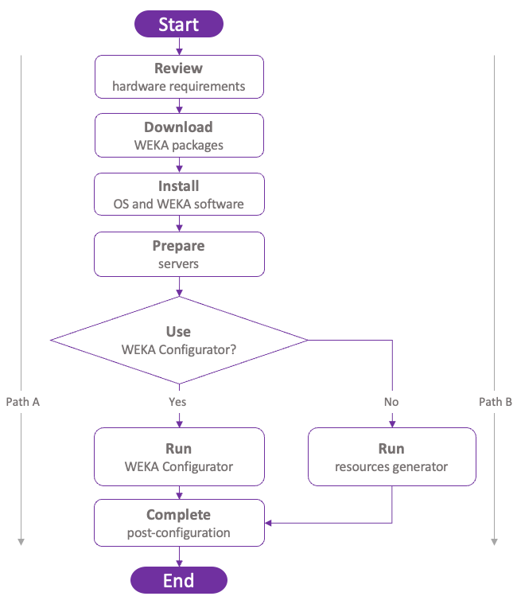

# System installation on bare metal servers

Explore the supported workflows for installing and configuring WEKA on bare metal servers.

WEKA supports the following workflows:

* Install the operating system and WEKA software, then configure the cluster using the WEKA Configurator.
* Install the operating system and WEKA software, then configure the cluster with the resources generator.

## High-level deployment workflow

The following illustrates a high-level deployment workflow on a group of bare metal servers.

<figure><figcaption>
High-level deployment workflow
</figcaption></figure>

### Deployment workflow paths summary

Select the workflow that matches your environment.



Use this workflow when you want guided cluster configuration after preparing the servers and installing the WEKA software.

1. Review hardware requirements.
2. Download WEKA packages.
3. Install OS and WEKA software
4. Prepare servers.
5. Run WEKA Configurator.
6. Complete post-configuration.



Use this workflow when you need full control over the operating system, networking, or cluster layout.

1. Review hardware requirements.
2. Download WEKA packages.
3. Install OS and WEKA software
4. Prepare servers.
5. Run resources generator.
6. Complete post-configuration.




These workflows require deep knowledge of WEKA architecture. Visit [WEKA U](https://learnweka.weka.io/learn/signin) for training materials.


## What to do next?

[Review hardware requirements](planning-a-weka-system-installation.md)
