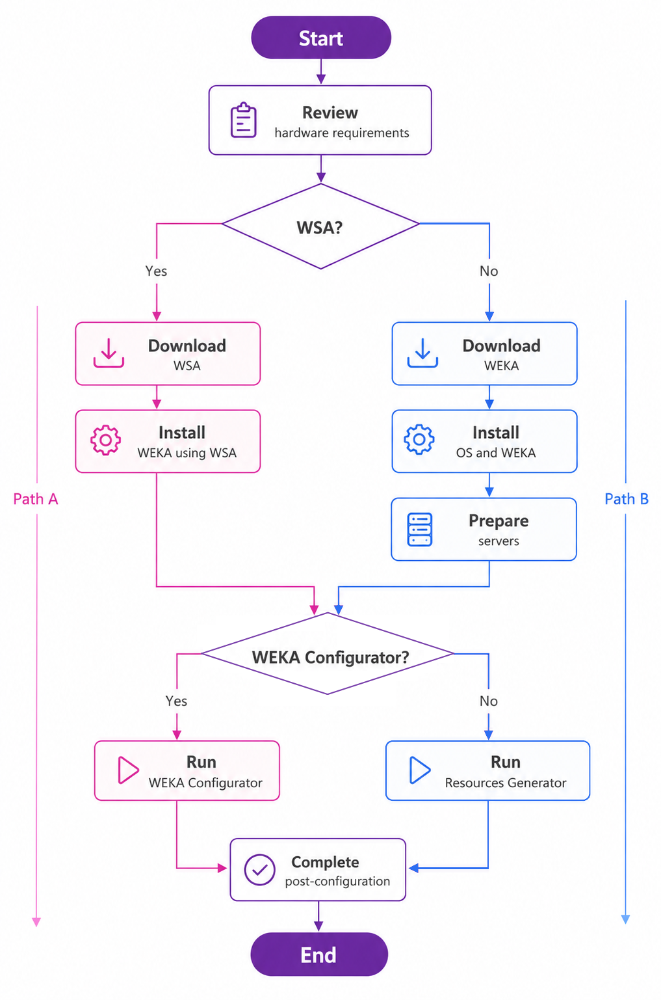

# System installation on bare metal servers

## Choose an installation path

WEKA supports two installation paths for bare metal servers:

* Path A: Automated installation with the WEKA Software Appliance (WSA).
* Path B: Manual installation with an operating system and tools of your choice.

### Path A: Automated installation with WSA

WEKA Software Appliance (WSA): a server image that includes a preconfigured operating system (Rocky Linux 8.10), drivers, WEKA software, and support tools.

WSA speeds up operating system deployment and WEKA software installation. Download WSA and install it on the servers. After installation, the server starts in STEM mode and is ready for configuration.

Use this path when the WSA operating system meets your deployment requirements. This is the fastest supported path from bare metal to a working WEKA cluster.

### Path B: Manual installation

Use this path if:

* You want to use a different operating system.
* You need a customized server image.
* You cannot use the WSA deployment model.

Download the WEKA software, install the operating system and WEKA software, and prepare the servers.


The manual installation workflow requires deep knowledge of WEKA architecture. Visit WEKA U for training material. Sign-in is required.


## High-level deployment workflow

Review the deployment workflow for a group of bare metal servers.

<figure><figcaption>
High-level deployment workflow
</figcaption></figure>

### Continue with cluster configuration

Once the servers are ready, choose the configuration method that matches your installation path:

* Path A: Run the WEKA Configurator. It is the simpler option for WSA-based deployment and generates the cluster configuration script.
* Path B: Run the WEKA Configurator for guided setup, or run the Resources Generator to generate the resource files required for manual container creation on the cluster servers.

All supported configuration methods lead to the same next step: completing post-configuration.

Frequently asked questions

1. What is the root password? Is this configurable, and can it be encrypted?
   * The default WSA root password is `WekaService`.
2. Can we choose the number of cores and containers to use?
   * Yes. Set them during cluster configuration.
3. Will the ISO setup mirror RAID on the dual-boot SSDs?
   * Yes, automatically.
4. Can I set up WEKA with 8 SSDs per node even though I have 12 installed?
   * Not automatically. Pull the drives or manually adjust the configuration before running it. Edit the `config.sh` output from `wekaconfig`.
5. What must be done to direct the ISO to set up for High Availability (HA)? How about no HA?
   * Set that during cluster configuration with `wekaconfig`.
6. If there are multiple NIC cards (for WEKA and Ceph), how do I choose the NICs to use for the WEKA backend server?
   * Configure the required dataplane interfaces and routes during cluster configuration.
7. With the ISO, are there different licensing processes? Or is it standard to get the cluster GUID and storage size, enter it on the WEKA webpage to get a license key, and enter that key on the command line?
   * Licensing has not changed.
8. Does the ISO configure the management or dataplane IP addresses?
   * No. Configure networking after the server reboots into STEM mode.
9. What needs to be configured for Ethernet or InfiniBand?
   * Set the network interfaces, IP addresses, routes, and related cluster settings during configuration.
10. What additional settings are required after the ISO installation?
    * Configure networking, validate the environment, and build the cluster.

## What to do next?

Go to [Plan hardware requirements](planning-a-weka-system-installation.md).
