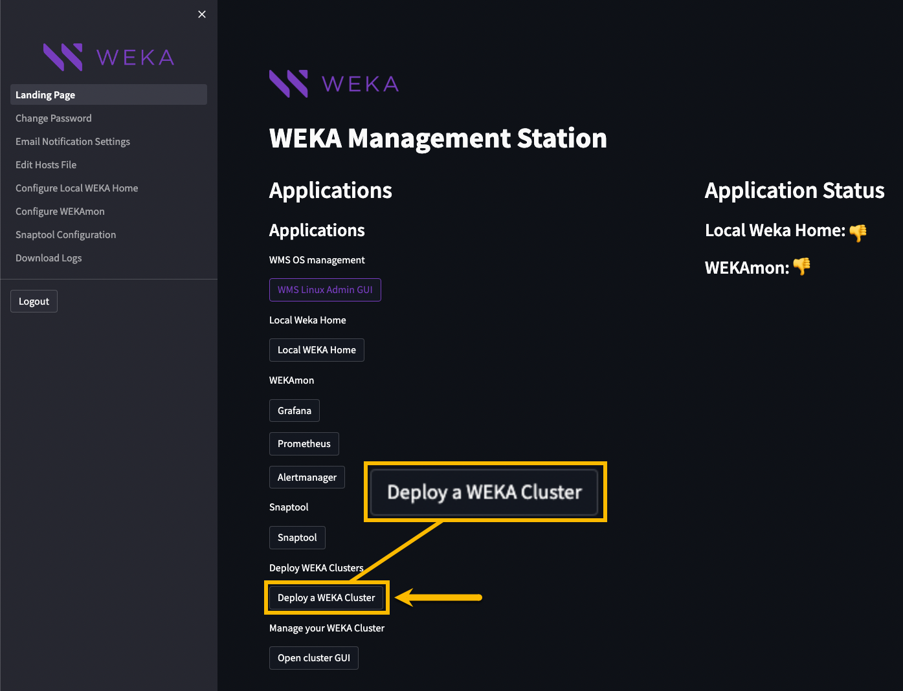
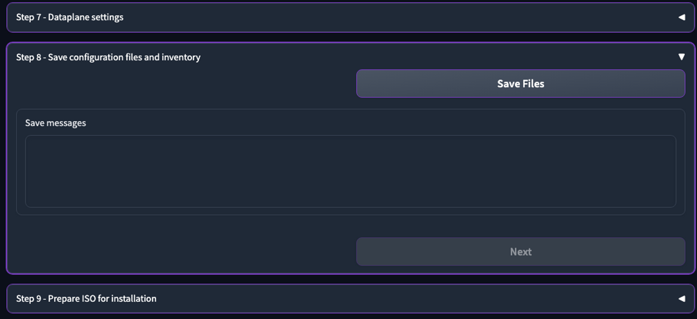

# Install the WEKA cluster using the WMS with WSA

The WEKA Management Station (WMS) is an install kit similar to an OS install disk that simplifies the installation and configuration of the WEKA cluster in an on-premises environment by deploying the WEKA Software Appliance (WSA) package on bare metal servers. The WMS installs the WEKA OS, drivers, and WEKA software automatically and unattended.

The WMS is also used for installing the monitoring tools: Local WEKA Home (LWH), WEKAmon, and SnapTool (for details, see [deploy-monitoring-tools-using-the-weka-management-station-wms.md](../../monitor-the-weka-cluster/deploy-monitoring-tools-using-the-weka-management-station-wms.md "mention").

<figure><figcaption><p>Install the WEKA cluster using the WMS with WSA</p></figcaption></figure>

## WMS deployment prerequisites

Using the WMS with WSA to install a WEKA cluster requires a physical server (or VM) that meets the following requirements:

* **Boot drives:** One or two identical boot drives as an installation target.
  * A system with two identical boot drives has the OS installed on mirrored partitions (LVM).
  * A system with one drive has a simple partition.
* **Minimum boot drive capacity:**
  * If not configuring LWH: SSD 125 GiB.
  * If configuring LWH: See the SSD-backed storage requirements section in [#1.-verify-prerequisites](../../monitor-the-weka-cluster/the-wekaio-support-cloud/local-weka-home-deployment.md#1.-verify-prerequisites "mention").
* **Boot type:** UEFI boot.
* **Cores and RAM:**
  * If not configuring LWH: minimum 4 cores and 16 GiB.
  * If configuring LWH, see the Server minimum CPU and RAM requirements section in [#1.-verify-prerequisites](../../monitor-the-weka-cluster/the-wekaio-support-cloud/local-weka-home-deployment.md#1.-verify-prerequisites "mention").
* **Network interface:** 1 Gbps.

### Prerequisites for the target bare metal servers&#x20;

* Target servers must be **Dell, HPE** or **Supermicro**. Other servers are not supported.
* The RedFish interface must be installed, enabled, and licensed for all target servers. (RedFish is a network standard API for managing servers, networks, storage devices, and more.)
* The WMS must be able to connect over Ethernet to the servers’ IPMI/iDRAC/iLO interface and the management interface.
* The bare metal servers must conform to the [prerequisites-and-compatibility.md](../prerequisites-and-compatibility.md "mention").
* The bare metal servers must have an OS management network interface for administering the servers using DHCP.

## Before you begin

Before deploying the WMS, adhere to the following:

* Obtain the WMS package. For details, see [obtaining-the-weka-install-file.md](obtaining-the-weka-install-file.md "mention").
* The root password is `WekaService`
* The WEKA user password is `weka.io123`
* If errors occur during installation and the installation halts (no error messages appear), use the system console to review the logs in `/tmp`. The primary log is `/tmp/ks-pre.log`.
* To get a command prompt from the Installation GUI, do one of the following:
  * On macOS, type **ctrl+option+f2**&#x20;
  * On Windows, type **ctrl+alt+f2**.

## WMS deployment workflow

1. [Install the WMS](install-the-weka-cluster-using-the-wms-with-wsa.md#1.-install-the-wms)
2. [Configure the WMS](install-the-weka-cluster-using-the-wms-with-wsa.md#2.-configure-the-wms)
3. [Add the WSA package to the WMS](install-the-weka-cluster-using-the-wms-with-wsa.md#3.-add-the-wsa-package-to-the-wms)
4. [Install a WEKA Cluster](install-the-weka-cluster-using-the-wms-with-wsa.md#4.-install-a-weka-cluster)

### 1. Install the WMS

1. Boot the server from the WMS image. The following are some options to do that:



Copy the WEKA Management Station ISO image to an appropriate location so the server’s BMC (Baseboard Management Controller) can mount it or be served through a PXE (Preboot Execution Environment).



Depending on the server manufacturer, consult the documentation for the server’s BMC (for example, iLO, iDRAC, and IPMI) for detailed instructions on mounting and booting from a bootable ISO image, such as:

* A workstation or laptop sent to the BMC through the web browser.
* Ann SMB share in a Windows server or a Samba server.
* An NFS share.&#x20;



To use PXE boot, use the WEKA Management Station as any other Operating System ISO image and configure accordingly.



Burn the WMS image to a DVD and boot it from the physical DVD. However, most modern servers do not have DVD readers anymore.



A bootable USB drive should work (follow online directions for creating a bootable USB drive) but has not been tested yet.



Once you boot the server, the WEKA Management Station installs the WEKA OS (Rocky Linux), drivers, and WEKA software automatically and unattended (no human interaction required).

Depending on network speed, this can take about 10-60 mins (or more) per server.

<figure><figcaption><p>WMS installation progress</p></figcaption></figure>

### 2. Configure the WMS

Once the WMS installation is complete and rebooted, configure the WMS.

1. Run the OS using one of the following options:



Run the OS through the BMC’s Console. See the specific manufacturer’s BMC documentation.



Run the OS through the Cockpit Web Interface on port 9090 of the OS management network.

If you don’t know the WMS hostname or IP address, go to the console and press the **Return** key a couple of times until it prompts the URL of the WMS OS Web Console (Cockpit) on port 9090.

Change the port from 9090 to 8051, which is the WMS Admin port.

<figure><figcaption><p>Cockpit URL (IP address of this WMS is 172.29.7.152)</p></figcaption></figure>



2. Browse to the WMS Admin UI using the following URL:\
   `http://<WMS-hostname-or-ip>:8501`

<figure><figcaption><p>WMS Admin UI: Login Page</p></figcaption></figure>

3. Enter username and password (default: _admin_/_admin_), and select **Login**.\
   The Landing Page appears.

<figure><figcaption><p>WMS Landing Pag</p></figcaption></figure>

### 3. Add the WSA package to the WMS

1. Download the latest release of the WSA package from [get.weka.io](https://get.weka.io/ui/dashboard) dashboard.
2. Copy the WSA package to **/home/weka** .\
   For example:  `scp <wsa.iso> weka@<wms-server>:`

### 4. Install a WEKA Cluster

1. Go to the WMS Admin UI (landing page) and select **Deploy a WEKA Custer**.

<figure><figcaption></figcaption></figure>

The WSA setup page opens.

<figure><figcaption><p>WSA Setup</p></figcaption></figure>

2. Open **Step 1 - Choose source ISO**, select the WSA package (ISO) you intend to deploy, and click **Next**.


The WSA packages that appear in the list are taken from `/home/weka`. You can have more than one in the directory. If none are displayed, click **Refresh ISO List**. If none are displayed after that, copy a WSA package to `/home/weka` and click **Refresh ISO List** again. Once you select a WSA ISO, click **Next.**


3. In **Step 2 - Load values from**, select one of the following options:
   * **Option 1: Enter environment data:**\
     Click **Go directly to forms to enter data**.
   *   **Option 2: Import CSV file:**\
       If you have the environment data in a CSV file, click **Upload a CSV file to pre-populate data**. Step 3 - CSV File Upload section opens.

       Drag or click to upload the CSV file, and click **Next**.

       The WMS skips to **Step 9 - Prepare ISO for installation**.

<figure><figcaption></figcaption></figure>

**CSV template example**

You can prepare a CSV file with the columns as specified in the following example:

```
IPMI_IP,Username,Password,OS_Mgmt_IP,Hostname,OS_Netmask,OS_Gateway,MTU,DNS,Hostname_Pattern,Hostname_Startnum,Server_Count,Data1_IP,Data1_Type,Data1_Netmask,Data1_MTU,Data1_Gateway,Data2_IP,Data2_Type,Data2_Netmask,Data2_MTU,Data2_Gateway
172.29.1.63,ADMIN,ADMIN,10.10.20.11,weka01,24,10.10.20.1,1500,8.8.8.8,weka%02d,1,7,10.100.10.11,Ethernet,16,9000,,10.100.20.11,Ethernet,16,9000,
172.29.1.64,ADMIN,ADMIN,10.10.20.12,weka02,24,10.10.20.1,1500,8.8.8.8,weka%02d,1,7,10.100.10.12,Ethernet,16,9000,,10.100.20.12,Ethernet,16,9000,
172.29.1.65,ADMIN,ADMIN,10.10.20.13,weka03,24,10.10.20.1,1500,8.8.8.8,weka%02d,1,7,10.100.10.13,Ethernet,16,9000,,10.100.20.13,Ethernet,16,9000,
172.29.1.66,ADMIN,ADMIN,10.10.20.14,weka04,24,10.10.20.1,1500,8.8.8.8,weka%02d,1,7,10.100.10.14,Ethernet,16,9000,,10.100.20.14,Ethernet,16,9000,
172.29.1.67,ADMIN,ADMIN,10.10.20.15,weka05,24,10.10.20.1,1500,8.8.8.8,weka%02d,1,7,10.100.10.15,Ethernet,16,9000,,10.100.20.15,Ethernet,16,9000,
172.29.1.68,ADMIN,ADMIN,10.10.20.16,weka06,24,10.10.20.1,1500,8.8.8.8,weka%02d,1,7,10.100.10.16,Ethernet,16,9000,,10.100.20.16,Ethernet,16,9000,
172.29.1.69,ADMIN,ADMIN,10.10.20.17,weka07,24,10.10.20.1,1500,8.8.8.8,weka%02d,1,7,10.100.10.17,Ethernet,16,9000,,10.100.20.17,Ethernet,16,9000,

```

4. In **Step 4 - Number of servers to display**, enter a Server Count (default is 8), and click **Next**.

<figure><figcaption></figcaption></figure>

5. In **Step 5 - IPMI information**, do the following:
   * In the **IPMI First IP**, enter the IPMI IP address of the first server. It requires a consecutive set of IP addresses for the servers (typical).
   * In the **IPMI user** and **IPMI password**, modify the login credentials for the IPMI, iLO, or iDRAC according to your choice.
   * Click **Fill IPMI IPs** to calculate the IP addresses for the number of servers specified in Step 4.
   * You can edit the IP addresses, Usernames, and Passwords as needed if the servers aren’t consecutive or require different credentials.
   * If you edited the table, click **Verify IPMI IPs** to verify that the WMS can log into the BMCs and detect the manufacturer (Brand column).
   * Verify that all is correct, and then click **Next**.

<figure><figcaption></figcaption></figure>

6. In **Step 6 - Operating System network information**, do the following:
   * In the **OS First IP**, enter the IP address of the OS 1 Gbit management interface. It requires a consecutive set of IP addresses for the servers (typical).
   * In the remaining networking fields, fill in the networking details.
   * Click **Fill OS Table** to populate the table. The WMS automatically generates names and IPs.
   * Verify that the OS IP settings are correct. You can repeatedly click **Fill OS Table** to make adjustments.
   * Verify that all is correct, and then click **Next**.

<figure><figcaption></figcaption></figure>

7.  In **Step 7 - Dataplane settings**, do the following:

    * Set the number of interfaces in the **Dataplane Interface Count** slider.
    * In the remaining dataplane fields, fill in the details.
    * Click **Update Dataplanes**. The WMS automatically populates the data.
    * You can repeatedly click **Update Dataplanes** to make adjustments.
    * Verify that all is correct, and then click **Next**.


    <figure><figcaption></figcaption></figure>
8.  In **Step 8 - Save configuration files and inventory**, click **Save Files** to save the configuration files, and then click **Next**.


    <figure><figcaption></figcaption></figure>
9.  In **Step 9 - Prepare ISO for installation**, click **Prepare ISO for install**. \
    The WMS updates the kickstart on the ISO to match the WMS deployment data (it takes about 30 seconds).


    <figure><figcaption></figcaption></figure>

When the ISO preparation is completed, the output is displayed. Verify that no errors appear. Then, click **Next**.

<figure><figcaption></figcaption></figure>

10. In **Step 10 - Start Installation**, click **Install OS on Servers**.\
    The WMS loads the WSA on the servers previously defined and starts the installation.\
    The installation can take several minutes and displays output when complete. Verify that no errors appear.


    <figure><figcaption></figcaption></figure>

    The installation process takes about 30 minutes, depending on several factors, such as network speed. Verify that the server’s BMC completed the restart.
11. In **Step 11 -  Run OS and Dataplane Configuration Scripts**, click **Run post-install scripts**.  This action runs scripts to configure the servers with the specified dataplane IPs and perform additional tasks, such as populating `/etc/hosts`.

<figure><figcaption></figcaption></figure>

**Alternative OS and dataplane configuration**

These commands only need to be run if you did not follow step 11 above.

1. Connect to one of the cluster servers to run the post-install scripts. The tools are in the same location:  `/opt/tools/install` on the WSA as they are on the WMS.&#x20;

```bash
ssh root@<wms ip>
```

2. When prompted, enter the password `WekaService`
3. Change the directory to `/opt/ansible-install` by running the following command:

```bash
cd /opt/ansible-install
# ./install_after_wsa_iso.sh
```

4. Run the post-install script:&#x20;

```bash
./install_after_wsa_iso.sh
```

Example:

```bash
$ ssh root@172.29.5.172
root@172.29.5.172's password:
X11 forwarding request failed on channel 0
Welcome to the Weka Management Station!

Web console: <https://WekaMgmtServer:9090/> or <https://172.29.5.172:9090/>

Last login: Sat Jun  3 10:31:28 2023 from ::ffff:10.41.193.86
[root@WekaMgmtServer ~]# cd /opt/ansible-install/
[root@WekaMgmtServer ansible-install]#
# ./install_after_wsa_iso.sh
```

4. Ensure the DNS is operational, or copy the `/etc/hosts` entries from one of the cluster servers to the WMS.

## What to do next?

[configure-the-weka-cluster-using-the-weka-configurator.md](configure-the-weka-cluster-using-the-weka-configurator.md "mention")
