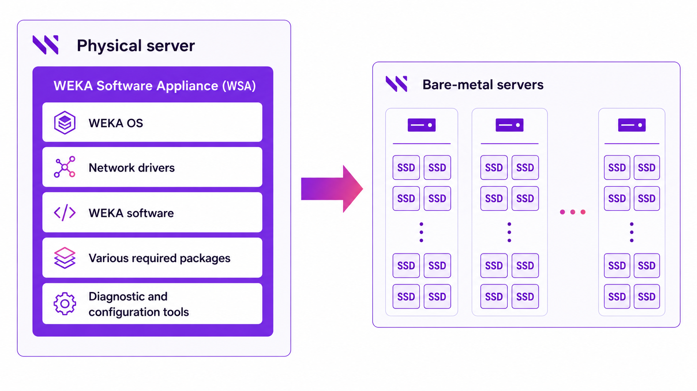
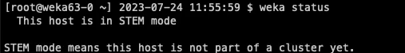

# Install WSA

Install WEKA on bare metal servers with the WEKA Software Appliance.

WSA includes the operating system image, network drivers, WEKA software, and diagnostic tools. It accelerates server preparation and standardizes the deployment environment.

Follow this page if you are using the automated installation with WSA path.

<div data-with-frame="true"><figure><figcaption><p>WEKA cluster installation using the WSA</p></figcaption></figure></div>


Do not install the WSA using PXE boot. Boot the WSA image from virtual media, DVD, or USB media.



WEKA releases WSA updates addressing critical security issues found in the underlying Linux distribution within five days of discovery and availability. Customers can update their WSA instance from the repository where these updates are provided. WEKA notifies customers when updates are available, enabling timely updates to minimize potential risks. For any questions, contact the Customer Success Team.


## WSA deployment prerequisites

A physical server that meets the following requirements:

* **Boot drives:** Two identical boot drives as an installation target.
* **Minimum boot drive capacity:** 125 GB (to support the pre-defined disk partition map).
* **Boot type:** UEFI.

## Before you begin

Before deploying the WSA, do the following:

* Download the latest release of the WSA package from [get.weka.io](https://get.weka.io/ui/dashboard) dashboard.
* The root password is `WekaService`
* The WEKA user password is `weka.io123`
* If errors occur during installation and the installation halts (no error messages appear), use the system console to review the logs in `/tmp`. The primary log is `/tmp/ks-pre.log`.
* To get a command prompt from the Installation GUI, do one of the following:
  * On macOS, type **ctrl+option+f2**
  * On Windows, type **ctrl+alt+f2**.

## WSA deployment workflow

1. [Install the WSA](install-the-weka-cluster-using-the-wsa.md#1.-install-the-wsa)
2. [Configure the WSA](install-the-weka-cluster-using-the-wsa.md#2.-configure-the-wsa)
3. [Test the environment](install-the-weka-cluster-using-the-wsa.md#3.-test-the-environment)
4. [Validate the WEKA software installation](install-the-weka-cluster-using-the-wsa.md#4.-validate-the-weka-software-installation)

### 1. Install the WSA

1. Boot the server from the WSA image. The following are some options to do that:



Copy the WSA image to an appropriate location so that the server’s BMC can mount it to a virtual CDROM/DVD.

Depending on the server manufacturer, consult the documentation for the server’s BMC (for example, iLO, iDRAC, and IPMI) for detailed instructions on mounting and booting from a bootable WSA image, such as:

* A workstation or laptop sent to the BMC through the web browser.
* An SMB share in a Windows server or a Samba server.
* An NFS share.



Burn the WSA image to a DVD or USB stick and boot the server from this physical media.



Once you boot the server, the WSA installs the operating system, drivers, WEKA software, and other packages automatically.

Depending on server and media performance, installation can take 10 to 60 minutes per server.

### 2. Configure the WSA

Once the WSA installation completes and the server reboots, configure the server.

1. Log-in to the server using one of the following methods:

* BMC's Console
* Cockpit web interface on port 9090

Username/password: `root`/`WekaService`.



Run the OS through the BMC’s Console. See the specific manufacturer’s BMC documentation.



Run the OS through the Cockpit Web Interface on port 9090 of the OS management network.

If you don’t know the WSA hostname or IP address, go to the console and press the **Return** key a couple of times until it prompts the URL of the WSA OS Web Console (Cockpit) on port 9090.



When the server boots for the first time, the WSA installs the WEKA software automatically.

After the reboot, the server runs with WEKA in STEM mode.

2. Set the following networking details:
   * Hostname
   * IP addresses for network interfaces, including:
     * Server management interface (typically a 1Gb interface on a management network) if not automatically set via DHCP.
     * Dataplane network interfaces (typically 1 or 2. Can be several up to 8).
   * DNS settings and/or an `/etc/hosts` file.
   * Network gateways and routing table adjustments as necessary.
   * Timeserver configuration.


For detailed instructions on setting the configuration options, see general Linux documentation for RedHat-based Linux Distributions.


### 3. Test the environment

Each server has the WEKA Tools pre-installed in `/opt/tools`, including:

* `wekanetperf`: Runs `iperf` between servers to validate line rate.
* `wekachecker`: Checks network settings and other readiness items. For details, see Validate the system preparation.
* `bios_tool`: Helps set the required BIOS settings on servers.

### 4. Validate the WEKA software installation

Verify that the WEKA software is installed and running on the server.

Log in to the server and run:

```bash
weka status
```

The server provides a status report indicating the system is in STEM mode, and is ready for the cluster configuration.

<div data-with-frame="true"><figure><figcaption><p>Example: weka status with STEM mode</p></figcaption></figure></div>

## What to do next?

Go to [Configure the cluster with WEKA Configurator](https://app.gitbook.com/s/ZW262oqYA8pNNfGvXjHa/planning-and-installation/bare-metal/configure-the-weka-cluster-using-the-weka-configurator).
