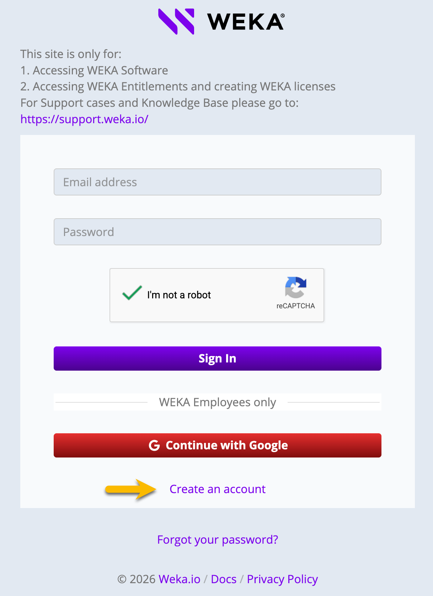
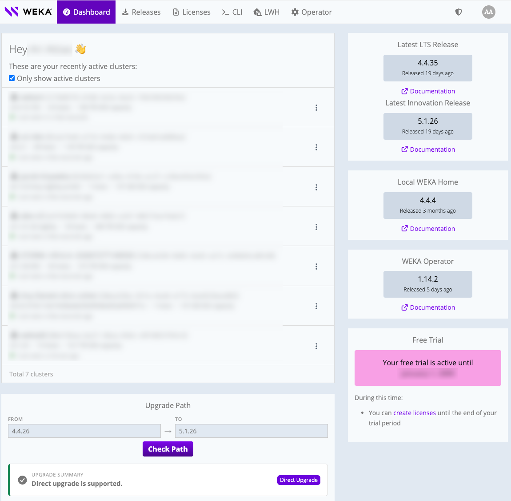
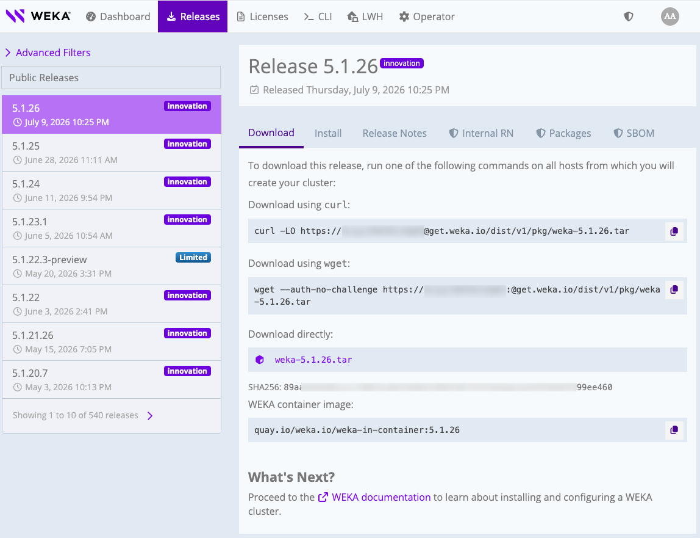

# Obtain the installation packages

## Register to get.weka.io

Create a [get.weka.io](https://get.weka.io/ui/dashboard) account before you download installation files. If you already have an account, skip this section.

**Procedure**

1. Go to the [get.weka.io](https://get.weka.io/ui/dashboard) download site, and select **Create an account.**

The Send Registration Email page opens.

2\. Fill in your organization's email address (private mail is prohibited).\
Select **I’m not a robot**, and then select **Send Registration Email.**

3\. Check your inbox for a registration email from Weka.io.\
To confirm your registration, select the link.\
The Create Your Account page opens.

4\. Fill in your email address, full name, and password. Then, select **Create Account**.

Your request for access to [get.weka.io](http://get.weka.io) is sent to WEKA for review. Wait for a validation email. Once your registration is approved, you can sign in to [get.weka.io](http://get.weka.io).

## Download the WEKA installation packages

Download the package that matches your installation path.

* Automated installation with WSA. Download the WSA image from [get.weka.io](https://get.weka.io/ui/dashboard).
* Manual installation and configuration. Download the WEKA software tarball from [get.weka.io](https://get.weka.io/ui/dashboard).

You can only sign in and download the packages if you are a registered user.

**Procedure: Download from get.weka.io**

1. Go to the [get.weka.io](https://get.weka.io/ui/dashboard) download site, and sign in with your registered account.

<figure><figcaption>
get.weka.io dashboard
</figcaption></figure>

2. Download the required package:
   * Select the package from the dashboard.
   * Or, select the **Releases** tab. Select the required release, then follow the download instructions.

The download-link token is intentionally blurred in the image.

<figure><figcaption>
Releases download page
</figcaption></figure>

## What to do next?

Depending on the installation path you follow, go to one of the following:

Path A: [Install WSA](https://app.gitbook.com/s/ZW262oqYA8pNNfGvXjHa/planning-and-installation/bare-metal/install-the-weka-cluster-using-the-wsa)

Path B: [Install OS and WEKA software](https://app.gitbook.com/s/ZW262oqYA8pNNfGvXjHa/planning-and-installation/bare-metal/manually-install-os-and-weka-on-servers)
