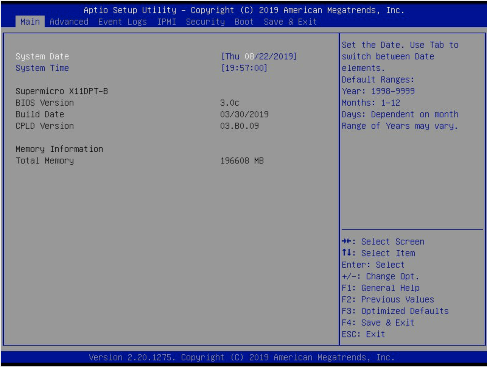
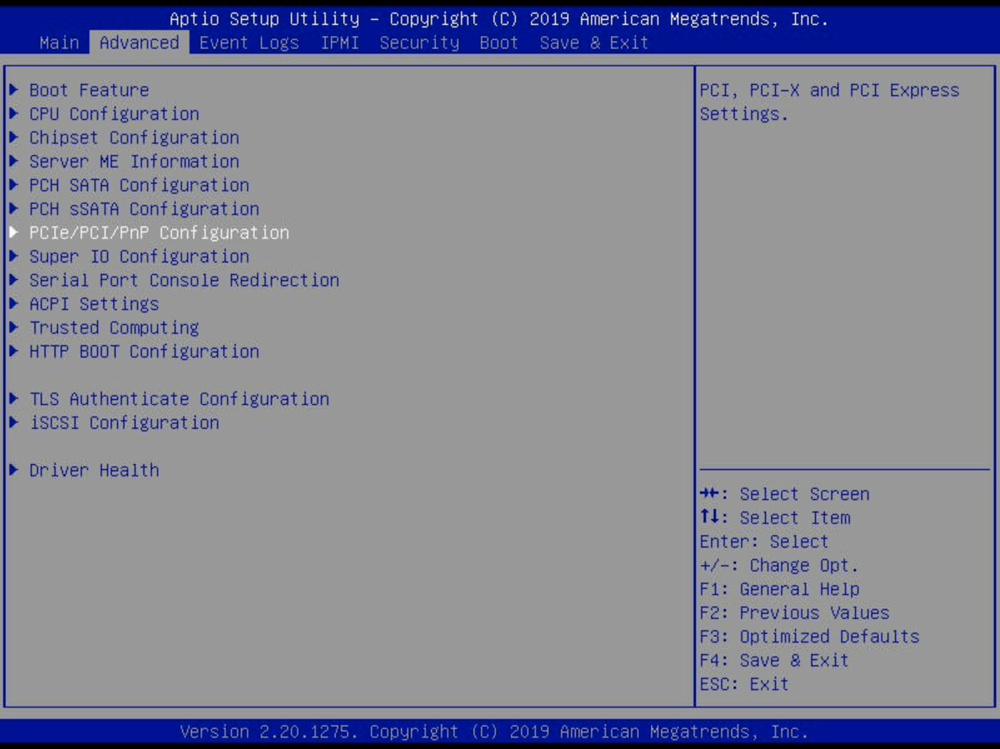
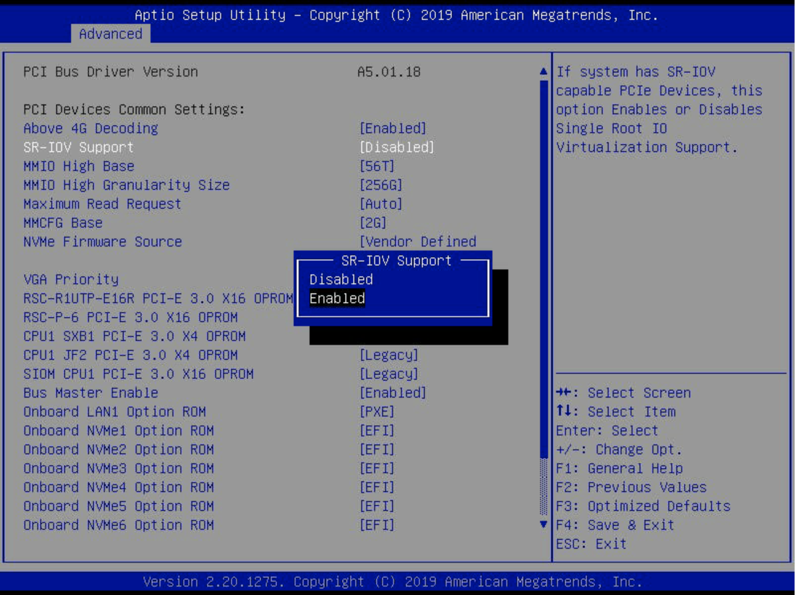
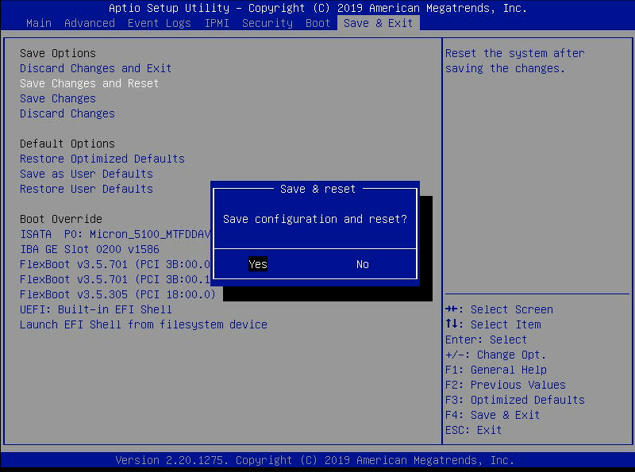

# Enable the SR-IOV

Many hardware vendors ship their products with the SR-IOV feature disabled. The feature must be enabled on such platforms before installing the Weka system. Enabling the SR-IOV applies to the server BIOS.

If the SR-IOV is already enabled, it is recommended to verify the current state before proceeding with the installation of the Weka system.

## Before you begin

Verify that the NIC drivers are installed and loaded successfully. If it still needs to be done, perform the [Install NIC drivers](./#install-nic-drivers) procedure.

## Enable SR-IOV in the server BIOS

The following procedure is a vendor-specific example and is provided as a courtesy. Depending on the vendor, the same settings may appear differently or be located elsewhere. Therefore, refer to your hardware platform and NIC vendor documentation for the latest information and updates.



Reboot the server and enter the BIOS Setup.

<figure><figcaption>
Main screen
</figcaption></figure>



From the Advanced menu, select the PCIe Configuration to display its properties.

<figure><figcaption>
Advanced screen
</figcaption></figure>



Select the SR-IOV support and enable it.

<figure><figcaption>
Enable SR-IOV
</figcaption></figure>



Save the configuration changes and exit.

<figure><figcaption>
Save and Exit
</figcaption></figure>


