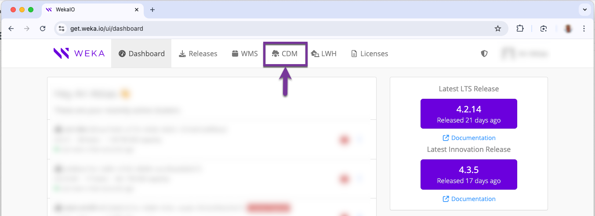
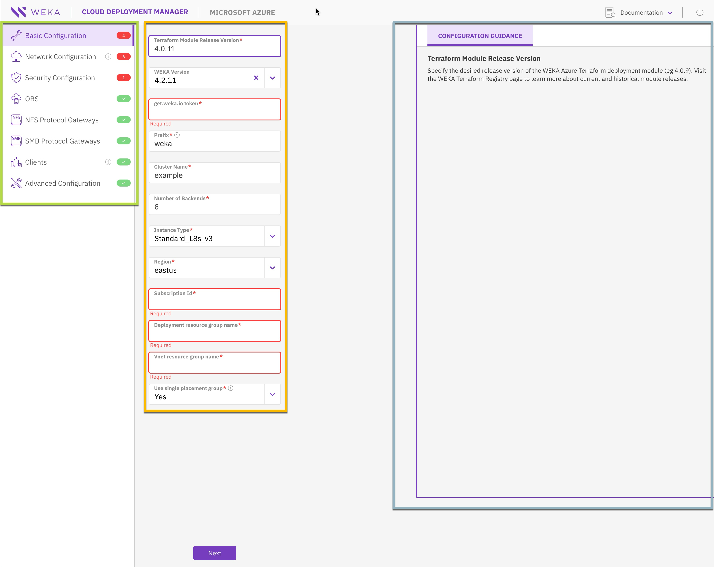
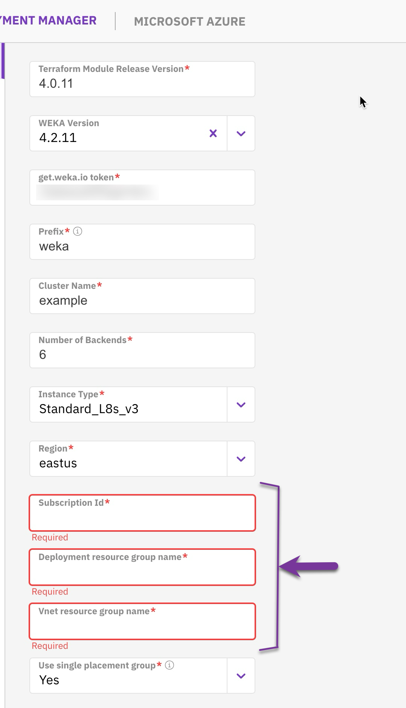
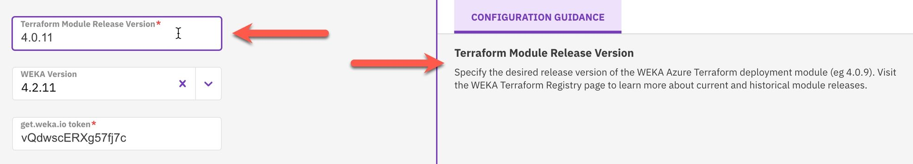
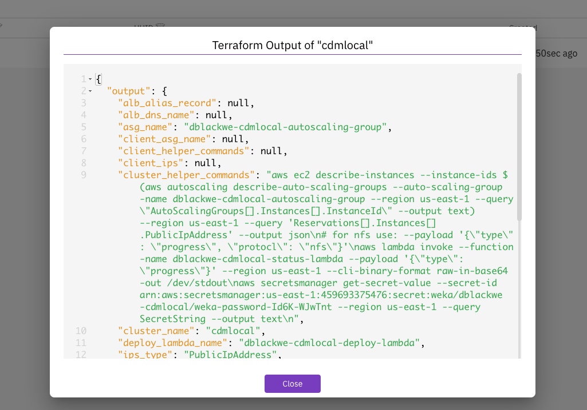

# WEKA Cloud Deployment Manager Local (CDM Local) User Guide

## Overview

The WEKA Cloud Deployment Manager Local (CDM Local) offers a locally installed solution for deploying WEKA clusters in AWS, Azure, and GCP public cloud environments. Like CDM Web, it leverages WEKA’s validated Terraform deployment modules and provides a user-friendly interface to guide users through the configuration process. However, CDM Local adds new features tailored for users who prefer a local installation, including public cloud environment configuration polling, validation, and deployment execution, which is not available in CDM Web.

Key features of CDM Local:

* **Locally installed solution**: CDM Local is packaged as a Go binary for download and can be run locally or on a cloud instance in the customer’s public cloud environment.
* **Cross-platform compatibility**: CDM Local provides individually downloadable binaries for different platforms, including Apple MacOS (Intel and Apple Silicon) and Linux (Intel and ARM).
* **Configuration polling and validation**: CDM Local includes a unique feature that automatically polls the public cloud environment to populate key variables like VPC and Subnet details. Additionally, it validates the cluster configuration to detect conflicts before deployment.
* **Automated Terraform deployment**: CDM Local generates a Terraform configuration file and state, which are stored in a user-defined cloud object bucket. Additionally, if Terraform is in the user's execution path, CDM Local uses it to automate the execution of the configuration file. If Terraform is not present, CDM Local installs it to execute the configuration file automatically, eliminating the need for manual Terraform commands.

## CDM Local prerequisites

Before deploying CDM Local, ensure the following components are installed on the system:

* [Go](https://go.dev/doc/install)
* The appropriate Cloud CLI or SDK for the target cloud environment:
  * [AWS CLI](https://docs.aws.amazon.com/cli/latest/userguide/getting-started-install.html)
  * [Azure CLI](https://learn.microsoft.com/en-us/cli/azure/install-azure-cli)
  * [Google Gcloud CLI](https://cloud.google.com/sdk/docs/install)

**Required permissions:**

* **AWS:** To run cluster validation in CDM Local, the user logged into the AWS CLI must have the permission `iam:SimulatePrincipalPolicy`. Ensure this permission is granted by attaching an AWS IAM policy that includes the action to the user's account.


Ensure the Cloud CLI is configured and logged in with the same user account used to deploy the WEKA cluster. This guarantees the logged-in user has the necessary permissions.

For Google Cloud CLI, use the `gcloud auth application-default login` command to authenticate.


## Download CDM Local

1. Go to [**get.weka.io**](http://get.weka.io) and select the **CDM** tab.

<figure><figcaption></figcaption></figure>

2. CDM Local is available as a platform-specific binary. Choose the binary that matches your target host platform for installation:
   * MacOS (Darwin):
     * Intel-based: cdm-darwin-amd64
     * Apple Silicon-based: cdm-darwin-arm64
   * **linux**:
     * Intel-based: cdm-linux-amd64
     * ARM-based: cdm-linux-arm64

<figure><figcaption></figcaption></figure>

## Launch CDM Local

CDM Local uses Terraform to finalize the deployment of WEKA cluster resources and execute post-installation scripts, similar to CDM Web. However, CDM Local is run locally through a binary and launched through a browser-based UI.

**Before you begin**

* Ensure you are authenticated to the relevant Cloud CLI (AWS, Azure, GCP) to grant the necessary permissions for the deployment.
* A valid [get.weka.io](http://get.weka.io) token is required to complete the deployment. Ensure you have this token available before proceeding.
* Choose the cloud where you will store the CDM Local configuration state. For all cloud providers except GCP, CDM Local can create the bucket for you. For GCP, you must use an existing bucket.

**Procedure**

1. **Navigate to the CDM Local binary:** Open a terminal and navigate to the directory where the downloaded CDM Local binary is located.
2.  **Make the binary executable:** Change the file permissions to allow execution. Example on an Apple Silicon system:

    ```bash
    chmod +x cdm-darwin-arm64-v1.2.0-tech-preview
    ```
3.  Run the CDM Local binary to launch CDM Local. Define the `state-backend` parameter based on your selected cloud provider:

    * **AWS**: `--state-backend=aws`
    * **Azure**: `--state-backend=azure --azure-subscription-id=[$YOUR_AZURE_SUBSCRIPTION_ID] --azure-resource-group=[$YOUR_AZURE_RESOURCE_GROUP]`
    * **GCP**: `--state-backend=gcp --gcp-project-id=[$YOUR_GCP_PROJECT_ID] --gcp-region=[$YOUR_GCP_REGION] --gcp-bucket=[$YOUR_GCP_BUCKET]`

    **Example** (on an Apple Silicon system with AWS for state backup):\
    `./cdm-darwin-arm64-v1.2.0-tech-preview --state-backend=aws`
4. **Access the CDM Local UI:** After running the binary, a browser window with the CDM Local interface opens automatically.

<figure><figcaption><p>CDM Local welcome</p></figcaption></figure>

5. **Accept Statistic Gathering**: Select **Accept** to allow WEKA to collect statistics to enhance the system.
6. **Deploy a Cluster**: Click **DEPLOY CLUSTER** to start deploying your first WEKA cluster.
7. **Select Cloud Provider**: Choose your deployment cloud (AWS, Azure, or GCP) and select **Deploy**. The CDM Local dashboard appears.

<figure><figcaption></figcaption></figure>

## CDM Local dashboard overview

The CDM Local dashboard provides a streamlined way to configure WEKA clusters, leveraging the power of Terraform modules with a graphical UI.

The CDM dashboard consists of three main sections:

* The workflow navigation panel (outlined in green)
* The configuration input panel (outlined in orange)
* The dynamic content sidebar (outlined in teal)

<figure><figcaption><p>CDM Local dashboard overview</p></figcaption></figure>

### **Workflow navigation panel**

The workflow navigation panel provides convenient access to various WEKA cluster configuration variables. You can switch between different aspects of cluster configuration and adjust settings according to their deployment needs.

The tabs within the panel correspond to primary configurable aspects for a WEKA cluster:

* Basic Configuration
* Networking Configuration
* Security Configuration
* OBS: Optional object storage configuration
* NFS Protocol Gateways: Optional deployment of NFS protocol servers.
* SMB Protocol Gateways: Optional deployment of SMB protocol servers.
* Clients: Optional deployment of WEKA clients
* Advanced Configuration: Optional, granular cluster-level adjustments

To ensure completeness from a basic requirements perspective, specific fields within the configuration input panel are marked as mandatory based on the selected configuration options.

The workflow navigation panel visually indicates the completeness of the configuration. A green check or a red **x** appears next to each tab, helping users identify areas that require additional attention. For example, if both Basic Configuration and Security Configuration have fields that need attention, the panel reflects this.

You can navigate between different workflow pages and view associated configuration input panels by clicking the **Next** button or selecting the desired tab from the workflow navigation panel.

<figure><figcaption><p>Workflow navigation panel</p></figcaption></figure>

### **Configuration input panel**

The configuration input panel enables customizing input fields related to the WEKA cluster deployment. These fields correspond to variables in WEKA Terraform modules, which traditionally require manual formatting and entry into a `main.tf` file. With CDM, these variables are presented visually, streamlining the configuration process.

* You can tailor the input fields to match their needs and deployment objectives.
* Required fields are marked with a red asterisk.

The following example illustrates the Basic Configuration tab, where some required fields are populated, while others remain empty. Fields lacking input are highlighted in bright red, and the red outline disappears once the user provides the necessary information.

<figure><figcaption><p>Configuration input panel: Basic Configuration tab showing required fields</p></figcaption></figure>

Certain fields within the configuration input panel require manual user input. Other fields, such as Instance Type, WEKA Version, and Region, are provided as selectable dropdown menus.



<figure><figcaption><p>Instance Type</p></figcaption></figure>



<figure><figcaption><p>Region</p></figcaption></figure>



The WEKA software release dropdown menu is designed to auto-populate with the most recent Long-Term Support (LTS) version by default. You can select the previous software release by opening the dropdown menu and choosing from the list. The top two entries in the dropdown are always LTS releases, while the bottom two are innovation releases.

To enter a WEKA software release that is not listed in the dropdown, click directly in the WEKA Version input field and type the desired release. This feature is particularly useful when deploying a WEKA cluster with a customer-specific software release.

<figure><figcaption><p>WEKA Version</p></figcaption></figure>



### **Dynamic content sidebar**

The dynamic content sidebar enhances user experience by displaying contextually relevant information during various activities within CDM. Its primary functions include:

#### Real-time configuration guidance

* **Purpose:** Assists users in understanding the role of specific variables or input fields in the configuration input panel.
* **Functionality:** Automatically displays pertinent information when an input field, such as the Terraform Module Release Version, is selected. This feature covers every input field for AWS, Azure, and GCP configurations.

<figure><figcaption><p>Terraform Module Release Version</p></figcaption></figure>

#### Real-time file representation

* **Purpose:** Provides a preview of the file that will be generated for download once all configuration inputs are completed.
* **Functionality:** Next to the configuration guidance tab, a new tab labeled “tf file preview” showcases the file in real-time.

#### JSON and HCL format options for main.tf

* **Purpose:** Allows flexibility in file format based on deployment requirements.
* **Functionality:** Includes a toggle switch to change the main.tf file format between JSON and HCL.

#### Validation of the finalized terraform configuration file

* **Purpose:** The validation process ensures that the completed Terraform configuration is accurate and ready for local deployment. This step helps identify and resolve any issues before proceeding with the deployment.
* **Functionality:** Before copying or downloading the generated `main.tf` file, it is highly recommended to validate the configuration using the **VALIDATE WEKA CLUSTER** button. The CDM Local performs the following checks during validation:
  * **Permissions:** Ensures that the user has the necessary permissions to deploy and run the WEKA cluster.
  * **Subnet IP addresses:** Confirms that the specified subnet has enough available IP addresses to accommodate the WEKA resources to be deployed.
  * **Compute resource quota:** Verifies that the chosen machine type for WEKA components meets the required compute resource quotas for the deployment.

If any errors occur during the validation, a popup window appears with details about the encountered issues. Users can then correct these errors and revalidate the configuration before continuing. Once validation is successful, the file can be copied or downloaded for use in the deployment process.

<figure><figcaption><p>Validation of the finalized terraform configuration file</p></figcaption></figure>

<figure><figcaption><p>Successful validation of configuration</p></figcaption></figure>

#### Download and copy the finalized terraform configuration file

* **Purpose:** Enables users to download or copy the completed configuration file for local use.
* **Functionality:** The **Download** and **Copy** button allow you to save the file locally or copy it, to manually execute the relevant Terraform `plan`, and `apply` commands for WEKA cluster deployment.

<figure><figcaption><p>Download and copy the finalized terraform configuration file</p></figcaption></figure>

#### Deploy WEKA Cluster

* **Purpose:** Executes the deployment of the configured WEKA cluster.
* **Functionality:** The **CREATE** button initiates the execution of a Terraform `apply` action. If Terraform is not present on the client system, it installs in the user's home directory.

<figure><figcaption><p>The CREATE button will deploy the configured WEKA cluster</p></figcaption></figure>

### Modify the configuration of a deployed WEKA cluster

After selecting **CREATE** or when connecting to CDM Local with at least one WEKA cluster deployed, the screen displays a list of deployed clusters.

<figure><figcaption><p>List of deployed or deploying clusters known by CDM Local</p></figcaption></figure>

Clicking on a cluster opens its configuration, allowing you to make changes. Use the **UPDATE** button, which replaces **CREATE**, to rerun the deployment configuration.

#### Update WEKA cluster

* **Purpose**: Applies updates to the configuration of the deployed WEKA cluster.
* **Functionality**: The **UPDATE** button initiates a Terraform `apply` action, enabling post-deployment changes to the cluster configuration, such as adding Protocol Servers.

<figure><figcaption><p>The UPDATE button applies changes to the configured WEKA cluster</p></figcaption></figure>

### Retrieve Information on deployed WEKA clusters

When clusters are listed in the CDM Local inventory, you can gather the following details about each deployment:

* [#clusterization-progress](weka-cdm-local-user-manager.md#clusterization-progress "mention")
* [#weka-cluster-status](weka-cdm-local-user-manager.md#weka-cluster-status "mention")
* [#terraform-output](weka-cdm-local-user-manager.md#terraform-output "mention")
* [#password](weka-cdm-local-user-manager.md#password "mention")
* [#backend-ips](weka-cdm-local-user-manager.md#backend-ips "mention")

#### **Clusterization progress**

During the initial build of the WEKA cluster, various cloud services collect progress information. You can retrieve the clusterization progress from the **Get Clusterization Progress** menu option.

<figure><figcaption><p>Get the status of the clusterization progress</p></figcaption></figure>

<figure><figcaption><p>"Clusterization completed successfully" indicates the deployment is complete</p></figcaption></figure>

#### WEKA cluster status

You can retrieve the status of the WEKA cluster at any time using the **Get WEKA Status** menu option.

<figure><figcaption><p>Get the current status of the WEKA cluster</p></figcaption></figure>

<figure><figcaption></figcaption></figure>

#### Terraform output

You can retrieve the output information from running Terraform using the **Get Terraform Output** menu option.

<figure><figcaption><p>Use CDM Local to retrieve Terraform Output</p></figcaption></figure>

<figure><figcaption></figcaption></figure>

#### Password

When the WEKA clusterization process finishes, a random password is generated for the 'admin' account. You can retrieve this password using the **Get Password** menu option.

<figure><figcaption><p>Get the auto generated password for the 'admin' user on the WEKA cluster</p></figcaption></figure>

<figure><figcaption></figcaption></figure>

#### Backend IPs

You can retrieve the IP addresses for backend access using the **Get Backend IPs** menu option in CDM Local.

<figure><figcaption><p>Get the backend IP addresses of the WEKA cluster</p></figcaption></figure>

<figure><figcaption><p>If public IPs were assigned, they will display otherwise the private IPs will display.</p></figcaption></figure>


**Related topics**

[deployment-on-aws-using-terraform.md](aws/weka-installation-on-aws-using-terraform/deployment-on-aws-using-terraform.md "mention")

[deployment-on-azure-using-terraform.md](weka-installation-on-azure/deployment-on-azure-using-terraform.md "mention")

[deployment-on-gcp-using-terraform.md](weka-installation-on-gcp/deployment-on-gcp-using-terraform.md "mention")
