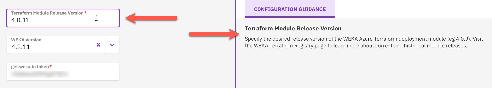

# WEKA Cloud Deployment Manager (CDM) User Guide

## Overview

The WEKA Cloud Deployment Manager (CDM) simplifies the deployment of WEKA clusters in public cloud environments (including AWS, Azure, and GCP). Leveraging WEKA’s validated Terraform deployment modules, the CDM provides a user-friendly interface to guide users through the initial configuration process.

Key features of the CDM:

* **Streamlined deployment:** The CDM streamlines the deployment of WEKA clusters, making it easier for users to set up their infrastructure.
* **Web-hosted solution:** The CDM is fully web-hosted, eliminating the need for downloads or installations. Users can quickly begin configuring their WEKA clusters.
* **Terraform configuration file:** The CDM process results in the main Terraform configuration file `(main.tf)`, which can be directly applied when deploying WEKA.

## Access the CDM

To access the CDM, follow these steps:

1. Navigate to [cloud.weka.io](http://cloud.weka.io).
2. On the welcome page, select the cloud environment (AWS, Azure, or GCP) for your WEKA cluster deployment. (This guide uses Azure as an example, but the deployment workflow is similar across all supported cloud platforms.)

<figure><figcaption>
CDM welcome
</figcaption></figure>

3. After selecting a public cloud, you are redirected to a login screen. Log in using your [get.weka.io](http://get.weka.io/) credentials. Internal WEKA users can use their Google SSO login to access CDM. Adhere to the following guidelines:
   * Ensure you have a get.weka.io token provisioned and available for a successful deployment.
   * If you are an internal WEKA user deploying a WEKA cluster for a customer, log in using the customer’s get.weka.io credentials. The signed-in user’s get.weka.io token automatically populates into the CDM configuration workflow.

<figure><figcaption>
CDM Login
</figcaption></figure>

Once logged in, you are presented with the main configuration dashboard of the Cloud Deployment Manager.

<figure><figcaption>
CDM main configuration
</figcaption></figure>

## CDM Interface

The CDM features a simple and clean configuration interface, offering the power and flexibility of our Terraform deployment modules. Below, each part of the interface is detailed for better understanding and usage.

The CDM interface consists of three main components:

* The workflow navigation stack (outlined in green)
* The configuration input panel (outlined in orange)
* The dynamic content sidebar (outlined in teal)

<figure><figcaption>
CDM interface main areas
</figcaption></figure>

### Workflow navigation stack

The workflow navigation stack provides convenient access to various WEKA cluster configuration variables. You can switch between different aspects of cluster configuration and adjust settings according to their deployment needs.

The tabs within the stack correspond to primary configurable aspects for a WEKA cluster:

* Basic WEKA cluster configuration
* Cloud networking configuration
* Cloud security configuration
* Optional object storage (OBS) configuration
* Optional deployment of NFS protocol nodes
* Optional deployment of SMB protocol nodes
* Optional deployment of WEKA clients
* Optional advanced configuration (granular cluster-level adjustments)

To ensure completeness from a basic requirements perspective, specific fields within the configuration input panel are marked as mandatory based on the selected configuration options.

The workflow navigation stack visually indicates the completeness of the configuration. A green check or a red **x** appears next to each tab, helping users identify areas that require additional attention. For example, if both Basic Configuration and Security Configuration have fields that need attention, the stack reflects this.

You can navigate between different workflow pages and view associated configuration input panels by clicking the **Next** button or selecting the desired tab from the workflow navigation stack.

<figure><figcaption>
Basic configuration page
</figcaption></figure>

### Configuration input panel

The configuration input panel provides a user-friendly interface for customizing input fields related to the WEKA cluster deployment. These fields correspond to variables in WEKA Terraform modules, which traditionally require manual formatting and entry into a `main.tf` file. With CDM, these variables are presented visually, streamlining the configuration process.

* You can tailor the input fields to match their needs and deployment objectives.
* Required fields are marked with a red asterisk.
* The following example illustrates the Basic Configuration workflow tab, where some required fields are populated, while others remain empty. Fields lacking input are highlighted in bright red, and the red outline disappears once the user provides the necessary information.

<figure><figcaption>
Basic configuration required fields
</figcaption></figure>

Certain fields within the configuration input panel require manual user input. Other fields, such as Instance Type, WEKA Version, and Region, are provided as selectable dropdown menus.



<figure><figcaption>
Instance Type
</figcaption></figure>



<figure><figcaption>
Region
</figcaption></figure>



The WEKA software release dropdown menu is designed to auto-populate with the most recent Long-Term Support (LTS) version by default. You can select the previous software release by opening the dropdown menu and choosing from the list. The top two entries in the dropdown are always LTS releases, while the bottom two are innovation releases.

If users need to enter a WEKA software release that is not listed in the dropdown, they can click directly in the WEKA Version input field and type the desired release. This feature is particularly useful when deploying a WEKA cluster with a customer-specific software release.

<figure><figcaption>
WEKA Version
</figcaption></figure>



### Dynamic content sidebar overview

The dynamic content sidebar enhances user experience by displaying contextually relevant information during various activities within CDM. Its primary functions include:

#### Real-time configuration guidance

* **Purpose:** Assists users in understanding the role of specific variables or input fields in the configuration input panel.
* **Functionality:** Automatically displays pertinent information when an input field, such as the Terraform Module Release Version, is selected. This feature covers every input field for AWS, Azure, and GCP configurations.

<figure><figcaption>
Terraform Module Release Version
</figcaption></figure>

#### Real-time file representation

* **Purpose:** Provides a preview of the file that will be generated for download once all configuration inputs are completed.
* **Functionality:** Next to the configuration guidance tab, a new tab labeled “tf file preview” showcases the file in real-time.

#### JSON and HCL format options for main.tf

* **Purpose:** Allows flexibility in file format based on deployment requirements.
* **Functionality:** Includes a toggle switch to change the main.tf file format between JSON and HCL.

#### Download finalized terraform configuration file

* **Purpose:** Enables users to download the completed configuration file for local use.
* **Functionality:** A **Download** button allows you to save the file locally, manually execute the relevant Terraform `plan`, and `apply` commands for WEKA cluster deployment.

<figure><figcaption></figcaption></figure>


All tabs in the workflow navigation stack display green status bubbles with check marks, indicating the configuration is complete and ready for a minimally viable WEKA deployment based on the user's selected parameters. Once all status bubbles are green, the dynamic content sidebar will only show the **TF File Preview** tab, **File Format** toggle, and **Download** button.


### Finalize the WEKA deployment

Once you download the CDM-generated Terraform file, manually execute the relevant Terraform commands to deploy their generated WEKA cluster configuration into the cloud of choice.

This means that Terraform, all its dependencies, relevant public cloud CLIs, and SDKs must exist, and the login uses an adequately privileged account before applying the Terraform file.

**Related topics**

[deployment-on-aws-using-terraform.md](aws/weka-installation-on-aws-using-terraform/deployment-on-aws-using-terraform.md "mention")

[deployment-on-azure-using-terraform.md](weka-installation-on-azure/deployment-on-azure-using-terraform.md "mention")

[deployment-on-gcp-using-terraform.md](weka-installation-on-gcp/deployment-on-gcp-using-terraform.md "mention")
