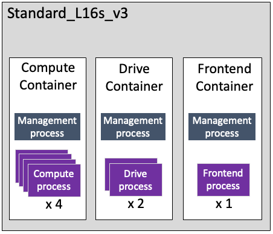

# Supported virtual machine types

## Supported VM sizes for backends

On Azure, WEKA is deployed in a multiple containers architecture using the storage-optimized Lsv3-series  of Azure Virtual Machines (Azure VMs), which features high throughput, low latency, and directly mapped local NVMe storage.

Each virtual machine size has a specific number of NICs, but only one is used for UDP mode connection for all traffic through the management interface.&#x20;

The following table provides the virtual machine sizes supported by the Terraform package:

<table><thead><tr><th width="198.33333333333331">VM size</th><th width="79">vCPU</th><th width="137">Memory (GiB)</th><th width="123">NVMe disks</th><th width="106">Max NICs</th><th width="100">BW (Mbps)</th></tr></thead><tbody><tr><td>Standard_L8s_v3</td><td>8</td><td>64</td><td>1x1.92 TB</td><td>4</td><td>12500</td></tr><tr><td>Standard_L16s_v3</td><td>16</td><td>128</td><td>2x1.92 TB</td><td>8</td><td>12500</td></tr><tr><td>Standard_L32s_v3</td><td>32</td><td>256</td><td>4x1.92 TB</td><td>8</td><td>16000</td></tr><tr><td>Standard_L48s_v3</td><td>48</td><td>384</td><td>6x1.92 TB</td><td>8</td><td>24000</td></tr><tr><td>Standard_L64s_v3</td><td>64</td><td>512</td><td>8x1.92 TB</td><td>8</td><td>30000</td></tr><tr><td>Standard_L80s_v3</td><td>80</td><td>640</td><td>10x1.92 TB</td><td>8</td><td>32000</td></tr><tr><td>Standard_L8as_v3</td><td>8</td><td>64</td><td>1x1.92 TB</td><td>4</td><td>12500</td></tr><tr><td>Standard_L16as_v3 </td><td>16</td><td>128</td><td>2x1.92 TB</td><td>8</td><td>12500</td></tr><tr><td>Standard_L32as_v3</td><td>32</td><td>256</td><td>4x1.92 TB</td><td>8</td><td>16000</td></tr><tr><td>Standard_L48as_v3 </td><td>48</td><td>384</td><td>6x1.92 TB</td><td>8</td><td>24000</td></tr><tr><td>Standard_L64as_v3</td><td>64</td><td>512</td><td>8x1.92 TB</td><td>8</td><td>32000</td></tr><tr><td>Standard_L80as_v3</td><td>80</td><td>640</td><td>10x1.92 TB</td><td>8</td><td>32000</td></tr></tbody></table>


Using the Azure Console, the client instances can have different virtual machine types provisioned separately from the WEKA cluster.


**Related information**

[Lsv3-series](https://learn.microsoft.com/en-us/azure/virtual-machines/lsv3-series) (Azure learning site)

[Lasv3-series](https://learn.microsoft.com/en-us/azure/virtual-machines/lasv3-series) (Azure learning site)

### Mapped cores to processes

In each virtual machine size, the cores are mapped to a specific number of the compute, drive, and frontend processes. For example, in the Standard\_L16s\_v3 size, the cores are mapped to the following processes:

* Compute: 4
* Drive: 2
* Frontend: 1

<figure><figcaption>
Mapped WEKA processes for a standard_L16s_v3
</figcaption></figure>

<table><thead><tr><th>VM size</th><th width="180"># of compute cores</th><th width="161"># of drive cores</th><th># of frontend cores</th></tr></thead><tbody><tr><td>Standard_L8s_v3</td><td>1</td><td>1</td><td>1</td></tr><tr><td>Standard_L16s_v3</td><td>4</td><td>2</td><td>1</td></tr><tr><td>Standard_L32s_v3</td><td>4</td><td>2</td><td>1</td></tr><tr><td>Standard_L48s_v3</td><td>3</td><td>3</td><td>1</td></tr><tr><td>Standard_L64s_v3</td><td>4</td><td>2</td><td>1</td></tr><tr><td>Standard_L64s_v3</td><td>4</td><td>2</td><td>1</td></tr><tr><td>Standard_L80s_v3</td><td>4</td><td>2</td><td>1</td></tr></tbody></table>

## Supported VM sizes for clients

### General purpose virtual machine sizes 

<table><thead><tr><th width="134">VM series</th><th>VM size</th></tr></thead><tbody><tr><td>Dsv3</td><td>Standard_D4s_v3, Standard_D8s_v3, Standard_D16s_v3</td></tr><tr><td>Dasv4</td><td>Standard_D2as_v4, Standard_D4as_v4, Standard_D8as_v4</td></tr><tr><td>Ddsv4</td><td>Standard_D16ds_v4</td></tr><tr><td>Dasv4</td><td>Standard_D4as_v4, Standard_D16as_v4, Standard_D32as_v4, Standard_D96as_v4</td></tr><tr><td>Dv5</td><td>Standard_D8_v5</td></tr><tr><td>Dsv5</td><td>Standard_D4s_v5 ,Standard_D16s_v5, Standard_D48s_v5 , Standard_D64s_v5</td></tr><tr><td>Dadsv5</td><td>Standard_D4ads_v5, Standard_D16ads_v5, Standard_D48ads_v5, Standard_D96ads_v5</td></tr><tr><td>Dcsv2</td><td>Standard_DC4s_v2 (UDP only)</td></tr><tr><td>Dasv5</td><td>Standard_D2as_v5, Standard_D8as_v5</td></tr><tr><td>Dpldsv5</td><td>Standard_D8plds_v5, Standard_D32plds_v5, Standard_D64plds_v5</td></tr><tr><td>Dpsv5</td><td>Standard_D4ps_v5, Standard_D8ps_v5, Standard_D16ps_v5, Standard_D32ps_v5, Standard_D48ps_v5, Standard_D64ps_v5</td></tr></tbody></table>

### Memory optimized virtual machine sizes

<table><thead><tr><th width="143">VM series</th><th>VM size</th></tr></thead><tbody><tr><td>Edsv4</td><td>Standard_E16ds_v4, Standard_E16-8ds_v4, Standard_E32ds_v4, </td></tr><tr><td>Easv4</td><td>Standard_E32-16as_v4</td></tr><tr><td>Easv5</td><td>Standard_E32-16as_v5</td></tr><tr><td>Edsv4</td><td>Standard_E32-16ds_v4, Standard_E48ds_v4</td></tr><tr><td>Eadsv5</td><td>Standard_E96ads_v5</td></tr><tr><td>Mdmsv2</td><td>Standard_M64dms_v2</td></tr><tr><td>Msv2</td><td>Standard_M208s_v2</td></tr><tr><td>Mmsv2</td><td>Standard_M208ms_v2, Standard_M416ms_v2</td></tr><tr><td>Epsv5</td><td>Standard_E4ps_v5, Standard_E8ps_v5, Standard_E16ps_v5, Standard_E20ps_v5, Standard_E32ps_v5</td></tr></tbody></table>

### Compute optimized virtual machine sizes

<table><thead><tr><th width="143">VM series</th><th>VM size</th></tr></thead><tbody><tr><td>FXmds</td><td>Standard_FX48mds</td></tr><tr><td>Fsv2</td><td>Standard_F8s_v2, Standard_F32s_v2, Standard_F64s_v2, Standard_F72s_v2</td></tr></tbody></table>

### Storage optimized virtual machine sizes

<table><thead><tr><th width="143">VM series</th><th>VM size</th></tr></thead><tbody><tr><td>Lsv3</td><td>Standard_L8s_v3, Standard_L16s_v3, Standard_L32s_v3, Standard_L48s_v3, Standard_L64s_v3, Standard_L80s_v3</td></tr></tbody></table>

### High performance optimized

<table><thead><tr><th width="143">VM series</th><th>VM size</th></tr></thead><tbody><tr><td>HBv4</td><td>Standard_HB176rs_v4, Standard_HB176-24rs_v4, Standard_HB176-96rs_v4</td></tr><tr><td>HBv3</td><td>Standard_HB120rs_v3</td></tr></tbody></table>

### GPU - accelerated compute

<table><thead><tr><th width="143">VM series</th><th>VM size</th></tr></thead><tbody><tr><td>NGads V620</td><td>Standard_NG8ads_V620_v1, Standard_NG16ads_V620_v1, Standard_NG32ads_V620_v1</td></tr><tr><td>NVadsA10</td><td>Standard_NVadsA10_v5</td></tr></tbody></table>

**Related information**

[Sizes for virtual machines in Azure](https://learn.microsoft.com/en-us/azure/virtual-machines/sizes) (Azure site)
