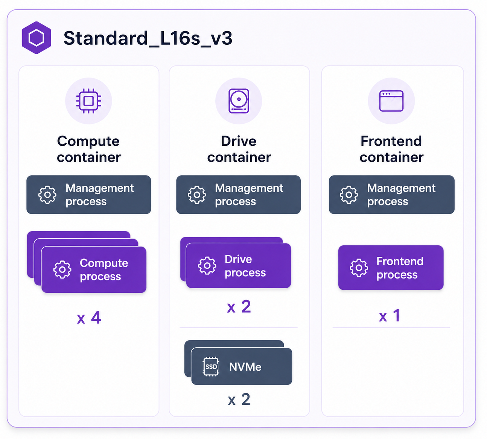

# Supported virtual machine types

## Supported VM sizes for backends

On Azure, WEKA is deployed in a multi-container architecture using the storage-optimized Lsv3-series and Lasv3-series Azure Virtual Machines (Azure VMs). These VMs feature high throughput, low latency, and directly mapped local NVMe storage.

Each VM size has a specific number of NICs, but only one is used for all traffic in UDP mode through the management interface.

The following table lists the VM sizes applied by the Terraform package on the backends:

| VM size             | vCPU | Memory (GiB) | NVMe disks | Max NICs | BW (Mbps) |
| ------------------- | ---- | ------------ | ---------- | -------- | --------- |
| Standard\_L8s\_v3   | 8    | 64           | 1x1.92 TB  | 4        | 12500     |
| Standard\_L16s\_v3  | 16   | 128          | 2x1.92 TB  | 8        | 12500     |
| Standard\_L32s\_v3  | 32   | 256          | 4x1.92 TB  | 8        | 16000     |
| Standard\_L48s\_v3  | 48   | 384          | 6x1.92 TB  | 8        | 24000     |
| Standard\_L64s\_v3  | 64   | 512          | 8x1.92 TB  | 8        | 30000     |
| Standard\_L80s\_v3  | 80   | 640          | 10x1.92 TB | 8        | 32000     |
| Standard\_L8as\_v3  | 8    | 64           | 1x1.92 TB  | 4        | 12500     |
| Standard\_L16as\_v3 | 16   | 128          | 2x1.92 TB  | 8        | 12500     |
| Standard\_L32as\_v3 | 32   | 256          | 4x1.92 TB  | 8        | 16000     |
| Standard\_L48as\_v3 | 48   | 384          | 6x1.92 TB  | 8        | 24000     |
| Standard\_L64as\_v3 | 64   | 512          | 8x1.92 TB  | 8        | 32000     |
| Standard\_L80as\_v3 | 80   | 640          | 10x1.92 TB | 8        | 32000     |


Using the Azure Console, the client instances can have different virtual machine types provisioned separately from the WEKA cluster.


**Related information**

[Lsv3-series](https://learn.microsoft.com/en-us/azure/virtual-machines/lsv3-series) and [Lasv3-series](https://learn.microsoft.com/en-us/azure/virtual-machines/lasv3-series) (Azure learning site)

### Mapped cores to processes

In each virtual machine size, the cores are mapped to a specific number of the compute, drive, and frontend processes. For example, in the Standard\_L16s\_v3 size, the cores are mapped to the following processes:

* Compute: 4
* Drive: 2
* Frontend: 1

<figure><figcaption>
Mapped WEKA processes for a standard_L16s_v3
</figcaption></figure>

| VM size             | # of compute cores | # of drive cores | # of frontend cores |
| ------------------- | ------------------ | ---------------- | ------------------- |
| Standard\_L8s\_v3   | 1                  | 1                | 1                   |
| Standard\_L16s\_v3  | 4                  | 2                | 1                   |
| Standard\_L32s\_v3  | 4                  | 2                | 1                   |
| Standard\_L48s\_v3  | 3                  | 3                | 1                   |
| Standard\_L64s\_v3  | 4                  | 2                | 1                   |
| Standard\_L80s\_v3  | 4                  | 2                | 1                   |
| Standard\_L8as\_v3  | 1                  | 1                | 1                   |
| Standard\_L16as\_v3 | 4                  | 2                | 1                   |
| Standard\_L32as\_v3 | 4                  | 2                | 1                   |
| Standard\_L48as\_v3 | 3                  | 3                | 1                   |
| Standard\_L64as\_v3 | 4                  | 2                | 1                   |
| Standard\_L80as\_v3 | 4                  | 2                | 1                   |

## Supported VM sizes for clients

### General purpose virtual machine sizes 

| VM series | VM size                                                                                                                    |
| --------- | -------------------------------------------------------------------------------------------------------------------------- |
| Dsv3      | Standard\_D4s\_v3, Standard\_D8s\_v3, Standard\_D16s\_v3                                                                   |
| Dasv4     | Standard\_D2as\_v4, Standard\_D4as\_v4, Standard\_D8as\_v4                                                                 |
| Ddsv4     | Standard\_D16ds\_v4                                                                                                        |
| Dasv4     | Standard\_D4as\_v4, Standard\_D16as\_v4, Standard\_D32as\_v4, Standard\_D96as\_v4                                          |
| Dv5       | Standard\_D8\_v5                                                                                                           |
| Dsv5      | Standard\_D4s\_v5 ,Standard\_D16s\_v5, Standard\_D48s\_v5 , Standard\_D64s\_v5                                             |
| Dadsv5    | Standard\_D4ads\_v5, Standard\_D16ads\_v5, Standard\_D48ads\_v5, Standard\_D96ads\_v5                                      |
| Dcsv2     | Standard\_DC4s\_v2 (UDP only)                                                                                              |
| Dasv5     | Standard\_D2as\_v5, Standard\_D8as\_v5                                                                                     |
| Dpldsv5   | Standard\_D8plds\_v5, Standard\_D32plds\_v5, Standard\_D64plds\_v5                                                         |
| Dpsv5     | Standard\_D4ps\_v5, Standard\_D8ps\_v5, Standard\_D16ps\_v5, Standard\_D32ps\_v5, Standard\_D48ps\_v5, Standard\_D64ps\_v5 |

### Memory optimized virtual machine sizes

| VM series | VM size                                                                                               |
| --------- | ----------------------------------------------------------------------------------------------------- |
| Edsv4     | Standard\_E16ds\_v4, Standard\_E16-8ds\_v4, Standard\_E32ds\_v4,                                      |
| Easv4     | Standard\_E32-16as\_v4                                                                                |
| Easv5     | Standard\_E32-16as\_v5                                                                                |
| Edsv4     | Standard\_E32-16ds\_v4, Standard\_E48ds\_v4                                                           |
| Eadsv5    | Standard\_E96ads\_v5                                                                                  |
| Mdmsv2    | Standard\_M64dms\_v2                                                                                  |
| Msv2      | Standard\_M208s\_v2                                                                                   |
| Mmsv2     | Standard\_M208ms\_v2, Standard\_M416ms\_v2                                                            |
| Epsv5     | Standard\_E4ps\_v5, Standard\_E8ps\_v5, Standard\_E16ps\_v5, Standard\_E20ps\_v5, Standard\_E32ps\_v5 |

### Compute optimized virtual machine sizes

| VM series | VM size                                                                       |
| --------- | ----------------------------------------------------------------------------- |
| FXmds     | Standard\_FX48mds                                                             |
| Fsv2      | Standard\_F8s\_v2, Standard\_F32s\_v2, Standard\_F64s\_v2, Standard\_F72s\_v2 |

### Storage optimized virtual machine sizes

| VM series | VM size                                                                                                               |
| --------- | --------------------------------------------------------------------------------------------------------------------- |
| Lsv3      | Standard\_L8s\_v3, Standard\_L16s\_v3, Standard\_L32s\_v3, Standard\_L48s\_v3, Standard\_L64s\_v3, Standard\_L80s\_v3 |

### High performance optimized

| VM series | VM size                                                                   |
| --------- | ------------------------------------------------------------------------- |
| HBv4      | Standard\_HB176rs\_v4, Standard\_HB176-24rs\_v4, Standard\_HB176-96rs\_v4 |
| HBv3      | Standard\_HB120rs\_v3                                                     |

### GPU - accelerated compute

| VM series  | VM size                                                                              |
| ---------- | ------------------------------------------------------------------------------------ |
| NGads V620 | Standard\_NG8ads\_V620\_v1, Standard\_NG16ads\_V620\_v1, Standard\_NG32ads\_V620\_v1 |
| NVadsA10   | Standard\_NVadsA10\_v5                                                               |

**Related information**

[Sizes for virtual machines in Azure](https://learn.microsoft.com/en-us/azure/virtual-machines/sizes) (Azure site)
