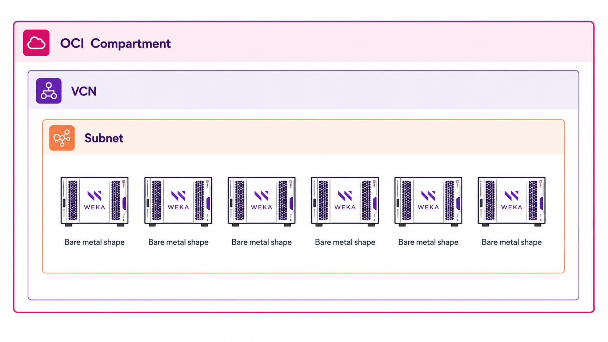

# WEKA installation on OCI

## Overview

The WEKA Data Platform deployment on OCI follows a process similar to bare-metal installation, with adaptations for cloud-specific architecture. This implementation allows you to leverage WEKA's high-performance storage capabilities within Oracle's cloud environment.

OCI provides the necessary infrastructure components for WEKA deployment, including bare-metal compute shapes, virtual networking, and storage options. However, certain limitations exist compared to on-premises deployments, particularly regarding network configuration flexibility.

<figure><figcaption>
WEKA cluster on OCI deployment
</figcaption></figure>

## Workflow

The deployment process includes the following main phases:

1. Prepare OCI bare metal infrastructure for WEKA.
2. Install WEKA on the OCI bare metal infrastructure.
3. Configure the WEKA cluster.
4. Add clients.


WEKA strongly recommends that you coordinate and obtain approval from OCI personnel before deploying any WEKA systems on OCI. This coordination ensures your deployment will be compatible with OCI's architecture and comply with cloud resource management policies.


### 1. Prepare OCI bare metal infrastructure for WEKA

Establish the foundational infrastructure required before installing the WEKA Data Platform software.

**Procedure**

1. **Verify resource compartment access:**
   1. Sign in to [https://cloud.oracle.com](https://cloud.oracle.com).
   2. Search for and select **compartments** from the **Services** section.
   3. Locate and click your designated **resource compartment** link.


If you see "Nothing here? Possible reasons..." message, you lack proper access permissions. Contact your cloud team for access before proceeding.


2.  **Verify IAM policy statements:**

    Navigate to [https://cloud.oracle.com/identity/domains/policies](https://cloud.oracle.com/identity/domains/policies) and verify your login has these permissions:

    * allow group \<identity group> to manage **compute-management-family** in compartment \<resource compartment>
    * allow group \<identity group> to manage **virtual-network-family** in compartment \<resource compartment>
    * allow group \<identity group> to manage **instance-family** in compartment \<resource compartment>
    * allow group \<identity group> to manage **volume-family** in compartment \<resource compartment>
    * allow group \<identity group> to manage **object-family** in compartment \<resource compartment>

    Replace terms in angle brackets with your company's specific names.
3. **Create cloud network:**
   1. Search for and select **VCN** from the **Services** section.
   2. Ensure the designated VCN has:
      * Subnet with sufficient addresses for admin/management access to each server.
      * Subnet with sufficient addresses for high-performance access to each server.
      * Subnet with sufficient addresses for high-performance clients mounting WEKA.


VCN capacity planning must account for both WEKA Data Platform and high-performance clients, as client mount connections cannot traverse firewalls or NAT-gateways.


4. **Deploy bare-metal servers:**
   1. Search for and select **Instances** from the **Services** section.
   2. Select the computer image:
      * Find your preferred OS version on [#operating-system](prerequisites-and-compatibility.md#operating-system "mention").
      * Select a matching image from the OCI instance image gallery.
   3. Select the appropriate server shape:
      * Select the **Bare Metal** option.
      * Select one the Bare Metal shapes, such as:
        * **BM.Optimized3.36**
        * **BM.DenseIO.E5.128**
        * **BM.HPC.E5.144**
        * **BM.GPU.H100, BM.GPU.H200, and BM.GPU.A100**
   4. Configure the boot volume:
      * Access the **Size and Performance** settings panel for the boot volume.
      * Switch to **Custom Configuration** mode.
      * Using the performance slider, set the VPUs/GB ratio to a minimum of **40**. Consider increasing this value beyond 40 VPUs/GB during periods of elevated cluster activity, because performance traces are stored on this boot volume.
   5. Configure network interfaces:
      * Create a primary NIC on the management subnet.
      * Create a secondary NIC on the high-performance subnet.

### 2. Install WEKA on the OCI bare metal infrastructure

1. Download the WEKA software. See [obtaining-the-weka-install-file.md](bare-metal/obtaining-the-weka-install-file.md "mention").
2.  Install the WEKA software.

    * Once the WEKA software tarball is downloaded from [get.weka.io](https://get.weka.io/), run the untar command.
    * Run the `install.sh` command on each server, following the instructions in the **Install** tab of [get.weka.io](https://get.weka.io/ui/dashboard).

    Once completed, the WEKA software is installed on all the allocated servers and runs in stem mode (no cluster is attached).

### 3. Configure the WEKA cluster

1. Use the resources generator to create configuration files (`drives0.json`, `compute0.json`, and `frontend0.json`) in the **/tmp** directory of each server.
2. Create containers using these configuration files on all cluster servers.
3. Complete essential post-configuration:
   * Apply your license.
   * Activate the IO service.
   * Verify your configuration.
   * Consider enabling event notifications if needed.

Refer to the related topics for detailed instructions on each step.

**Related topics**

[manually-configure-the-weka-cluster-using-the-resource-generator](bare-metal/manually-configure-the-weka-cluster-using-the-resource-generator/ "mention")

[perform-post-configuration-procedures.md](bare-metal/perform-post-configuration-procedures.md "mention").

### 4. Add clients or use converged mode

Depending on your deployment mode, you can choose one of the following options to access the WEKA filesystem:

* **Client-server mode:** In this configuration, client functionality is deployed on dedicated client servers, similar to a bare-metal WEKA cluster. This setup separates client and backend functionality. For detailed instructions, refer to [adding-clients-bare-metal.md](bare-metal/adding-clients-bare-metal.md "mention").
* **Converged mode:** In this configuration, client functionality is integrated with the backend servers. You can create a filesystem and mount it directly on each of the WEKA backend servers.

### What to do next

Proceed to [Broken link](/broken/pages/KEOEQRdsKM2PB9lTiaPg "mention"), which serves as your entry point for using the WEKA system. Start by familiarizing yourself with the graphical user interface (GUI) and command-line interface (CLI). Once you are comfortable, you can perform your first I/O operations using the WEKA filesystem. This includes creating a filesystem and mounting it on the appropriate client or backend servers, depending on your chosen deployment mode.
