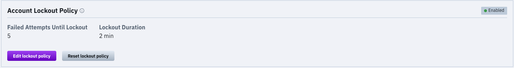
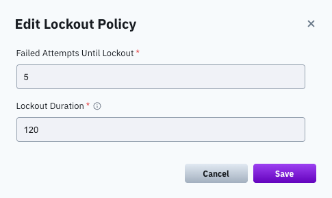

# Manage account lockout policy

To prevent brute force attacks, if several sign-in attempts fail (default: 5), the user account is locked for several minutes (default: 2 minutes).

You can control these default values using the GUI or the CLI.

## Manage account lockout policy using GUI

You can set the number of failed attempts until the account is locked and the lockout duration. You can also reset the lockout policy properties to the default values.

<figure><figcaption>
Account Lockout Policy
</figcaption></figure>

**Procedure**

1. From the menu, select **Configure > Cluster Settings**.
2. From the left pane, select **Security**.
3. In the Account Lockout Policy section, select **Edit lockout policy**.
4. In the Edit Lockout Policy dialog, do the following:
   * **Failed Attempts Until Lockout:** Set the number of sign-in attempts to lockout between 2 to 50.
   * **Lockout Duration:** Set the lockout duration between 30 seconds to 60 minutes.
5. Select **Save**.

<figure><figcaption>
Edit Lockout Policy
</figcaption></figure>

6. To reset the account lockout policy properties to the default values, select **Reset lockout policy**. In the confirmation message, select **Yes**.

## Manage account lockout policy using CLI

To control the default values, use the following CLI commands:

`weka security lockout-config set|show|reset`

**Commands options:**

`set`: Sets the number of failed attempts until the account is locked (`--failed-attempts`) and the lockout duration (`--lockout-duration`).

`reset`: Resets the number of failed attempts until the account is locked and the lockout duration to their default values.

`show`: Shows the number of failed attempts until the account is locked and the lockout duration.
