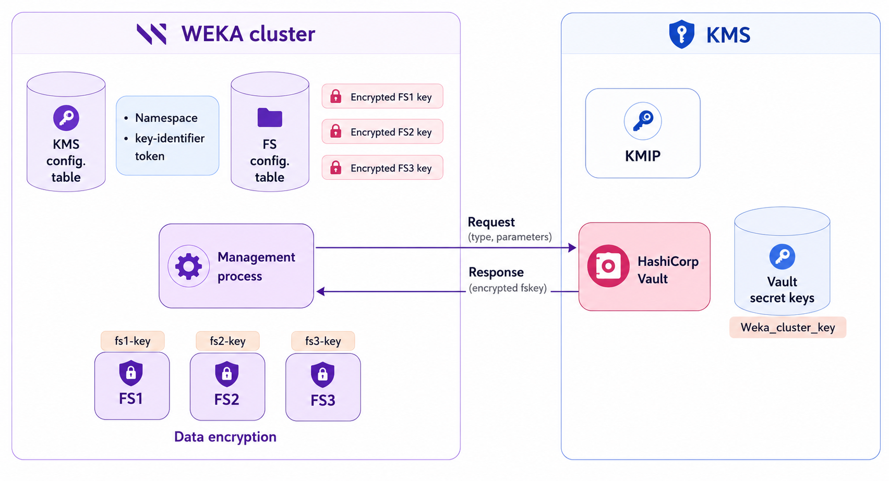
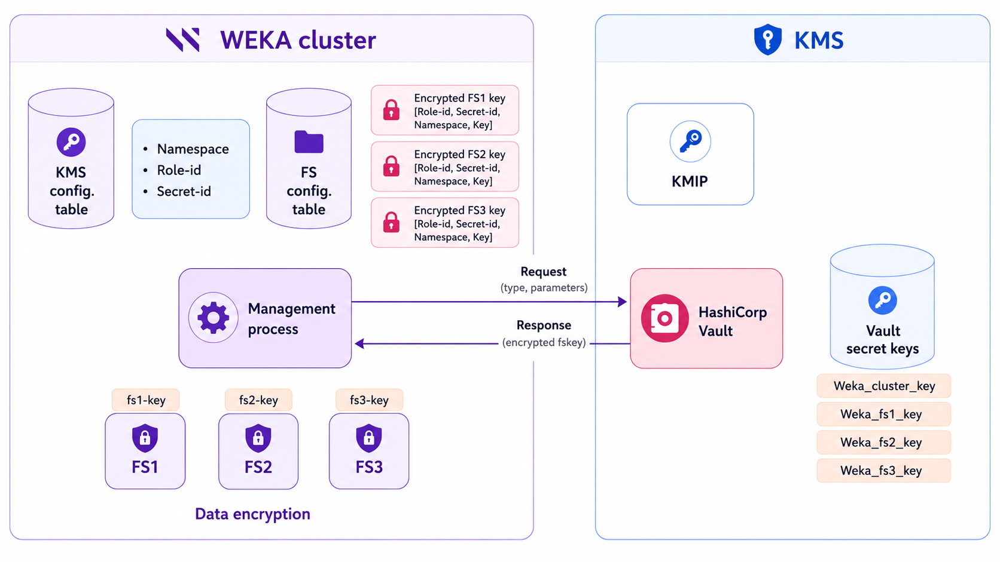

# Manage KMS

## Overview

When creating an encrypted filesystem in the WEKA system, a Key Management System (KMS) is essential for securely managing encryption keys. WEKA relies on the KMS to encrypt filesystem keys and decrypt them during system startup, using in-memory capabilities for ongoing data encryption and decryption.

The Snap-To-Object feature stores the encrypted filesystem key alongside the encrypted data when snapshots are taken. During snapshot promotion to a different filesystem or disaster recovery within the WEKA cluster, the KMS decrypts the filesystem key. Therefore, ensuring access to the same KMS configuration is crucial for these operations.

To enhance security, WEKA does not store any data that could reconstruct the KMS encryption keys. As a result, careful consideration of the following factors is required:

* **Disaster recovery strategy:** Loss of the KMS configuration can result in the loss of encrypted data. A robust Disaster Recovery (DR) plan is essential in production environments.
* **High availability:** The KMS must be available during system startup, filesystem creation, and key rotations. Ensuring high availability for the KMS is highly recommended.




In context of WEKA KMS OpenBao Vault is compatible with HashiCorp Vault. Any reference to HashiCorp Vault throughout the documentation, also apply to OpenBao Vault.


### **KMS encryption models**

WEKA supports two primary models for KMS integration.

#### **Cluster encryption key**

In this model, a single encryption key from the KMS serves as the master key for the entire WEKA cluster. All individual filesystem keys are encrypted (wrapped) by this cluster key.

For HashiCorp Vault or OpenBao Vault integration, this model supports two authentication methods:

* **Token-based authentication:** Uses a Vault token for authentication.
* **AppRole authentication:** Uses a **Role ID** and **Secret ID** for more structured, automated authentication.

#### **Per-filesystem encryption keys**

This model, available exclusively with HashiCorp Vault or OpenBao Vault, allows each filesystem to have its own unique encryption key sourced from the KMS. This approach provides enhanced data isolation, which is ideal for multi-tenant environments where each tenant requires a distinct, customer-controlled encryption key.

This configuration requires using **AppRole authentication**. Filesystems can share authentication credentials if they are in the same KMS namespace, or you can use cluster-level credentials for key access.

## **KMS integration best practices**

To ensure seamless operations and safeguard your data, adhere to the following best practices:

* **Disaster recovery setup:** Establish a robust backup or replication mechanism for the KMS to minimize the risk of data loss.
* **High availability:** Ensure that the KMS remains highly available, as the WEKA system identifies it through a single address. Downtime in KMS availability could disrupt critical operations.
* **KMS access:** Ensure that all WEKA backend servers can access the KMS to maintain consistent encryption and decryption functionality.
* **KMS method verification:** Familiarize yourself with the specific methods your KMS uses for key security, unsealing, and recovery. Different systems have distinct processes; for example, HashiCorp Vault can enable [auto-unsealing](https://developer.hashicorp.com/vault/tutorials/auto-unseal/autounseal-aws-kms) using a trusted service. Understanding these mechanisms is essential for efficient recovery and key management.
* **Snapshot backup:** When using Snap-To-Object, ensure that encrypted filesystem keys are backed up to an object store. This provides an additional layer of protection in case the WEKA system configuration is compromised.

For further guidance on securing HashiCorp Vault or OpenBao Vault in production environments, refer to the [HashiCorp Vault Production Hardening](https://learn.hashicorp.com/vault/operations/production-hardening) or [OpenBao Vault Post Installation Hardening](https://openbao.org/docs/install/#post-installation-hardening) documentation.

## KMS integration: cluster encryption keys

The diagram illustrates WEKA's cluster encryption process supported on all supported KMS types. This example focuses on HashiCorp Vault for key management.

The following steps outline the process for managing encryption keys across the WEKA cluster:

1. **Initial setup:** Each encrypted filesystem (FS) in the WEKA cluster requires a unique encryption key. FS keys are encrypted using a cluster key and stored securely in the configuration table. The KMS configuration table stores the namespace and key-identifier for streamlined key management and secure access to encryption keys within the WEKA cluster.
2. **Encryption process:** During normal operation, encrypted FS keys are stored in the configuration table. FS keys in-memory are used for real-time encryption/decryption. After a restart, encrypted FS keys are retrieved and decrypted using the cluster key.
3. **Rewrap operation:** The rewrap process involves decrypting the FS key, retrieving it, and then re-encrypting the FS key with a new version of the cluster key. This ensures that the FS keys remain protected with updated encryption, enhancing security based on KMS policies.

<figure><figcaption>
KMS integration with cluster encryption keys
</figcaption></figure>

## KMS integration: per-filesystem encryption keys

In multi-tenant environments, such as clusters offering POSIX or S3 services to multiple customers, strong data isolation is essential. To meet this requirement, WEKA extends its KMS integration to support per-filesystem encryption keys using HashiCorp Vault or OpenBao Vault. This enables each tenant to use a distinct, customer-controlled encryption key.

#### Why use per-filesystem encryption keys?

In multi-tenant deployments, isolating encryption keys by tenant ensures that no single key compromises data confidentiality across the environment. Assigning a unique encryption key to each filesystem, managed externally by a KMS, eliminates shared cluster-wide keys and enhances security.

#### **Key features**

* **Independent encryption keys per filesystem:** Enables tenant-level data isolation by assigning a unique external key to each filesystem.
* **Shared credentials option:** Filesystems within the same namespace can share authentication credentials if appropriate.
* **Cluster-level authentication support:** Optionally allows use of cluster-wide credentials for key access.
* **Role-based access control (RBAC):** Supports role-based authentication to enforce secure and auditable key access.

#### Authentication method

WEKA integrates with HashiCorp Vault or OpenBao Vault using the **AppRole** authentication method, enabling each filesystem to use a distinct, revokable identity for secure key access. This design is critical for ensuring tenant-level isolation and key management flexibility.

#### Architecture overview

The following diagram illustrates how WEKA integrates with HashiCorp Vault to manage per-filesystem encryption keys:

<figure><figcaption>
KMS integration with per-filesystem encryption keys
</figcaption></figure>

#### **Configuration process**

Administrators must configure multiple keys within the KMS, one for each filesystem. During the creation of a filesystem, specific parameters are required, including the namespace, KMS key identifier, role ID, and secret ID. This configuration ensures that the filesystem operates with its dedicated encryption key.

The `weka fs create` command supports this process. For details, see [#create-a-filesystem](../../weka-filesystems-and-object-stores/managing-filesystems/managing-filesystems-1.md#create-a-filesystem "mention").

#### **Key update and fallback**

Filesystem keys can be updated when necessary, such as when transitioning from Key1 to Key2. Administrators also have the option to revert to the cluster key, which involves removing the individual filesystem keys and returning to the previous setup.

The `weka fs update` command supports these updates. For details, see [#edit-a-filesystem](../../weka-filesystems-and-object-stores/managing-filesystems/managing-filesystems-1.md#edit-a-filesystem "mention").

**Rewrap KMS security key for a specific filesystem**

Rewrap operations can be performed per filesystem, enabling each key to be re-encrypted with a new version if there are concerns about key compromise.

The `weka fs kms-rewrap` command supports this operation. For details, see [#rewrap-the-filesystem-encryption-key](../../weka-filesystems-and-object-stores/managing-filesystems/managing-filesystems-1.md#rewrap-the-filesystem-encryption-key "mention").

#### Create a filesystem from an encrypted snapshot

To create a filesystem from an uploaded snapshot originating from an encrypted source, use the `weka fs download` command. For details, see [#create-a-filesystem-from-an-uploaded-snapshot](../../weka-filesystems-and-object-stores/snap-to-obj/snap-to-obj-1.md#create-a-filesystem-from-an-uploaded-snapshot "mention").

#### **Security configuration**

Before configuring per-filesystem encryption, you must first establish a connection between the WEKA cluster and the configured HashiCorp Vault KMS by setting up the `key-identifier` (Weka\_cluster\_key in the illustration above). Use the `weka security kms set` command to specify the `role-id` and `secret-id` for this connection. For details, see [#configure-the-kms](kms-management-1.md#configure-the-kms "mention").

If there are concerns about key compromise, administrators can rewrap all filesystem keys using the `weka security kms rewrap --all` command.\
When the `--all` option is omitted, the system rewraps only the filesystems that use the cluster encryption key. For details, see [#rewrap-filesystem-keys](kms-management-1.md#rewrap-filesystem-keys "mention").


The configuration for per-filesystem encryption keys in KMS integration is available exclusively in the CLI.


**Related topics**

[kms-management.md](kms-management.md "mention")

[kms-management-1.md](kms-management-1.md "mention")
