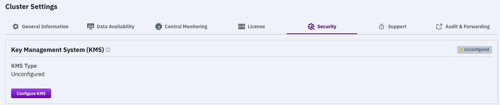
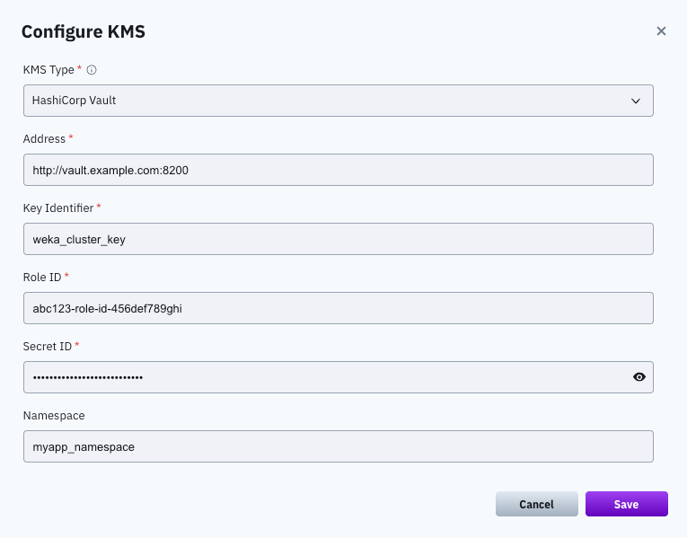
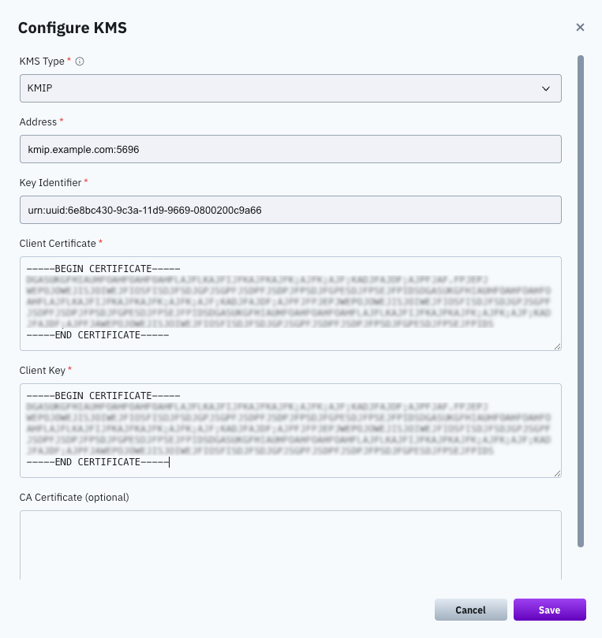

# Manage KMS using the GUI

## Configure a KMS

Configure the KMS of either HashiCorp Vault or KMIP within the WEKA system to encrypt filesystem keys securely.

**Before you begin**

Ensure the KMS is preconfigured, and the key and a valid token are readily available.

**Procedure**

1. From the menu, select **Configure > Cluster Settings**.
2. Select **Security**.

<figure><figcaption></figcaption></figure>

3. On the **Security** page, select **Configure KMS**.
4. On the **Configure KMS** dialog, select the KMS type to deploy: **HashiCorp Vault** or **KMIP**.
5. Set the connection properties according to the selected KMS type. Select the relevant tab for details:



To configure the HashiCorp Vault connection from the GUI, set the following properties.

* **Address:** The KMS server address.
* **Key Identifier:** The key name used to secure the filesystem keys.
* **Role ID:** The Role ID for AppRole authentication, provided by the Vault administrator.
* **Secret ID:** The Secret ID for AppRole authentication, provided by the Vault administrator.
* **Namespace:** The namespace in Vault that identifies the logical partition for organizing data and policies. Namespace names must not end with `/`, avoid spaces, and refrain from using reserved names like `root`, `sys`, `audit`, `auth`, `cubbyhole`, and `identity`.


The GUI procedure configures HashiCorp Vault for **per-filesystem encryption**, which uses the AppRole authentication method. To configure cluster-wide encryption (using either a token or AppRole), use the CLI. See [#configure-the-kms](kms-management-1.md#configure-the-kms "mention").





To configure the KMIP connection, set the following properties:

* **Address:** The hostname and port of the KMS, in `hostname:port` format. The hostname can be a fully qualified domain name (FQDN) or an IP address. Do not include protocol prefixes such as `https://`. The default port for KMIP is 5696, but this can vary based on the server configuration.
* **KMS Identifier:** The key UID used to secure the filesystem keys.
* **Client Certificate:** The content of the client certificate PEM file.
* **Client Key:** The content of the client key PEM file.
* **CA Certificate:** (Optional) The content of the CA certificate PEM file.

<figure><figcaption>
KMIP type configuration
</figcaption></figure>




6. Select **Save**.

**Related topics**

[Obtain an API token from the vault](kms-management-1.md#obtain-an-api-token-from-the-vault)

[Obtain a certificate for a KMIP-based KMS](kms-management-1.md#obtain-a-certificate-for-a-kmip-based-kms)

## View the KMS configuration

**Procedure**

1. From the menu, select **Configure > Cluster Settings**.
2. From the left pane, select **Security**.\
   The **Security** page displays the configured KMS.

## Update the KMS configuration

Update the KMS configuration in the WEKA system when changes occur in the KMS server details or cryptographic keys, ensuring seamless integration and continued secure filesystem key encryption.


If your system is upgraded to version 4.4.2 or higher, the **Update KMS Configuration** screen displays a configuration with the Token parameter. Reset the KMS configuration and configure it using the new **Role ID** and **Secret ID** parameters.


**Procedure**

1. From the menu, select **Configure > Cluster Settings**.
2. Select **Security**. The **Security** page displays the configured KMS.
3. Select **Update KMS**, and update the settings. For the parameter descriptions, see [#configure-a-kms](kms-management.md#configure-a-kms "mention").
4. Select **Save**.

## Reset the KMS configuration

Reseting a KMS configuration is possible only if no encrypted filesystems exist.

**Procedure**

1. From the menu, select **Configure > Cluster Settings**.
2. From the left pane, select **Security**.
3. The **Security** page displays the configured KMS.
4. Select **Reset KMS.**
5. In the message that appears, select **Yes** to confirm the KMS configuration reset.
