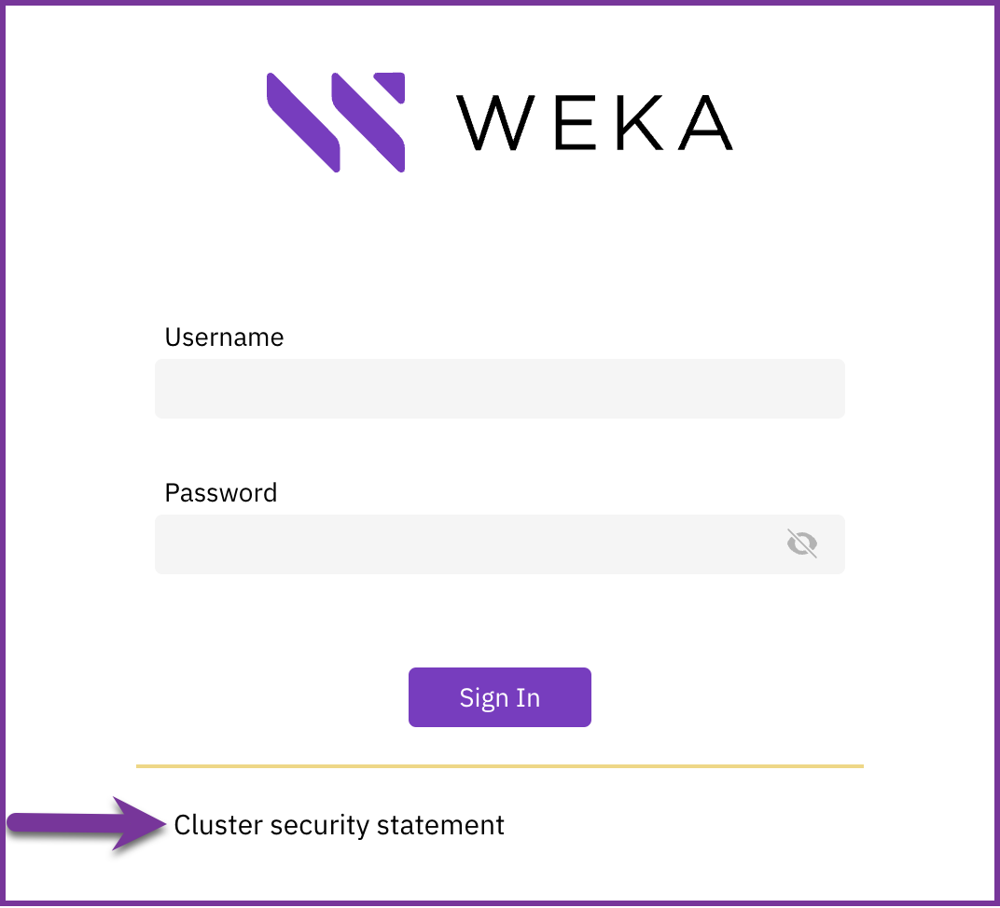
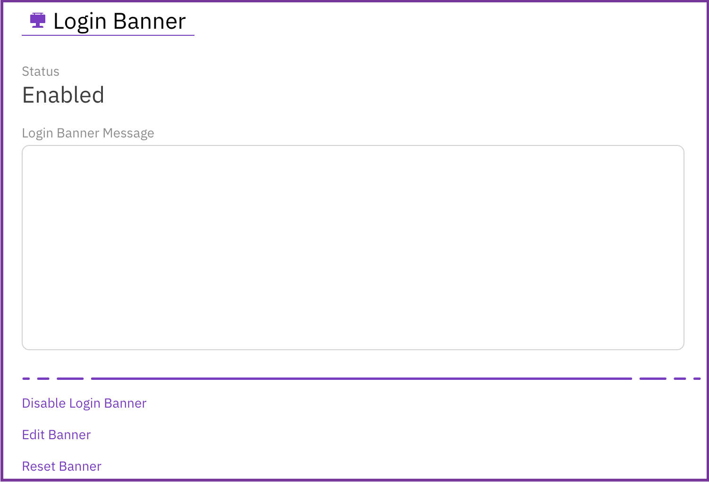
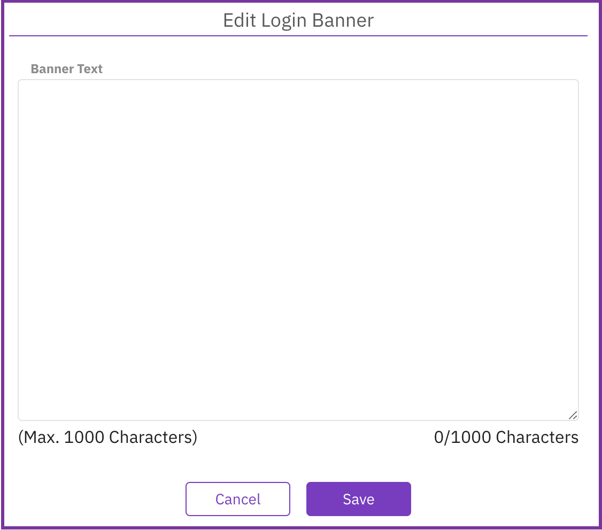

# Manage login banner

The login banner provides a security statement or a legal message displayed on the sign-in page displayed on the GUI. The statement can be a definitive warning to any possible intruders that may want to access your system that certain types of activity are illegal, but at the same time, it also advises the authorized and legitimate users of their obligations relating to acceptable use of the system.

## Manage login banner using GUI

You can set a login banner containing a security statement or a legal message displayed on the sign-in page. You can also disable, edit, or reset the login banner.

**Procedure**

1. From the menu, select **Configure > Cluster Settings**.
2. From the Cluster Settings pane, select **Security**.
3. On the Security page, select **Login Banner**.

4. Select **Edit Banner**.

5. In the Edit Login Banner, write your organization statement in the banner text box.
6. Select **Save**.
7. To prevent displaying the login banner, select **Disable Login Banner**.
8. To clear the banner text, select **Clear Login Banner Message.**

## Manage login banner using CLI

To manage the login banner, use the following CLI commands:

`weka security login-banner set|show|reset|enable|disable`

**Command options:**

`set:` Sets the login banner text.

`show`: Shows the login banner text.

`reset`: Clears the login banner text.

`enable`: Displays the login banner when accessing the cluster.

`disable:` Prevents displaying the login banner when accessing the cluster.
