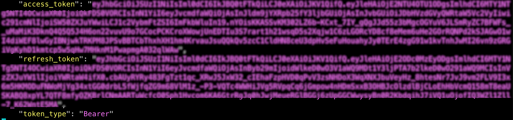
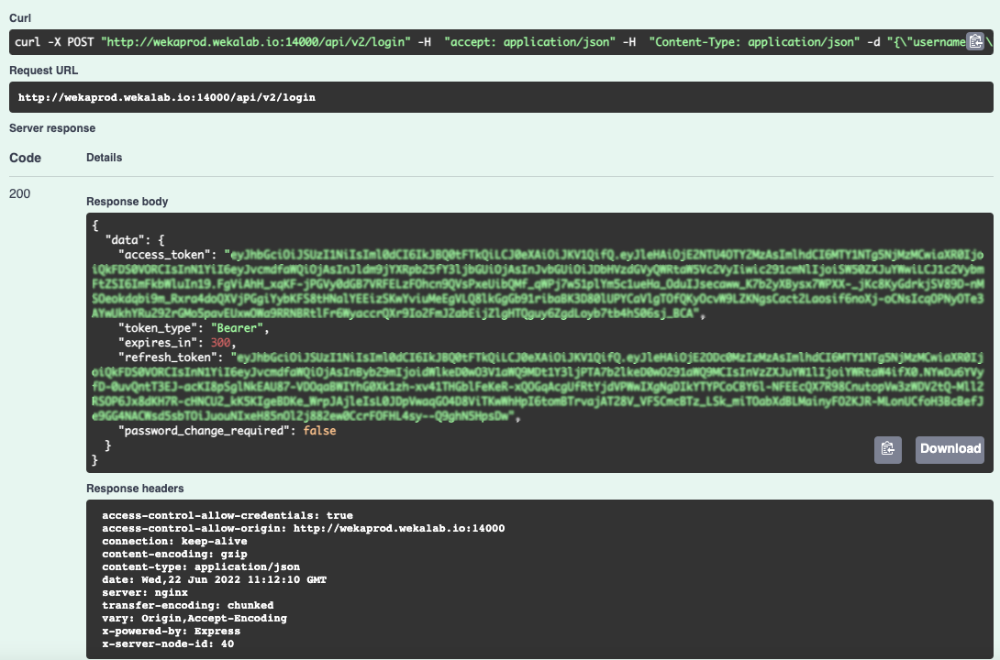
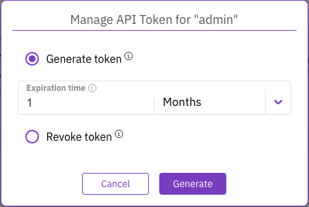
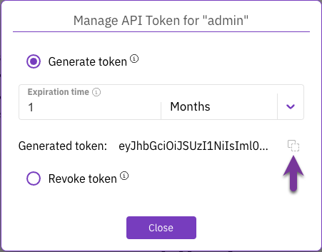
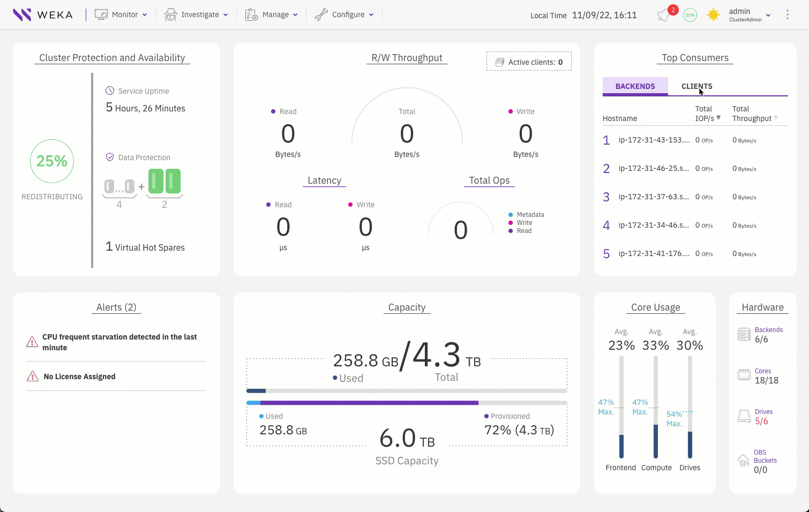

# Obtain authentication tokens

There are two types of authentication tokens: an access token and a refresh token.

* **Access token:** A short-lived token (valid for five minutes) used to access the WEKA system API and enable secure filesystem mounting.
* **Refresh token:** A long-lived token (one month by default, but customizable) used to obtain new access tokens as needed.

**Procedure**

Do one of the following:

*   **Using the CLI**: To obtain the refresh token and access token through the **CLI**, log in to the system using the command: `weka user login`. For details, see [#log-in-to-the-weka-cluster](../operation-guide/user-management/user-management-1.md#log-in-to-the-weka-cluster "mention").

    The system creates an authentication token file and saves it in `~/.weka/auth-token.json`. The token file contains both the access token and the refresh token.

* **Using the REST API**: To obtain the refresh token and access token through the **REST API,** use the `POST /login`. The API returns the token in the response body.

## Manage long-lived tokens for REST API usage

When working with the REST API, local users may use a long-lived token (a token that doesn't require a refresh every 5 minutes).

As a local user, you can generate a long-lived token using the GUI or the CLI.

### Generate a long-live access token using the GUI

**Procedure**

1. From the signed-in user menu, select **API Token**.
2. In the Manage API Token dialog, select Generate token and set the expiration time. Then, select **Generate**.

<figure><figcaption>
Manage API Token
</figcaption></figure>


If you want to revoke all existing login tokens of the local user and refresh them, select **Revoke Tokens**.


3\. Copy the generated token and paste it to the REST API authorization dialog.

<figure><figcaption>
Generated token
</figcaption></figure>

The following demonstrates how to generate the API token and authorize it in the REST API.

<figure><figcaption>
Generate a long-lived token using the GUI example
</figcaption></figure>

### Generate a long-lived access token using the CLI

**Command:** `weka user generate-token [--access-token-timeout timeout]`

The default timeout is 30 days.

To revoke the access and refresh tokens, use the CLI command: `weka user revoke-tokens`.
