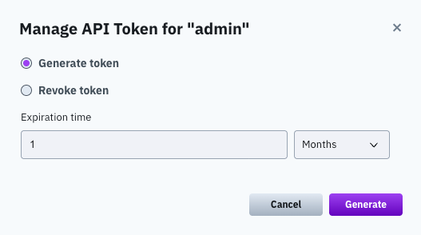
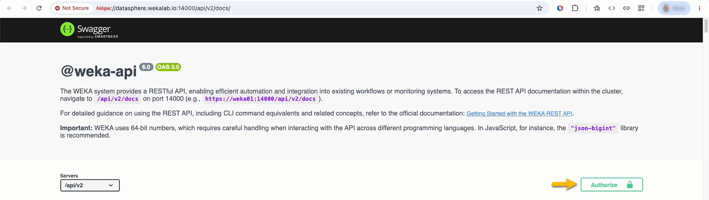
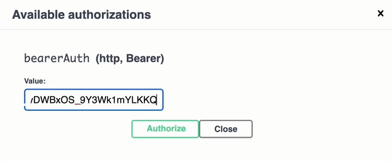

# Obtain authentication tokens

There are two types of authentication tokens: an access token and a refresh token.

* **Access token:** A short-lived token (valid for five minutes) used to access the WEKA system API and enable secure filesystem mounting.
* **Refresh token:** A long-lived token (one month by default, but customizable) used to obtain new access tokens as needed.

**Procedure**

Do one of the following:

*   **Using the CLI**: To obtain the refresh token and access token through the **CLI**, log in to the system using the command: `weka user login`. For details, see [#log-in-to-the-weka-cluster](../operation-guide/user-management/user-management-1.md#log-in-to-the-weka-cluster "mention").

    The system creates an authentication token file and saves it in `~/.weka/auth-token.json`. The token file contains both the access token and the refresh token.

<div data-with-frame="true"></div>

* **Using the REST API**: To obtain the refresh token and access token through the **REST API,** use the `POST /login`. The API returns the token in the response body.

<div data-with-frame="true"></div>

## Manage long-lived tokens for REST API usage

When working with the REST API, local users may use a long-lived token (a token that doesn't require a refresh every 5 minutes).

As a local user, you can generate a long-lived token using the GUI or the CLI.

### Generate a long-lived access token using the GUI

Generate a long-lived access token for REST API authentication.

#### Before you begin

Sign in as a local user.

1. Open the signed-in user menu. Select **API Token**.
2. In **Manage API Token**, select **Generate token**. Set the expiration time. Select **Generate**.

<div data-with-frame="true"><figure><figcaption><p>Manage API Token</p></figcaption></figure></div>


If you want to revoke all existing login tokens of the local user and refresh them, select **Revoke Tokens**.


3. Copy the generated token.
4. In the three-dot menu, select **REST API**. The cluster REST API opens in your browser.
5. Select **Authorize**.

<div data-with-frame="true"><figure><figcaption><p>REST API</p></figcaption></figure></div>

6. In **Available authorizations**, paste the token. Select **Authorize**.

<div data-with-frame="true"><figure><figcaption><p>Available authorizations</p></figcaption></figure></div>

6. Use the REST API endpoints.

### Generate a long-lived access token using the CLI

Generates a long-lived access token for REST API use, so automation does not have to log in with a password.

**Command:** `weka user generate-token`

```sh
weka user generate-token [--access-token-timeout <duration>] [--plain]
```

**Parameters**

| Parameter                            | Description                                                            |
| ------------------------------------ | ---------------------------------------------------------------------- |
| `--access-token-timeout` \<duration> | Duration until the access token expires.                               |
| `--plain`                            | Print the token to the console instead of copying it to the clipboard. |
