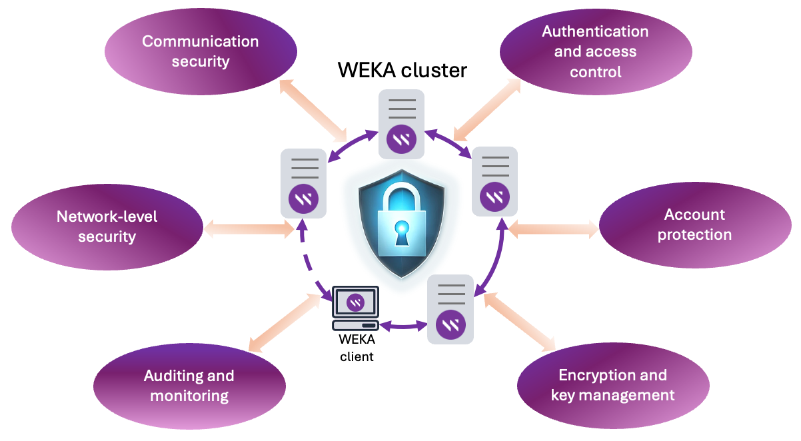
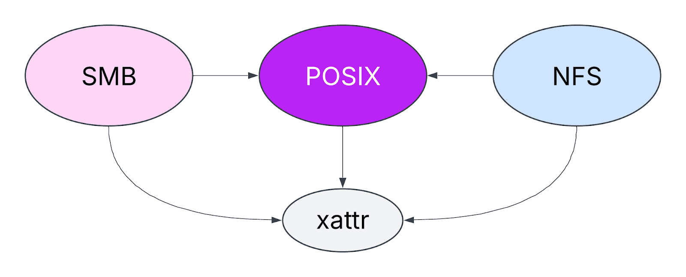

# WEKA security overview

## Introduction

As data security becomes increasingly critical, WEKA provides a comprehensive security framework to ensure the confidentiality, integrity, and availability of your data.

Learn about the supported security features and recommended configurations to protect sensitive data, comply with industry regulations, and reduce the risk of unauthorized access. Implementing these measures makes secure deployment and operation both straightforward and effective.

<figure><figcaption>
WEKA security overview
</figcaption></figure>

***

## Authentication

Authentication is the process of verifying the identity of a user, system, or device before granting access to resources. It ensures that the entity attempting to gain access is who they claim to be. Authentication is a critical component and is often paired with authorization, which determines what authenticated users are allowed to do.

### **User authentication**

#### Kerberos

NFS with Kerberos enhances security by allowing mounts to clients with valid Kerberos tickets. It supports three Kerberos modes:

* **`krb5`**: Authenticates users through Kerberos V5 instead of local UNIX UIDs and GIDs.
* **`krb5i`**: Adds integrity checking using secure checksums to prevent data tampering.
* **`krb5p`**: Encrypts NFS traffic for maximum security, though with higher performance overhead.

Encryption support varies by NFS version. NFSv3 has no native encryption, while NFSv4 (with Kerberos configured) can encrypt all RPC communication, including metadata and payload.

To enable these modes, list `krb5`, `krb5i`, or `krb5p` in the `--enable-auth-types` parameter within the global NFS configuration or when creating an export.

**Related topic**

[#nfs-integration-with-kerberos-service](../additional-protocols/nfs-support/#nfs-integration-with-kerberos-service "mention")

#### Active Directory

WEKA integrates with Active Directory to assign roles to users based on their Active Directory group memberships. These roles determine whether users can manage the cluster, mount filesystems, or more.

To join a WEKA cluster to Active Directory, use the `weka user ldap setup-ad` command.

Active Directory also serves as an identity source for SMB users. Use the `weka smb cluster create` command during SMB setup to set the Active Directory domain as an identity source for SMB users.

**Related topic**

[#join-the-smb-cluster-in-the-active-directory](../additional-protocols/smb-support/smb-management-using-the-gui.md#join-the-smb-cluster-in-the-active-directory "mention")

#### LDAP

LDAP functions similarly to Active Directory but offers additional features, such as retrieving user and group IDs from extended attributes.

To connect the WEKA cluster to LDAP, use the `weka user ldap setup` command.

**Related topic**

[user-management](../operation-guide/user-management/ "mention")

#### Local

The WEKA system manages user access and roles locally or through directories like LDAP or AD. Local users can have roles just like LDAP or AD users, but you assign them through direct mapping.

To manage local users, use the `weka user add/update/delete` commands.

**Related topic**

[#authentication-and-login-process](../operation-guide/user-management/#authentication-and-login-process "mention")

#### Security token service (STS)

The WEKA Security Token Service (STS) provides temporary credentials for S3 API access. Using temporary credentials enhances security by limiting the exposure of long-term access keys and enforcing the principle of least privilege for specific tasks.

To retrieve temporary credentials, run the `weka s3 sts assume-role` command. The API response provides an access key, a secret key, and a session token. Access is granted based on the permissions defined in the IAM policy attached to the user's role. You can also specify a more restrictive IAM policy when requesting the credentials to further limit the token's permissions.

Before you can assume a role, perform the following actions:

* Create a local S3 user.
* Assign the S3 role to the user.
* Attach an IAM policy to the user's role.

**Related topic**

[#generate-a-temporary-security-token](../additional-protocols/s3/s3-users-and-authentication/s3-users-and-authentication.md#generate-a-temporary-security-token "mention")

#### S3 service accounts

An S3 service account provides persistent, long-term credentials for programmatic access to manage object store buckets and S3 APIs. Unlike the temporary credentials from STS, service account credentials do not expire, making them suitable for trusted applications and automated services.

Service accounts operate as child identities of a parent S3 user. They inherit their base privileges from the IAM policies attached to the parent user. You can also apply an additional, more restrictive IAM policy directly to the service account to limit its access to specific actions and resources.

To create a service account, run the `weka s3 service-account add` command.

**Related topic**

[s3-users-and-authentication-1.md](../additional-protocols/s3/s3-users-and-authentication/s3-users-and-authentication-1.md "mention")

### **Cluster entity authentication**

Securing the cluster infrastructure involves authenticating the cluster entities, such as servers, containers, processes, and clients. This process ensures that only authorized entities can join the cluster, which is critical for maintaining data integrity and preventing security breaches.

Cluster entity authentication prevents servers in multi-cluster environments from mistakenly joining a neighboring cluster and blocks malicious resources from infiltrating your system. The primary mechanism for this is the join secret.

#### Join secret

The join secret ensures that backends can only join a cluster if they share the same secret key. This feature mitigates two risks:

* In multi-cluster environments, backends might mistakenly rejoin a neighboring cluster instead of their original one.
* During a security breach, a malicious resource could infiltrate a cluster and access sensitive information.

Generate a join token by running `weka cluster join-token generate` on a backend server.

To add the join secret to a backend container, run `weka local resources join-secret <secret>`.

**Related topic**

[secure-cluster-membership-with-join-secret-authentication.md](../secure-cluster-membership-with-join-secret-authentication.md "mention")

***

## Access control

Access control models define how users and systems interact with resources in the WEKA cluster. The WEKA platform uses two fundamental models to provide robust and flexible security:

* Discretionary Access Control (DAC)
* Mandatory Access Control (MAC)

### Discretionary access control (DAC)

In the DAC model, an owner of an object (like a file or directory) can grant or revoke permissions for other users at their discretion.

#### Access control lists (ACLs)

Access Control List (ACL) is a list of entries that specifies which users or groups have permission to access an object, such as a file or a directory. By managing ACLs, users can enforce granular control over who can perform what actions on their resources, ensuring data confidentiality and integrity.

The WEKA platform supports ACLs across SMB, POSIX, and NFS, offering protocol-specific permission models and a hybrid flavor for versatile multi-protocol access.

<figure><figcaption></figcaption></figure>

**SMB ACL flavors**

WEKA SMB supports three ACL flavors to manage permissions in different environments.

* **Windows:** When you set an ACL through an SMB client, the system stores it exclusively in Windows format within an extended attribute metadata file (`xattr`). Consequently:
  * SMB clients see the Windows ACL.
  * POSIX and NFS clients do not see any ACLs on the object.
* **POSIX:** When you select POSIX as the preferred ACL flavor, the system stores ACLs set through SMB in POSIX format in the POSIX metadata. This makes the ACL visible for all clients (SMB, POSIX, and NFS), ensuring consistent permissions.
*   **Hybrid:** When you set an ACL through an SMB client, the system stores it in both the `xattr` (in Windows format) and the POSIX metadata (translated to the closest POSIX format). As a result:

    * SMB clients see the original Windows ACL from the `xattr`.
    * POSIX and NFS clients see the translated POSIX ACL.

    However, in Hybrid mode, a direct update to the POSIX ACL invalidates the corresponding ACL in the `xattr`. This, in turn, invalidates the ACL of the opposing protocol. For example, an ACL update from an SMB client overrides the POSIX ACL and invalidates a previously set NFSv4 ACL.

**NFS ACL flavors**

The WEKA NFS service provides a similar model with four distinct flavors to manage permissions.

* **NFSv4:** When you set an ACL through an NFSv4 client, the system stores it in the `xattr`. This enforces native NFSv4 ACLs, which offer fine-grained control. However, this limits interoperability, as SMB and POSIX clients will not see this ACL.
* **POSIX:** When you set an ACL through an NFS or POSIX client, the system stores it in the POSIX metadata, ensuring compatibility across different protocols. All clients (NFS, POSIX, and SMB) will see the same POSIX ACL.
*   **Hybrid:** When you set an ACL through an NFSv4 client, the system combines both POSIX and NFSv4 ACLs to ensure consistency. As a result:

    * NFSv4 clients see the native NFSv4 ACL.
    * POSIX and SMB clients see a translated POSIX ACL.

    However, similar to the SMB Hybrid flavor, any direct update to the POSIX ACL invalidates the corresponding ACL stored in the `xattr`. This action invalidates the ACL of the opposing protocol. For instance, an ACL update from an NFS client overrides the POSIX ACL and invalidates a previously set Windows ACL.
* **None:** No ACL enforcement or updates occur, even if POSIX ACLs exist on a file or directory.&#x20;

**ACL best practices**

To ensure predictable and stable permissions in a multi-protocol environment, follow these best practices:

* **Avoid using Hybrid mode on both protocols simultaneously:** When you set both SMB and NFS to the Hybrid flavor, they continuously override each other's POSIX ACL updates. This conflict leads to unpredictable permissions and is not a recommended configuration.
* **Use the POSIX flavor for consistent multi-protocol access:** If both NFS and SMB access are required, using the POSIX flavor for both is the recommended approach. This method standardizes permission granularity and provides the most predictable permission translation between protocols.
* **Use native flavors for isolated permissions:** If you require simultaneous protocol access but do not need permissions to be consistent, you can use native security flavors (Windows for SMB and NFSv4 for NFS). This configuration stores each protocol's ACLs in the extended attribute metadata file (`xattr`) without translation, which can result in different access permissions depending on the protocol you use.
* **Prioritize the dominant protocol:** If one access protocol is used significantly more than others, set its preferred security flavor and configure the minor protocol to use either POSIX or None, depending on your specific use case.

***

### Mandatory access control (MAC)

The MAC model enforces access policies from a central authority. Users cannot change the access rights, as the system strictly enforces security labels defined by an administrator.

#### Roles

The WEKA system uses roles to manage user access permissions. You can assign roles to local users or map them to users from a directory service like LDAP or AD. Each user account has a unique display name and is authenticated with a secret. The system supports up to 1,152 local users.

When you create a WEKA cluster, the system generates a default Cluster Admin user (`admin`) with a default password. It is critical to reset this password upon first login, as the `admin` user has full administrative privileges across the cluster.

**Password policy**

User passwords must meet the following requirements:

* Minimum of 8 characters
* At least one uppercase letter
* At least one lowercase letter
* At least one number or special character

#### Authentication and authorization

During an authentication attempt, the system first searches for the user in the local accounts. If the user is not found locally, the system then checks the configured directory service. WEKA supports a single directory service (either AD or LDAP) per organization.

The system provides automatic user mapping from LDAP or AD group memberships to WEKA roles. If a user is a member of more than one mapped group, they receive a union of all associated roles, granting them aggregated permissions.

**Special roles**

In addition to standard administrative and user roles, WEKA provides special roles for specific services. You can assign these roles only to local users.

* **CSI:** The CSI role facilitates Kubernetes interaction with the WEKA cluster through the WEKA CSI Plugin. It grants permissions limited to filesystem provisioning and management through the CLI and API.
*   **S3:** The S3 user role provides access to the WEKA system exclusively through the S3 protocol.

    This role allows a user to execute S3 commands and API calls. All actions are governed by the permissions defined in the user's attached S3 IAM policy.

    A user with the S3 role can also create S3 service accounts and assign specific IAM policies to them. The role is strictly limited to S3 protocol operations and does not grant any management permissions on the WEKA cluster.

#### Account lockout

The WEKA platform provides an account lockout policy to prevent brute-force login attacks. The system temporarily locks a user's account after multiple consecutive incorrect login attempts.

The default policy settings are:

* Failed attempts threshold: 5
* Lockout duration: 2 minutes

This feature discourages automated password guessing while minimizing disruption to legitimate users.

To manage the account lockout policy use the `weka security lockout-config set` command.

**Related topic**

[account-lockout-threshold-policy-management.md](account-lockout-threshold-policy-management.md "mention")

#### CIDR-based policies

CIDR-based policies allow administrators to regulate access to WEKA cluster management and POSIX data services by creating rules that permit or block connections from specific client IP ranges. These policies strengthen security by limiting network access without requiring user authentication. You manage them centrally at the organization and filesystem levels to ensure only authorized clients can connect.

Policy management and considerations:

* **Administrator control:** Only administrators can manage CIDR-based security policies. Cluster Admins manage policies in the root organization, while Organization Admins manage them in their respective non-root organizations.
* **Live sessions:** Policy updates do not affect active connections. A mounted client session remains active until it is disconnected.
* **Rule order:** The order in which you attach policies determines the filtering sequence.
* **Implementation models:** The WEKA platform supports both whitelist and blacklist approaches.
  * To implement an allowlist, place an **any-deny** rule at the end of the policy list and add specific **allow** rules above it.
  * To implement a denylist, add only the specific **deny** rules for the clients you wish to block.

**Related topic**

[manage-cidr-based-security-policies.md](manage-cidr-based-security-policies.md "mention")

**S3 IAM policies**

An S3 IAM policy is a JSON-based document that defines the specific actions a user, group, or role can perform on WEKA S3 resources, such as reading or writing objects in buckets. These policies are crucial for securely managing access and enforcing the principle of least privilege.

After a Cluster Admin creates an S3 user, they must attach an IAM policy to grant the necessary permissions. Without an attached policy, the user cannot execute any S3 commands or API calls.

The Cluster Admin can attach either a pre-defined WEKA policy or a custom-created policy. You can use a tool like the [AWS Policy Generator](https://awspolicygen.s3.amazonaws.com/policygen.html) to create custom policies in the required JSON format.

**Related topic**

[s3-users-and-authentication.md](../additional-protocols/s3/s3-users-and-authentication/s3-users-and-authentication.md "mention")

**Bucket policies**

A bucket policy is a JSON document that you attach directly to an S3 bucket. It defines what actions are allowed or denied on that specific bucket and its objects for various principals, regardless of the user, group, or role making the request.

**Related topic**

[s3-buckets-management](../additional-protocols/s3/s3-buckets-management/ "mention")


**S3 IAM and bucket policies notes:**

* When a request is made to an S3 resource, WEKA evaluates both the bucket policy and the relevant IAM policies. If either policy explicitly denies access, the request is denied, even if the other policy grants permission.
* As a security best practice, grant permissions according to the principle of least privilege, ensuring users have only the access they require.


#### SELinux

The WEKA system supports the use of SELinux (Security-Enhanced Linux) on its clients. SELinux is a security architecture in the Linux kernel that enforces mandatory access control (MAC) policies defined by a system administrator.

You can enable SELinux on a client server using one of the following methods:

* **For the current session**: To enable SELinux in `Enforcing` mode temporarily, run the following command on the client: `sudo setenforce Enforcing`
*   **For persistent configuration:** To enable SELinux persistently across system reboots, edit the

    `/etc/selinux/config` file. A system reboot is required for this change to take effect.

#### Login banner

The login banner displays a customizable legal or security message on the GUI sign-in page. It serves to warn against unauthorized access and to inform authorized users of their responsibilities and acceptable use policies.

To configure the login banner, use the `weka security login-banner set` command.

**Related topic**

[manage-the-login-banner.md](manage-the-login-banner.md "mention")

***

## Encryption

The WEKA platform uses encryption to protect data confidentiality by scrambling readable data (plaintext) into an unreadable format (ciphertext). This fundamental security technique prevents unauthorized parties from viewing or tampering with your data.

WEKA applies encryption in two primary contexts:

* **Encryption at rest:** Secures data stored on the physical media within the cluster.
* **Encryption in transit:** Secures data as it travels across the network between clients and the cluster.

### **Encryption at rest**

Encryption at rest secures data that is stored on physical media, such as the SSDs within the WEKA cluster. This practice ensures that data remains unreadable and protected even if the physical storage devices are stolen or accessed by unauthorized individuals. WEKA encrypts all data before it is written to the storage tier and leverages an external Key Management Service (KMS) for secure and robust management of the encryption keys.

#### **Key management service (KMS)**

A Key Management Service (KMS) provides a centralized system to securely manage the entire lifecycle of cryptographic keys, including their generation, storage, distribution, rotation, and destruction. It offers administrators a secure and simplified method for controlling access to the essential keys used for data encryption and decryption.

In the WEKA system, the KMS plays a crucial role during startup by encrypting and decrypting filesystem keys. For ongoing data operations, WEKA relies on efficient in-memory functions to maintain high performance for encryption and decryption. To enhance security, the WEKA system never stores any information that could potentially reconstruct the master encryption keys managed by the KMS.

Using a KMS is vital for security when you use the Snap-to-object feature. Without KMS integration, the system protects an encrypted filesystem snapshot with a generic key, meaning the snapshot can potentially be restored on any WEKA cluster. The generic key uses the XTS-AES 256 library.

**Related topic**

[kms-management](kms-management/ "mention")

### **Encryption in transit**

Encryption in transit protects data as it travels across networks, such as between clients and the WEKA cluster. This process is essential for preventing unauthorized interception, eavesdropping, or tampering with data during transmission. The WEKA platform provides distinct encryption methods for its various data protocols to ensure the confidentiality and integrity of your data in transit.

**POSIX**

The WEKA system provides transparent encryption for data accessed by POSIX clients using the XTS-AES-256 algorithm. An automatic layer encrypts data when it is written to disk and decrypts it when it is read, making the process invisible to POSIX programs.

The key features of this encryption method include:

* **512-bit key:** The system uses a 512-bit key that is split into two parts. One part performs the encryption, while the other ensures that each block of data is unique.
* **Block-level encryption:** Each 512-byte (or larger) block is encrypted separately. This secures the data even if an application accesses parts of the disk out of order.

#### **NFS**

The WEKA system supports both NFSv3 and NFSv4. NFSv3 does not have a native data encryption mechanism. In contrast, NFSv4 supports encryption with Kerberos when you configure it to use the `krb5p` security mode. WEKA supports NFSv4 only with the NFS-W service.

#### **SMB**

You can encrypt SMB share access to secure data in transit. When a supported client sends an encrypted request, the WEKA SMB-W service replies with an encrypted message. You can also configure the cluster to always encrypt outgoing SMB traffic, regardless of the client’s settings.

By default, WEKA SMB-W follows the client’s message signing preference; the server signs its response only if the client signs its request. The message signing algorithm depends on the SMB version:

* SMB2: Uses HMAC-SHA256
* SMB3: Uses AES-CMAC

#### **S3**

The WEKA S3 service uses Transport Layer Security (TLS) to secure data in transit, ensuring confidentiality, integrity, and authentication between clients and the S3 service. It supports both TLS 1.2 and 1.3 and leverages modern cipher suites, including AES-256-GCM and ChaCha20-Poly1305. The implementation, built on OpenSSL 3.3, provides enhanced performance for HTTPS connections and adheres to strong cryptographic standards.
