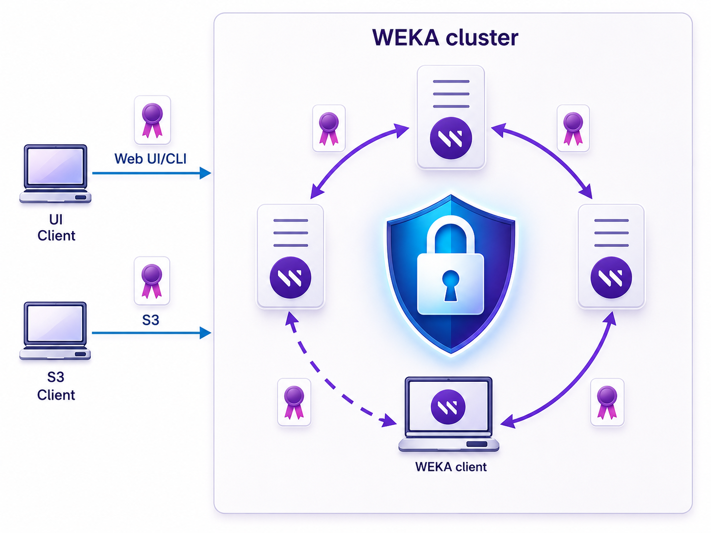

# Manage TLS certificates

The TLS implementation in a WEKA cluster secures communication between clients and the system, and between WEKA servers and clients. TLS certificates serve two key purposes:

* **Data Protection:** Encrypting data in transit to ensure confidentiality and integrity.
* **Authentication:** Verifying the system’s identity to prevent unauthorized access.

By default, the WEKA system deploys a self-signed TLS certificate to secure access to the Web UI, CLI, and API over HTTPS (port 14000) . Users can enhance security by deploying their own TLS certificates, which requires providing an unencrypted private key and certificate in PEM format.

The system supports TLS 1.2 and higher, enforcing encrypted communication with a minimum of 128-bit ciphers.

To establish trust with external services, such as a Key Management System (KMS), the system relies on well-known CA certificates. If a custom CA certificate is required for WEKA servers to authenticate external services, manually configure the custom CA certificate on the WEKA servers.

<figure><figcaption>
TLS implementation
</figcaption></figure>

**Related topics**

[manage-the-tls-certificate-using-the-gui.md](manage-the-tls-certificate-using-the-gui.md "mention")

[manage-the-tls-certificate-using-the-cli.md](manage-the-tls-certificate-using-the-cli.md "mention")
