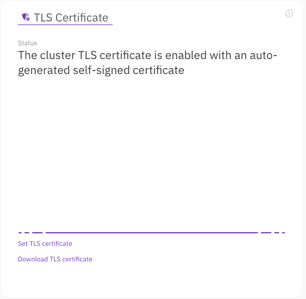
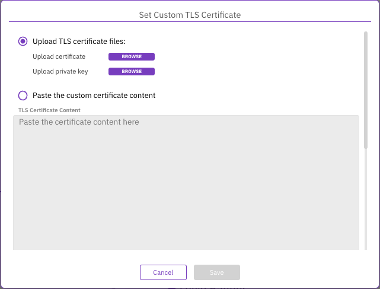
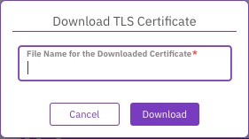
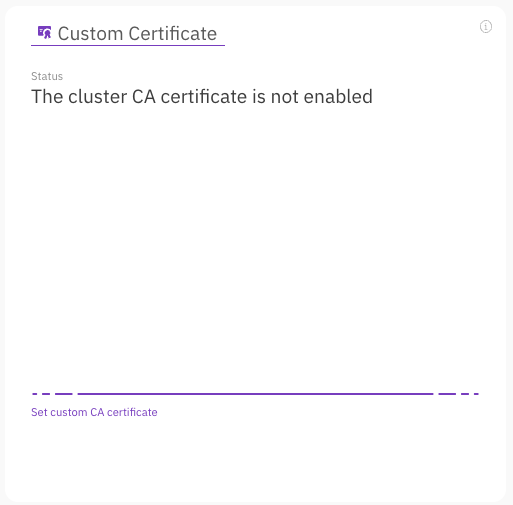
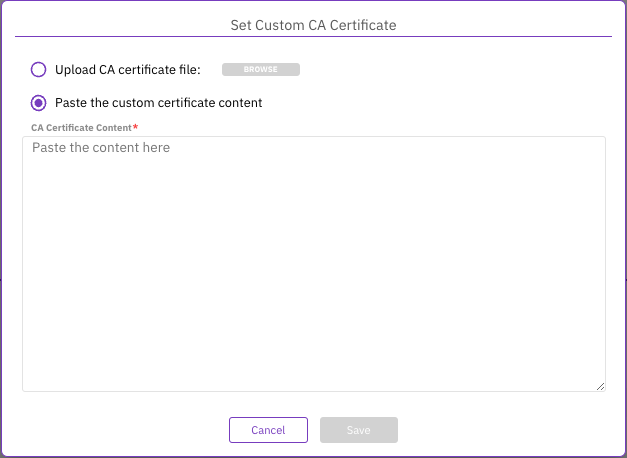
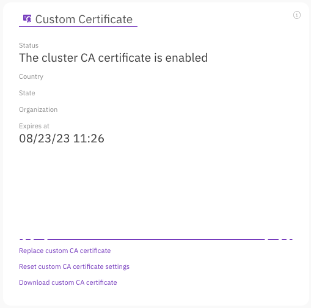
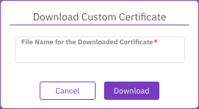

# Manage TLS certificates using GUI

## Set and download TLS certificate&#x20;

Upon system installation, the cluster's TLS certificate is activated with an auto-generated self-signed certificate, enabling access to the GUI, CLI, and API via HTTPS. If you have a custom TLS certificate, you may replace the auto-generated self-signed certificate with your own. Additionally, you can download the existing TLS certificate for integration with other applications that require communication with the cluster, such as Local WEKA Home.

**Procedure**

1. From the menu, select **Configure > Cluster Settings**.
2. From the left pane, select **Security**.
3. In the TLS Certificate section, select **Set TLS certificate**.
4. In the Set Custom TLS Certificate dialog, do one of the following:
   * Select **Upload TLS certificate files**, and upload the TLS certificate and private key files.
   * Select **Paste the custom certificate content**, and paste the content of the TLS certificate and private key.

5. To download the existing TLS certificate, select **Download TLS certificate**. \
   &#x20;In the dialog, set a name for the certificate and select **Download**.

## Set custom CA certificate 

The system uses well-known CA certificates to establish trust with external services. For example, when using a KMS. If a different CA certificate is required for Weka servers to establish trust, set this custom CA certificate on the Weka servers.

**Procedure**

1. From the menu, select **Configure > Cluster Settings**.
2. From the left pane, select **Security**.
3. In the TLS Certificate section, select **Set custom CA certificate**.
4. In the Set Custom CA Certificate dialog, do one of the following:
   * Select **Upload CA certificate file**, and upload the custom CA certificate file.
   * Select **Paste the custom certificate content**, and paste the content of the custom CA certificate.
5. Select **Save**.

## Manage the custom CA certificate 

Once a CA certificate is set, you can:

* Replace the CA certificate with a new one according to the deployment needs.
* Remove (reset) the custom CA certificate settings.
* Download the existing CA certificate for later use.

**Procedure**

1. From the menu, select **Configure > Cluster Settings**.
2. From the left pane, select **Security**.
3. In the TLS Certificate section, select **Replace custom CA certificate**.
4. In the Set Custom CA Certificate dialog, do one of the following:
   * Select **Upload CA certificate file**, and upload the custom CA certificate file.
   * Select **Paste the custom certificate content**, and paste the content of the custom CA certificate.
5. Select **Save**.
6. If required to remove the custom CA certificate, select **Reset custom CA certificate settings**. In the confirmation message, select **Yes**.
7. To download the existing CA certificate, select **Download custom CA certificate**. In the dialog, set a name for the certificate and select **Download**.

**Related topic**

[local-weka-home-deployment.md](../../monitor-the-weka-cluster/the-wekaio-support-cloud/local-weka-home-deployment.md "mention")

[deploy-local-weka-home-v2.x.md](../../monitor-the-weka-cluster/the-wekaio-support-cloud/deploy-local-weka-home-v2.x.md "mention")
