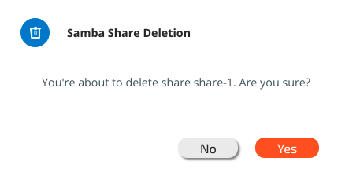

# SMB Management Using the GUI


**Note:** For activating GUI control of Samba, contact the WekaIO Support Team.


## **Configuring a Samba Cluster**

To configure a Samba cluster, first access the SMB Service view.

To configure the Samba cluster, click the Configure button. The following Configure Cluster window will be displayed:

Enter the name and domain, choose between 3 to 8 hosts and enter the IPs \(make sure to provide IPs equal to or 3 times greater than the number of hosts selected\). Then click the Configure button.


**Note:** in order to add an IP range, it is possible to use`a.b.c.x-y` notation.


The following Samba Cluster Configuration window will be displayed:


**Note:** The status of the hosts will change from not ready to ready.



**Note:** In AWS installations, it is not possible to enter a list of SMB service addresses. The SMB service must be accessed using the primary addresses of the cluster nodes.


## Joining Samba to an Active Directory

To join Samba to an Active Directory, click the Join button when all hosts have been prepared and are ready. The following window will be displayed:

Enter the provided username and password in order to access the Active Directory. The Server input field is optional, The default for the Computers Org.Unit field is the Computers directory, but it is possible to define any other directory in Active Directory to be connected, such as SMB servers or Corporate computer.


**Note:** WekaIO does not save the user password. A computer account is created on behalf of the user for the SMB cluster.


On successful completion, the join status next to the domain will change to "joined as &lt;username&gt;" as shown below:

In order to join another Active Directory to the current Samba cluster configuration, click the Leave button. To confirm this action, it is necessary to enter the username and password used to connect to the Active Directory.


**Note:** To configure a new Samba cluster, the current Samba cluster has to be deleted.


## Deleting a Samba Cluster

To delete a configured Samba cluster, click the Reset button in the Configure Samba Cluster window. The following window will be displayed:

Confirm the deletion by clicking the Reset button.

## **Listing SMB Shares**

To access SMB shares**,** click the SMB Shares tab in the SMB Service Overview screen. A list of all SMB shares will be displayed**:**


**Note:** It is possible to filter this list using any column in the table.


## Adding an SMB Share

To add a new SMB share, click Create Share at the top right-hand corner of the table. The following Create Share window will be displayed:

Enter the new share name and description, select a filesystem and enter the path. Then click the Create button. The new share will receive the default mount mode \(readcache\). 

## Removing an SMB Share

To remove an SMB share, click anywhere on the row to be removed and then click the Delete button.

The Samba Share Deletion window will be displayed**:**

Click the Yes button to confirm deletion of the share. The deleted share will no longer appear in the SMB Shares list.

