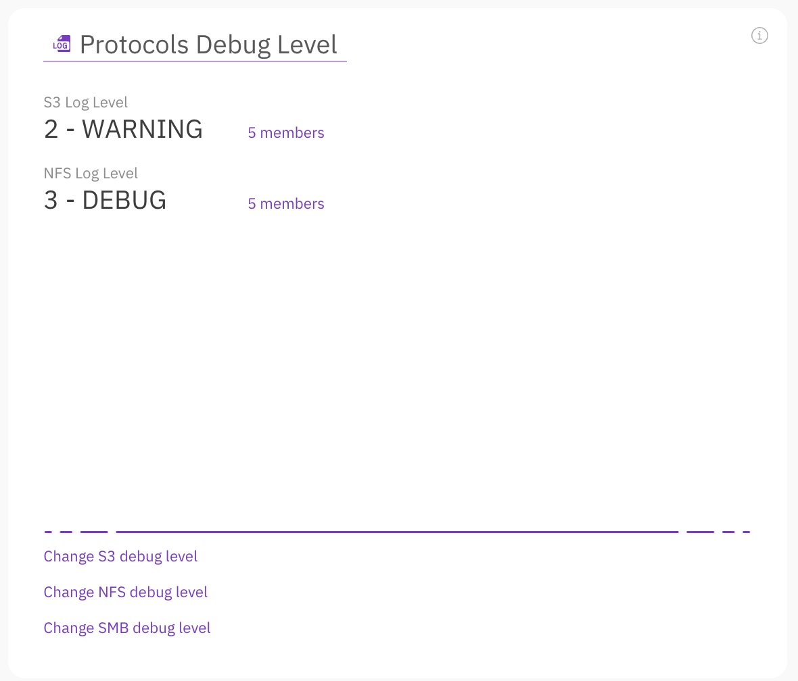
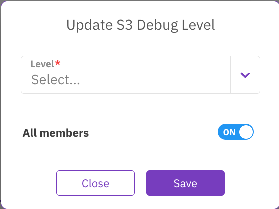
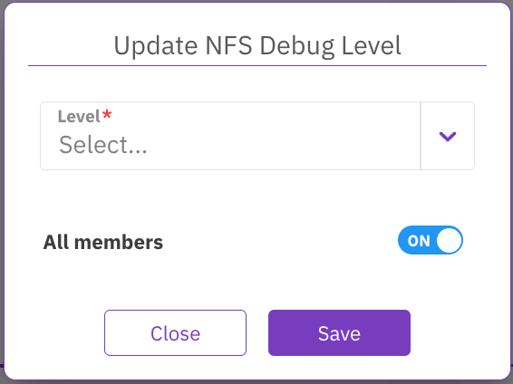
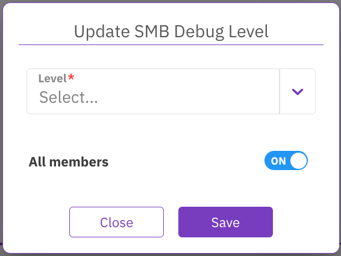

---
metaLinks:
  alternates:
    - >-
      https://app.gitbook.com/s/0yXyIrnroN3zIG3qa4W3/support/diagnostics-management/protocols-debug-level-management/manage-protocols-debug-level-using-the-gui
---

# Manage protocols debug level using the GUI

The Protocols Debug Level section displays the debug level for the S3 and NFS protocols only (the SMB debug level is not shown). You can change the debug level only for the configured protocols.

Using the GUI, you can:

* [Update S3 debug level](manage-protocols-debug-level-using-the-gui.md#update-s3-debug-level)
* [Update NFS debug level](manage-protocols-debug-level-using-the-gui.md#update-nfs-debug-level)
* [Update SMB debug level](manage-protocols-debug-level-using-the-gui.md#update-smb-debug-level)


Once the server is restarted, the log verbosity level reverts to its default.


## Update S3 debug level 

If the S3 protocol is configured, you can change the debug level for all servers or specified servers.

The available debug levels are:

* 0 - CRITICAL
* 1 - ERROR
* 2 - WARNING
* 3 - INFO
* 4 - DEBUG
* 5 - TRACE

**Procedure**

1. From the menu, select **Configure > Cluster Settings**.
2. From the left pane, select **Support**.
3. On the Protocols Debug Level section, select **Change S3 debug level**.
4. On the Update S3 Debug Level dialog, set the following properties:
   * **Level:** Select the debug level.
   * **All servers:** If you want to apply the update on all the servers, switch to **On**. If you want to apply the update on specific servers, switch to **Off** and select the required servers.

## Update NFS debug level 

If the NFS protocol is configured, you can change the debug level for all servers or specified servers.

The available debug levels are:

* 1 - EVENT
* 2 - INFO
* 3 - DEBUG
* 4 - MID DEBUG
* 5 - FULL DEBUG

**Procedure**

1. From the menu, select **Configure > Cluster Settings**.
2. From the left pane, select **Support**.
3. On the Protocols Debug Level section, select **Change NFS debug level**.
4. On the Update NFS Debug Level dialog, set the following properties:
   * **Level:** Select the debug level.
   * **All servers:** If you want to apply the update on all the servers, switch to **On**. If you want to apply the update on specific servers, switch to **Off** and select the required servers.

## Update SMB debug level 

If the SMB protocol is configured, you can change the debug level for all servers or specified servers.

The available debug levels are:

* 0 - NO DEBUG
* 5 - MID DEBUG
* 10 - FULL DEBUG

**Procedure**

1. From the menu, select **Configure > Cluster Settings**.
2. From the left pane, select **Support**.
3. On the Protocols Debug Level section, select **Change SMB debug level**.
4. On the Update SMB Debug Level dialog, set the following properties:
   * **Level:** Select the debug level.
   * **All servers:** If you want to apply the update on all the servers, switch to **On**. If you want to apply the update on specific servers, switch to **Off** and select the required servers.

