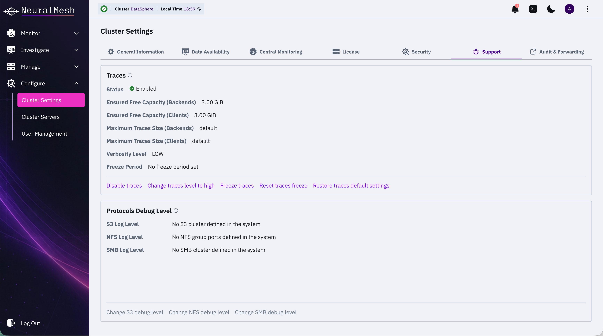
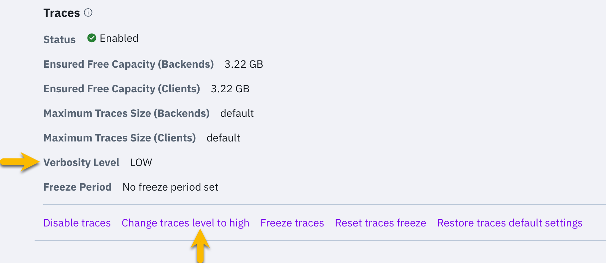
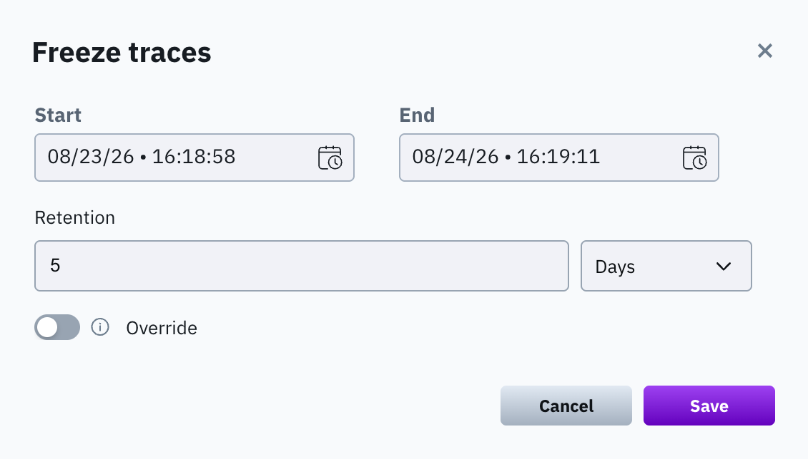
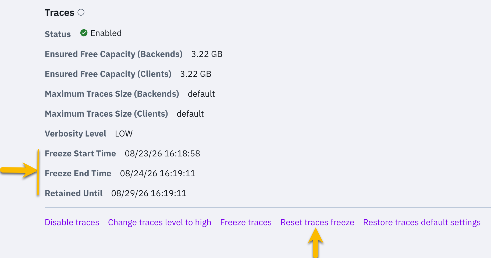

# Manage traces and protocols debug level using the GUI

Manage trace collection and protocol debug levels from **Configure > Cluster Settings > Support**. The screen includes the **Traces** and **Protocols Debug Level** sections.


**TBD - INTERNAL:** Trace capacity is expected to become configurable in the GUI (under investigation); the screen currently only displays the values. Replace the CLI pointer with a capacity task once the GUI control lands.


<figure><figcaption>
Support settings
</figcaption></figure>

## Traces

The Traces section displays the current traces status, ensured free capacity and maximum traces size for backends and clients, verbosity level, and freeze period.

To modify the maximum traces size and the ensured free capacity, use the CLI. See Manage traces and protocols debug level using the CLI.

### Disable traces

Disable traces to stop collecting tracing data on the cluster.


Do not disable traces without specific instructions from the Customer Success Team. Disabling traces reduces the troubleshooting information about the system and may affect the SLA if an issue occurs.


**Procedure**

1. From the menu, select **Configure > Cluster Settings**, and select the **Support** tab.
2. In the Traces section, select **Disable traces**. Then, in the confirmation message, select **Confirm**.

To resume trace collection, select **Enable traces**.

### Change traces verbosity level

The verbosity level determines the amount of information in the tracing data. Setting the verbosity level to high provides more troubleshooting detail but can consume more disk space.

<figure><figcaption>
Change traces verbosity level
</figcaption></figure>

**Procedure**

1. From the menu, select **Configure > Cluster Settings**, and select the **Support** tab.
2. In the Traces section, depending on the current verbosity level (low or high), select **Change traces level to high** or **Change traces level to low**.

### Freeze traces

Freeze traces for a selected period to retain data for investigation.

<figure><figcaption>
Freeze traces
</figcaption></figure>

**Before you begin**

Identify the trace period and its required retention time.

**Procedure**

1. From the menu, select **Configure > Cluster Settings**, and select the **Support** tab.
2. In the Traces section, select **Freeze traces**.
3. In the **Freeze traces** dialog, set the following properties:
   * **Start:** Set the start date and time of the trace period.
   * **End:** Set the end date and time of the trace period.
   * **Retention:** Set the retention period and its unit, for example, days.
   * **Override:** Turn on to replace an existing freeze period.
4. Select **Save**.

The Traces section displays the freeze start time, freeze end time, and the date until which the traces are retained.

### Reset traces freeze

Clear the freeze period when the investigation is complete. The traces return to the standard rotation.


Resetting the freeze period deletes the existing frozen traces.


<figure><figcaption>
Reset traces freeze
</figcaption></figure>

**Procedure**

1. From the menu, select **Configure > Cluster Settings**, and select the **Support** tab.
2. In the Traces section, select **Reset traces freeze**. Then, in the confirmation message, select **Confirm**.

### Restore traces default settings

Restore the traces configuration to its default settings.


The default maximum traces capacity is 50 GiB per I/O process, with a minimum of 100 GiB and a maximum of 1000 GiB per server. The default minimum free capacity is 3 GiB.



**TBD - INTERNAL - Nevo, please confirm before publication**


**Procedure**

1. From the menu, select **Configure > Cluster Settings**, and select the **Support** tab.
2. In the Traces section, select **Restore traces default settings**. Then, in the confirmation message, select **Confirm**.

## Protocols debug level

The Protocols Debug Level section displays the debug level for the S3, NFS, and SMB protocols. If a protocol is not configured, the section indicates it, and you cannot change its debug level.


After the protocol container restarts, the debug level reverts to its default.


### Change S3 debug level

If the S3 protocol is configured, you can change the debug level for all servers or specified servers.

The available debug levels are:

* 0 - CRITICAL
* 1 - ERROR
* 2 - WARNING
* 3 - INFO
* 4 - DEBUG
* 5 - TRACE

**Procedure**

1. From the menu, select **Configure > Cluster Settings**, and select the **Support** tab.
2. In the Protocols Debug Level section, select **Change S3 debug level**.
3. In the **Update S3 Debug Level** dialog, set the following properties:
   * **Level:** Select the debug level.
   * **All servers:** To apply the update to all servers, switch to **On**. To apply the update to specific servers, switch to **Off** and select the required servers.
4. Select **Save**.

### Change NFS debug level

If the NFS protocol is configured, you can change the debug level for all servers or specified servers.

The available debug levels are:

* 1 - EVENT
* 2 - INFO
* 3 - DEBUG
* 4 - MID DEBUG
* 5 - FULL DEBUG

**Procedure**

1. From the menu, select **Configure > Cluster Settings**, and select the **Support** tab.
2. In the Protocols Debug Level section, select **Change NFS debug level**.
3. In the **Update NFS Debug Level** dialog, set the following properties:
   * **Level:** Select the debug level.
   * **All servers:** To apply the update to all servers, switch to **On**. To apply the update to specific servers, switch to **Off** and select the required servers.
4. Select **Save**.


**TBD - INTERNAL:** verify the confirm button label in the 6.0 dialog


### Change SMB debug level

If the SMB protocol is configured, you can change the debug level for all servers or specified servers.

The available debug levels are:

* 0 - NO DEBUG
* 5 - MID DEBUG
* 10 - FULL DEBUG

**Procedure**

1. From the menu, select **Configure > Cluster Settings**, and select the **Support** tab.
2. In the Protocols Debug Level section, select **Change SMB debug level**.
3. In the **Update SMB Debug Level** dialog, set the following properties:
   * **Level:** Select the debug level.
   * **All servers:** To apply the update to all servers, switch to **On**. To apply the update to specific servers, switch to **Off** and select the required servers.
4. Select **Save**.


**TBD - INTERNAL:** verify the confirm button label in the 6.0 dialog



**INTERNAL: dialog names** ("Update S3 Debug Level") and the level lists are taken from the published 4.x topic; verify them against the 6.0 GUI before publication

