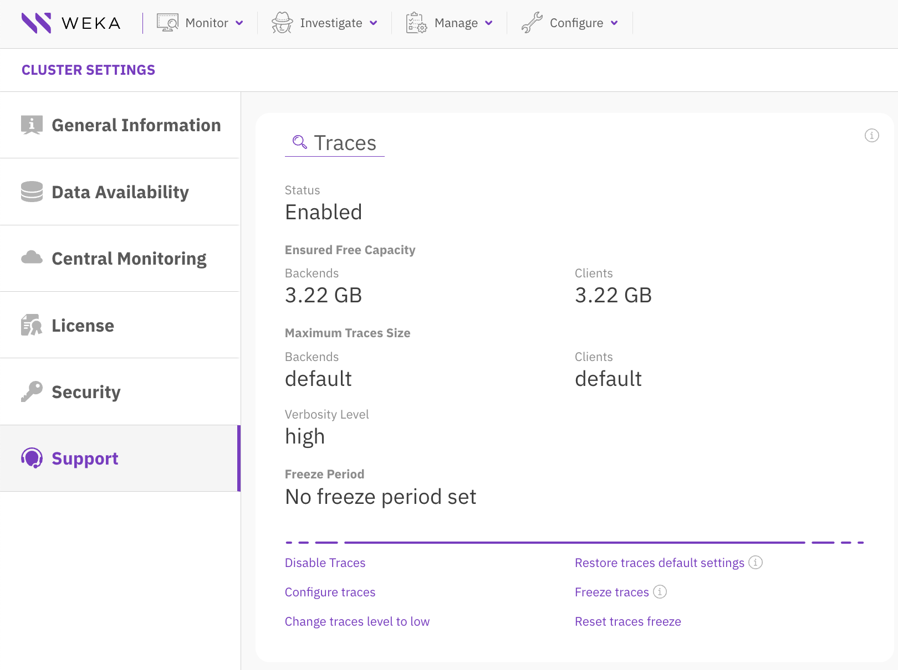
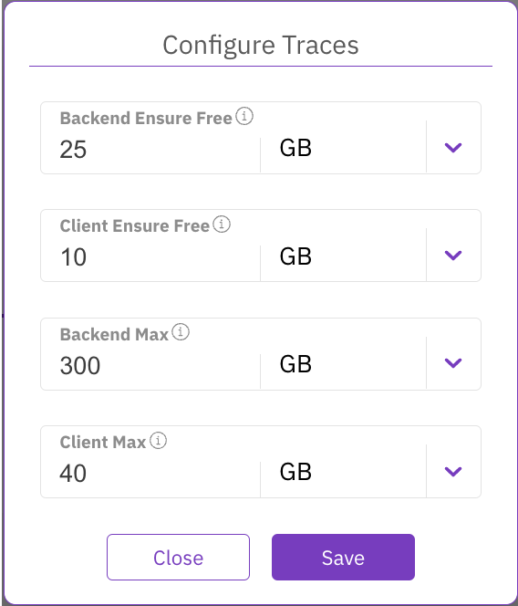
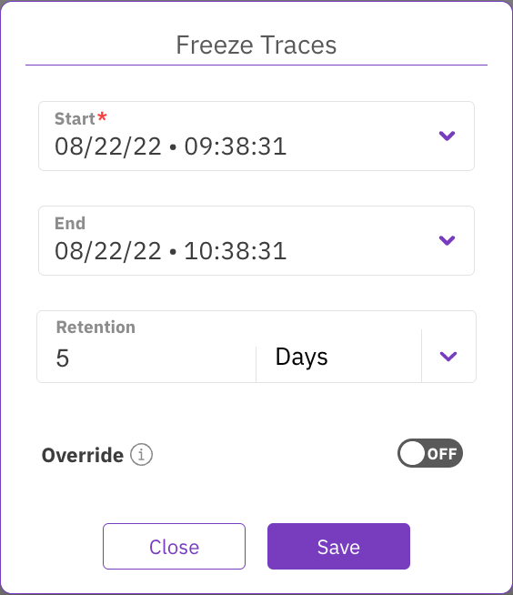
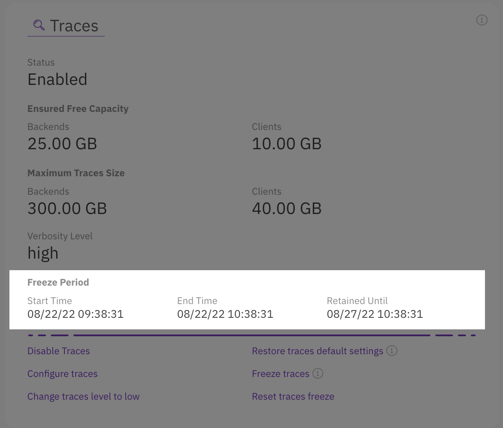
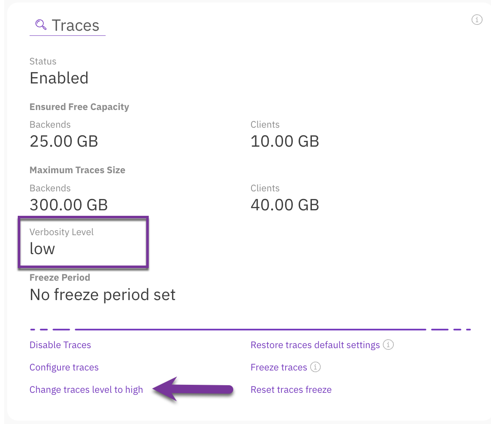

# Manage traces using the GUI

Using the GUI, you can:

* [Configure traces](manage-traces-using-the-gui.md#configure-traces)
* [Freeze traces](manage-traces-using-the-gui.md#freeze-traces)
* [Change traces verbosity level](manage-traces-using-the-gui.md#change-traces-verbosity-level)
* [Restore traces default settings](manage-traces-using-the-gui.md#restore-traces-default-settings)

<figure><figcaption>
Manage traces
</figcaption></figure>

## Configure traces 

The tracking tool collects the traces on the backends and clients and retains them on their disks. You can limit the capacity used by the traces by ensuring minimum free capacity and by setting the maximum capacity that traces can use.

**Procedure**

1. From the menu, select **Configure > Cluster Settings**.
2. From the left pane, select **Support**.
3. On the Traces section, select **Configure traces**.
4. On the Configure Traces dialog set the following properties:
   * The minimum free capacity to preserve on the backends.
   * The minimum free capacity to preserve on the clients.
   * The maximum capacity traces can use on backends.
   * The maximum capacity traces can use on clients.
5. Select **Save**.

<figure><figcaption>
Configure traces
</figcaption></figure>

## Freeze traces 

Sometimes you may need to investigate an issue that occurred during a certain period. You can retain the tracing data of that period using the freeze traces action.

**Procedure**

1. From the menu, select **Configure > Cluster Settings**.
2. From the left pane, select **Support**.
3. On the Traces section, select **Freeze traces**.
4. On the Freeze Traces dialog set the following properties:
   * **Start:** The start date and time of the period to freeze (mandatory).
   * **End:** The end date and time of the period to freeze.
   * **Retention:** The time to retain the tracing data. After this time, the tracking tool may purge the tracing data according to its purging cycle.
   * **Override:** If a freezing period is already set, you can override it by setting the **Override** button to **On**.
5. Select **Save**.

<figure><figcaption>
Freeze traces
</figcaption></figure>

<figure><figcaption>
Example of a freeze period
</figcaption></figure>

6\. To clear the freeze period, select **Reset traces freeze**. Then, in the confirmation message, \
&#x20;   select **Yes**.

## Change traces verbosity level 

The verbosity level determines the amount of information in the tracing data. Switching the verbosity level to high provides more troubleshooting details but may use more space on the disk.

**Procedure**

1. In the Traces section, depending on the current verbosity level (low or high), select **Change traces level to high** or **Change traces level to low**.

<figure><figcaption>
Change verbosity level
</figcaption></figure>

## Restore traces default settings 

You can restore the traces configuration to its default settings as shown in the following image.

<figure><figcaption>
Traces default settings
</figcaption></figure>


The default maximum capacity per IO-node is 50 GB and the minimum for all IO-nodes is 100 GB. The minimum free capacity is 3.22 GB


**Procedure**

1. In the Traces section,  select **Restore traces default settings**. Then, in the confirmation message, select **Yes**.
