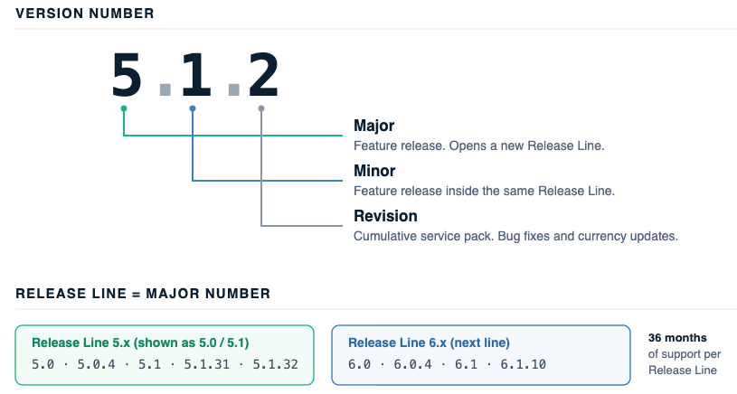
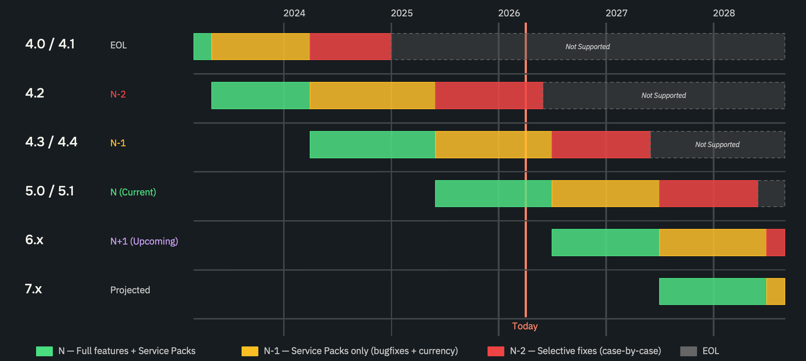

# Release support and commitments

WEKA software versions use a three-part numbering system: `Major.Minor.Revision`. For example, `5.1.2`.

<table><thead><tr><th width="145.15234375">Level</th><th>Description</th></tr></thead><tbody><tr><td>Major</td><td>Indicates a feature release. WEKA bumps the Major number for high-impact, strategic changes. A new Major number opens a new Release Line.</td></tr><tr><td>Minor</td><td>Indicates a feature release within an existing Release Line. Minor releases are triggered by the same type of changes as Major releases. The choice between a Major and a Minor bump reflects the scope of the features and their market impact.</td></tr><tr><td>Revision</td><td>Indicates a cumulative service pack that includes bug fixes and currency updates. On the current line, it can also include enhancements and features.</td></tr></tbody></table>

## Release Lines

A Release Line is defined by a unique Major number. For example, 5.x, 6.x, and 7.x are each a distinct Release Line, and every Minor release within a Major number belongs to the same line. Version 5.1 belongs to the same Release Line as version 5.0.

Revisions are cumulative. Each higher revision includes all fixes from prior revisions within the same line.

In the WEKA portal at get.weka.io, each Release Line is identified by the Minor versions it contains. The current line appears as **5.0 / 5.1**, because both Minor versions belong to Major number 5.

<figure><figcaption>
<em>Version number structure and Release Line grouping</em>
</figcaption></figure>


As an exception, the following legacy versions are grouped into separate Release Lines that do not follow the Major number rule:

* Versions 4.0 and 4.1
* Version 4.2
* Versions 4.3 and 4.4

Version 4.2 and older are treated as Release Lines that are older than 4.3.


## Lifecycle policy

WEKA provides a unified support framework to ensure predictability and simplify compliance.

* Support duration: Every Release Line receives 36 months of support starting from its initial General Availability release.
* Upgrade cadence: Customers should upgrade at least once a year to remain within a supported phase.
* Feature delivery: New features ship on the current (N) line.
* New Release Lines: WEKA introduces a new Release Line approximately every 12 months.


WEKA no longer uses LTS or Innovation labels to ensure every release is recognized for its high stability and long-term commitment. Removing these labels creates a transparent, simplified framework that provides clear planning for all deployments.


_Version number structure and Release Line grouping_

## Support phases

The support phase for a Release Line changes as WEKA introduces newer versions.

<table><thead><tr><th width="171.34375">Phase</th><th width="170.01953125">Status</th><th>Support details</th></tr></thead><tbody><tr><td>N</td><td>Current</td><td>Receives new features and service packs. This phase receives full engineering investment.</td></tr><tr><td>N-1</td><td>Maintenance</td><td>Receives ongoing service packs containing bug fixes and currency updates. No new features are added.</td></tr><tr><td>N-2</td><td>Limited Support</td><td>Receives selective fix releases on a case-by-case basis. This phase is supported by Customer Success and R&#x26;D jointly.</td></tr><tr><td>N-3 and older</td><td>End of Life</td><td>Receives no further updates. Upgrade immediately.</td></tr></tbody></table>

Service packs for Current and Maintenance phases include bug fixes and updates for operating systems, cloud instances, and network interface cards. For the Limited Support phase, currency and interoperability updates are provided on a best-effort basis with no committed service pack cadence.

<figure><figcaption>
Release Line lifecycle: Support phase transitions (example)
</figcaption></figure>


This figure shows an example based on the support status as of May 2026. Support phases change as new Release Lines are introduced.


## Check the support phase of a Release Line

Identify the current phase and End of Life date of your Release Line before planning an upgrade.

1. Sign in to the WEKA portal at get.weka.io.
2. Select **Release Lines**.
3. Locate your Release Line.

Each Release Line shows its support phase, its End of Life date, and the releases it contains. The line marked **N. Current** carries the newest features.

## Related topics

[Upgrade WEKA versions](../operation-guide/upgrading-weka-versions/)

[Get support for your WEKA system](getting-support-for-your-weka-system.md)

