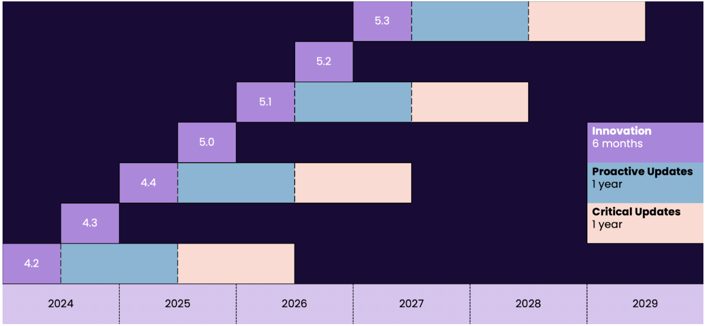

# Release support and commitments

WEKA provides a structured release cycle to deliver regular updates while ensuring long-term product support.

### Release cycles

WEKA offers two types of release cycles:

* **Innovation cycle:** A new innovation cycle starts twice a year and includes monthly updates for six months. These releases deliver new features, enhancements, and security updates.
* **Long-Term Support (LTS) cycle:** WEKA designates an LTS release after every two innovation cycles. An LTS release is supported for two years, providing a stable and reliable platform. For example, version 4.4 is the LTS release that follows the 4.2 LTS release, as illustrated in the support phases diagram below.

### Support phases

Each release cycle consists of distinct support phases. The length of each phase depends on whether the release is an Innovation or LTS version.

* **Innovation:** This phase lasts for six months for non-LTS releases. It includes new features and proactive updates.
* **Proactive updates:** This phase is the first year of an LTS release. It provides new features, OS and hardware compatibility enhancements, and security updates.
* **Critical updates:** This phase is the second year of an LTS release. It delivers essential security updates and minimal OS and hardware support.

<figure><figcaption>
Support phases
</figcaption></figure>

### Update and upgrade policy

To ensure you benefit from the latest improvements and security enhancements, adhere to the following policies:

* **Innovation releases:** You must apply updates within 90 days of their release to remain supported. For example, it is not permissible to use version 4.3.0 for a year without updating to the newer 4.3.x releases. WEKA addresses defects in subsequent releases rather than as hotfixes for older releases.
* **Upgrade paths:** You can transition from an innovation release cycle to an LTS release. WEKA guarantees upgrades from one major LTS version to the next.
*   **End of support:** You must plan an upgrade to a supported version before your current version reaches the end of its critical update period. For assistance with planning and performing your upgrade, contact the [Customer Success Team](getting-support-for-your-weka-system.md).

    WEKA does not support software versions that have reached their end-of-support date and disclaims liability for any issues that arise from using unsupported versions.

### Version support dates

The following table provides the end-of-support dates for WEKA version series.

| WEKA version series | End of proactive updates | End of critical updates | End of support  |
| ------------------- | ------------------------ | ----------------------- | --------------- |
| Pre-4.2             | June 1, 2024             | June 1, 2025            | June 1, 2025    |
| 4.2                 | June 1, 2025             | June 1, 2026            | June 1, 2026    |
| 4.3                 | January 1, 2025          | January 1, 2025         | January 1, 2025 |
| 4.4                 | June 1, 2026             | June 1, 2027            | June 1, 2027    |
| 5.0                 | January 1, 2026          | January 1, 2026         | January 1, 2026 |

**Related topic**

[upgrading-weka-versions.md](../operation-guide/upgrading-weka-versions.md "mention")
