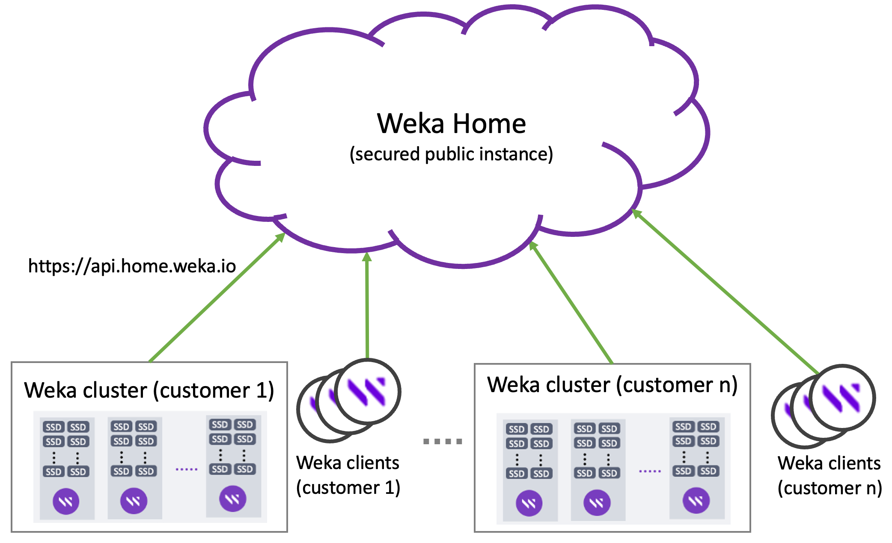

# Weka Home - The Weka support cloud

Weka Home is a central cloud location that collects information such as alerts, statistics, events, and diagnostics uploaded from the customers' Weka clusters and clients to improve the support process.

It enables the Customer Success Team to provide proactive support if any irregularities are recognized in system behavior, improving their response time and troubleshooting process.

Only licensed Weka clusters are monitored through Weka Home.

<figure><figcaption>
Weka clusters and clients connected to Weka Home
</figcaption></figure>

## Which information is uploaded to the Weka Home?

The Weka cluster uploads various information types to Weka Home periodically and on demand.&#x20;

**Periodic uploads:**

* **Alerts:** Alerts indicate problematic ongoing states that the cluster is suffering from. Alerts are uploaded immediately when a host creates an alert.
* **Events:** Events indicate relevant information concerning the Weka cluster and customer environment. Triggered by a customer operation or an environment change, events can be informational, indicate an issue in the system, or indicate a previously resolved issue. Events are uploaded immediately when a host creates an event.
* **Statistics:** Statistics help analyze the Weka system performance and determine the source of any issue. Statistics are uploaded every minute from each host.
* **Usage reports:**  Usage reports provide metrics for NFS permissions, interface groups, hosts, nodes, drives, status, version, and filesystems. Usage reports are uploaded every minute.
* **Analytics:** Analytics provide metrics for the cluster, drives, filesystems settings, hosts, network devices, nodes, protocols, and more. Analytics are uploaded every 24 hours.

**On-demand uploads:**

* **Diagnostics (support files):** Uploaded on-demand from the host that collected the diagnostics.

## Enable upload information from the Weka cluster to Weka Home

1. To enable cloud notifications, run the `weka cloud enable` command (during the Weka cluster installation, it is an optional step, which may be already done).
2. To upload diagnostics collected by the cluster, run the `weka diags upload` command.
3. Ensure that your network allows the cluster to send events to Weka by allowing HTTPS connections from the Weka hosts management IP interfaces to **api.home.weka.io** and **get.weka.io**. If the connection to Weka Home is through a proxy, to set the proxy, run the `weka cloud proxy --set <proxy_url>` command.


Uploading information to Weka Home from the backend hosts and clients is recommended for optimal support. If client connectivity cannot be configured, enabling upload information from the backend hosts is still beneficial.


****

**Related topics**

[list-of-alerts.md](../../usage/alerts/list-of-alerts.md "mention")

[list-of-events.md](../../usage/events/list-of-events.md "mention")

[list-of-statistics.md](../../usage/statistics/list-of-statistics.md "mention")

[#upload-diagnostics-to-weka-home](../diagnostics-management/diagnostics-utility.md#upload-diagnostics-to-weka-home "mention")****
