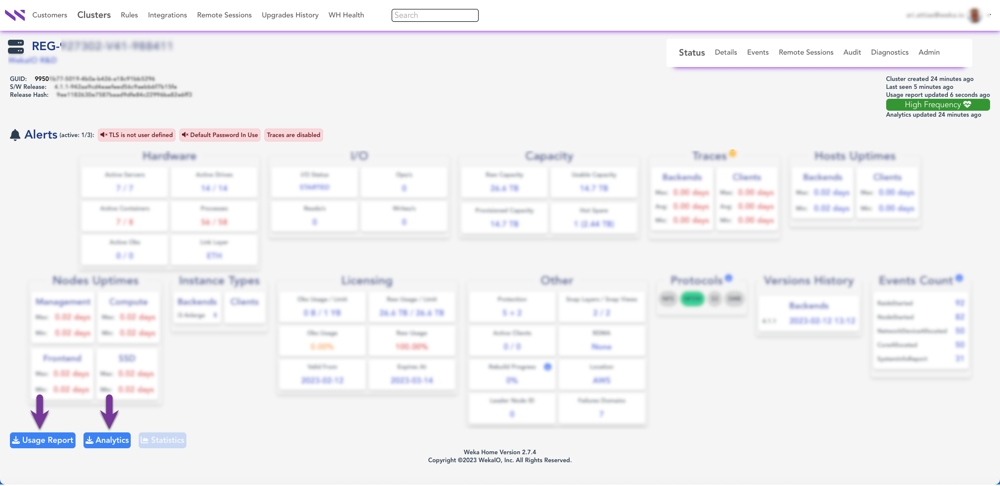

# Download the Usage Report or Analytics

## Download the Usage Report or Analytics

The Local Weka Home lets you download JSON-formatted reports to your local workstation, view them, and forward them to the Weka Customer Success Team for case resolution and adding them to the Cloud Weka Home for offline monitoring purposes.

**Procedure:**

1. In the Local Weka Home portal, select the cluster.
2. Select the **Usage Report** or **Analytics** download button.

<figure><figcaption>
Download the Usage Report or Analytics
</figcaption></figure>

## Download the Usage Report or Analytics without sensitive data

Suppose you need to download the Usage Report or Analytics files to send them to the Customer Success Team (or any third party), but the data might include sensitive values you do not want to expose. For this purpose, the Local Weka Home portal allows anonymizing the data in the downloaded files.

With anonymization, **sensitive** values are affected as follows:

* The cluster name is renamed to `weka-[first part of cluster GUID]`
* Other sensitive values are removed

Usage Report default anonymized data

The following properties are affected by anonymization:

* name
* alerts
* status/name
* status/cloud

Analytics default anonymized data

The following properties are affected by anonymization:

* cluster/name
* For all hosts:
  * host/hosts/ips
  * host/hosts/host\_ip
  * host/hosts/hostname
  * host/hosts/instance\_region
  * host/hosts/aws\_instance\_region
* misc/kms/type
* misc/cloud/url
* nfs/interface\_groups/name
* nfs/interface\_groups/gateway
* nfs/interface\_groups/subnet\_mask
* s3/domain
* s3/filesystem
* smb/smb\_trusted\_domains


**Note:** The anonymization option is supported with Weka clusters of version 3.14.2 and above.


**Procedure:**

1. In the Local Weka Home portal, select the cluster.
2. Below the Usage Report and Analytics **** download buttons, switch on the **Enable Anonymization** option.
3. Select the **Usage Report** or **Analytics** download button.

<figure><figcaption>
Enable anonymization in Usage Report and Analytics
</figcaption></figure>
