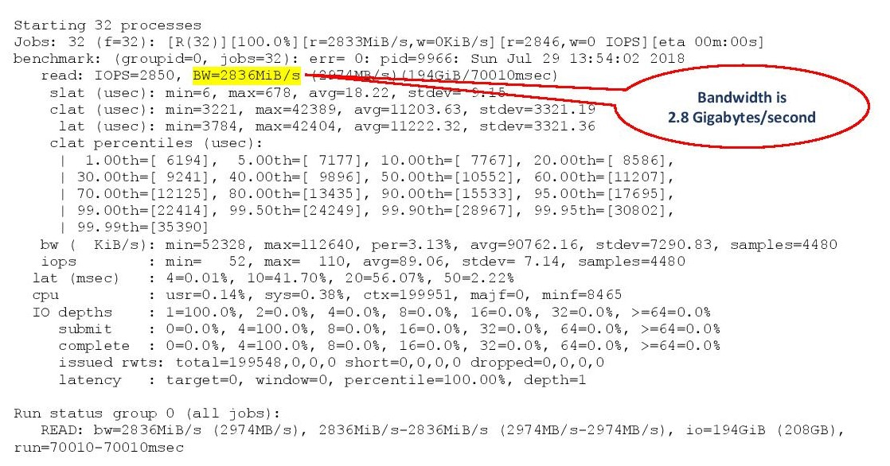

# Testing WekaIO System Performance

## About WekaIO System Performance Testing

There are 3 main performance metrics when measuring a storage system performance:

1. Latency, which is the time from operation initiation to completion.
2. The number of IO operations that the system can process concurrently.
3. The bandwidth of data that the system can process concurrently.

Each of these performance metrics apply to read operations, write operations or a mixture of read and write operations.

When measuring the WekaIO system performance, different [mount modes](../overview/weka-client-and-mount-modes.md) produce different performance characteristics. Additionally, client network configuration \(using either space networking or kernel UDP\) also have a significant effect on performance.


**Note:** All performance tests listed here are generic and not specific to the WekaIO system. They can be used to compare the WekaIO storage system to other storage systems or to a local storage device.


## The FIO Utility

The [FIO Utility](https://linux.die.net/man/1/fio) is a generic open source storage performance testing tool which can be defined as described [here](https://github.com/axboe/fio). In this documentation, the usage of FIO version 3.5 is assumed.

## WekaIO System Performance Testing

### Small Write Latency

#### Description

This test measures the minimal achievable write latency under a light load. The test measures the latency over a single threaded sequence of 4 KB writes across multiple files. Each write is executed only after the previous write has been acknowledged.

#### Preparation

```text
export WEKA_MOUNT=/mnt/weka
export BENCHMARK_ID=FioWrites4KSingleThread
export WORKING_DIR=$WEKA_MOUNT/$BENCHMARK_ID
mkdir -p $WORKING_DIR
```



#### Run Benchmark

```text
fio --name=$BENCHMARK_ID --directory=$WORKING_DIR --filesize=104857600 \\
     --group_reporting --numjobs=1 --ioengine=posixaio --nrfiles=32 --invalidate=0 \\
     --iodepth=1 --max-jobs=1 --rwmixread=0 --create_serialize=0 --runtime=70 \\
     --time_based --direct=1 --randrepeat=1 --filename_format='$jobnum/$filenum' \\
     --clat_percentiles=1 --blocksize=4096 --readwrite=randwrite
```



#### Example of Test Output


The following is an example of the test output for an AWS WekaIO cluster of 6 instances of type i3.16xlarge.



In this test output example, results show an average latency of 529 microseconds, where 99.5% of the writes terminated in 766 microseconds or less.


**Note:** Different hardware and networking configurations may yield different latency results, which can be as low as 150 microseconds for 100 Gbit networking and NVMe drives.


### Small Read Latency

This test measures the minimal achievable read latency under a light load. The test measures the latency over a single threaded sequence of 4 KB reads across multiple files. Each read is executed only after the previous read has been served.

#### Preparation

```text
export WEKA_MOUNT=/mnt/weka
export BENCHMARK_ID=FioReads4KSingleThread
export WORKING_DIR=$WEKA_MOUNT/$BENCHMARK_ID
mkdir -p $WORKING_DIR
```



#### Run Benchmark

```text
fio --blocksize=4k --direct=1 --numjobs=1 --directory=$WORKING_DIRECTORY \\
    --ioengine=libaio --invalidate=0 --time_based --name=$BENCHMARK_NAME --nrfiles=1 \\
    --clat_percentiles=1 --max-jobs=1 --randrepeat=1 --create_serialize=0 \\
    --group_reporting ' --filename_format=$jobnum/$filenum' --runtime=60 \\
    --rwmixread=0 --iodepth=256 --readwrite=randread --filesize=10485760000
```



#### Example of Test Output


The following is an example of the test output for an AWS WekaIO cluster of 6 instances of type i3.16xlarge.



In this test output example, results show an average latency of 224 microseconds, where 99.5% of the writes terminated in 338 microseconds or less.


**Note:** Different hardware and networking configurations may yield different latency results, which can be as low as 150 microseconds for 100 Gbit networking and NVMe drives.


### Large Bandwidth Writes and Sequential Writes

#### Description

This test measures the overall system throughput for large \(1 MB\) writes, which is the same as large sequential writes. The scripts below will try to maximize the system write throughput from a single client. The test utilizes multiple threads, each one performing 1 MB writes.


**Note:** in order to achieve the maximal system throughput, in most cases multiple clients are required.


#### Preparation

```text
export WEKA_MOUNT=/mnt/weka
export BENCHMARK_ID=FioWrite1MMultiThread
export WORKING_DIR=$WEKA_MOUNT/$BENCHMARK_ID
mkdir -p $WORKING_DIR
```



#### Run Benchmark

```text
fio --blocksize=1048576 --direct=1 --numjobs=32 --directory=$WORKING_DIRECTORY \\
    --ioengine=libaio --invalidate=0 --time_based --name=$BENCHMARK_NAME --nrfiles=1 \\
    --clat_percentiles=1 --max-jobs=32 --randrepeat=1 --create_serialize=0 \\
    --group_reporting '--filename_format=$jobnum/$filenum' --runtime=70 --rwmixread=0 \\
    --iodepth=1 --readwrite=write --filesize=104857600
```



#### Example of Test Output


In this test output example, results show a bandwidth of 2.8 Gigabytes/second.

### Large Bandwidth Reads and Sequential Reads

#### Description

This test measures the overall system throughput for large \(1MB\) reads, which is the same as sequential reads. The scripts below will try to maximize the system read throughput from a single client. The test utilizes multiple threads, each one performing 1MB reads.


**Note:** in order to achieve the maximal system throughput, in most cases multiple clients are required.


#### Preparation

```text
export WEKA_MOUNT=/mnt/weka
export BENCHMARK_ID=FioReads1MMultiThread
export WORKING_DIR=$WEKA_MOUNT/$BENCHMARK_ID
mkdir -p $WORKING_DIR
```



#### Run Benchmark

```text
fio —blocksize=1048576 --direct=1 --numjobs=32 --directory=$WORKING_DIRECTORY \\
    --ioengine=libaio --invalidate=0 --time_based --name=$BENCHMARK_NAME --nrfiles=1 \\
    --clat_percentiles=1 --max-jobs=32 --randrepeat=1 --create_serialize=0 \\
    --group_reporting '--filename_format=$jobnum/$filenum' --runtime=70 \\
    --rwmixread=0 --iodepth=1 --readwrite=read --file
```



#### Example of Test Output



In this test output example, results show a bandwidth of 2.8 Gigabytes/second.

### IOPS Write

#### Description

This test measures the overall system ability to execute small \(4 KB\) writes. The scripts below will try to maximize the number of concurrent operations from a single client. The test utilizes multiple threads, each one performing 4 KB writes.


**Note:** in order to achieve the maximal system throughput, in most cases multiple clients are required.


#### Preparation

```text
export WEKA_MOUNT=/mnt/weka
export BENCHMARK_ID=IOPSWrite1MMultiThread
export WORKING_DIR=$WEKA_MOUNT/$BENCHMARK_ID
mkdir -p $WORKING_DIR
```



#### Run  Benchmark

```text
fio --blocksize=4k --direct=1 --numjobs=1 --directory=$WORKING_DIRECTORY \\
    --ioengine=libaio --invalidate=0 --time_based --name=$BENCHMARK_NAME --nrfiles=1 \\
    --clat_percentiles=1 --max-jobs=1 --randrepeat=1 --create_serialize=0 \\
    --group_reporting '--filename_format=$jobnum/$filenum' --runtime=60 \\
    --rwmixread=0 --iodepth=256 --readwrite=randwrite --filesize=10485760000
```



#### Example of Test Output


In this test output example, results show an average IOPS of 127,402.

### IOPS Read

#### Description

This test measures the overall system throughput for small \(4 KB\) reads. The scripts below will try to maximize the system read throughput from a single client. The test utilizes multiple threads, each one performing 4 KB reads.


**Note:** in order to achieve the maximal system throughput, in most cased multiple clients are required.


#### Preparation

```text
export WEKA_MOUNT=/mnt/weka
export BENCHMARK_ID=IOPSRead1MMultiThread
export WORKING_DIR=$WEKA_MOUNT/$BENCHMARK_ID
mkdir -p $WORKING_DIR
```



#### Run  Benchmark

```text
fio --blocksize=4k --direct=1 --numjobs=1 --directory=$WORKING_DIRECTORY \\
    --ioengine=libaio --invalidate=0 --time_based --name=$BENCHMARK_NAME \\
    --nrfiles=1 --clat_percentiles=1 --max-jobs=1 --randrepeat=1 \\
    --create_serialize=0 --group_reporting '--filename_format=$jobnum/$filenum' \\
    --runtime=60 --rwmixread=0 --iodepth=256 --readwrite=randread \\
    --filesize=10485760000
```



#### Example of Test Output


In this test output example, results show an average IOPS of 127,402.  


\`\`


