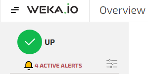
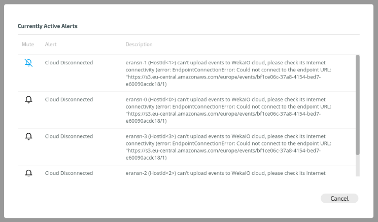
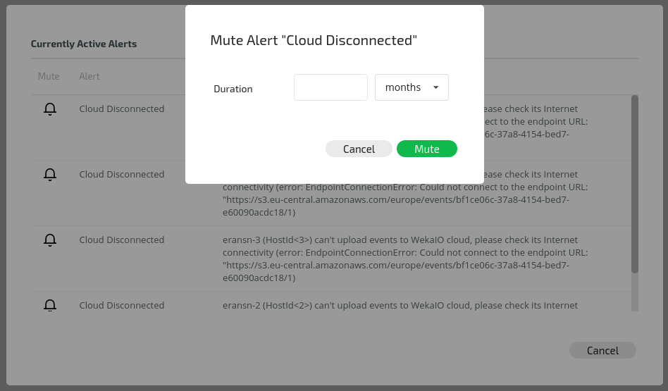

# Alerts

## Overview

WekaIO alerts indicate problematic ongoing states that the cluster is currently suffering from. They can only be dismissed by resolving the root cause of their existence. Usually, an alert is introduced alongside an equivalent event. This can help in identifying the point in time that the problematic state occurred and its root cause.

Alerts are indicated by a yellow triangle. Click the triangle to display a list of active alerts in the system.


**Note:** If for any reason it is not possible to solve the root cause of an alert at any given time, the alert can be muted in order to hide it. This action is only possible from the CLI.


## Working with Alerts Using the GUI

### Viewing Alerts

The following Alerts Overview popup window is displayed in the System Overview, in the top left side of the screen. It presents the status of alerts:


**Note:** If there are no alerts at all \(active/muted\), the bell and text will not be displayed.


To view details of currently active alerts, click the "X ACTIVE ALERTS" text. The following Currently Active Alerts window is displayed:

When hovering on the bell with the mouse, the bell will change color and display the opposite condition of the alert i.e., change active to mute, and vice versa. 

### Muting Alerts

To mute an alert, click the bell of an active alert in the Current Active Alerts window. A dialog box will be displayed, requesting the time period during which the alert is to be muted:

Enter the time period required and click Mute.


**Note:** Alerts cannot be suppressed indefinitely. After expiry of the muted period, the alert is automatically unmuted.



**Note:** When there are only muted alerts, the Alerts Overview popup window will appear as follows:


## Working with Alerts Using the CLI

**Command:** `weka alerts --muted`

Use this command line to list all alerts \(muted and unmuted\) in the WekaIO cluster.

**Optional Sub-commands in Command Line**

`[--types]`: Lists all possible types of alerts that can be returned from the WekaIO cluster.

`[--mute]`: Mutes an alert-type. Muted alerts will not be prompted when listing active alerts. Alerts cannot be suppressed indefinitely, so a duration for the muted period must be provided. After expiry of the muted period, the alert-type is automatically unmuted.

`[--unmute]`: Unmutes a previously muted alert type.

## List of Alerts

| Name | Description | Actions |
| :--- | :--- | :--- |
| AdminDefault Password | The admin password is still set to the factory default.  | Change the admin user password to ensure only authorized users can access the cluster. |
| AgentNotRunning | The WekaIO local control agent is not running on a host. | Restart the agent with `service weka-agent start.` |
| BucketHasNoQuorum | Too many compute nodes are down, causing the bucket compute resource to be unavailable. | Check that the compute nodes and their hosts are up and running and fully connected; contact the WekaIO Support Team if issue is not resolved. |
| BucketUnresponsive | A compute resource has failed, causing system unavailability.  | Check that the compute nodes and their hosts are up and running and fully connected; contact the WekaIO Support Team if issue is not resolved. |
| ClockSkew | The clock of a host is skewed in relation to the cluster leader, with a time difference more than the permitted maximum of 30 seconds. | Make sure NTP is configured correctly on the hosts and that their dates are synchronized. |
| CloudHealth | A host cannot upload events to the WekaIO cloud.  | Check the host has Internet connectivity and is connected to the WekaIO cloud as explained in [WekaIO Support Cloud section](../support/the-wekaio-support-cloud.md). |
| ClusterIsUpgrading | Cluster is upgrading. |  |
| DataProtection | Some of the system's data is not fully redundant. | Check which node/host/drive is down and act accordingly. |
| DriveDown | A drive is not responding. |  |
| DriveNeedsPhaseout | A drive has too many errors. | Phase-out the drive and probably replace it. |
| DedicatedWatchdog | A dedicated WekaIO host requires the installation of a hardware watchdog driver. | Make sure a hardware watchdog is available at /dev/watchdog. |
| FilesystemHasToo ManyFiles | The filesystem storage configuration is not large enough for the size of files and directory entries being stored.  | Increase the max-files for the filesystem; it may be necessary decrease max-files from another filesystem or install more memory. |
| HangingIOs | Some IOs are hanging on the node acting as a driver/NFS/backend. | Check that the compute nodes and their hosts are up and running, and fully connected. Also check that if a backend object store is configured, it is connected and responsive. Contact the WekaIO Support Team if issue is not resolved. |
| HighDrivesCapacity | The average capacity of the SSDs is too high.  | Free-up space on the SSDs or [add more SSDs](https://docs.weka.io/v/3.4/usage/expanding-and-shrinking-cluster-resources/expansion-of-specific-resources) to the cluster. |
| HugePagesAlloc | WekaIO could not allocate Huge Pages on a host, perhaps because of insufficient memory on the host or if memory is fragmented by usage of other processes. | Reboot the host to avoid memory fragmentation and allow WekaIO to run startIO again. If this fails, verify that the host has enough free memory for use by WekaIO or configure WekaIO to use less memory. |
| IPConflictDetected |  | Resolve the conflict of the reported IP. |
| JumboConnectivity | A host cannot send jumbo frames to any of its cluster peers.  | Check the host network settings and the switch to which it is connected, even if WekaIO seems to be functional, since this will improve performance. |
| LicenseError | A license conflict exists. | Make sure the cluster is using a correct license; that the license has not expired; and that the cluster allocated space does not exceed the license. |
| Negative UnprovisionedCapacity | WekaIO capacity usage changes detected due to cluster upgrade. | One or more of the filesystems need to be resized in order to reclaim capacity; contact the WekaIO Support Team. |
| NetworkInterfaceLinkDown |  |  |
| NoClusterLicense | No license is assigned to the cluster. | Obtain and install a license from get.weka.io. |
| NodeDisconnected | 
 A node is disconnected from the cluster.  | Check network connectivity to make sure the node can communicate with the cluster. |
| NodeTiering Connectivity | A node cannot connect to an object store.  | Check connectivity with the object store and make sure the node can communicate with it. |
| NotEnoughActiveDrives | There are not enough active failure domains. | Check connectivity, host status  and/or replace problematic drives. |
| NotEnoughConfigured MemoryForFilesystems | The total configured memory bytes for filesystems is insufficient to store the file and directory entries of the filesystems in the cluster.  | Decrease the max-files for some of the filesystems, decrease their capacity or increase the configured RAM of the cluster backend hosts. |
| NotEnoughAvailable MemoryForFilesystems | There are not enough working compute nodes in the cluster to store the file and directory entries for all the filesystems in the cluster.  | Either try to decrease the max-files for some of the filesystems or return the dead compute nodes to get their memory back. |
| NumaBalancingEnabled | A host has automatic NUMA balancing enabled which can negatively impact performance.  | To disable, run `echo > /proc/sys/kernel/numa_balancing` on the host. |
| OfedVersions | A host Mellanox OFED version ID does not match the one used by the WekaIO container. | Install a supported OFED. If the current version needs to be retained or the alert continues after a supported version is installed, contact the WekaIO Support Team. |
| PartiallyConnectedNode | A node seems to be only partially connected. | Make sure there is no network connectivity issue. |

