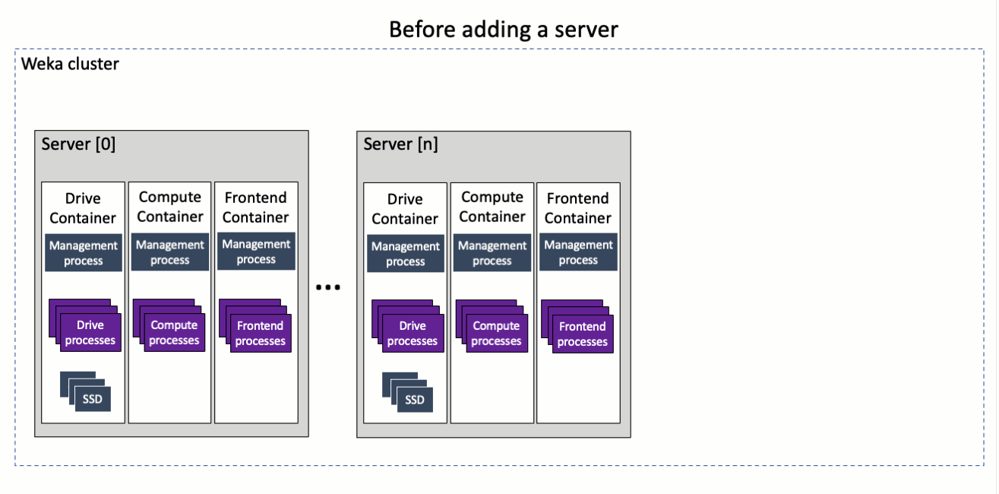

# Add a backend server in a multiple containers architecture

Expanding a cluster in a multiple container architecture with a new backend server is similar to the Weka system installation process in a multiple containers architecture.

Adding a server to the cluster includes discovering the existing cluster resources, generating the resource files, creating containers using the resource files, and adding the SSDs to the new server.

<figure><figcaption><p>Adding a server to the cluster in a multiple containers architecture</p></figcaption></figure>

### Before you begin

1. Review the system dashboard and ensure that the system is operational and does not indicate any alarms.
2. Discover the number of cores for each container type in the cluster server.

```
weka local resources -C drives0 |grep -c DRIVES 

weka local resources -C compute0 |grep -c COMPUTE

weka local resources -C frontend0 |grep -c FRONTEND

```

3. Discover the Management IPs of one of the containers. In a high-availability system, more than one IP exists.

```
weka local resources -C drives0 | grep "Management IPs"

```

4. Ensure that the new backend server meets the requirements and is available for installation.
5. Download from [get.weka.io](https://get.weka.io/) the same Weka software version as in the existing Weka cluster servers.


**Note:** To learn how about the options of the commands in the following procedure, see the related topics.


### **Procedure**

1. Install the Weka software on the new backend server.
2. Remove the default container from the new backend server.

```
weka local stop default && weka local rm -f default

```

3. Download the Weka tools from the GitHub repository.

```
cd ~
git clone https://github.com/weka/tools/
cd ~/tools/install/

```

4. Generate the resource files with the same network devices and options as the existing Weka cluster servers.&#x20;

```
./resources_generator.py --net <net-devices> [options]

```

<details>

<summary>Example of a high-availability system with two network devices</summary>

```
./resources_generator.py --net ens4 ens5 --compute-dedicated-cores 3 --drive-dedicated-cores 2 --frontend-dedicated-cores 2

```

</details>

<details>

<summary>Example of a high-availability system with two network devices and a gateway</summary>

Add to the `--net` option the following for each network device:\
`<net device name>/<net device IP>/<net mask>/<gateway IP>`

```
./resources_generator.py --net enp197s0np0/172.25.5.132/16/172.25.5.2 enp129s0np0/172.25.6.132/16/172.25.5.2 --compute-dedicated-cores 12 --drive-dedicated-cores 12 --frontend-dedicated-cores 1

```

</details>

5. Create the drive, compute, and frontend containers, and join the new server's containers to the existing cluster.
   * 

In `management-ips`, specify the management IP address of the new server joining the cluster. Specify two or more comma-separated management IP addresses in a high-availability system.


   * In `join-ips`, specify the management IP of one of the servers in the cluster to join.

<pre><code><strong>weka local setup container --name drives0 --resources-path &#x3C;path>/drives0.json --management-ips=&#x3C;management IPs of the new server> --join-ips=&#x3C;management IP of the existing server>
</strong>
weka local setup container --name compute0 --resources-path &#x3C;path>/compute0.json --management-ips=&#x3C;management IPs of the new server> --join-ips=&#x3C;management IP of the existing server>

weka local setup container --name frontend0 --resources-path &#x3C;path>/frontend0.json --management-ips=&#x3C;management IPs of the new server> --join-ips=&#x3C;management IP of the existing server>

</code></pre>

6. Configure the SSD drives on the drive container.&#x20;

```
weka cluster drive add <container-id> <device-paths>

```

**Related topics**

[obtaining-the-weka-install-file.md](../../install/bare-metal/obtaining-the-weka-install-file.md "mention")

[weka-system-installation-with-multiple-containers-using-the-cli.md](../../install/bare-metal/weka-system-installation-with-multiple-containers-using-the-cli.md "mention")
