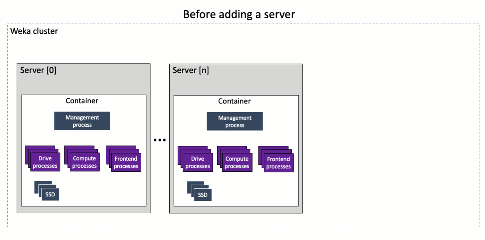

# Add a backend server in a legacy architecture

Expanding a cluster in a legacy architecture with a new backend server is similar to the Weka legacy system installation process.

Adding a server to the cluster includes adding the containers and configuring the networking, CPU resources, and SSDs.

<figure><figcaption><p>Adding a server to the cluster in a legacy architecture</p></figcaption></figure>


**Note:** In most cases, the container configurations are similar. Therefore, importing the container settings from a previously exported container in the cluster is possible, saving time and avoiding misconfiguration. \
See [Expand the cluster by importing the server settings](stages-in-adding-a-backend-host.md#expand-the-cluster-by-importing-the-server-settings).


## Add a backend server to an existing cluster

1. Obtain the Weka install file.
   * Download the Weka install file used when the existing cluster was last upgraded (or formed, if not upgraded). See [obtaining-the-weka-install-file.md](../../install/bare-metal/obtaining-the-weka-install-file.md "mention").
   * Use the `weka-status` command to show the current cluster install file version.\

2. Install the Weka software on the new server.
   * Run the `untar` command and `install.sh` command on the new server.\
     At the end of the installation process, the server is in stem mode (the server is not attached to a cluster).
3. Add the container to the cluster.
   * Run the following command line on any container that is part of the cluster. In the `backend-hostname` property, specify the IP address or hostname of the new backend server to add.

```
weka cluster container add <backend-hostname>

```


**Note:** Once this step is completed, the container ID of the newly added server appears in response to the command. Make a note of it to use in the following steps.


4. Configure the networking.
   * Perform the instructions in [#stage-6-configure-the-networking](../../install/bare-metal/using-cli.md#stage-6-configure-the-networking "mention").
5. Configure the CPU resources.
   * Perform the instructions in [#stage-8-configure-the-cpu-resources](../../install/bare-metal/using-cli.md#stage-8-configure-the-cpu-resources "mention").
6. Apply the configuration of the container on the newly added server.
   * Perform the instructions in [#stage-13-apply-containers-configuration](../../install/bare-metal/using-cli.md#stage-13-apply-containers-configuration "mention").


**Note:** You can activate the cluster containers sequentially.


7. Configure the SSDs.
   * Perform the instructions in [#7.-configure-the-ssds](../../install/bare-metal/using-cli.md#7.-configure-the-ssds "mention").

## Expand the cluster by importing the container settings

In most cases, the server configurations are similar. Therefore, importing the server setting from a previously exported server in the cluster is possible, saving time and avoiding misconfiguration.

**Procedure:**

1. Perform only steps 1 to 3 in the [Add a backend server to an existing cluster](stages-in-adding-a-backend-host.md#add-a-backend-server-to-an-existing-cluster) procedure (above).
2. Connect to one of the servers in the cluster and export the settings by running the following command: `weka local resources export`.
3. Connect to the new server and import the settings by running the following command: \
   `weka local resources import`.
4. Edit the local configuration.
   * See the [#local-resources-editing-commands](expansion-of-specific-resources.md#local-resources-editing-commands "mention") section.
5. Apply the configuration on the newly added server.
   * See [#stage-13-apply-containers-configuration](../../install/bare-metal/using-cli.md#stage-13-apply-containers-configuration "mention").
