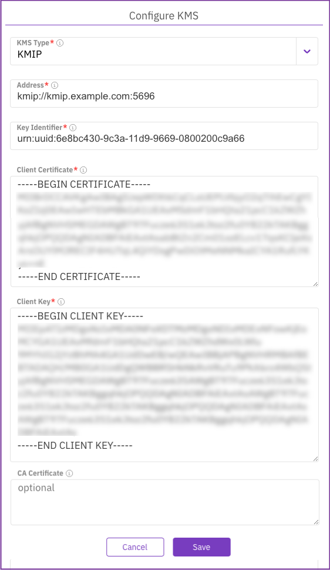

# Manage KMS using the GUI

Using the GUI, you can:

* [Configure a KMS](kms-management.md#configure-a-kms)
* [View the KMS configuration](kms-management.md#view-the-kms-configuration)
* [Update the KMS configuration](kms-management.md#update-the-kms-configuration)
* [Remove the KMS configuration](kms-management.md#remove-the-kms-configuration)

## Configure a KMS

Configure the KMS of either HashiCorp Vault or KMIP within the WEKA system to encrypt filesystem keys securely.

**Before you begin**

Ensure that the KMS is preconfigured, and both the key and a valid token are readily available.

**Procedure**

1. From the menu, select **Configure > Cluster Settings**.
2. From the left pane, select **Security**.
3. On the **Security** page, select **Configure KMS**.
4. On the **Configure KMS** dialog, select the KMS type to deploy: **HashiCorp Vault** or **KMIP**.
5. Set the connection properties according to the selected KMS type. Select the relevant tab for details:



For the **HashiCorp Vault** type, set the following:

* **Address**: The KMS address.
* **Key Identifier**: Key name to secure the filesystem keys (encryption-as-a-service).
* **Token**: The authentication API token you obtain from the vault to access the KMS.
* **Namespace:** The namespace name that identifies the logical partition within the vault. It is used to organize and isolate data, policies, and configurations. Namespace names must not end with "/", avoid spaces, and refrain from using reserved names like `root`, `sys`, `audit`, `auth`, `cubbyhole`, and `identity`. (Available from v4.2.7.)




For the **KMIP** type, set the following:

* **Address**: The address of the KMS in hostname:port format.
* **KMS Identifier**: Key UID to secure the filesystem keys (encryption-as-a-service).
* **Client Certificate:** The client certificate content of the PEM file.
* **Client Key**: The client key content of the PEM file.
* **CA Certificate**: (Optional) The CA certificate content of the PEM file.

<figure><figcaption>
KMIP type configuration 
</figcaption></figure>



6. Click **Save**.

**Related topics**

[Obtain an API token from the vault](kms-management-1.md#obtain-an-api-token-from-the-vault)

[Obtain a certificate for a KMIP-based KMS](kms-management-1.md#obtain-a-certificate-for-a-kmip-based-kms)

## View the KMS configuration

**Procedure**

1. From the menu, select **Configure > Cluster Settings**.
2. From the left pane, select **Security**.\
   The **Security** page displays the configured KMS.

## Update the KMS configuration

Update the KMS configuration in the WEKA system when changes occur in the KMS server details or cryptographic keys, ensuring seamless integration and continued secure filesystem key encryption.

**Procedure**

1. From the menu, select **Configure > Cluster Settings**.
2. From the left pane, select **Security**.
3. The **Security** page displays the configured KMS.
4. Select **Update KMS**, and update its settings.
5. Select **Save**.

## Remove the KMS configuration

Removing a KMS configuration is possible only if no encrypted filesystems exist.

**Procedure**

1. From the menu, select **Configure > Cluster Settings**.
2. From the left pane, select **Security**.
3. The **Security** page displays the configured KMS.
4. Select **Reset KMS.**
5. In the message that appears, select **Yes** to confirm the KMS configuration reset.
