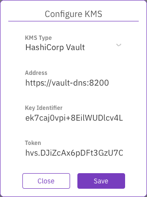

# Manage KMS using the GUI

Using the GUI, you can:

* [Add a KMS](kms-management.md#add-a-kms)
* [View the KMS](kms-management.md#view-the-kms)
* [Update the KMS configuration](kms-management.md#update-the-kms-configuration)
* [Remove the KMS](kms-management.md#remove-the-kms)

## Add a KMS

**Procedure**

1. From the menu, select **Configure > Cluster Settings**.
2. From the left pane, select **Security**.
3. On the **Security** page, select **Configure KMS**.
4. On the **Configure KMS** dialog, select the KMS type to deploy: **HashiCorp Vault** or **Kmip**.

 

5\. Enter the connection properties. The required properties depend on the KMS type you select.

For the **HashiCorp Vault** type, enter the following:

* **Address**: The KMS address
* **Key Identifier**: The identifier of the KMS.
* **Token**: The API token that you obtain from the vault.

For the **Kmip** type, enter the following:

* **Address**: The KMS address
* **KMS Identifier**: The identifier of the KMS.
* **Client Cert** and **Client Key**: The client certificate and key that you obtain for the Kmip-based KMS.
* **CA Cert**: (Optional) A digital certificate from the Certificate Authority (CA).

6\. Click **Save**.

**Related topics**

[Obtain an API token from the vault](kms-management-1.md#obtain-an-api-token-from-the-vault)

[Obtain a certificate for a Kmip-based KMS](kms-management-1.md#obtain-a-certificate-for-a-kmip-based-kms)

## View the KMS

**Procedure**

1. From the menu, select **Configure > Cluster Settings**.
2. From the left pane, select **Security**.
3. The **Security** page displays the configured KMS.

## Update the KMS configuration

**Procedure**

1. From the menu, select **Configure > Cluster Settings**.
2. From the left pane, select **Security**.
3. The **Security** page displays the configured KMS.
4. Select **Update KMS**, and update its settings.

5\. Select **Save**.

## Remove the KMS

Removing a KMS configuration is possible only if no encrypted filesystems exist.

**Procedure**

1. From the menu, select **Configure > Cluster Settings**.
2. From the left pane, select **Security**.
3. The **Security** page displays the configured KMS.
4. Select **Reset KMS.**
5. In the message that appears, select **Yes** to confirm the KMS configuration reset.
