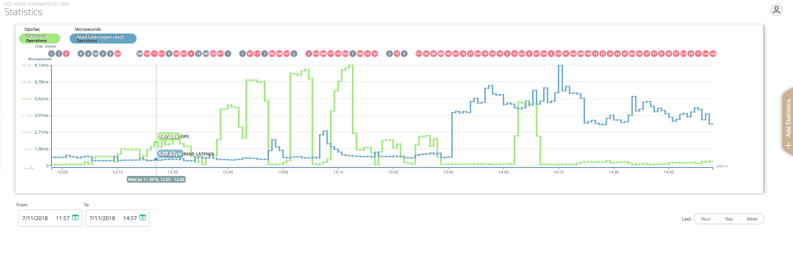
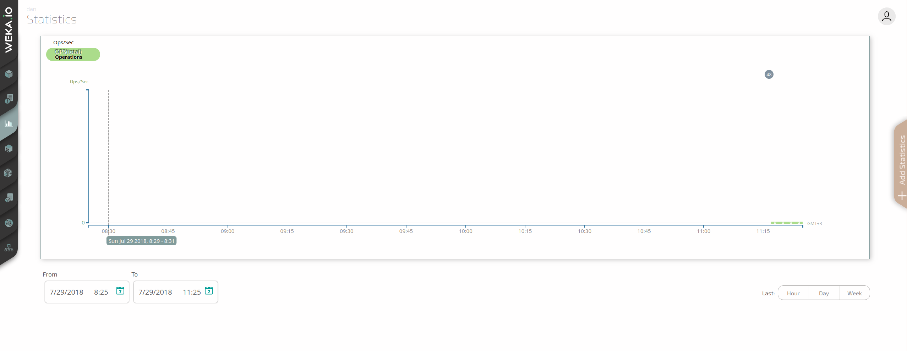

# Statistics

## Overview

As the WekaIO system runs, it collects hundreds of statistics on system performance. These statistics help in analyzing the WekaIO system performance and determining the source of any problems.

Five different categories of statistics are available for review - Operations \(NFS\), Operations \(Driver\), Object Store, SSD and CPU – and when each category is selected, a list of the possible statistics that can be selected is displayed.

By default, the main statistics page displays the last hour of operation, presenting the WekaIO system operation per second on a time axis.

This Statistics view screen offers a number of options to drill-down into the statistics, according to category. Options include:

* Mousing over the scrollable graph area to view various performance metrics of the WekaIO matrix cluster.
* Troubleshooting or obtaining a correlation between events and performance \(using the top line which provides links to events that occurred\).
* Adding more statistics to the view \(using the Statistics menu\).
* Displaying different statistics simultaneously and toggling between them. By default, the graph area shows Ops/sec for the last hour. Using the "Hour, Day, Week" buttons

  at the bottom-right enables changing of the time interval.

* Displaying, hiding. deleting, and zooming-in on statistics from defined timelines and dates.
* Bookmarking specific statistics for future reference and sharing with others \(using the URL\).

## Working with Statistics Using the GUI

### Viewing Statistics

To view the statistics screen using the GUI, click the statistics button on the left bar:  

### Adding Statistics

To select the addition of specific statistics, click the + Add Statistics tab on the right-hand side of the Statistics view screen. The statistics menu will be displayed.

Then select the component for which statistics required from the six possible categories. As each component is selected, the list of possible Statistics Names that can be selected changes. It is also possible to searching for a specific statistic by typing the name of the statistic in the Filter field at the top of the menu. 

Up to 5 different statistics can be displayed simultaneously. Selecting a metric adds its graph to the Statistics view, together with a selector containing the category and name of the statistics which are displayed according to the appropriate units. 

Switching the active unit scale is performed by clicking on one of the inactive units displayed in the left bottom corner of the graph display box.

### Hiding/Deleting Statistics

To hide or delete statistics from a graph, mouse-over the selector and click either the Hide or Delete button appearing under the selector.

### Specifying a Time Frame

To define a specific period of time \(start and end\) for the statistics to be displayed, click the From and To selectors appearing in the left corner of the graph display box. Then select the date of the statistics required from the calendar popup and the hours from the right scroller, or by using the up and down arrows that appear when hovering on the time selectors.


**Note:** It is also possible to change the time period by dragging the graph left or right.


The Auto Refresh setting offers another option for defining a specific period of time. Activation of Auto Refresh is performed by clicking on one of the buttons displayed in the right bottom corner of the graph display box, according to the desired period \(hour, day or week\). The selected period of time for the statistics will be automatically updated every minute, until Auto Refresh is deactivated by clicking the 'x' button located at the top right of the Auto Refresh tool tip, or by defining a period of time using the time selector.   

### Obtaining a Summary of Events

To obtain a summary of events that occurred in a specific time period, click the events bubble displayed above the graph. The Events popup will be displayed.  Expand the popup in order to obtain a detailed list of events. Click on the icon next to each event to link to the selected event in the Events view screen.    

## Working with Statistics Using the CLI

**Command:** `weka stats`

Use the following command line to obtain statistics definition information:  
`weka stats list-types`


**Note:** This command can be filtered according to names or categories of statistics \(when the name or category are defined\).


Use the following command line to obtain the current performance status of the hosts:  
`weka stats realtime`

Use the following command line to manage filters and read statistics:  
`weka stats --start-time=<start> [--end-time=<end>] [--category=<category>]... [--stat=<stat>]... [--resolution-secs=<secs>] [--accumulated] [--node-ids=<node>...] [--param=<key:val>]... [--no-zeros] [--show-internal] [--per-node]`  
or:

`weka stats --interval=<interval> [--category=<category>]... [--stat=<stat>]... [--resolution-secs=<secs>] [--accumulated] [--node-ids=<node>...] [--param=<key:val>]... [--no-zeros] [--show-internal] [--per-node]`

**Parameters in Command Lines**

| **Name** | **Type** | **Value** | **Limitations** | **Mandatory** | **Default** |
| :--- | :--- | :--- | :--- | :--- | :--- |
| `start` | String | Start time of the reported period | Valid date and time\* | Yes |  |
| `end` | String | End time of the reported period | Valid date and time\* | No | Current time |
| `interval**` | String | Period of time to be reported | Valid interval in seconds \(positive integer number\) | Yes |  |
| `category` | String | Specific categories for retrieval of appropirate statistics | Valid existing categories: CPU, Object Store, Operations, Operations \(NFS\), Operations \(Driver\), SSD  | No | All |
| `stat` | String | Statistics names | Valid statistics names | No | All |
| `secs` | String | Length of each interval in the reported period | Must be multiples of 60 seconds | No | 60 seconds |
| `nodes` | String | Node id | Valid node-id | No | All |
| `key:val` | String | A pair of key and value, where `key` is a statistics parameterization type and `val` is a valid parameterization value for that type | Valid parameterization type and value | No |  |


**Notes:**

\*Refer to Datetime Switches Syntax section in `weka --help-syntax` for help regarding datetime typed switches.

\*\*Relevant to the second command.


**Optional Flags in Command Line**

`[--accumulated]`: Displays accumulated statistics, not rate statistics

`[--no-zeros]`: Filters results where the value is 0

`[--show-internal]`: Displays internal statistics

`[--per-node]`: Does not aggregate statistics across nodes

## List of Statistics Collected

This section details the statistics collected to analyze system performance and determine the source of any problems as the WekaIO system runs, according to the following six categories: Operations, Operations \(NFS\), Operations \(Driver\), Object Storage, SSD and CPU. When each category is selected, a list of the possible statistics that can be selected is displayed.


**Note:** All statistics are averaged over 1 second intervals. Consequently, "total" or other aggregates relate to a specific minute.


### Operations Statistics

| Statistic | Description |
| :--- | :--- |
| ACCESS\_LATENCY | Average latency of ACCESS operations, in microseconds |
| ACCESS\_OPS | Number of ACCESS operations per second |
| COMMIT\_LATENCY | Average latency of COMMIT operations, in microseconds |
| COMMIT\_OPS | Number of COMMIT operations per second |
| CREATE\_LATENCY | Average latency of CREATE operations, in microseconds |
| CREATE\_OPS | Number of CREATE operations per second |
| FILEATOMICOPEN\_LATENCY | Average latency of FILEATOMICOPEN operations, in microseconds |
| FILEATOMICOPEN\_OPS | Number of FILEATOMICOPEN operations per second |
| FILECLOSE\_LATENCY | Average latency of FILECLOSE operations, in microseconds |
| FILECLOSE\_OPS | Number of FILECLOSE operations per second |
| FILEOPEN\_LATENCY | Average latency of FILEOPEN operations, in microseconds |
| FILEOPEN\_OPS | Number of FILEOPEN operations per second |
| FLOCK\_LATENCY | Average latency of FLOCK operations, in microseconds |
| FLOCK\_OPS | Number of FLOCK operations per second |
| FSINFO\_LATENCY | Average latency of FSINFO operations, in microseconds |
| FSINFO\_OPS | Number of FSINFO operations per second |
| GETATTR\_LATENCY | Average latency of GETATTR operations, in microseconds |
| GATATTR\_OPS | Number of GETATTR operations per second |
| LINK\_LATENCY | Average latency of LINK operations, in microseconds |
| LINK\_OPS | Number of LINK operations per second |
| LOOKUP\_LATENCY | Average latency of LOOKUP operations, in microseconds |
| LOOKUP\_OPS | Number of LOOKUP operations per second |
| MKDIR\_LATENCY | Average latency of MKDIR operations, in microseconds |
| MKDIR\_OPS | Number of MKDIR operations per second |
| MKNOD\_OPS | Number of MKNOD operations per second |
| MKNOD\_LATENCY | Average latency of MKNOD operations per second |
| OPS | Total number of operations per second |
| PATHCONF\_LATENCY | Average latency of PATHCONF operations, in microseconds |
| PATHCONF\_OPS | Number of PATHCONF operations per second |
| READ\_BYTES | Number of byte reads per second |
| READDIR\_LATENCY | Average latency of READDIR operations, in microseconds |
| READDIR\_OPS | Number of READDIR operations per second |
| READ\_DURATION | Histogram of read duration, in microseconds |
| READLINK\_LATENCY | Average latency of READLINK operations, in microseconds |
| READLINK\_OPS | Number of READLINK operations per second |
| READ\_LATENCY | Average latency of READ operations, in microseconds |
| READS | Number of READ operations per second |
| REMOVE\_LATENCY | Average latency of REMOVE operations, in microseconds |
| REMOVE\_OPS | Number of REMOVE operations per second |
| RENAME\_LATENCY | Average latency of RENAME operations, in microseconds |
| RENAME\_OPS | Number of RENAME operations per second |
| RMDIR\_LATENCY | Average latency of RMDIR operations, in microseconds |
| RMDIR\_OPS | Number of RMDIR operations per second |
| SETATTR\_LATENCY | Average latency of SETATTR operations, in microseconds |
| SETATTR\_OPS | Number of SETATTR operations per second |
| STATFS\_LATENCY | Average latency of STATFS operations, in microseconds |
| STATFS\_OP | Number of STATFS operations per second |
| SYMLINK\_LATENCY | Average latency of SYMLINK operations, in microseconds |
| SYMLINK\_OPS | Number of SYMLINK operations per second |
| THROUGHPUT | Number of byte read/writes per second |
| UNLINK\_LATENCY | Average latency of UNLINK operations, in microseconds |
| UNLINK\_OPS | Number of UNLINK operations per second |
| WRITES | Number of WRITE operations per second |
| WRITE\_BYTES | Number of byte writes per second |
| WRITE\_DURATION | Histogram of write duration, in microseconds |
| WRITE\_LATENCY | Average latency of WRITE operations, in microseconds |

### Operations \(NFS\) Statistics

| Statistic | Description |
| :--- | :--- |
| ACCESS\_OPS | The number of ACCESS operations per second |
| ACCESS\_LATENCY | The average latency of ACCESS operations, in microseconds |
| COMMIT\_OPS | The number of COMMIT operations per second |
| COMMIT\_LATENCY | The average latency of COMMIT operations, in microseconds |
| CREATE\_OPS | The number of CREATE operations per second  |
| CREATE\_LATENCY | The average latency of CREATE operations, in microseconds |
| FSINFO\_OPS | The number of FSINFO operations per second |
| FSINFO\_LATENCY | The average latency of FSINFO operations, in microseconds |
| GETATTR\_OPS | The number of GETATTR operations per second  |
| GETATTR\_LATENCY | The average latency of GETATTR operations, in microseconds |
| LINK\_OPS | The number of LINK operations per second |
| LINK\_LATENCY | The average latency of LINK operations, in microseconds |
| LOOKUP\_OPS | The number of LOOKUP operations per second |
| LOOKUP\_LATENCY | The average latency of LOOKUP operations, in microseconds |
| MKDIR\_OPS | The number of MKDIR operations per second |
| MKDIR\_LATENCY | The average latency of MKDIR operations, in microseconds |
| MKNOD\_OPS | The number of MKNOD operations per second |
| MKNOD\_LATENCY | The average latency of MKNOD operations, in microseconds |
| OPS | The total number of operations per second |
| PATHCONF\_OPS | The number of PATHCONF operations per second |
| PATHCONF\_LATENCY | The average latency of PATHCONF operations, in microseconds |
| READ\_BYTES | The number of bytes read per second |
| READ\_DURATION | Histogram of the time spent performing read operations, in ,microseconds |
| READ\_LATENCY | The average latency of READ operations, in microseconds |
| READ\_SIZES | Histogram of NFS read sizes |
| READDIR\_OPS | The number of READDIR operations per second |
| READDIR\_LATENCY | The average latency of READDIR operations, in microseconds |
| READLINK\_OPS | The number of READLINK operations per second |
| READLINK\_LATENCY | The average latency of READLINK operations, in microseconds |
| READS | The number of read operations per second |
| REMOVE\_OPS | The number of REMOVE operations per second |
| REMOVE\_LATENCY | The average latency of REMOVE operations, in microseconds |
| RENAME\_OPS | The number of RENAME operations per second |
| RENAME\_LATENCY | The average latency of RENAME operations, in microseconds |
| SETATTR\_OPS | The number of SETATTR operations per second |
| SETATTR\_LATENCY | The average latency of SETATTR operations, in microseconds |
| STATFS\_OPS | The number of STATFS operations per second |
| STATFS\_LATENCY | The average latency of STATFS operations, in microseconds |
| SYMLINK\_OPS | The number of SYMLINK operations per second |
| SYMLINK\_LATENCY | The average latency of SYMLINK operations, in microseconds |
| THROUGHPUT | The number byte read/write per second |
| WRITES | The number of WRITE operations per second |
| WRITE\_BYTES | The number of bytes written to a file per second |
| WRITE\_LATENCY | The average latency of WRITE operations, in microseconds |
| WRITE\_DURATION | Histogram of the time spent performing write operations |
| WRITE\_SIZES | Histogram of NFS write sizes |

### Operations \(Driver\) Statistics

| Statistic | Description |
| :--- | :--- |
| DIRECT\_READ\_SIZES | Histogram of the sizes of read operations that were not cached, in blocks/second |
| DIRECT\_WRITE\_SIZES | Histogram of the sizes of write operations that were not cached, in blocks/second |
| FILEATOMICOPEN\_OPS | The number of FILEATOMICOPEN operations \(operations that atomically create and open a file\) per second |
| FILEATOMICOPEN\_LATENCY | The average latency of FILEATOMICOPEN operations, in microseconds |
| FILEOPEN\_OPS | The number of FILEOPEN operations per second |
| FILEOPEN\_LATENCY | The average latency of FILEOPEN operations, in microseconds |
| FILECLOSE\_OPS | The number of FILECLOSE operations per second |
| FILECLOSE\_LATENCY | The average latency of FILECLOSE operations, in microseconds |
| FLOCK\_OPS | The number of File LOCK operations  per second |
| FLOCK\_LATENCY | The average latency of File LOCK operations, in microseconds |
| GETATTR\_OPS | The number of GETATTR operations per second  |
| GETATTR\_LATENCY | The average latency of GETATTR operations, in microseconds |
| IOCTL\_OBS\_PREFETCH\_OPS  | The number of IOCTL OBS PREFETCH operations per second |
| IOCTL\_OBS\_PREFETCH\_LATENCY | The average latency of IOCTL OBS PREFETCH operations, in microseconds |
| LINK\_OPS | The number of LINK operations per second |
| LINK\_LATENCY | The average latency of LINK operations, in microseconds |
| LOOKUP\_OPS | The number of LOOKUP operations per second |
| LOOKUP\_LATENCY | The average latency of LOOKUP operations, in microseconds |
| MKNOD\_OPS | The number of MKNOD operations per second |
| MKNOD\_LATENCY | The average latency of MKNOD operations, in microseconds |
| OPS | The total number of operations per second |
| READS | The number of READ operations per second |
| READ\_BYTES | The number of bytes read per second |
| READ\_DURATION | Histogram of the time spent performing read operations, in microseconds |
| READ\_LATENCY | The average latency of READ operations, in microseconds |
| READ\_SIZES | Histogram of sizes of read operations, in blocks/second |
| READDIR\_OPS | The number of READDIR operations per second |
| READDIR\_LATENCY | The average latency of READDIR operations, in microseconds |
| RENAME\_OPS | The number of file or directory RENAME operations per second |
| RENAME\_LATENCY | The average latency of RENAME operations, in microseconds |
| RMDIR\_OPS | The number of RMDIR operations per second |
| RMDIR\_LATENCY | The average latency of RMDIR operations, in microseconds |
| READLINK\_OPS | The number of READLINK operations per second |
| READLINK\_LATENCY | The average latency of READLINK operations, in microseconds |
| STATFS\_OPS | The number of STATFS operations per second |
| STATFS\_LATENCY | The average latency of STATFS operations, in microseconds |
| SETATTR\_OPS | The number of SETATTR operations per second |
| SETATTR\_LATENCY | The average latency of SETATTR operations, in microseconds |
| SYMLINK\_OPS | The number of SYMLINK operations per second |
| SYMLINK\_LATENCY | The average latency of SYMLINK operations, in microseconds |
| THROUGHPUT | The total number byte reads/writes per second |
| UNLINK\_OPS | The number of UNLINK operations per second |
| UNLINK\_LATENCY | The average latency of UNLINK operations, in microseconds |
| WRITES | The number of write operations per second |
| WRITE\_BYTES | The number of bytes written per second |
| WRITE\_DURATION | Histogram of the time spent performing write operations, in microseconds |
| WRITE\_LATENCY | The average latency of WRITE operations, in microseconds |
| WRITE\_SIZES | Histogram of the number of blocks written per second |

### Object Storage Statistics

| Statistic | Description |
| :--- | :--- |
| FAILED\_OBJECT\_DELETES | The number of FAILED OBJECT DELETE operations \(irrespective of the reason for failure\) on all object stores per second |
| FAILED\_OBJECT\_DOWNLOADS | The number of FAILED OBJECT DOWNLOAD operations \(irrespective of the reason for failure\) on all object stores per second |
| FAILED\_OBJECT\_OPERATIONS | The total number of FAILED OBJECT operations per second |
| FAILED\_OBJECT\_UPLOADS | The number of FAILED OBJECT UPLOAD operations \(irrespective of the  reason for failure\) on all object stores per second |
| OBJECT\_DELETE\_DURATION | Histogram of the time spent performing OBJECT DELETE operations, in microseconds  |
| OBJECT\_DELETE\_LATENCY | The latency of OBJECT DELETE operations, in microseconds |
| OBJECT\_DELETES | The number of OBJECT DELETE operations per second |
| OBJECT\_DOWNLOADS | The number of OBJECT DOWNLOAD operations per second |
| OBJECT\_DOWNLOAD\_DURATION | Histogram of the time spent performing OBJECT DOWNLOAD operations, in microseconds  |
| OBJECT\_DOWNLOAD\_LATENCY | The time spent performing OBJECT DOWNLOAD operations, in microseconds |
| OBJECT\_OPERATIONS | The total number of OBJECT operations per second |
| OBJECT\_UPLOADS | The number of OBJECT UPLOAD operations per second |
| OBJECT\_UPLOAD\_DURATION | Histogram of the time spent on OBJECT UPLOAD operations, in microseconds |
| OBJECT\_UPLOAD\_LATENCY | The latency of OBJECT UPLOAD operations, in microsecondst stores. |
| OBS\_READ\_BYTES | The number of READ BYTES read from the object store per second |
| OBS\_WRITE\_BYTES | The number of WRITE BYTES sent to the object store per second |
| READ\_BYTES | The number of bytes READ from the object store per second |
| WRITE\_BYTES | The number of bytes sent to the object store per second |

### SSD Statistics

| Statistic | Description |
| :--- | :--- |
| DRIVE\_READ\_OPS | The rate of DRIVE READ operations, in IO/second |
| DRIVE\_READ\_LATENCY | The latency of DRIVE READ operations, in microseconds |
| DRIVE\_WRITE\_OPERATIONS | The rate of DRIVE WRITE operations, in IO/second |
| DRIVE\_WRITE\_LATENCY | The latency of DRIVE WRITE operations, in microseconds |
| SSD\_BLOCKS\_READ | The number of BLOCK READ operations from the SSD service, in blocks/second |
| SSD\_BLOCKS\_WRITTEN | The number of BLOCK WRITE operations to the SSD service, in blocks/second |
| SSD\_MEDIA\_ERRORS | The number of SSD MEDIA ERRORS, in IO/second |
| SSD\_NON\_MEDIA\_ERRORS | The number of SSD NON-MEDIA ERRORS, in IO/second |
| SSD\_READ\_REQS | The number of read requests from the SSD service, in IO/second |
| SSD\_READ\_ERRORS | The number of ERRORS in reading blocks from the SSD service, in blocks/second |
| SSD\_READ\_LATENCY | The average latency of READ requests from the SSD, in microseconds |
| SSD\_WRITES | The number of WRITE request operations to the SSD service, in IO/second |
| SSD\_WRITE\_LATENCY | The latency of writes to the SSD service, in microseconds |
| SSD\_WRITE\_ERRORS | The number of ERRORS in writing blocks to the SSD service, in blocks/second |

### CPU Statistics

| Statistic | Description |
| :--- | :--- |
| CPU\_UTILIZATION | Custom statistic on the handling of I/Os, representing the average percentage of CPU time utilized by WekaIO \(from the cores used by WekaIO\) |

