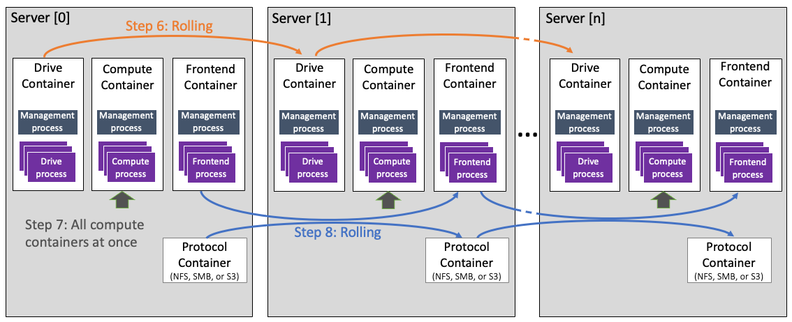

# Upgrade Weka versions

## Overview&#x20;

The Weka upgrade process supports upgrading to higher minor versions and major versions of the Weka software.

When upgrading to a major version, always upgrade to the latest minor version in the new major version. This may require first upgrading to a specific minor version in the current software version, as follows:

* To upgrade to Weka software version 4.1.x, go through version 4.0.2 or above for NDU, or version 4.0.1 for a regular upgrade (see upgrade options).&#x20;
* To upgrade to Weka software version 4.0.x, go through version 3.14.1 or above
* To upgrade to Weka software version 3.14.x, go through version 3.13.1 or above
* To upgrade to Weka software version 3.13.x, go through version 3.12.1 or above

For more information, contact the [Customer Success Team](../support/getting-support-for-your-weka-system.md#contact-customer-success-team).

## Upgrade options

Weka provides two main upgrade options depending on the source version and configuration:

* [Non-disruptive upgrade (NDU)](upgrading-weka-versions.md#non-disruptive-upgrade-ndu): This upgrade is aimed at source versions 4.0.2 and above configured with multiple containers architecture.
* [Regular upgrade](upgrading-weka-versions.md#upgrade-during-a-maintenance-window): This upgrade is aimed at source versions 4.0.1 and above configured with single container architecture (Weka legacy system).

### Non-disruptive upgrade (NDU)

Each container serves a single type of process, drive, frontend, or compute function in a multiple containers architecture. Therefore it is possible to upgrade one container at a time while the remaining containers continue serving the clients.

The drives and frontend containers are upgraded in a rolling fashion, one container at a time, and the compute containers are upgraded at once, minimizing the time IOs are not served.

**Internal upgrade process**

Once you run the upgrade command in `ndu` mode, the following occurs:

1. Downloading the version to all backend servers.
2. Creating upgrade containers on all servers.
3. Establishing secure tunnels on all containers.
4. Preparing version on all backend servers.
5. Upgrading agents on all backend servers.
6.  Starting rolling upgrade of the **drive** containers:

    * Upgrading drive containers on server \[x].
    * Upgrading server \[0] from version \<source> \<target>.
    * Rebuilding and redistributing.

    Then continue the same actions on the remaining servers with drive containers. Finishing the rolling upgrade on all drive containers.
7. Starting upgrade of the **compute** containers all at once:
   * Stopping buckets
   * Stopping io-nodes
   * Starting io-nodes
   * Starting buckets.
8.  Starting rolling upgrade of the **frontend** and **protocols** containers:

    * Upgrading frontend and protocol **** containers on server \[x].
    * Upgrading server \[x] from version \<source> \<target>.
    * Rebuilding and redistributing.

    Then continue the same actions on the remaining servers with frontend and protocol containers. Finishing the rolling upgrade on all frontend and protocols containers.

<figure><figcaption><p>NDU process at a glance</p></figcaption></figure>

### Regular upgrade

In this upgrade option, the upgrade is done during a maintenance window. The upgrade runs on all backend containers, and the service during this time is disrupted up to a defined window of 10 minutes. Weka system ensures that either the upgrade process to the new version completes successfully or the version is automatically reverted to the previous version within this maintenance window. If a failure occurs, the version is automatically reverted on the backends (run the `weka cluster container` command to verify that).\
This upgrade option applies to all versions configured in a single container architecture. However, to upgrade from version 4.0.2 or above, it is recommended to use the NDU option.

**Related topics**

[weka-containers-architecture-overview.md](../overview/weka-containers-architecture-overview.md "mention")

## Upgrade workflow

1. [Verify prerequisites for the upgrade](upgrading-weka-versions.md#1.-verify-prerequisites-for-the-upgrade)
2. [Prepare the cluster for upgrade](upgrading-weka-versions.md#2.-prepare-the-cluster-for-upgrade)
3. [Prepare the backend servers for upgrade (optional)](upgrading-weka-versions.md#3.-optional.-prepare-the-backend-servers-for-upgrade)
4. [Upgrade the backend servers](upgrading-weka-versions.md#4.-upgrade-the-backend-servers)
5. [Upgrade the clients](upgrading-weka-versions.md#5.-upgrade-the-clients)
6. [Check the status after the upgrade](upgrading-weka-versions.md#6.-check-the-status-after-the-upgrade)

### 1. Verify prerequisites for the upgrade

Before upgrading the cluster, ensure the following prerequisites. Otherwise, the NDU is not possible:

1. The backend servers meet the [prerequisites and compatibility](../support/prerequisites-and-compatibility.md) of the target version.
2. If you perform a non-disruptive upgrade (NDU), ensure the source version is configured in a multiple containers architecture. If not, contact the [Customer Success Team](../support/getting-support-for-your-weka-system.md#contact-customer-success-team) to convert the source version from a single container architecture to a multiple containers architecture. This prerequisite only applies to an upgrade from source version 4.0.2 and above to 4.1.x.
3. All the backend servers are online.
4. Any rebuild has been completed.
5. There are no outstanding alerts that haven't been addressed.
6. There is at least 4 GB of free space in the `/opt/weka` directory.
7. Verify that no stateful clients are connected to the cluster.


**Note:** If you plan a multi-hop version upgrade, once an upgrade is done, a background process of converting metadata to a new format may occur (in some versions). This upgrade takes several minutes to complete before another upgrade can start. You can monitor the progress using the `weka status` CLI command and check if there is a `data upgrade` task in a `RUNNING` state.


### 2. Prepare the cluster for upgrade&#x20;

Download the new software release on one of the backends using one of the following methods:

* From the backend server, run `weka version get <new-version>` where `<new-version>` is the name of the new version (for example,`4.1.0`), followed by `weka version prepare <new-version>`.&#x20;
* If you don't have a distribution server set, you can add it explicitly to the command. For example, to get the `4.1.0` version from [get.weka.io](https://get.weka.io/ui/releases/), use a token as follows:&#x20;

```bash
weka version get 4.1.0 --from https://[GET.WEKA.IO-TOKEN]@get.weka.io
```

* From the backend server, run the `curl` command described in the install tab on the [get.weka.io](https://get.weka.io/ui/releases/) new release page.
* Download the new version tar file to the backend server and run the `install.sh` command. This method is helpful in environments without connectivity to [get.weka.io](https://get.weka.io), such as dark sites or private VPCs.

### 3. Prepare the backend servers for upgrade (optional)

When working with many backend servers, it is possible to prepare them separately from the upgrade process in advance to minimize the total upgrade time. For a small number of backend servers, this step is not required.&#x20;

The preparation phase prepares all the connected backend servers for the upgrade, which includes downloading the new version and getting it ready to be applied.

Once the new version is downloaded to one of the backend servers, run the following CLI command:

* For non-disruptive upgrade (NDU):\
  `weka local run -- container <container-name) --in <new-version> upgrade --mode ndu --prepare-only`
* For upgrades during a maintenance window:\
  `weka local run --in <new-version> upgrade --prepare-only`

### 4. Upgrade the backend servers

Once a new software version is installed on one of the backend servers, upgrade the cluster to the new version by running one of the following commands on the backend server:

* For non-disruptive upgrade (NDU):\
  `weka local run -- container <container-name) --in <new-version> upgrade --mode ndu`
* For upgrades during a maintenance window:\
  `weka local run --in <new-version> upgrade`

Where `<new-version>` is the new version's name (for example,`4.1.0`).

The upgrade command skips the download and preparation operations if you already ran the preparation step.

You can control the upgrade window time by setting the following parameters in the `upgrade` command:

**Parameters**

| **Name**                                 | **Type** | **Value**                                                                                                           | **Limitations** | **Mandatory**                             | **Default** |
| ---------------------------------------- | -------- | ------------------------------------------------------------------------------------------------------------------- | --------------- | ----------------------------------------- | ----------- |
| `--stop-io-timeout`                      | Integer  | Maximum time in seconds to wait for IO to stop successfully                                                         |                 | No                                        | 90s         |
| `--container-version-change-timeout`     | Integer  | Maximum time in seconds to wait for a container version update                                                      |                 | No                                        | 180s        |
| `--disconnect-stateless-clients-timeout` | Integer  | Maximum time in seconds to wait for stateless clients to be marked as DOWN and continue the upgrade without them    |                 | No                                        | 60s         |
| `--prepare-only`                         | Boolean  | Download and prepare a new software version across all servers in the cluster without performing the actual upgrade |                 | No                                        | False       |
| `--health-check-timeout`                 | String   | Maximum time in seconds to wait for the health check to complete                                                    |                 | No                                        | 10s         |
| `--container`                            | String   | The container from which to run the upgrade.                                                                        |                 | Yes for multiple containers configuration |             |
| `--mode`                                 | String   | <p>The method to run the upgrade. <br>For a non-disruptive upgrade, set <code>ndu</code>.</p>                       |                 | Yes for NDU                               |             |


**Note:** To run the upgrade command, ensure you are logged in as a Cluster Admin (using a `weka user login`).


Before switching the cluster to the new software release, the upgrade command distributes the new release to all cluster servers. It makes the necessary preparations, such as compiling the new `wekafs` driver.

Suppose a failure occurs during the preparation, such as the disconnection of a server or failure to build a driver. In that case, the upgrade process stops, and a summary message indicates the problematic server.

In a successful process, the upgrade stops the cluster IO service, switches all servers to the new release, and then turns the IO service back on. This process takes about 1 minute, depending on the size of the cluster.


**Note:** In large deployments of Weka with many backend servers and hundreds or thousands of clients, it is recommended to adjust the following timeout parameters: &#x20;

* Set `container-version-change-timeout` to `600s`
* Set `disconnect-stateless-clients-timeout` to `200s`
* Set health-check-timeout to `30s`

If further assistance and adjustments are required, contact the [Customer Success Team](../support/getting-support-for-your-weka-system.md#contact-customer-success-team).


### 5. Upgrade the clients

Once all backends are upgraded, the clients remain with the existing version and continue working with the upgraded backends.

Once a stateless client is rebooted, or a complete `umount` and `mount` is performed, the stateless client is automatically upgraded to the backend version.

For stateful clients, a manual upgrade is required, usually during a maintenance window.

For a manual upgrade of both stateless or stateful clients, run the following command line on the client:

`weka local upgrade`

An alert is raised if there is a mismatch between the clients' and the cluster versions.


Add the `--prepare-driver` flag to the command for client source versions 4.0.1 and above.



**Note:** Clients with two or more versions behind the version of the backends are not supported. Therefore, clients must be automatically or manually upgraded before the next cluster software version upgrade.


### 6. Check the status after the upgrade

Once the upgrade is complete, verify that the cluster is in the new version by running the `weka status` command.


**Example:** The following is returned when the system is upgraded to version 4.1.0:

`# weka status`  \
`Weka v4.1.0`   \
`...`

