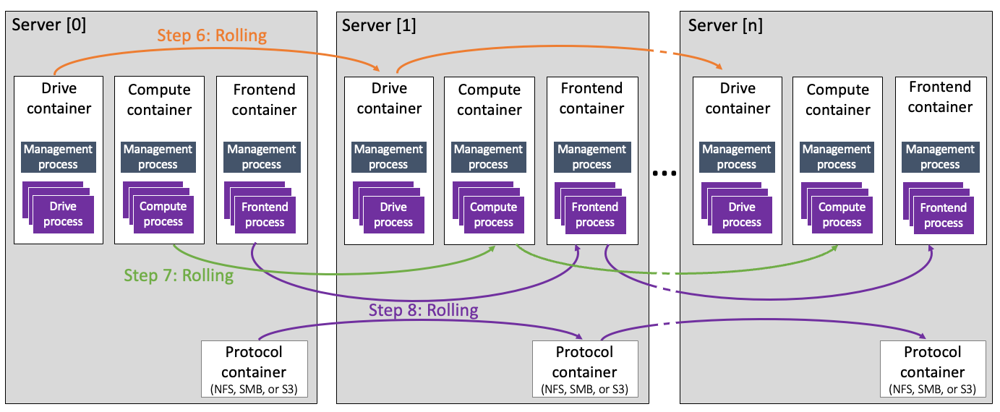
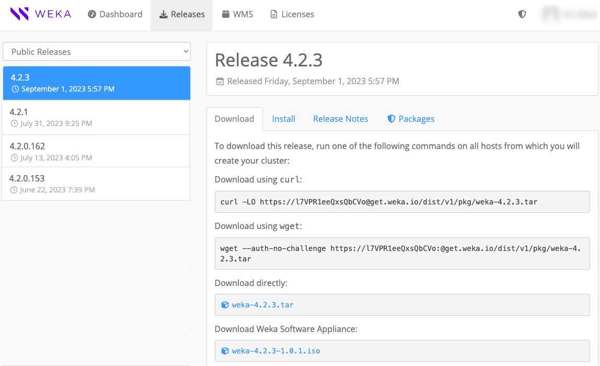
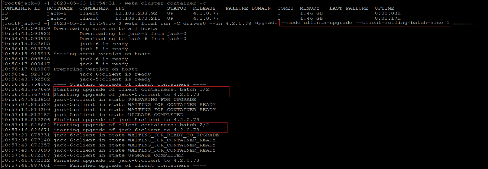

# Upgrade WEKA versions

## Upgrade overview

The WEKA upgrade process supports upgrading to higher minor and major versions of a WEKA system deployed in a multi-container backend architecture (MCB). MCB is supported from version 4.0.2. MCB enables non-disruptive upgrades (NDU).

Always upgrade to the latest minor version in the new major version when upgrading to a major version. This may require first upgrading to a specific minor version in the current software version, as follows:

* To upgrade to WEKA software version 4.2.x, the minimum source version must be 4.1.2 in MCB architecture.
* To upgrade to WEKA software version 4.1.x, the minimum source version must be 4.0.2 in MCB architecture.&#x20;


If the source system is not in MCB architecture, it is required to convert the cluster architecture to MCB. \
See [convert-the-cluster-architecture-from-a-single-container-backend-to-a-multi-container-backend.md](../appendix/convert-the-cluster-architecture-from-a-single-container-backend-to-a-multi-container-backend.md "mention"). \
This workflow is only intended for professional services.\
Contact the [Customer Success Team](../support/getting-support-for-your-weka-system.md#contact-customer-success-team) for assistance.



Customers running WEKA clusters on AWS with **auto-scaling groups** must contact the [Customer Success Team](../support/getting-support-for-your-weka-system.md#contact-customer-success-team) before converting the cluster to MCB.


## What is a non-disruptive upgrade (NDU)

In MCB architecture, each container serves a single type of process, drive, frontend, or compute function. Therefore, upgrading one container at a time (rolling upgrade) is possible while the remaining containers continue serving the clients.


Some background tasks, such as snapshot uploads or downloads, must be postponed or aborted. See the [prerequisites](upgrading-weka-versions.md#1.-verify-prerequisites-for-the-upgrade) in the upgrade workflow for details.


#### **Internal upgrade process**

Once you run the upgrade command in `ndu` mode, the following occurs:

1. Downloading the version and preparing all backend servers.
2. Rolling upgrade of the **drive** containers.
3. Rolling upgrade of the **compute** containers.
4. Rolling upgrade of the **frontend** and **protocol** containers and the protocol gateways.

<figure><figcaption><p>NDU process at a glance</p></figcaption></figure>

**Related topics**

[weka-containers-architecture-overview.md](../overview/weka-containers-architecture-overview.md "mention")

## Upgrade workflow

1. [Verify system upgrade prerequisites](upgrading-weka-versions.md#id-1.-verify-system-upgrade-prerequisites)
2. [Prepare the cluster for upgrade](upgrading-weka-versions.md#2.-prepare-the-cluster-for-upgrade)
3. [Prepare the backend servers for upgrade (optional)](upgrading-weka-versions.md#3.-optional.-prepare-the-backend-servers-for-upgrade)
4. [Upgrade the backend servers](upgrading-weka-versions.md#4.-upgrade-the-backend-servers)
5. [Upgrade the clients](upgrading-weka-versions.md#5.-upgrade-the-clients)
6. [Check the status after the upgrade](upgrading-weka-versions.md#6.-check-the-status-after-the-upgrade)


Adhere to the following considerations:

* Upgrading a WEKA cluster with a server used for more than one of the following protocols, NFS, SMB, or S3, is not allowed. In such a case, the upgrade does not start and indicates the servers that require protocol separation. Contact the Customer Success Team to ensure only one additional protocol is installed on each server.
* If you intend to create an S3 cluster, ensure the upgrade process is complete and all containers are up before initiating the S3 cluster creation.


### 1. Verify system upgrade prerequisites

Before proceeding with any system upgrade, ensuring that the environment meets the necessary prerequisites is crucial. The **WEKA Upgrade Checker Tool** automates these essential checks, comprehensively assessing the system’s readiness. Whether performing a single-version upgrade or a multi-hop upgrade, following this procedure is mandatory.

#### Summary of the WEKA Upgrade Checker Tool results:

1. **Passed checks (Green)**: The system meets all prerequisites for the upgrade.
2. **Warnings (Yellow)**: Address promptly to resolve potential issues.
3. **Failures (Red)**: Do not proceed; they may lead to data loss.

<details>

<summary>Sample list of the verification steps performed by the WEKA Upgrade Checker Tool </summary>

* [x] **Backend server Prerequisites and compatibility**:
  * Confirm that all backend servers meet the [prerequisites and compatibility](../support/prerequisites-and-compatibility.md) requirements of the target version. Address any discrepancies promptly.
  * **Contact the Customer Success Team** if there are compatibility issues or missing prerequisites.
* [x] **Source version architecture**:
  * Verify that the source version is configured in an **MCB (Multi-Cluster Backend)** architecture.
  * If the source version still uses the legacy architecture, take the necessary steps to **convert it to MCB**.
  * **Contact the Customer Success Team** for assistance during this conversion process.
* [x] **S3 protocol configuration and target version 4.2.4**:
  * If the S3 protocol is configured and the target version is **4.2.4**, the tool performs additional checks.
  * **Contact the Customer Success Team** to confirm that the internal key-value store (**ETCD**) has been successfully upgraded to **KWAS** (Key-Value WEKA Accelerated Store).
* [x] **Backend server availability**:
  * Ensure that all backend servers are **online and operational**.
  * Address any server availability issues promptly.
* [x] **User role**:
  * Log in with a user role that has **Cluster Admin privileges**.
  * If necessary, adjust user roles to meet this requirement.
* [x] **Rebuild completion**:
  * Verify that any ongoing rebuild processes have been successfully completed.
  * Do not proceed with the upgrade until the rebuilds are finished.
* [x] **Alerts and outstanding issues**:
  * Check for any outstanding alerts or unresolved issues.
  * Resolve any pending alerts before proceeding.
* [x] **Free space in /opt/weka directory**:
  * Ensure that there is **at least 4 GB of free space** in the `/opt/weka` directory.
  * If space is insufficient, address it promptly.
* [x] **Non-Disruptive Upgrade (NDU) process tasks**:
  * Before initiating the NDU process, **stop the following tasks** (if applicable):
    * **Upload a snapshot**:
      * If applicable, wait for the snapshot upload to complete.
      * Alternatively, abort the upload process if needed.
      * Task Name: **STOW\_UPLOAD**
    * **Create a filesystem from an uploaded snapshot**:
      * Wait for the download to complete.
      * If necessary, abort the process by deleting the downloaded filesystem or snapshot.
      * If the task is in the snapshot prefetch stage of the metadata phase, wait for the prefetch to complete or abort it. Resuming snapshot prefetch after the upgrade is not possible.
      * Task Names: STOW\_DOWNLOAD\_SNAPSHOT, STOW\_DOWNLOAD\_FILESYSTEM, FILESYSTEM\_SQUASH, and SNAPSHOT\_PREFETCH
    * **Sync a Filesystem from a Snapshot**:
      * **Wait for the download to complete**.
      * If needed, abort the process by deleting the downloaded filesystem or snapshot.
      * Task Name: STOW\_DOWNLOAD\_SNAPSHOT
    * **Detach Object Store Bucket from a Filesystem**:
      * During the upgrade, detaching an object store is blocked.
      * If the task is currently running, **ignore it**.
      * Task Name: OBS\_DETACH
  * **Postpone planned tasks or address running tasks**:
    * If any planned tasks are scheduled during the upgrade, postpone them until after the NDU process.
    * If tasks are currently running, take necessary actions based on their status.
    * Consult the [**Background tasks**](background-tasks/) topic for comprehensive guidance.

</details>


**Multi-hop version upgrades:**

After completing an upgrade, a background process initiates the conversion of metadata to a new format (in specific versions). This conversion may take several minutes before another upgrade can commence. To monitor the progress, use the `weka status` CLI command and check if a data upgrade task is RUNNING.


By diligently following this system readiness validation procedure, you can confidently proceed with system upgrades, minimizing risks and ensuring a smooth upgrade.


Demo: WEKA Upgrade Checker



* Prioritize running the WEKA Upgrade Checker **24 hours** before any scheduled upgrades. This step is critical to identify and address any potential issues proactively.
* Ensure **passwordless SSH access** is set up on all backend servers. This is crucial for the seamless execution of the Python script while running the WEKA Upgrade Checker.&#x20;


#### **Procedure**

1. **Log in to one of the backend servers as a root user:**
   * Access the server using the appropriate credentials.
2. **Obtain the WEKA Upgrade Checker:** \
   Choose one of the following methods:
   * **Method A:** Direct download
     * Clone the WEKA Upgrade Checker GIT repository with the command: \
       `git clone https://github.com/weka/tools.git`
   * **Method B:** Update from existing tools repository
     * If you have previously downloaded the tools repository, navigate to the **tools** directory.
     * Run `git pull` to update the tools repository with the latest enhancements. (The WEKA tools, including the WEKA Upgrade Checker, continuously evolve.)
3. **Run the WEKA Upgrade Checker:**
   * Navigate to the weka\_upgrade\_checker directory. It includes a binary version and a Python script of the tool. A minimum of Python 3.8 is required if you run the Python script.
   *   Run the Python script: `python3.8 ./weka_upgrade_checker.py`

       The tool scans the backend servers and verifies the upgrade prerequisites.
4. **Review the results:**
   * Pay attention to the following indicators:
     * **Green:** Passed checks. Ensure the tool's version is the latest.
     * **Yellow**: Warnings that require attention and remedy.
     * **Red**: Failed checks. If any exist, **do not proceed**. Contact the Customer Success Team.
5. **Send the log file to the Customer Success Team:**
   * The `weka_upgrade_checker.log` is located in the same directory you ran the tool from. Share the latest log file with the Customer Success Team for further analysis.

### 2. Prepare the cluster for upgrade&#x20;

Download the new WEKA version to one of the backend servers using one of the following methods depending on the cluster deployment:

* Method A: Using a distribution server
* Method B: Direct download and install from get.weka.io
* Method C: If the connectivity to get.weka.io is limited

For details, select the relevant tab.



Use this method if the cluster environment includes a distribution server from which the target WEKA version can be downloaded.

If the distribution server contains the target WEKA version, run the following commands from the cluster backend server:

```
weka version get <version>
weka version prepare <version>
```

Where: \<version> is the target WEKA version, for example: `4.2.3`.

If the distribution server does not contain the target WEKA version, add the option `--from` to the command, and specify the [get.weka.io](https://get.weka.io/ui/releases/) distribution site, along with the token.

Example:

```
weka version get <version> --from https://[GET.WEKA.IO-TOKEN]@get.weka.io
weka version prepare <version>
```



Use this method if the cluster environment has connectivity to [get.weka.io](https://get.weka.io).

1. From the Public Releases on the [get.weka.io](https://get.weka.io/ui/releases/), select the required release.
2. Select the **Install** tab.
3. From the backend server, run the `curl` command line as shown in the following example.&#x20;

<figure><figcaption><p>Example: Install tab</p></figcaption></figure>



Use this method if the cluster environment does not have connectivity to [get.weka.io](https://get.weka.io), such as with private networks or dark sites.

1. Download the new version tar file to a location from which you copy it to a dedicated directory in the cluster backend server, and untar the file.
2. From the dedicated directory in the cluster backend server, run the `install.sh` command.

<figure><figcaption><p>Example: Download tab</p></figcaption></figure>



### 3. Prepare the backend servers for upgrade (optional)

When working with many backend servers, preparing them separately from the upgrade process in advance is possible to minimize the total upgrade time. For a small number of backend servers, this step is not required.&#x20;

The preparation phase prepares all the connected backend servers for the upgrade, which includes downloading the new version and getting it ready to be applied.

Once the new version is downloaded to one of the backend servers, run the following CLI command:

`weka local run --container <container-name> --in <new-version> upgrade --prepare-only`

Where:

`<new-version>`: Specify the new version. For example,`4.2.3`.

`<container-name>`: Specify only one container name. For example: `drives0`.

The default upgrade mode to 4.2.x is `ndu`. Therefore, no need to specify it.

### 4. Upgrade the backend servers

Once a new software version is installed on one of the backend servers, upgrade the cluster to the new version by running the following command on the backend server.

If you already ran the preparation step, the upgrade command skips the download and preparation operations.

`weka local run --container <container-name> --in <new-version> upgrade`

Example:

`weka local run --container drives0 --in 4.2.3 upgrade`

**Consider the following guidelines:**

* Before switching the cluster to the new software release, the upgrade command distributes the new release to all cluster servers. It makes the necessary preparations, such as compiling the new `wekafs` driver.
* If a failure occurs during the preparation, such as a disconnection of a server or failure to build a driver, the upgrade process stops, and a summary message indicates the problematic server.
*   If cleanup issues occur during a specific upgrade phase, rerun it with the relevant option:                &#x20;

    ```bash
    --ndu-drives-phase
    --ndu-frontends-phase
    --ndu-computes-phase
    ```
* In a successful process, the upgrade stops the cluster IO service, switches all servers to the new release, and then turns the IO service back on. This process takes about 1 minute, depending on the cluster size.
* If the container running the upgrade process uses a port other than the default (14000), include the option `--mgmt-port <existing-port>` to the command.

### 5. Upgrade the clients

Once all backends are upgraded, the clients remain with the existing version and continue working with the upgraded backends. The client's version can only be one major version behind the version of the backends. Therefore, clients must be upgraded before the next cluster software version upgrade.\
The minimum source version for clients upgrade is 4.1.2.

#### Stateless client upgrade options

* If a stateless client is mounted on a single cluster, it is automatically upgraded to the backend version after rebooting, or a complete `umount` and `mount` is performed.
* If a stateless client is mounted on multiple clusters, the client container version is the same as the `client-target-version` in the cluster (see [Mount filesystems from multiple clusters on a single client](../fs/mounting-filesystems/mount-filesystems-from-multiple-clusters-on-a-single-client.md)).
* Stateless clients can also be upgraded manually.
* You can manually upgrade the clients locally (one by one) or remotely (in batches), usually during a maintenance window.

#### Stateful client upgrade options

* You can manually upgrade the clients locally (one by one) or remotely (in batches), usually during a maintenance window.
* A gateway, which is a stateful client running a protocol, is upgraded with the backend servers.

#### Client upgrade procedures



To upgrade a stateless or stateful client locally, connect to the client and run the following command line:

1. Run: `weka version get <target-version> --from <backend name or IP>:<port>`
2. Upgrade the agent by running the following:\
   `/opt/weka/dist/cli/<target_client> agent install-agent --no-update`
3. Upgrade the client containers. Do one the following following:
   * For clients connected to a single cluster, run `weka local upgrade`
   * For clients connected to a multiple  clusters, upgrade all containers simultaneously by running  `weka local upgrade --all`

An alert is raised if there is a mismatch between the clients' and the cluster versions.

Add the `--from <backend name or IP>` option to download the client package only from the backend, thus avoiding downloading from get.weka.io. The default port is 14000.



To upgrade stateless or stateful clients remotely in batches, add the following options to the  `weka local upgrade` command:

* `--mode=clients-upgrade`: This option activates the remote upgrade.
* `--client-rolling-batch-size`: This option determines the number of clients to upgrade in each batch.  For example, if there are 100 clients, you can set this option to 10 and the upgrade will run 10 batches of 10 clients each.

If you need upgrade specific clients, add the `--clients-to-upgrade` and the clients' ids to upgrade. For example, `--clients-to-upgrade 33,34,34`.

If you need to skip upgrade of specific clients, add the `--drop-host`  and the clients' ids to skip. For example, `--drop-host 22,23`.

If an upgrade of a client part of a batch fails, it stops the following batch upgrade. The current running batch continues the upgrade.

**Command syntax**

`weka local run -C <backend name> --in <target release> upgrade --mode=clients-upgrade --client-rolling-batch-size <number of clients in a batch> --clients-to-upgrade <comma separated clients' ids> --drop-host <comma separated clients' ids> --from backends`

**Example**

The following command line upgrade two clients in two batches (each batch has one client):

`weka local run -C drive0 --in 4.2.0.78 upgrade --mode=clients-upgrade --client-rolling-batch-size 1`

**Output example:**

<figure><figcaption><p>Upgrade one client per batch</p></figcaption></figure>



### 6. Check the status after the upgrade

Once the upgrade is complete, verify that the cluster is in the new version by running the `weka status` command.


**Example:** The following is returned when the system is upgraded to version 4.2.3:

`# weka status`  \
`Weka v4.2.3`   \
`...`

