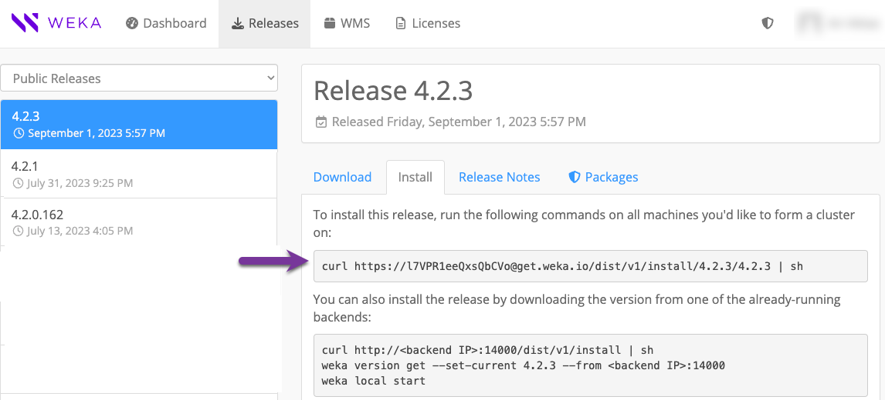

# Upgrade WEKA versions

## Upgrade overview

The WEKA upgrade process supports upgrading to higher minor and major versions of a WEKA system deployed in a multi-container backend architecture (MCB). MCB is supported from version 4.0.2. MCB enables non-disruptive upgrades (NDU).

Always upgrade to the latest minor version in the new major version when upgrading to a major version. This may require first upgrading to a specific minor version in the current software version, as follows:

* To upgrade to WEKA software version 4.2.x, the minimum source version must be 4.1.2 in MCB architecture.
* To upgrade to WEKA software version 4.1.x, the minimum source version must be 4.0.2 in MCB architecture.&#x20;

If the source system is not in MCB architecture, it is required to convert the cluster architecture to MCB. Contact the [Customer Success Team](../support/getting-support-for-your-weka-system.md#contact-customer-success-team) for assistance.


Customers running WEKA clusters on AWS with **auto-scaling groups** must contact the [Customer Success Team](../support/getting-support-for-your-weka-system.md#contact-customer-success-team) before converting the cluster to MCB.


## What is a non-disruptive upgrade (NDU)

In MCB architecture, each container serves a single type of process, drive, frontend, or compute function. Therefore it is possible to upgrade one container at a time (rolling upgrade) while the remaining containers continue serving the clients.


Some background tasks, such as snapshot uploads or downloads, must be postponed or aborted. See the [prerequisites](upgrading-weka-versions.md#1.-verify-prerequisites-for-the-upgrade) in the upgrade workflow for details.


#### **Internal upgrade process**

Once you run the upgrade command in `ndu` mode, the following occurs:

1. Downloading the version and preparing all backend servers.
2. Rolling upgrade of the **drive** containers.
3. Rolling upgrade of the **compute** containers.
4. Rolling upgrade of the **frontend** and **protocol** containers and the protocol gateways.

<figure><figcaption><p>NDU process at a glance</p></figcaption></figure>

**Related topics**

[weka-containers-architecture-overview.md](../overview/weka-containers-architecture-overview.md "mention")

## Upgrade workflow

1. [Verify prerequisites for the upgrade](upgrading-weka-versions.md#1.-verify-prerequisites-for-the-upgrade)
2. [Prepare the cluster for upgrade](upgrading-weka-versions.md#2.-prepare-the-cluster-for-upgrade)
3. [Prepare the backend servers for upgrade (optional)](upgrading-weka-versions.md#3.-optional.-prepare-the-backend-servers-for-upgrade)
4. [Upgrade the backend servers](upgrading-weka-versions.md#4.-upgrade-the-backend-servers)
5. [Upgrade the clients](upgrading-weka-versions.md#5.-upgrade-the-clients)
6. [Check the status after the upgrade](upgrading-weka-versions.md#6.-check-the-status-after-the-upgrade)


Upgrading a WEKA cluster with a server used for more than one of the following protocols, NFS, SMB, or S3, is not allowed. In such a case, the upgrade does not start and indicates the servers that require protocol separation.\
Contact the Customer Success Team to ensure only one additional protocol is installed on each server.


### 1. Verify prerequisites for the upgrade

Before upgrading the cluster, ensure the following prerequisites:

1. The backend servers meet the [prerequisites and compatibility](../support/prerequisites-and-compatibility.md) of the target version.
2. Ensure the source version is configured in an MCB architecture. If not, contact the [Customer Success Team](../support/getting-support-for-your-weka-system.md#contact-customer-success-team) to convert the source version from the legacy architecture to MCB.
3. If the S3 protocol is configured and the target version is 4.2.4, contact the Customer Success Team to confirm the ETCD (internal key-value store) has been upgraded to KWAS.&#x20;
4. All the backend servers are online.
5. Ensure you are logged in as a Cluster Admin (using a `weka user login`).
6. Any rebuild has been completed.
7. There are no outstanding alerts that still need to be addressed.
8. There is at least 4 GB of free space in the `/opt/weka` directory.
9. The NDU process requires the following tasks to be stopped. If these tasks are planned, postpone them. If the tasks are running, perform the required action.

<table><thead><tr><th width="208">Task</th><th width="242">Required action</th><th>Backgrounk task name</th></tr></thead><tbody><tr><td>Upload a snapshot  </td><td>Wait for the snapshot upload to complete,  or abort it.</td><td>STOW_UPLOAD</td></tr><tr><td>Create a filesystem from an uploaded snapshot</td><td>Wait for the download to complete or abort it by deleting the downloaded filesystem or snapshot.<br><br>If the task is in the snapshot prefetch of the metadata stage, wait for the prefetch to complete or abort it by. It is not possible to resume the snapshot prefetch after the upgrade.</td><td>STOW_DOWNLOAD_SNAPSHOT<br>STOW_DOWNLOAD_FILESYSTEM<br>FILESYSTEM_SQUASH<br>SNAPSHOT_PREFETCH</td></tr><tr><td>Sync a filesystem from a snapshot</td><td>Wait for the download to complete or abort it by deleting the downloaded filesystem or snapshot.</td><td>STOW_DOWNLOAD_SNAPSHOT</td></tr><tr><td>Detach object store bucket from a filesystem</td><td>Detaching an object store is blocked during the upgrade. If it is running, ignore it. </td><td>OBS_DETACH</td></tr></tbody></table>

For details on managing the background tasks, see the [Background tasks](background-tasks/) topic.


If you plan a multi-hop version upgrade, once an upgrade is done, a background process of converting metadata to a new format may occur (in some versions). This upgrade takes several minutes to complete before another upgrade can start. You can monitor the progress using the `weka status` CLI command and check if a data upgrade task is in a `RUNNING` state.


### 2. Prepare the cluster for upgrade&#x20;

Download the new WEKA version to one of the backend servers using one of the following methods depending on the cluster deployment:

* Method A: Using a distribution server
* Method B: Direct download and install from get.weka.io
* Method C: If the connectivity to get.weka.io is limited

For details, select the relevant tab.



Use this method if the cluster environment includes a distribution server from which the target WEKA version can be downloaded.

If the distribution server contains the target WEKA version, run the following commands from the cluster backend server:

```
weka version get <version>
weka version prepare <version>
```

Where: \<version> is the target WEKA version, for example: `4.2.3`.

If the distribution server does not contain the target WEKA version, add the option `--from` to the command, and specify the [get.weka.io](https://get.weka.io/ui/releases/) distribution site, along with the token.

Example:

```
weka version get <version> --from https://[GET.WEKA.IO-TOKEN]@get.weka.io
weka version prepare <version>
```



Use this method if the cluster environment has connectivity to [get.weka.io](https://get.weka.io).

1. From the Public Releases on the [get.weka.io](https://get.weka.io/ui/releases/), select the required release.
2. Select the **Install** tab.
3. From the backend server, run the `curl` command line as shown in the following example.&#x20;

<figure><figcaption><p>Example: Install tab</p></figcaption></figure>



Use this method if the cluster environment does not have connectivity to [get.weka.io](https://get.weka.io), such as with private networks or dark sites.

1. Download the new version tar file to a location from which you copy it to a dedicated directory in the cluster backend server, and untar the file.
2. From the dedicated directory in the cluster backend server, run the `install.sh` command.

<figure><figcaption><p>Example: Download tab</p></figcaption></figure>



### 3. Prepare the backend servers for upgrade (optional)

When working with many backend servers, preparing them separately from the upgrade process in advance is possible to minimize the total upgrade time. For a small number of backend servers, this step is not required.&#x20;

The preparation phase prepares all the connected backend servers for the upgrade, which includes downloading the new version and getting it ready to be applied.

Once the new version is downloaded to one of the backend servers, run the following CLI command:

`weka local run --container <container-name> --in <new-version> upgrade --prepare-only`

Where:

`<new-version>`: Specify the new version. For example,`4.2.3`.

`<container-name>`: Specify only one container name. For example: `drives0`.

The default upgrade mode to 4.2.x is `ndu`. Therefore, no need to specify it.

### 4. Upgrade the backend servers

Once a new software version is installed on one of the backend servers, upgrade the cluster to the new version by running the following command on the backend server.

If you already ran the preparation step, the upgrade command skips the download and preparation operations.

`weka local run --container <container-name> --in <new-version> upgrade`

Example:

`weka local run --container drives0 --in 4.2.3 upgrade`

**Adhere to the following:**

* Before switching the cluster to the new software release, the upgrade command distributes the new release to all cluster servers. It makes the necessary preparations, such as compiling the new `wekafs` driver.
* If a failure occurs during the preparation, such as a disconnection of a server or failure to build a driver, the upgrade process stops, and a summary message indicates the problematic server.
* In a successful process, the upgrade stops the cluster IO service, switches all servers to the new release, and then turns the IO service back on. This process takes about 1 minute, depending on the cluster size.

### 5. Upgrade the clients

Once all backends are upgraded, the clients remain with the existing version and continue working with the upgraded backends. The client's version can only be one version behind the version of the backends. Therefore, clients must be upgraded before the next cluster software version upgrade.

#### Stateless client upgrade options

* If a stateless client is mounted on a single cluster, it is automatically upgraded to the backend version after rebooting, or a complete `umount` and `mount` is performed.
* If a stateless client is mounted on multiple clusters, the client container version is the same as the `client-target-version` in the cluster (see [Mount filesystems from multiple clusters on a single client](../fs/mounting-filesystems/mount-filesystems-from-multiple-clusters-on-a-single-client.md)).
* Stateless clients can also be upgraded manually.
* You can manually upgrade the clients locally (one by one) or remotely (in batches), usually during a maintenance window.

#### Stateful client upgrade options

* You can manually upgrade the clients locally (one by one) or remotely (in batches), usually during a maintenance window.
* A gateway, which is a stateful client running a protocol, is upgraded with the backend servers.

#### Client upgrade procedures



To upgrade a stateless or stateful client locally, connect to the client and run the following command line:

1. Run: `weka version get <target-version> --from <backend name or IP>:<port>`
2. Upgrade the agent by running the following:\
   `/opt/weka/dist/cli/<target_client> agent install-agent --no-update`
3. Upgrade the client containers. Do one the following following:
   * For clients connected to a single cluster, run `weka local upgrade`
   * For clients connected to a multiple  clusters, upgrade all containers simultaneously by running  `weka local upgrade --all`

An alert is raised if there is a mismatch between the clients' and the cluster versions.

Add the `--from <backend name or IP>` option to download the client package only from the backend, thus avoiding downloading from get.weka.io. The default port is 14000.



To upgrade stateless or stateful clients remotely in batches, add the following options to the  `weka local upgrade` command:

* `--mode=clients-upgrade`: This option activates the remote upgrade.
* `--client-rolling-batch-size`: This option determines the number of clients to upgrade in each batch.  For example, if there are 100 clients, you can set this option to 10 and the upgrade will run 10 batches of 10 clients each.

If you need upgrade specific clients, add the `--clients-to-upgrade` and the clients' ids to upgrade. For example, `--clients-to-upgrade 33,34,34`.

If you need to skip upgrade of specific clients, add the `--drop-host`  and the clients' ids to skip. For example, `--drop-host 22,23`.

If an upgrade of a client part of a batch fails, it stops the following batch upgrade. The current running batch continues the upgrade.

**Command syntax**

`weka local run -C <backend name> --in <target release> upgrade --mode=clients-upgrade --client-rolling-batch-size <number of clients in a batch> --clients-to-upgrade <comma separated clients' ids> --drop-host <comma separated clients' ids> --from backends`

**Example**

The following command line upgrade two clients in two batches (each batch has one client):

`weka local run -C drive0 --in 4.2.0.78 upgrade --mode=clients-upgrade --client-rolling-batch-size 1`

**Output example:**

<figure><figcaption><p>Upgrade one client per batch</p></figcaption></figure>



### 6. Check the status after the upgrade

Once the upgrade is complete, verify that the cluster is in the new version by running the `weka status` command.


**Example:** The following is returned when the system is upgraded to version 4.2.3:

`# weka status`  \
`Weka v4.2.3`   \
`...`

