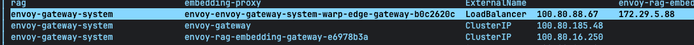
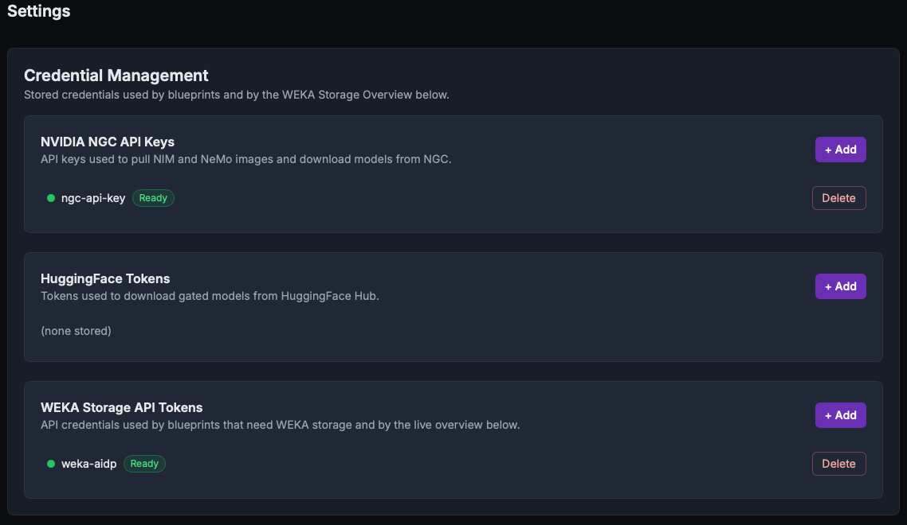
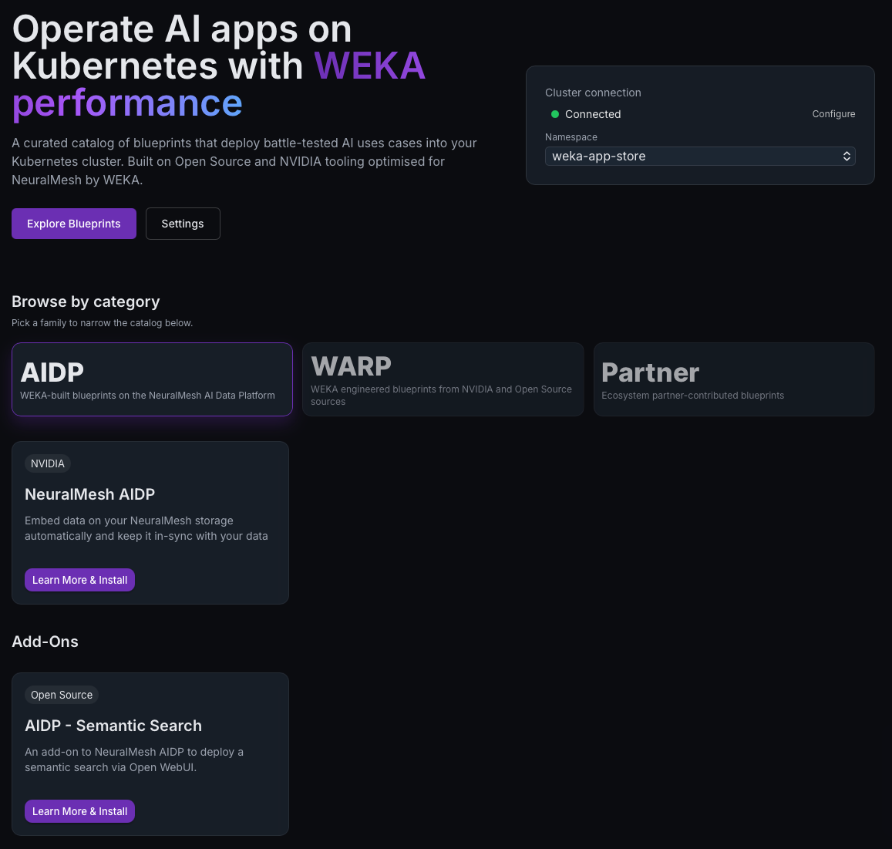
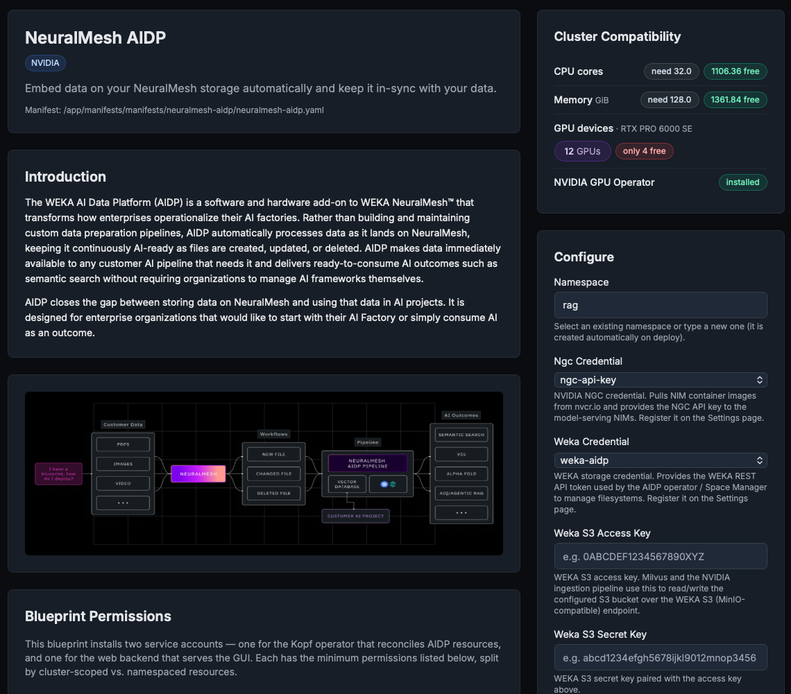

# Install the WEKA AI Data Platform

Deploy AIDP, WEKA's AI data pipeline that continuously transforms enterprise file data into AI-ready context, from the WEKA App Store catalogue. Complete a form and select **Deploy** to roll out the platform, with no terminal required.

## What AIDP deploys

The WEKA AI Data Platform watches a NeuralMesh filesystem continuously: every file created, updated, or deleted is captured through WEKA's snapshot-diff mechanism and reflected in the vector index in real time, without a scheduler, polling interval, or reindex cycle.

Selected files are parsed, chunked, and embedded using NVIDIA NIM models, then indexed into a vector database, with POSIX permissions captured at ingest and enforced at query time: a user who cannot see a file on the filesystem cannot see its vector either. Users interact with the results, including semantic search and agentic RAG, through a browser UI or API, without accessing the underlying pipeline directly.

On the installation side, a browser-managed control plane lets users create watchers that identify which NeuralMesh filesystem and folders to monitor. A Kubernetes operator turns each request into the storage and workload objects it needs. The full stack, including Keycloak identity, the NVIDIA Nemo Retriever (NIMs, Milvus, and the ingestion pipeline), observability, and the AI Data Platform's own services, ships as a single WEKA App Store application. Selecting it in the App Store catalogue and completing one form deploys everything as a `WekaAppStore` custom resource, which the operator reconciles component by component with automatic dependency ordering and readiness gating.

## Before you begin

Confirm the following before opening AIDP. The App Store GUI does not set these up.

* The WEKA App Store is installed and running on the cluster, with the NVIDIA GPU Operator, the WEKA CSI driver, and Envoy Gateway (with a `warp-edge-gateway` Gateway resource) already in place. See [Install the WEKA App Store](install-the-weka-app-store.md) for these prerequisites.
* Enough free GPU capacity. AIDP's default profile requires 12 RTX PRO 6000 SE GPUs (96 GB each) across 3 nodes, plus 32 CPU cores and 128 GiB of memory as a floor for the rest of the stack. The AIDP page's Cluster Compatibility panel checks this automatically before deployment.
* An NVIDIA NGC account and API key, for pulling NIM container images and downloading model weights. Obtain one from org.ngc.nvidia.com/setup/api-keys, then enter it in the App Store's credential manager.
* A NeuralMesh cluster with an S3-compatible bucket already created for the AI Data Platform's vector database traffic, plus WEKA S3 access and secret keys for that bucket.
* The cluster's S3 server IP addresses. Run `weka s3 cluster` on a WEKA server to list them, for entry into the install form so the built-in load balancer can reach them.
* WEKA REST API access: the management host or IP address, a username, and an API token or password with permission to manage filesystems. This becomes the platform's WEKA Storage credential.
* A Kubernetes load-balancer solution for the cluster. The WEKA App Store does not include or install one. See below for its role and requirements.
* A DNS zone configured for the Envoy routes AIDP creates. See below for the required configuration.

### Set up a DNS zone for Envoy routes

Every hostname the AI Data Platform uses, including Keycloak, its own GUI, the Attu admin UI, and observability, routes through one shared Envoy Gateway (`warp-edge-gateway`) that the WEKA App Store installs. That gateway is a single Kubernetes LoadBalancer service, and assigning it a real external IP depends entirely on the cluster already having a load-balancer solution configured: this is customer-provided infrastructure, not something the WEKA App Store installer sets up.

<figure><figcaption>
The warp-edge-gateway LoadBalancer service with an external IP assigned by the cluster's load-balancer solution
</figcaption></figure>

If the cluster does not already have one, provide it before continuing, for example MetalLB on a bare-metal cluster or a cloud provider's native load-balancer integration. Once in place, Envoy reads the `Host` header of each incoming request and routes it to the correct internal service. There is no separate IP per hostname, so every hostname in use must resolve to that single IP.

| Hostname          | Example                | Purpose                                                |
| ----------------- | ---------------------- | ------------------------------------------------------ |
| Keycloak FQDN     | `keycloak.example.com` | Sign-in and identity                                   |
| GUI base URL host | `aidp.example.com`     | The AI Data Platform's own web UI                      |
| Attu hostname     | `attu.example.com`     | The Milvus vector database admin UI                    |
| Cluster FQDN      | `example.com`          | Used to derive `phoenix.example.com` for observability |

Manage these as one DNS zone, either an existing organisational domain or a dedicated subdomain carved out for the cluster (for example, `aidp.yourcompany.com`). Within that zone, do one of the following:

* Wildcard record (recommended): a single `*.example.com` A record pointing to the gateway IP covers every hostname above automatically, along with any future hostname added later.
* Individual records: create one A record per hostname above, each pointing to the same gateway IP.

Obtain the Envoy Gateway's external IP from a cluster or network administrator before creating these records: it is the address the cluster's load-balancer solution assigned to `warp-edge-gateway`.


`warp-edge-gateway` serves plain HTTP, not HTTPS, and has no TLS termination configured out of the box. It listens on port 80 only. For HTTPS on these hostnames, place a TLS-terminating proxy or load balancer in front of the gateway. Otherwise, plan on accessing Keycloak, the GUI, and Attu over plain HTTP.


Confirm this DNS zone works before opening the install form. The Keycloak FQDN, GUI base URL, and Attu hostname fields must all resolve correctly for the Keycloak sign-in redirect to work once the platform is deployed.

## Step 1: Register credentials

The install form references two credentials by name rather than accepting secrets directly. Register both under **Settings > Credential Management** before starting AIDP.

<table><thead><tr><th width="237.90625">Credential</th><th>Steps</th></tr></thead><tbody><tr><td>NVIDIA NGC API Keys</td><td>Under <strong>NVIDIA NGC API Keys</strong>, select <strong>+ Add</strong>. Enter a display name and the NGC API key. The App Store derives the image-pull secret and the NIM model-download key from this entry.</td></tr><tr><td>WEKA Storage API Tokens</td><td>Under <strong>WEKA Storage API Tokens</strong>, select <strong>+ Add</strong>. Enter the WEKA management endpoint (host or IP address), a username, and an API token or password. This becomes the credential the AI Data Platform operator and Space Manager use to reach the cluster's REST API.</td></tr><tr><td>WEKA Quay Token</td><td>Under <strong>Quay Token</strong>, select <strong>+ Add</strong>. To pull images for AIDP from the WEKA Quay repository, you will need to enter your Quay Robot username and password. Failure to do this will produce imagepullerror on deployment.</td></tr></tbody></table>

Once saved, each credential shows a Ready status on the Settings page, making it selectable from a dropdown on the AIDP install form.

<figure><figcaption>
Settings → Credential Management, with both credentials registered and showing a Ready status
</figcaption></figure>

## Step 2: Find the Application

From the App Store home page, select **Explore Blueprints** and open AIDP. The detail page shows a description of what it deploys and a Cluster Compatibility panel comparing the cluster's free CPU, memory, and GPU capacity against AIDP requirements.

<figure><figcaption>
The App Store catalog: AIDP listed under Browse by category
</figcaption></figure>


If the Cluster Compatibility panel shows a shortfall, the **Deploy** button stays disabled until the cluster has enough free GPU, CPU, or memory capacity. Free up capacity or add nodes before continuing.


## Step 3: Complete the install form

The installation form contains fields, including two credential dropdowns populated in Step 1. Enter or select the remaining values as described below.

<figure><figcaption>
The AIDP detail page: Cluster Compatibility panel on the right, Configure form below it
</figcaption></figure>

<table><thead><tr><th width="238.0546875">Field</th><th width="139.09375">Requirement</th><th>Description</th></tr></thead><tbody><tr><td>Namespace</td><td>Required</td><td>The Kubernetes namespace to deploy into, created automatically if it does not already exist. Select an existing namespace from the dropdown or enter a new name, for example <code>rag</code>.</td></tr><tr><td>NGC Credential</td><td>Credential</td><td>Dropdown of registered NVIDIA NGC credentials from step 1. Pulls NIM images from <code>nvcr.io</code> and supplies the NGC API key to the model-serving NIMs.</td></tr><tr><td>WEKA Credential</td><td>Credential</td><td>Dropdown of registered WEKA Storage credentials from step 1. Supplies the WEKA REST API token the AI Data Platform operator and Space Manager use to manage filesystems.</td></tr><tr><td>WEKA S3 Access Key</td><td>Required</td><td>Access key for the WEKA S3-compatible bucket, used by Milvus and the NVIDIA ingestion pipeline.</td></tr><tr><td>WEKA S3 Secret Key</td><td>Required</td><td>Secret key paired with the access key above.</td></tr><tr><td>WEKA S3 Bucket Name</td><td>Default: <code>aidp-bucket</code></td><td>Name of the S3 bucket Milvus and the ingestion pipeline use. This bucket must already exist on the cluster.</td></tr><tr><td>WEKA S3 Node IPs</td><td>Required</td><td>Comma or space-separated list of the cluster's S3 server IP addresses, across which the built-in load balancer distributes traffic. Get the list by running <code>weka cluster nodes --role S3</code> on a WEKA server. Example: <code>192.168.1.1, 192.168.1.2, 192.168.1.3</code></td></tr><tr><td>WEKA API Host</td><td>Required</td><td>The bare WEKA management IP address or hostname, without <code>http://</code> or a port (port 14000 is assumed). Example: <code>172.3.4.248</code></td></tr><tr><td>Keycloak FQDN</td><td>Required</td><td>External hostname for Keycloak sign-in, hostname only, without a scheme or path. Example: <code>keycloak.example.com</code></td></tr><tr><td>GUI Base URL</td><td>Required</td><td>Full external URL of the AI Data Platform GUI. The Keycloak OIDC redirect URI is derived from this value. Example: <code>https://aidp.example.com</code></td></tr><tr><td>Attu Hostname</td><td>Required</td><td>External hostname for the Milvus Attu admin UI, hostname only. Example: <code>attu.example.com</code></td></tr><tr><td>Cluster FQDN</td><td>Required</td><td>The general cluster domain, used to derive the observability hostname (<code>phoenix.&#x3C;domain></code>). Example: <code>example.com</code></td></tr><tr><td>Vector DB Filesystem Name</td><td>Required</td><td>The human-readable NeuralMesh name backing the vector database, exactly as shown in the WEKA console.</td></tr></tbody></table>

## Step 4: Deploy and monitor progress

Select **Deploy**. The App Store applies the underlying `WekaAppStore` resource and streams a live progress view with one row per component, updating in real time as the operator works through the dependency graph, the same experience as any other App Store application installation.

Budget 60 to 90 minutes for a cold install. Almost all of that time is spent on the NVIDIA RAG component downloading NIM model weights on the first deployment. Every other component, including Keycloak, the load balancer, the bootstrap jobs, and the AI Data Platform's own services, typically finishes within a few minutes each.


Keep the browser tab open. Navigating away loses the live view, though the installation continues running in the background.


AIDP installs active components in dependency order.

| Component                    | Purpose                                                                                                                        | Typical duration                                     |
| ---------------------------- | ------------------------------------------------------------------------------------------------------------------------------ | ---------------------------------------------------- |
| `aidp-site-config`           | Generates the site-config ConfigMap from the form answers                                                                      | Seconds                                              |
| `weka-s3-lb`                 | nginx load balancer distributing traffic across the WEKA S3 server IP addresses                                                | Seconds                                              |
| `aidp-bootstrap-secrets`     | Bootstrap secrets required by every downstream component                                                                       | Seconds                                              |
| `aidp-bootstrap-ngc-secrets` | Materializes the NGC image-pull and API-key secrets from the NGC credential                                                    | Under 1 minute                                       |
| `aidp-bootstrap-weka-token`  | Patches the WEKA REST API token from the WEKA Storage credential into the operator's secret                                    | Under 1 minute                                       |
| `aidp-keycloak-realm-config` | Prepares the Keycloak realm import (clients, roles, groups) for the AI Data Platform                                           | Under 1 minute                                       |
| `envoy-endpoint-discovery`   | Discovers the Envoy Gateway's ClusterIP for internal hostname resolution                                                       | Under 1 minute                                       |
| `embedding-gateway`          | Internal L7 proxy giving the ingestion pipeline a stable embedding endpoint                                                    | Under 1 minute                                       |
| `keycloak`                   | Deploys Keycloak and imports the AI Data Platform's identity realm                                                             | 5 to 10 minutes                                      |
| `keycloak-secret-sync`       | Fetches the client secrets Keycloak generates on realm import and syncs them into the AI Data Platform's secrets automatically | Under 1 minute                                       |
| `milvus`                     | Vector database for RAG, backed by the WEKA S3 bucket                                                                          | 10 to 15 minutes                                     |
| `aidp-observability`         | Logs, traces, and LLM prompt and completion visibility (Loki, Tempo, Phoenix)                                                  | 10 to 15 minutes                                     |
| `space-manager-postgres`     | Database backing the embedding-eviction service                                                                                | 5 minutes                                            |
| `nvidia-rag-blueprint`       | All NIM inference services, the ingestion pipeline, and the RAG server                                                         | Up to 60 minutes cold; faster once models are cached |
| `aidp`                       | The AI Data Platform's GUI, Operator, RAG Gateway, RAG Bridge, and Space Manager                                               | 5 minutes                                            |

## Step 5: Federate the identity provider

The WEKA AI Data Platform's core security promise, that a user who cannot see a file cannot see its vector, holds only if the platform knows who its users actually are. That identity must come from an existing source: Active Directory, LDAP, or an existing SSO provider. Federating Keycloak with that source lets the AI Data Platform enforce the organisation's existing access controls instead of introducing a second, disconnected set of accounts.

Every AI Data Platform component authenticates against one Keycloak realm, `rag-gateway`. Out of the box, that realm is an empty shell: the groups and roles already exist, but no connection to a real user directory exists yet. Until this step is complete, the only way into the AI Data Platform GUI is the built-in Keycloak admin account.


Rotate the default Keycloak admin password first. AIDP provisions a Keycloak admin account (`admin`) with a fixed default password, so the Admin Console is reachable immediately after deployment. Because that default ships in the AIDP source, treat it as public on day one: sign in at the configured Keycloak hostname (`/auth/admin/`) and change it under the account's **Credentials** tab before doing anything else.


### Realm groups

Every AI Data Platform login is evaluated against the `rag-gateway` realm, which ships with three groups already defined. Map federated users into the correct group; do not create new ones.

| Group             | Grants                                                                                                            |
| ----------------- | ----------------------------------------------------------------------------------------------------------------- |
| `/cluster-admins` | The `aidp-cluster-admin` role: full, cluster-wide visibility and management of every watcher regardless of owner. |
| `/admins`         | The `aidp-admin` role: full watcher management plus purge capability.                                             |
| `/users`          | The default group. No elevated role; members see and manage only the watchers they created.                       |

A user with no group assignment can still sign in, but lands in the same restricted, own-watchers-only view as `/users`. Mapping real users into the correct group determines what they can do, not just whether they can log in.

### POSIX UID and GID for ACL-enforced vector search

Groups control who can manage watchers. A separate pair of attributes controls whether a user's search results reflect the files they are actually allowed to see. The AI Data Platform's RAG Gateway and RAG Bridge look up each user's `uid` and `gids` from their Keycloak profile at query time and use them to filter vector search results against the same POSIX ownership and permissions enforced on NeuralMesh. This mechanism underlies the platform's core security promise, and it depends entirely on those two attributes holding the user's real identity.

<table><thead><tr><th width="126.1015625">Attribute</th><th>Description</th></tr></thead><tbody><tr><td><code>uid</code></td><td>The user's POSIX UID as it exists on NeuralMesh, a single numeric value, for example <code>1001</code>.</td></tr><tr><td><code>gids</code></td><td>Every POSIX GID the user belongs to, multi-valued, each a numeric value, for example <code>1001, 2010</code>.</td></tr></tbody></table>


Keycloak marks these fields optional. Treat them as required: declaring the fields does not populate them, and a user with no `uid` or `gids` set falls back to a shared default identity for vector search, which does not reflect their real file-level permissions. For deployments doing ACL-enforced search or retrieval, every user needs real values here.


Populate these values in one of two ways:

* Set them manually: in the Keycloak Admin Console, open **Users**, select a user, and add `uid` and `gids` values on the **Attributes** tab.
* Federate them automatically: for Active Directory or LDAP, add a `user-attribute-ldap-mapper` mapping the directory's `uidNumber` attribute to Keycloak's `uid`, and a second mapper for the GID source to `gids`. For SAML or OIDC, configure the identity provider to emit the user's numeric POSIX UID and GID as attributes or claims, then add an Attribute or Claim Importer mapper in Keycloak targeting the `uid` and `gids` user profile fields, following the same pattern used for groups below.

### Connect an identity source

Keycloak supports three ways to connect a real identity source. Configure only the one that matches the environment.

#### Option A: Active Directory or LDAP

1. In the Keycloak Admin Console, switch the realm selector to `rag-gateway`, open **User federation**, and select **Add Ldap providers**.
2. Set **Vendor** to **Active Directory** (or the specific LDAP vendor), then enter the **Connection URL** (for example `ldaps://dc.yourcompany.com:636`), **Bind DN**, and **Bind Credential** for a service account with read access to the directory.
3. Set **Users DN** to the base DN the users live under (for example `ou=People,dc=yourcompany,dc=com`), and **Username LDAP attribute** to `sAMAccountName` for Active Directory.
4. Select **Test connection** and **Test authentication**, then **Save**.
5. Open the new provider's **Mappers** tab and add a `group-ldap-mapper`. Point it at the DN the security groups live under (**LDAP Groups DN**), and set **Mode** to `READ_ONLY` so Keycloak treats the directory as the source of truth.
6. Name or map the AD/LDAP groups to match the realm's existing group names exactly (`cluster-admins`, `admins`), so the sync lands members directly in `/cluster-admins` and `/admins` instead of creating new top-level groups that require manual merging.
7. Trigger a sync (**Sync all users**) and confirm affected users appear under **Groups > cluster-admins / admins** in the Admin Console.

#### Option B: SAML 2.0 identity provider

1. In the `rag-gateway` realm, open **Identity providers > Add provider > SAML v2.0**.
2. If the identity provider (ADFS, PingFederate, Okta's SAML app type, and similar) can export metadata, use **Import from URL** or **Import from file** to auto-fill the SSO URL, entity ID, and signing certificate. Otherwise enter these manually from the identity provider's setup screens.
3. On the identity provider side, create a SAML application with its Assertion Consumer Service (ACS) URL set to the Keycloak hostname's realm broker endpoint for this provider, and its Audience or Entity ID set to the Keycloak hostname's `rag-gateway` realm URL.
4. Configure the identity provider to include a group-membership attribute in the SAML assertion, often called a Group Attribute Statement.
5. In Keycloak, open the identity provider's **Mappers** tab and add a SAML Attribute Importer mapper targeting a group, mapping the identity provider's group values to `/cluster-admins` and `/admins`.
6. Test with a real federated user and confirm they land in the correct group after their first login.

#### Option C: OpenID Connect (Okta, Entra ID, and similar)

1. In the `rag-gateway` realm, open **Identity providers > Add provider > OpenID Connect v1.0**.
2. Enter the provider's discovery endpoint (for Okta, the Okta domain plus `/.well-known/openid-configuration`). Keycloak auto-fills the authorization, token, and userinfo endpoints from it.
3. On the identity provider side, create an OIDC application (in Okta: **Applications > Create App Integration > OIDC - Web Application**) with its sign-in redirect URI set to the Keycloak hostname's realm broker endpoint for this provider.
4. Copy the Client ID and Client Secret the identity provider generates into Keycloak's provider configuration, then save.
5. Configure the identity provider to include a `groups` claim in its tokens (in Okta, under **Authorization Server > Claims**).
6. In Keycloak, open the identity provider's **Mappers** tab and add a Claim to Group mapper, mapping the incoming `groups` claim values to `/cluster-admins` and `/admins`.
7. Test with a real federated user and confirm they land in the correct group after their first login.

#### Option D: Local users (test and development only)


Do not use local users for production access. Local Keycloak users are not deprovisioned when someone leaves the organization, do not inherit the identity provider's MFA or conditional access policies, and their passwords live only in Keycloak. Use this option only to stand up a working login for early testing before a real AD/LDAP, SAML, or OIDC connection exists, then delete the account once federation (Options A through C) is in place.


1. In the Keycloak Admin Console, switch the realm selector to `rag-gateway`, open **Users**, and select **Add user**. Enter a username and select **Create**.
2. Open the new user's **Credentials** tab, select **Set password**, and enter a password. Toggle **Temporary** off to avoid forcing a password change on first login.
3. Open the **Attributes** tab and add `uid` and `gids` values matching a real POSIX identity on NeuralMesh. Without this, the test user's search results do not reflect real file permissions.
4. Open the **Groups** tab, select **Join Group**, and add the user to `/cluster-admins` or `/admins` depending on what to test. Leave the user ungrouped to test the default, own-watchers-only experience.
5. Sign in at the configured GUI base URL with the new username and password to confirm the account works end to end.

Until an identity source is federated, or a user is created locally and mapped into a group by hand, only the default Keycloak admin account can sign into the AI Data Platform GUI. Any user who signs in without landing in `/cluster-admins` or `/admins` sees only their own watchers, regardless of how they authenticated.

## Step 6: Verify the installation

Confirm the deployment from the browser; no terminal is required.

1. Confirm AIDP's status reads Ready. The App Store's deployment view shows every component with a green ready indicator once the rollout finishes. The **Blueprint Uninstall** panel under **Settings** lists `weka-aidp` as installed in the configured namespace (for example `rag`), with its install timestamp.
2. Open the AI Data Platform's GUI at the configured base URL. Confirm the login page redirects through Keycloak for sign-in and returns to the dashboard afterward.
3. Sign in and create a test watcher: select a NeuralMesh filesystem and a folder to monitor. If it moves from Provisioning to Active, storage, the operator, and the ingestion pipeline are wired up correctly end to end.
4. Open the configured Attu hostname to confirm the Milvus admin UI is reachable and shows a healthy collection.

The WEKA AI Data Platform is now deployed and connected to Keycloak, WEKA storage, and the RAG ingestion pipeline, entirely from the browser.

## Troubleshooting

Start with the App Store's live progress view: every component row that fails shows the operator's error message inline, which covers most install problems.

| Symptom                                        | Likely cause                                                                        | What to check                                                                                                                           |
| ---------------------------------------------- | ----------------------------------------------------------------------------------- | --------------------------------------------------------------------------------------------------------------------------------------- |
| **Deploy** button stays disabled               | The Cluster Compatibility check is failing                                          | Recheck the panel on the AIDP page. The cluster needs free capacity for 12 RTX PRO 6000 SE-class GPUs, 32 cores, and 128 GiB of memory. |
| Credential dropdown is empty                   | No ready credential of that type exists yet                                         | Go to **Settings > Credential Management** and add one. The page shows a not-ready state until the credential validates.                |
| `nvidia-rag-blueprint` stuck over 60 minutes   | NIM model download stalled, often from an invalid NGC credential                    | Recheck the NGC credential's status on the Settings page. The live progress row shows the operator's own error if the download failed.  |
| `keycloak` or `aidp` component fails readiness | A hostname field does not resolve, or a DNS entry is not pointed at the cluster yet | Confirm the Keycloak FQDN, GUI base URL, Attu hostname, and cluster FQDN entered all have working DNS records.                          |
| Login redirects to Keycloak but then fails     | `keycloak-secret-sync` has not completed yet                                        | Wait for that row to show Ready in the progress view before testing login. It runs automatically right after Keycloak comes up.         |
| Ingestion jobs time out reaching WEKA S3       | Incorrect or incomplete WEKA S3 server IP list                                      | Reverify the IP list against `weka cluster nodes --role S3` on a WEKA server and recheck the form entry.                                |

A cluster administrator with `kubectl` access can investigate pod logs and events for the failing component's namespace as an advanced fallback.
