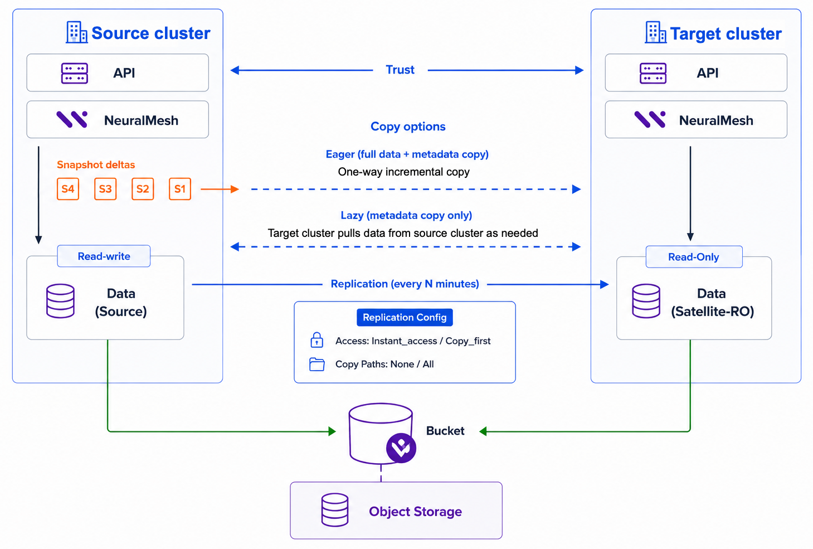

# Asynchronous replication

Asynchronous replication is a native, cluster-to-cluster filesystem replication solution that synchronizes data and metadata directly between a source cluster and a target cluster. Replication transfers incremental snapshot deltas of the source filesystem on a configurable interval, without disrupting client access to the source.

## When to use asynchronous replication

* **Disaster recovery**: Maintain a complete, incrementally updated filesystem copy on the target cluster. If the source cluster becomes unavailable, manually activate the target filesystem. Because replication is asynchronous, the Recovery Point Objective (RPO) is not zero: writes made after the last replicated snapshot may be lost, and recovery time depends on the manual failover procedure.
* **On-demand caching**: Make a large dataset visible on a remote cluster with limited capacity. The target receives the full filesystem metadata (directories and file hierarchy), and file data is retrieved from the source only when files are accessed. A typical example is a large capacity site that collects data and a smaller GPU cluster that hydrates only the files needed for AI training and inference.
* **Partial copy**: Replicate only selected directories proactively. Specify up to 10 directory paths with size limit of 2k to copy in full, while the rest of the namespace remains available on demand. Use this when a remote site needs local performance for specific projects only.

## Replication architecture

The following diagram shows the components and data flow for an asynchronous replication pair.

<figure><figcaption>
Asynchronous replication architecture
</figcaption></figure>

A replication pair connects a source filesystem with a target filesystem:

* **Trust relationship**: Before you can create a replication pair, the two clusters exchange tokens and establish mutual trust through their APIs.
* **Snapshot deltas**: On each replication interval, the system takes a snapshot of the source filesystem and transfers the incremental delta to the target. The minimum interval is 5 minutes.
* **Transport**: Replication uses the S3 infrastructure of the clusters as a transport layer. Data passes through the object store bucket but is not stored in it. Each cluster requires an S3 cluster, an S3 system user, a thin-provisioned object store tier, and an S3 bucket.
* **Source and target roles**: The source filesystem remains fully readable and writable throughout replication. The target filesystem is write-protected: only the replication process can write to it, while users and applications can read it. The target becomes writable only when you remove the write protection, for example, during a failover.

### Copy options

The replication policy determines how data reaches the target:

* **Full data copy**: All data and metadata are pushed from the source cluster to the target cluster as a one-way incremental copy. Use this for disaster recovery.
* **Metadata-only copy**: Only metadata is pushed from the source cluster to the target cluster. File data is pulled from the source cluster when accessed on the target cluster (hydration). Use this for on-demand caching.
* **Partial copy**: Selected directory paths are pushed in full. All other data behaves as metadata-only.

With a metadata-only or partial copy, you can also fetch or release the data of individual files on the target.

### Access strategy

The access strategy determines when users see each replicated snapshot on the target:

* **Instant access** (default): The snapshot is exposed immediately, and its data is visible under the `.snapshot` directory. Data is copied in the background and retrieved on demand when accessed.
* **Copy first**: The snapshot is applied only after its data and metadata are fully copied. Use this when workloads on the target require immediate local data access with full consistency.

## Size the target filesystem

Size the target filesystem relative to the SSD capacity of the target cluster, not by its absolute size. The system distributes replicated data evenly across the target cluster. When the target filesystem is small relative to the cluster SSD capacity, each component receives only a small share of the filesystem budget and reaches its internal capacity limit before the filesystem is full. Replication then slows down and can stall until space is freed or the filesystem is enlarged.

* Size the target filesystem to at least 5% of the target cluster SSD capacity. It then typically fills to about 85% before replication slows down.
* Size it to 20% or more to reach about 90%.
* Avoid sizing it at 1% or less. It can reach its limit at 60% to 70% full. Use this only for small or short-lived datasets.

The same filesystem size behaves differently on different clusters. A 5 GB filesystem can work well on a small cluster and stall immediately on a large one.

| Target filesystem size (% of cluster SSD capacity) | Expected usable fill level |
| -------------------------------------------------- | -------------------------- |
| 0.5%                                               | 61% to 65%                 |
| 1%                                                 | 69% to 73%                 |
| 2%                                                 | 76% to 79%                 |
| 5%                                                 | 83% to 85%                 |
| 10%                                                | 86% to 88%                 |
| 20%                                                | 89% to 90%                 |
| 50%                                                | 91% to 92%                 |
| 100%                                               | 92% to 93%                 |


If the target filesystem is smaller than about 0.1% of the target cluster SSD capacity, replication can stall from the first synchronization cycle, before any data is visibly transferred. Increase the filesystem size, or use a target cluster with less SSD capacity.



These values assume an untiered target filesystem with default settings. Datasets that consist mostly of very large files distribute slightly better and can fill a few percentage points higher.


If the target filesystem runs out of space during a full copy, the replication cycle stops and the pair moves to the error state. Run `weka fs tier s3` against the replication bucket for details. Replication resumes after you free space or enlarge the filesystem.


**INTERNAL, remove before publication. Gokul to review:** the fill-level table and the 0.1% stall warning are taken from the "Internal details for replication sizing" section of the Async replication UAT page. Confirm they are cleared for customer-facing documentation, and that the numbers still hold for the shipping 6.0 build rather than 6.0.0.254-nightly.


## Considerations


The RPO is not zero. Expect a lag of at least the replication interval (minimum 5 minutes). Writes that are not yet replicated at failover time are lost.


### Target filesystem

* The replication process creates the target filesystem. You cannot replicate to a filesystem that already exists.
* The target filesystem is write-protected while the replication pair is active. Only the replication process writes to it, and users and applications can read it.
* `weka fs update --access rw` is not supported on the target filesystem and can cause undefined behavior.
* Creating a manual snapshot on the target filesystem halts replication and moves the pair to the error state.
* Inode numbers on the target filesystem differ from the source filesystem.

To write to the target filesystem, hydrate all of its data, remove the replication pair, and contact the [Customer Success Team](../../support/getting-support-for-your-weka-system.md#contact-customer-success-team) to convert the filesystem to read-write.

### Failover

* Failover is manual. The system does not promote the target filesystem automatically, and it does not fail back.
* The target cluster does not fail over automatically if its S3 endpoint becomes degraded.

### Source filesystem

* Tiered data on the source is not replicated.

### Snapshots and scheduling

* The number of snapshots to keep ranges from 2 to 25. Retaining more snapshots requires more storage.
* Avoid a snapshot interval shorter than 30 minutes on a filesystem that also has a replication schedule. If snapshot deletion overlaps the start of a replication cycle, the target can fall further behind than the scheduled interval.
* The anchor snapshot remains after you remove the replication pair and the cluster peer.
* Resuming an aborted replication pair can fail and move the pair to the error state with a `SNAPSHOT_INCOMPATIBLE` message.

### Data copy and hydration

* Changing the policy from on-demand caching to a full or partial copy does not copy files that were never hydrated. Hydrate those files before you change the policy.
* A file that grows after you prefetch it with `weka fs replication fetch` stays unhydrated. Read the file directly to fetch the larger version from the source.
* Dehydration on the target filesystem starts when the disk occupied space reaches 95% and stops when it drops to 90%. To release data outside these thresholds, run `weka fs replication release`.

### Deployment

* Replication management is available through the CLI only.
* Replication is not supported on servers that run the NFS or SMB protocols, because the S3 protocol cannot be combined with NFS or SMB.
* Rotating S3 credentials with `weka cluster peer init --reinit` is not supported. Run `weka fs tier s3 update` on the target cluster with the new credentials.


**INTERNAL, remove before publication. Gokul to review:** these considerations come from the Async replication UAT page. Four of them could not be confirmed against `wekapp` `trunk/v6.0.0` or the shipped CLI, and stand on your authority. Confirm each:

* The target filesystem cannot be pre-created.
* Creating a manual snapshot on the target halts replication.
* The dehydration thresholds of 95% and 90%.
* The restriction on servers running NFS or SMB.

One conflict to settle. Your notes say source filesystems with tiering are not supported, but nothing in the 6.0 API rejects a tiered source, so this page keeps the existing wording, "Tiered data on the source is not replicated." Which is correct?

Two numbers in the UAT examples do not match the shipped code, so this page follows the code. `--snapshots-to-keep 250` and `100` exceed the documented range of 2 to 25 (`add.go`), and "up to 4 copy paths" conflicts with `MAX_COPY_PATHS = 10` (`replication_pair.d`). Separately, `replication_pairs.d` enforces that limit with `<` in one place and `<=` in another, so the real ceiling is 9 or 10 depending on the path taken. Worth a look.

