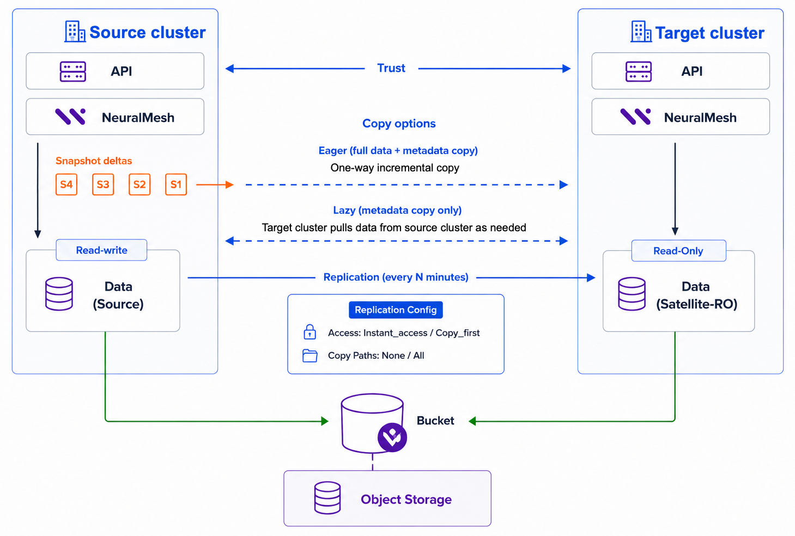

# Asynchronous replication

Asynchronous replication is a native, cluster-to-cluster filesystem replication solution that synchronizes data and metadata directly between a source cluster and a target cluster. Replication transfers incremental snapshot deltas of the source filesystem on a configurable interval, without disrupting client access to the source.

The main decision is how much data the target holds: the whole filesystem, only its metadata, or selected directories. Set this per pair with `--copy-path`, and change it later without recreating the pair. A full copy needs a target at least the size of the source. A selective copy can be much smaller, sized for the working set.

## When to use asynchronous replication

### Full data copy

Maintain a complete, incrementally updated filesystem copy on the target cluster. If the source cluster becomes unavailable, manually activate the target filesystem. Because replication is asynchronous, the target lags the source by at least the replication interval: writes made after the last replicated snapshot may be lost, and recovery time depends on the manual failover procedure.

* **Disaster recovery with a replication interval requirement**: The system raises an alert whenever a replication cycle runs past its interval. Use the alert history to verify replication interval compliance. See [Monitor replication interval compliance](manage-asynchronous-replication.md#monitor-replication-interval-compliance).
* **Ingest site to central compute**: Collection sites replicate continuously to a central cluster that runs the compute — for example, device data feeding a central GPU cluster for training. No shipping media, and no compute at every collection site.

### Selective copy - metadata only copy

Make a large dataset visible on a remote cluster that has far less capacity than the source. The target receives the full filesystem metadata (directories and file hierarchy), and file data is retrieved from the source only when files are accessed (hydration).

* **Remote working set**: Users at a remote site browse the entire namespace but hydrate only the projects in active use. Size the target for the working set, not the full dataset.
* **Bursting to a remote or cloud cluster**: Present the namespace on a cluster that holds none of the data yet. Jobs pull only the files they actually read.

### Selective copy - critical paths

Replicate selected directories proactively while the rest of the namespace remains available on demand. Specify up to 10 directory paths. Each path can be up to 1,023 characters long, and all paths together up to 2,048 characters. Use this when a remote site needs local performance for specific projects and on-demand access to everything else.

* **Pre-staged projects**: Add a project directory to the copy path set before the work starts, so its data is already local when users arrive. See [Modify the replication policy](manage-asynchronous-replication.md#modify-the-replication-policy).

## Replication architecture

The following diagram shows the components and data flow for an asynchronous replication pair.

<figure><figcaption>
Asynchronous replication architecture
</figcaption></figure>

A replication pair connects a source filesystem with a target filesystem:

* **Cluster link**: Before you can create a replication pair, link the two clusters. One `weka cluster link add` command, run on either cluster, creates the link on both. The link authenticates with a cluster admin account on the other cluster, pins its TLS certificate, and carries replication in both directions. Each replication pair replicates in one direction, from its source to its target.
* **Snapshot deltas**: On each replication interval, the system takes a snapshot of the source filesystem and transfers the incremental delta to the target. The minimum interval is 5 minutes.
* **Transport**: Replication uses the S3 infrastructure of the clusters as a transport layer. Data passes through the S3 service of each cluster, over a dedicated replica route.
* **Source and target roles**: The source filesystem remains fully readable and writable throughout replication. The target filesystem is write-protected: only the replication process can write to it, while users and applications can read it. The target becomes writable only when you remove the write protection, for example, during a failover.

### Copy options

The replication policy determines how data reaches the target:

* **Full data copy**: All data and metadata are pushed from the source cluster to the target cluster as a one-way incremental copy. Use this for disaster recovery.
* **Selective copy - metadata only copy**: Only metadata is pushed from the source cluster to the target cluster. File data is pulled from the source cluster when accessed on the target cluster (hydration). Use this for on-demand caching.
* **Selective copy - critical paths**: Selected directory paths are pushed in full. All other data behaves as metadata-only.

With selective copy, a file whose data blocks are still on the source is in _lazy mode_: the file is visible on the target, and its data is pulled from the source when the file is accessed. To control this per file, use `weka fs replication fetch` to pull a file's data to the target, and `weka fs replication release` to return it to lazy mode. See [Manage file hydration on the target](manage-asynchronous-replication.md#manage-file-hydration-on-the-target).

### Access strategy

The access strategy determines when users see each replicated snapshot on the target:

* **Instant access** (default): The snapshot is exposed immediately, and its data is visible under the `.snapshot` directory. Data is copied in the background and retrieved on demand when accessed.
* **Copy first**: The snapshot is applied only after its data and metadata are fully copied. Use this when workloads on the target require immediate local data access with full consistency.

## Size the target filesystem

Two constraints apply. Size for whichever is larger.

**By copy option:**

A full data copy needs a target at least the size of the source filesystem.

A selective copy can be far smaller. Size it for the working set, which includes the directories named in `--copy-path`, plus headroom.

A working-set target runs at a high fill level by design. When it approaches full, the system returns hydrated data to lazy mode (dehydration). Keep the working set below the dehydration threshold, or the target re-fetches data it has just released. See [Data copy and hydration](./#data-copy-and-hydration).

**By target cluster capacity:**

Size the target filesystem to at least 5% of the target cluster SSD capacity.

The same filesystem size behaves differently on different clusters. A 5 GB filesystem can work well on a small cluster but stall immediately on a large one.


If the target filesystem is smaller than about 1% of the target cluster SSD capacity, replication can stall from the first synchronization cycle, before any data is visibly transferred. Increase the filesystem size, or use a target cluster with less SSD capacity.


If the target filesystem runs out of space during a full data copy, the replication cycle waits and retries until space is available. The pair stays in the `RUNNING` state, and its **Current Status** in `weka fs replication` ends with `(stuck: Target filesystem is full)`. Free space on the target filesystem or increase its size, and the cycle continues. While the cycle runs past its interval, the system raises the replication interval alerts.

With a selective copy, file data that does not fit on the target stays in lazy mode and is read from the source when accessed.

## Considerations


Replication is asynchronous. Expect a lag of at least the replication interval. The target is always at least 5 minutes behind the source, and writes made after the last replicated snapshot are lost on failover.


### Target filesystem

* The replication process creates the target filesystem during the first replication cycle. You cannot replicate to a filesystem that already exists.
* The target filesystem is created in the filesystem group that has the same name as the group of the source filesystem. That group must already exist on the target cluster.
* The target filesystem is write-protected while the replication pair is active. Only the replication process writes to it, and users and applications can read it.
* Run `weka fs update --access rw` on the target filesystem only after you remove the replication pair.
* Creating a manual snapshot on the target filesystem halts replication and moves the pair to the error state.
* Inode numbers on the target filesystem can differ from the source filesystem. They stay the same across replication cycles.

To write to the target filesystem, hydrate all of its data, remove the replication pair, and then run `weka fs update <name> --access rw`.

### Failover

* Failover is manual. The system does not promote the target filesystem automatically, and it does not fail back. To return to the original source cluster, see [Fail back to the original source cluster](manage-asynchronous-replication.md#fail-back-to-the-original-source-cluster).
* The target cluster does not fail over automatically if its S3 endpoint becomes degraded.

### Source filesystem

* Tiered data on the source is not replicated.

### Snapshots and scheduling

* The number of snapshots to keep ranges from 2 to 25. Retaining more snapshots requires more storage.
* Avoid a snapshot interval shorter than 30 minutes on a filesystem that also has a replication schedule. If snapshot deletion overlaps the start of a replication cycle, the target can fall further behind than the scheduled interval.
* The **anchor snapshot** is the last live snapshot in a replication pair. It remains on the filesystem after you remove the replication pair and the cluster link, and you cannot delete it.
* Resuming an aborted replication pair can fail and move the pair to the error state with a `SNAPSHOT_INCOMPATIBLE` message. This is a terminal error. Replication does not retry the pair, and recovering it requires manual intervention.

### Data copy and hydration

* Changing the policy from on-demand caching to Full data copy or Selective copy - critical paths does not copy files that were never hydrated. Hydrate those files before you change the policy.
* Dehydration on the target filesystem starts when the disk occupied space reaches 95% and stops when it drops to 90%. To release data outside these thresholds, run `weka fs replication release`.

### Pair topology

* A filesystem can belong to one replication pair only.
* A target filesystem cannot be the source of another pair, so cascading replication (A to B to C) is not supported.

### Scale limits

* A cluster can have at most **8 cluster links**.
* A cluster can be the source of at most **8 replication pairs**. The limit counts only the pairs that replicate from the cluster.
* A filesystem can have at most **8 replica anchors**.

In a fan-in topology, where several clusters replicate to one target, the target is bounded by its 8 cluster links.

### Deployment

* Replication management is available through the CLI only.
* Replication is not supported on servers that run the NFS or SMB protocols, because the S3 protocol cannot be combined with NFS or SMB.
* Selective copy - critical paths (`--copy-path` with specific directories) requires a Data Services container on the target cluster.
