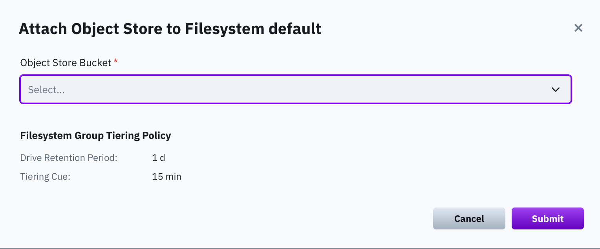
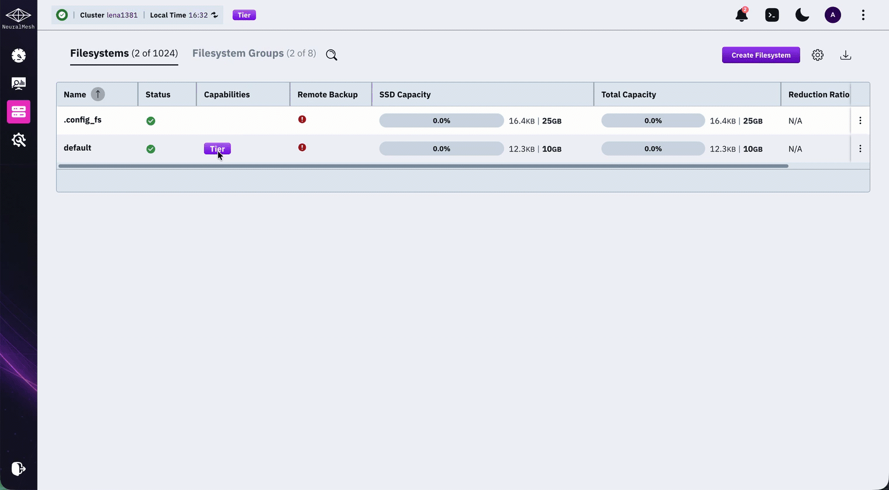

# Attach or detach object store bucket using the GUI

## Attach object store bucket to a filesystem

Attach an object store bucket to extend a filesystem with object storage.

**Before you begin**

Ensure an object store bucket is available.

**Procedure**

1. From the menu, select **Manage > Filesystems**.
2. For the filesystem, select the three dots, then select **Attach Object Store Bucket**.
3. In **Attach Object Store Bucket**, select an object store bucket, then select **Submit**.

## Detach object store bucket from a filesystem

Detach an object store bucket from a filesystem. The system migrates its data to a writable bucket or SSD capacity.

**Procedure**

1. From the menu, select **Manage > Filesystems**.
2. Select the filesystem, then select the tier to detach.
3. In the right-side **Detach Object Store Bucket** dialog, select **Detach**.
4. If two buckets are attached, detach only the read-only bucket. The system migrates its data to the writable bucket.
5. In the confirmation message, select **Confirm**.

6. If this is the only bucket on a tiered filesystem, select a capacity option:
   * Increase the SSD capacity to match the current total capacity.
   * Reduce total capacity to match available SSD or used capacity.
   * Configure a different capacity.


The used capacity limits any capacity reduction. Un-tiering copies data from the bucket to SSD capacity. This process can take time. For active filesystems, allow capacity for additional writes.


7. Select the option that best meets your needs, and select **Continue**.
8. In the confirmation message, select **Detach**.
