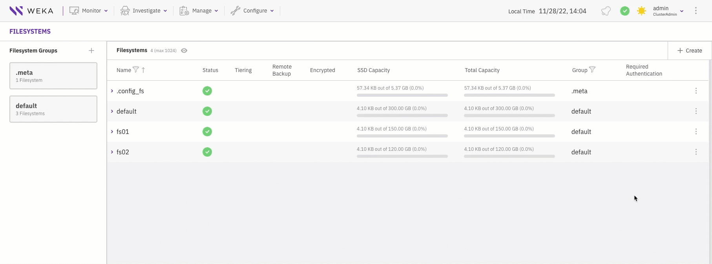
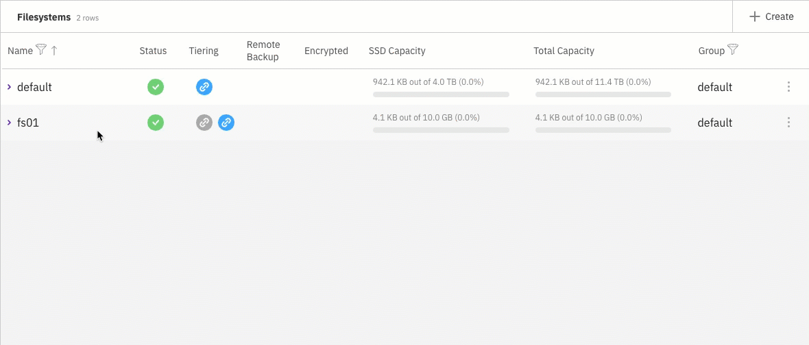
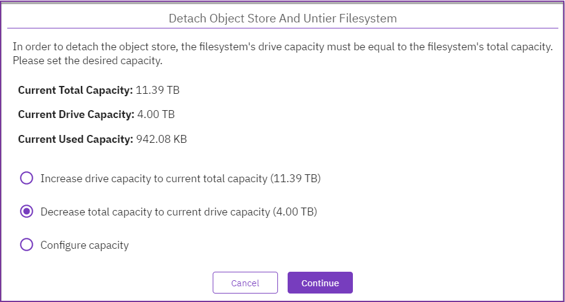

# Attach or detach object store bucket using the GUI

Using the GUI, you can:

* [Attach object store bucket to a filesystem](attaching-detaching-object-stores-to-from-filesystems.md#attach-or-detach-object-store-bucket-to-a-filesystem)
* [Detach object store bucket from a filesystem](attaching-detaching-object-stores-to-from-filesystems.md#detach-object-store-bucket-from-a-filesystem)

## Attach object store bucket to a filesystem

**Before you begin**

Verify that an object store bucket is available.

**Procedure**

1. From the menu, select **Manage > Filesystems**.
2. On the **Filesystem** page, select the three dots on the right of the filesystem that you want to attach to the object store bucket. Then, from the menu, select **Attach Object Store Bucket**.
3. On the Attach Object Store Bucket dialog, select the relevant object store bucket.

## Detach object store bucket from a filesystem

Detaching a local object store bucket from a filesystem migrates the filesystem data residing in the object store bucket either to the writable object store bucket (if one exists) or to the SSD.

**Procedure**

1. From the menu, select **Manage > Filesystems**.
2. On the **Filesystem** page, select the filesystem from which you want to detach the object store bucket.
3. From the **Detach Object Store Bucket** dialog, select **Detach.**\
   If the filesystem is attached to two object store buckets (one is read-only, and the other is writable), you can detach only the read-only one. The data of the detached object store bucket is migrated to the writable object store bucket.
4. In the message that appears, to confirm the detachment, select **Yes**.

5. If the filesystem is tiered and only one object store is attached, detaching the object store bucket opens the following message:

6. Object store buckets usually expand the filesystem capacity. Un-tiering of a filesystem requires adjustment of its total capacity. Select one of the following options:
   * Increase the SSD capacity to match the current total capacity.
   * Reduce the total filesystem capacity to match the SSD or used capacity (the decrease option depends on the used capacity).
   * Configure a different capacity.


Used capacity must be taken into account. Un-tiering takes time to propagate the data from the object store to the SSD. When un-tiering an active filesystem, to accommodate the additional writes during the detaching process, it is recommended to adjust to a higher value than the used capacity.


7. Select the option that best meets your needs, and select **Continue**.
8. In the message that appears, select **Detach** to confirm the action.
