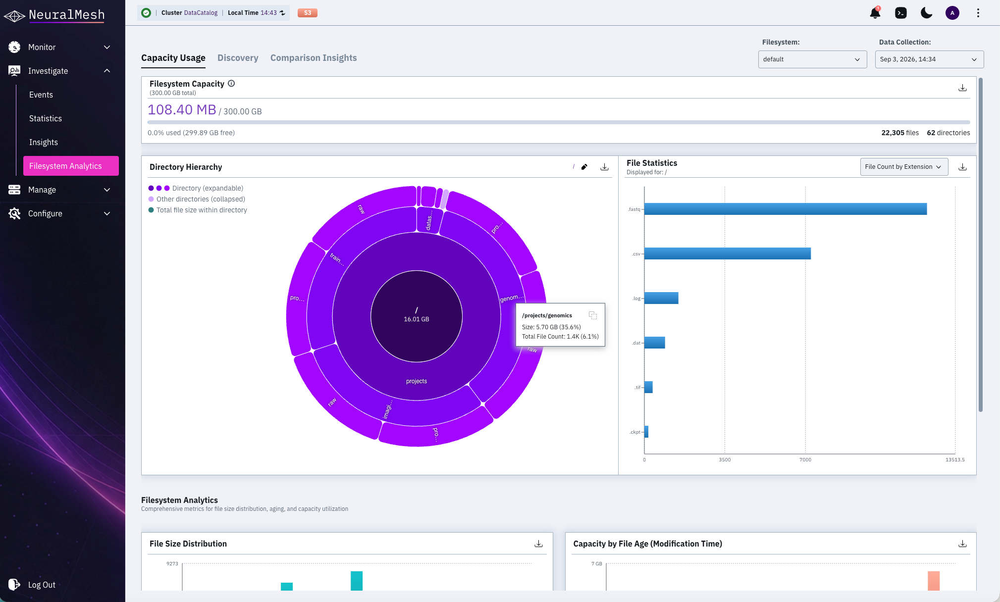
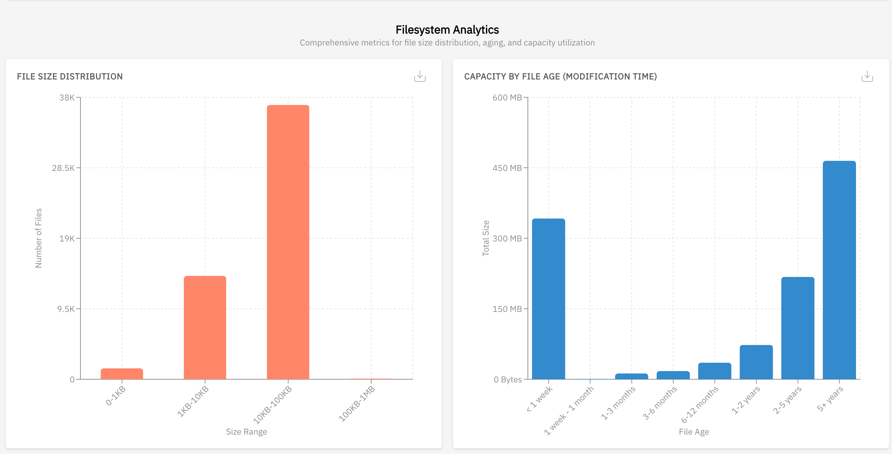
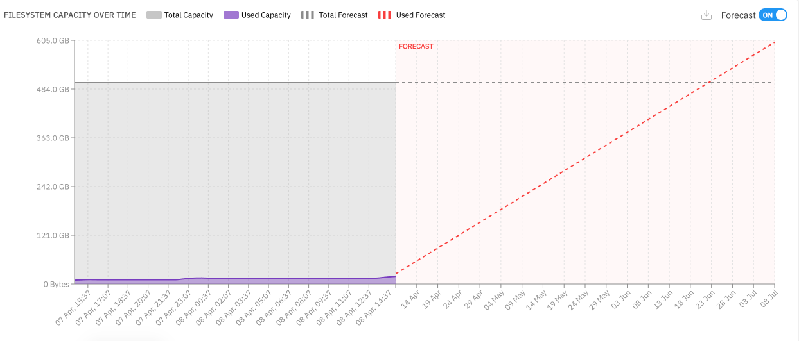
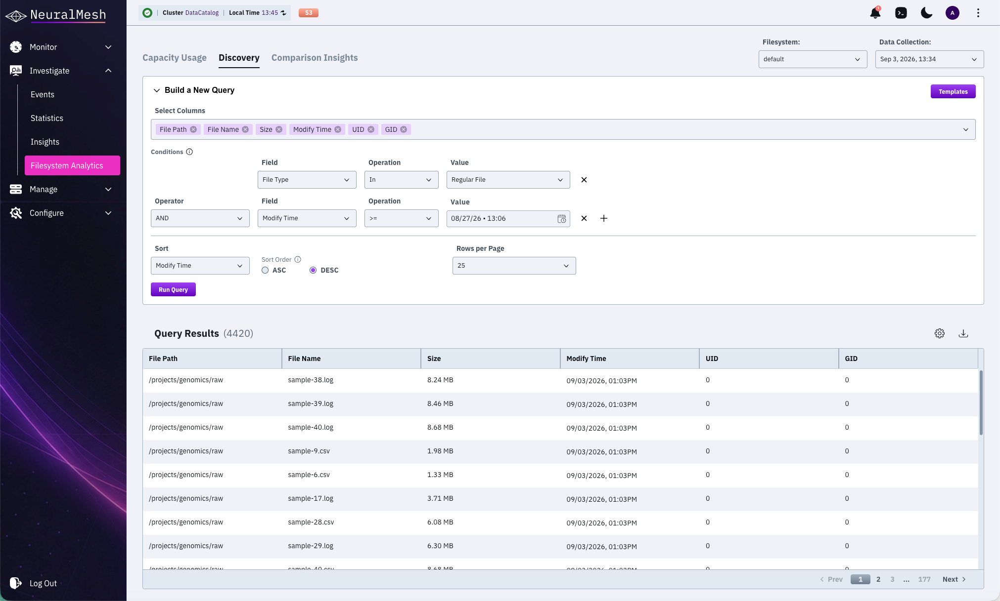
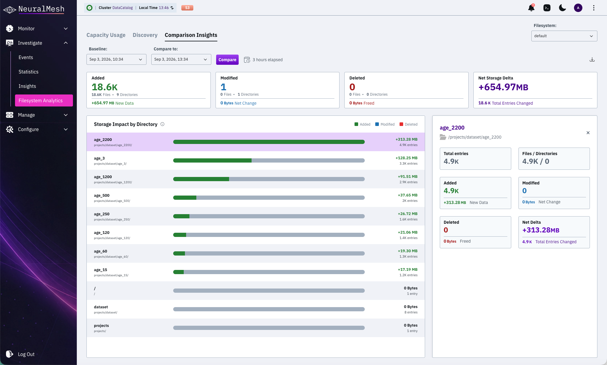
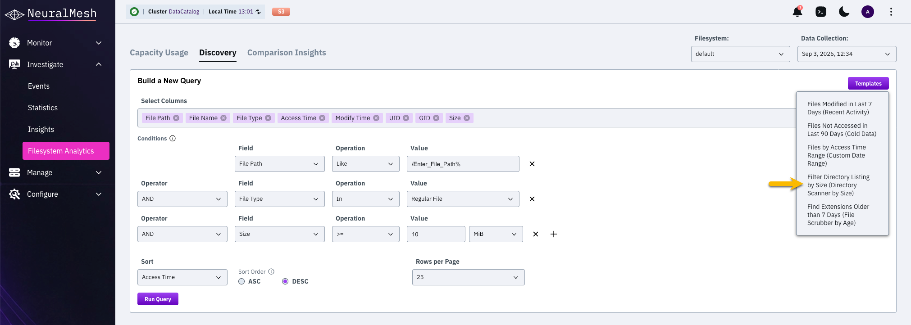
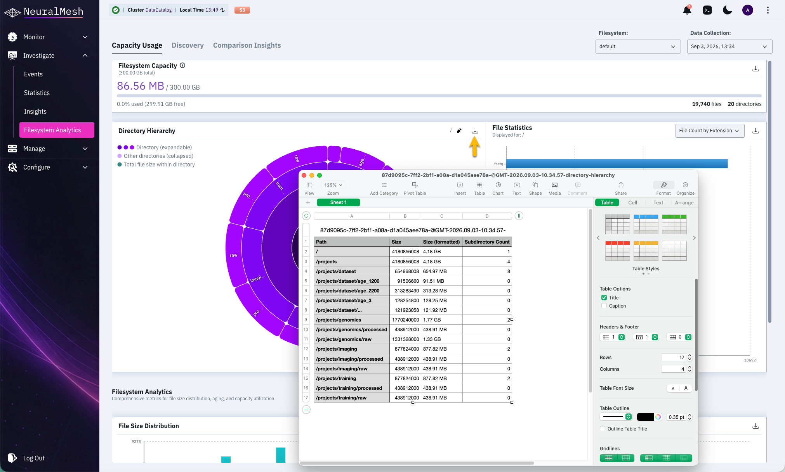

# Analyze storage distribution

Explore filesystem metadata to identify usage patterns and discover specific data sets through the Filesystem Analytics dashboard. Powered by the data catalog, these tools provide macro-level insights and granular discovery to eliminate reliance on external capacity monitoring systems.

* **Analyze capacity usage:** Explore the directory hierarchy and identify storage consumption.
* **Visualize file distribution:** Review file statistics by extension, user, or group.
* **Monitor storage distribution and trends:** Observe how files are distributed by size and age, and track capacity growth.
* **Search files with discovery queries:** Build custom queries to locate files based on metadata attributes.
* **Use discovery templates:** Apply pre-defined query patterns for common analysis tasks.
* **Export catalog data:** Save capacity reports and query results as CSV or JSON files.
* **Compare storage activity:** Compare added, modified, and deleted files and directories between two points in time using the Comparison Insights tab.

## Analyze capacity usage

Explore the distribution of storage across different directory levels to identify large data sets and review high-level filesystem metrics.

<figure><figcaption>
Capacity usage: Sunburst and File Statistics charts
</figcaption></figure>

**Before you begin**

Verify that the target filesystem is indexed by the data catalog.

**Procedure**

1. Select **Investigate > Filesystem Analytics**.
2. Select the **Capacity Usage** tab.
3. Select the target filesystem from the **Filesystem** dropdown menu.
4. Select a specific point in time from the **Data Collection** dropdown menu.
5. To display the chart from a custom file path, click the pencil icon and enter the desired path.\
   All chart information will relate to this file path.
6. Review the high-level metrics:
   * **Filesystem Capacity:** Displays used and total provisioned space. Hover over the info icon to view the actual block-level occupancy.
   * **File and Directory counts:** Displays the total number of files and directories indexed in the filesystem.
7. Interact with the sunburst chart to navigate the directory hierarchy:
   * Select a sector to zoom into a specific directory.
   * Hover over a sector to view the directory path, total size, and percentage of the total filesystem capacity. Dark purple sectors represent directories, while light purple sectors represent individual files or groups of smaller items.
   * Select the center of the chart to move up one directory level.
8. Use the **File Statistics** chart to view data distribution.
   1. Select an option from the dropdown menu:
      * File Count by Extension
      * Usage Statistics by Group
      * Usage Statistics by User
   2.  Select a bar, then select **Deep Dive** to explore the individual files within that segment.

       **Deep Dive** appears only after you select a bar. It leaves the **Capacity Usage** report, opens **Discovery** with the relevant query parameters populated, and runs the query. The results appear without further action.

       To refine the results, expand **Build a New Query**, adjust the conditions or the **Sort** and **Sort Order** settings, and select **Run Query**. Sorting is set in the query panel; the result table headers are not sort controls.

       The same **Deep Dive** action is available on the **File Size Distribution** and **Capacity by File Age** charts described below.

## Monitor storage distribution and trends

Observe how files are distributed by size and age, and track capacity growth over time to forecast future storage needs.

<figure><figcaption>
File Size Distribution and Capacity by File Age charts
</figcaption></figure>

<figure><figcaption>
Filesystem Capacity Over Time and Forecast chart
</figcaption></figure>

**Before you begin**

Access the **Capacity Usage** tab and scroll to the **Filesystem Analytics** section.

Scroll down to view additional distribution metrics.

**Procedure**

1. Review the **File Size Distribution** chart:
   * Identify the number of files within specific size ranges (for example: 1MB-10MB).
   * Hover over a bar to view the exact File Count for that range.
   * Select a bar, then select **Deep Dive** to open **Discovery** with that size range applied as a query condition.
2. Review the **Capacity by File Age** chart:
   * Identify the volume of data based on the time elapsed since the last modification (for example: < 1 week or 5+ years).
   * Hover over a bar to view the Total Size of the files in that age category.
   * Select a bar, then select **Deep Dive** to open **Discovery** with that age range applied as a query condition.
3. Analyze the **Filesystem Capacity Over Time** chart:
   * Observe historical trends for Total Capacity and Used Capacity.
   * Toggle the **Forecast** switch to ON to view projected storage needs. The chart displays Total Forecast and Used Forecast lines based on current data patterns. This requires at least 24 hours of historical snapshot data.
4. Select the **Download** icon in the top right corner of any chart to export the specific chart data as a CSV file.

## Search files with discovery queries

Filter and locate specific files by defining complex metadata conditions such as file size, access time, or owner.

<figure><figcaption>
Discovery query
</figcaption></figure>

**Before you begin**

Access the **Discovery** tab within the **Filesystem Analytics** view.

**Procedure**

1. Select the **Filesystem** and **Data Collection** date.
2. In the **Show** section, select the columns to display in the results table, for example: File Name, Size, and Created At.
3. In the **Conditions** section, define the search criteria:
   * Select a metadata field (for example: File Size, Access Time, or UID).
   * Select an operator (for example: In, Between, >, or Regular File).
   * Enter or select the value for the condition.
4. Select the **+** icon to add more conditions. Use the Operator dropdown to select AND or OR logic between conditions.
5. In the **Sort** section, select a field and the sort order (ASC or DESC).
6. Set the number of **Rows per Page** to display.
7. Select **Run Query**.

## Compare storage insights

Compare a filesystem between two points in time to identify what changed and which directories drove the change.

<figure><figcaption>
Compare storage insights
</figcaption></figure>

**Before you begin**

Verify that the target filesystem is indexed by the data catalog and has at least two point-in-time snapshots available.

**Procedure**

1. Select **Investigate > Filesystem Analytics**.
2. Select the **Comparison Insights** tab.
3. Select the target filesystem from the **Filesystem** dropdown menu.
4. Select the **Baseline** and **Compare to** points in time. The elapsed time between the two points appears next to the selectors.
5. Select **Compare** to run the comparison.
6. Review the summary cards. Each card shows the number of affected files and directories, plus the associated capacity:
   * **Added:** New files and directories, with the total size of new data.
   * **Modified:** Changed files and directories, with the net size change.
   * **Deleted:** Removed files and directories, with the capacity freed.
   * **Net Storage Delta:** The overall capacity change and the total number of entries changed.
7. Review the **Storage Impact by Directory** chart to identify which directories contributed most to the change. Each bar is color-coded by change type (added, modified, or deleted) and shows the net capacity delta and number of changed entries.
8. Select a directory row to view its detailed breakdown, including added, modified, and deleted capacity, net delta, total entries changed, and the number of files and directories in that path.
   * Use the copy icon next to a directory path. Paste the path into **Discovery** to analyze its directory structure without retyping it.
9. Use the download icon to export the comparison results as a CSV file.

## Apply discovery query templates

Use pre-configured templates to quickly identify common file categories like cold data or recently modified files.

<figure><figcaption>
Discovery query templates
</figcaption></figure>

**Before you begin**

Access the **Discovery** tab within the **Filesystem Analytics** view.

**Procedure**

1. Select **Templates** in the **Build a New Query** section.
2. Select a template from the list, for example: Files Not Accessed in Last 90 Days (Cold Data).
3. Review the auto-populated conditions.
4. Modify the values if required, for example: change the date range or the file size threshold.
5. Select **Run Query**.

**Query results handling**

The query results table supports full filesystems exploration through pagination. Navigate across pages to review the complete result set.

The GUI exports up to 10,000 records per query. To retrieve more records, use the REST API. See [#catalog](../../getting-started-with-weka/weka-rest-api-and-equivalent-cli-commands.md#catalog "mention").

## Export catalog data

Save the results of a capacity analysis or a discovery query for external reporting or further processing.

<figure><figcaption></figcaption></figure>

**Before you begin**

Generate a visualization in the **Capacity Usage** tab or run a query in the **Discovery** tab.

**To export capacity data:**

1. Navigate to the **Capacity Usage** tab.
2. Select the **Download CSV** icon located above the sunburst or distribution charts.

The exported CSV reflects the current visualization scope. It includes the top-level directory statistics displayed in the chart. The “**...**” entry represents an aggregated summary of additional directories outside the top view.

**To export discovery results:**

1. Navigate to the **Discovery** tab.
2. Select **Export** above the results table.
3. Select the preferred format and scope:
   * **CSV (current page results)**
   * **JSON (current page results)**
   * **CSV (all results)**
   * **JSON (all results)**

Retrieve the file from the default downloads folder of the browser.
