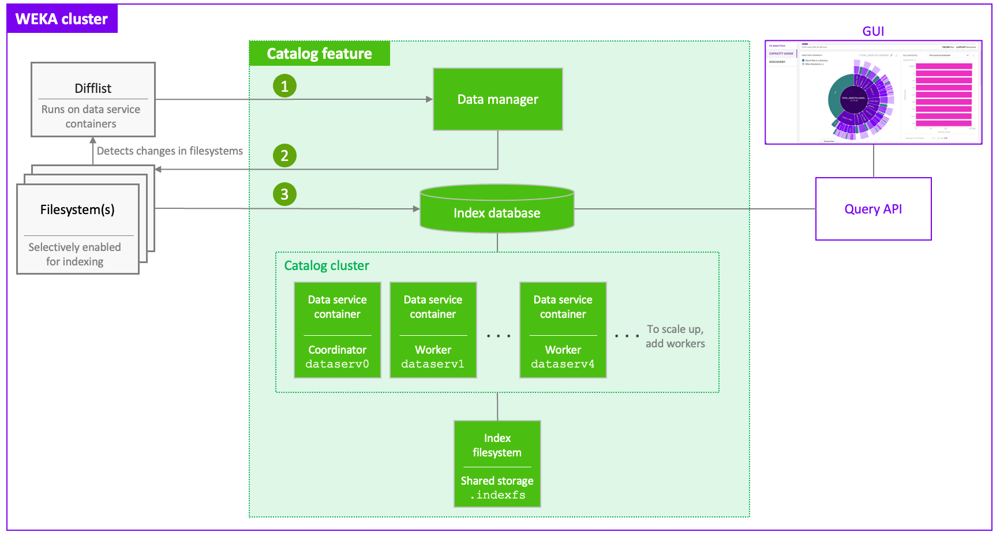

# Configure data catalog

## Data catalog architecture

Gain insights into how data catalog components collaboratively function to index and query filesystem metadata at scale. By deploying dedicated catalog services, the system concurrently scans modified files and stores searchable metadata in a centralized index database.

#### Catalog components

The catalog feature integrates several components within the WEKA cluster to manage and query metadata:

* **Data service containers:** The compute units that power catalog services. The catalog requires a minimum of five data service containers: one serves as the coordinator and the others function as workers.
* **Difflist:** A service that runs on the data service containers to detect changes in the filesystems.
* **Data manager:** The component that manages rolling snapshots used by the difflist to track data changes.
* **Index database:** The central repository that receives indexed fields and stores results for metadata queries.
* **Index filesystem (.indexfs):** A dedicated filesystem that stores catalog index data.
* **Query API and GUI:** Interfaces used to access and visualize the indexed metadata.

**Related topics**

[set-up-a-data-services-container-for-background-tasks.md](../../operation-guide/background-tasks/set-up-a-data-services-container-for-background-tasks.md "mention")

[#track-filesystem-changes-with-the-difflist-rest-api](../snapshots/#track-filesystem-changes-with-the-difflist-rest-api "mention")

#### Catalog workflow

The data catalog maintains synchronization through a structured three-step process:

1. **Snapshot management:** The Data manager creates rolling snapshots of the filesystems to provide a reference point for the Difflist.
2. **Parallel scanning:** The system identifies changed files and scans them in parallel across the data service containers to maintain high performance.
3. **Indexing and storage:** The service indexes common metadata fields and sends the results to the Index database. This data is stored on the **index filesystem** for long-term retention and querying.

<div data-with-frame="true"><figure><figcaption><p>Catalog architecture</p></figcaption></figure></div>

## Deploy the catalog services

Configure the infrastructure and filesystems required to activate catalog services for your data.


**INTERNAL, remove before publication. TBD (Docs):** Two sample-output blocks on this page (the `weka catalog cluster status` examples) still show legacy typed identifiers such as `FSId<4>` and `HostId<23>`. 6.0 prints bare integers, so these read as `4` and `23`. They could not be recaptured here: neither lab cluster has a catalog cluster configured, and standing one up creates an index filesystem and coordinator. Recapture on a cluster where the data catalog is already in use.


#### Before you begin

* The catalog services require at least five backend servers. Ensure each server has 32 GB for the data catalog service plus 5.5 GB for the data services, and connectivity on port 14400.
* Each server that runs catalog services must also run a frontend container. The catalog feature requires a frontend container and a data service container on the same server.
* For optimal operation, ensure a minimum of 500 GB of available storage for the index filesystem (`.indexfs`). See [#sizing-guidelines](configure-data-catalog.md#sizing-guidelines "mention").

#### Procedure

1. **Create the configuration filesystem:** New clusters do not create `.config_fs` by default. Create it if it does not already exist. Existing clusters already include this filesystem.

```bash
weka fs add .config_fs 50GB --fs-group default
```


For details about the .config\_fs sizing, see the [Dedicated filesystem requirement for cluster-wide persistent protocol configurations](../../additional-protocols/additional-protocols-overview.md#dedicated-filesystem-requirement-for-cluster-wide-persistent-protocol-configurations).


2. **Create the index filesystem:** Add the `.indexfs`.

<pre class="language-bash"><code class="lang-bash"><strong>weka fs add .indexfs default 500GB
</strong></code></pre>

3. **Deploy data service containers:**

Run the following command on each server, whether dedicated backend servers or existing backend servers:

```bash
sudo weka local setup container \
  --name dataservN \
  --base-port 14400 \
  --join-ips <CLUSTER_LEADER_IP> \
  --only-dataserv-cores \
  --allow-mix-setting
```

You can use the same name on all servers or increment it across servers (for example, `dataserv0`, `dataserv1`, and so on).<br>

**Dedicated backend servers only:** To avoid impact on client workload I/Os, also run the following command on each dedicated backend server to add a frontend container (existing backend servers already contain frontend containers):


```bash
sudo weka local setup container \
   --name frontend0 \
   --cores 1 \
   --frontend-dedicated-cores 1 \
   --join-ips <CLUSTER_LEADER_IP> \
   --net <INTERFACE>
```


4. Set **global configuration of data service** container by running the following command on any of the cluster servers.


```bash
weka dataservice global-config set --config-fs .config_fs
```


5. **Initialize the catalog services:**
6.  Add the newly created `dataserv` container IDs to the catalog cluster. You can specify the container IDs or provide the `--all-servers` flag.

    ```bash
    weka catalog cluster add .indexfs --containers <ID1>,<ID2>,<ID3>,<ID4>,<ID5>
    #or
    weka catalog cluster add .indexfs --all-servers
    ```
7.  Wait for 30 seconds and then check if the catalog services are active:

    ```bash
    weka catalog cluster status
    ```

    Output example:

    ```bash
    SERVICE NAME         CONTAINER ID  HOSTNAME  CONTAINER  IP             STATUS  ROLE
    catalog-coordinator  23            sphere-3  dataserv0  10.121.43.123  active  COORDINATOR
    catalog-worker-2     25            sphere-2  dataserv0  10.121.74.183  active  WORKER
    catalog-worker-4     22            sphere-4  dataserv0  10.121.101.84  active  WORKER
    catalog-worker-5     21            sphere-5  dataserv0  10.121.10.21   active  WORKER
    catalog-worker-6     24            sphere-6  dataserv0  10.121.97.143  active  WORKER
    ```
8. **Enable indexing:**
   1.  Enable the catalog feature on your specified filesystem. Replace `fs-name` with the name of the filesystem you want to index.

       ```bash
       weka fs update <fs-name> --index-enabled true
       ```
   2.  View the filesystem listing as seen from the catalog perspective:

       ```bash
       weka catalog fs status
       ```

       Output example:

       ```bash
       FILESYSTEM   INDEXING  HAS METADATA  SNAPSHOTS  LATEST SNAPSHOT         OLDEST SNAPSHOT         LAST INGEST  LAST ERROR
       catalogtest  Enabled   Yes           7          cat-ingest-3.2604061605  cat-ingest-3.2604061553 Never       -
       fs1          Enabled   Yes           6          cat-ingest-5.2604061605  cat-ingest-5.2604061555 Never       -
       ```
   3.  Verify catalog configuration:

       ```bash
       weka catalog config show
       ```

       Output example:

       ```bash
       Indexing enabled: true
       Index filesystem: .indexfs (ID: FSId<4>)
       Coordinator: test-catalog (ID: HostId<23>)
       IP: 10.121.43.123
       Port: 14511
       Indexing interval: 1d 0:00:00h
       Retention period: 30d 0:00:00h
       Max ingest tasks: 1
       ```
9.  **Configure index interval and snapshot retention period:** Adjust these settings to match your workload needs. They dictate how often data is indexed and the duration for which point-in-time snapshots are kept. By default, the `--index-interval` is set to 1 day, and the `--retention-period` is 30 days. Use the following command to update these configurations:

    ```shell
    weka catalog config update --index-interval <time> --retention-period <time>
    ```

    Supported time units:

    * `--index-interval`: Accepts values in minutes, hours, or days (for example: `30m`, `2h`, `1d5h` , `3d8h30m`, `7d`). Valid range: `30m`–`7d`.
    * `--retention-period`: Accepts values in minutes, hours, or days (for example: `30d, 45d, 90d, 180d or 366d`). Must be at least `--index-interval` and no more than `366d`.


The duration of the initial Data Catalog snapshot creation is proportional to the total number of objects (files and directories) in the filesystem. For approximate baseline and differential snapshot creation times, refer to **Sizing for baseline indexing time** below. The Data Catalog UI remains unpopulated until the first snapshot has been successfully created.


### Troubleshoot catalog deployment issues

Resolve issues related to container deployment and catalog services operations by following these resolution steps.

#### Troubleshoot container deployment

<details>

<summary>Container with name already exists</summary>

**Resolution:**

1. If a container exists but is not functional, remove it manually by running `weka local stop <name>` and `weka local rm <name>`.
2. Re-run the script after removal.

</details>

<details>

<summary>Container not found after creation</summary>

**Resolution:** The system waits 30 seconds and retries after 15 seconds. If containers do not appear in `weka cluster container`, verify the following:

* Network connectivity to the cluster leader process.
* The accuracy of the `--join-ips` value.

</details>

#### Troubleshoot catalog cluster operations

<details>

<summary>Catalog cluster status shows inactive</summary>

**Resolution:**

1. Check the cluster state:

```bash
weka catalog cluster status
```

2. Verify that all data service containers are in the `UP` state:

```bash
weka cluster container
```

3. For any failed container, SSH to the server and restart it:

```bash
weka local stop <name>
weka local start <name>
```

</details>

<details>

<summary>Indexing does not progress</summary>

**Resolution:**

1. Verify indexing is enabled by checking the `Indexing` column in `weka catalog fs status`.
2. Check the index interval with `weka catalog config show`.
3. Ensure the catalog services have a sufficient number of servers configured and running with active status.

</details>

<details>

<summary>Catalog tasks are stuck or slow</summary>

**Resolution:**

1. Run `weka cluster task --show-catalog` to view the progress of each ingestion phase.
2. Identify the phase with the longest elapsed time and investigate resource availability on those specific containers.

</details>

### Catalog diagnostic command reference

To monitor and diagnose the health of the catalog cluster, use these CLI commands. Review the example outputs to understand the expected results for these diagnostic commands.

#### Display catalog cluster status

`weka catalog cluster status`

Check the overall health of the catalog services. Ensure each container displays a status of `active` during normal operation. Use this as the initial step when troubleshooting catalog-related issues.

<details>

<summary>Example</summary>

```bash
$ weka catalog cluster status
SERVICE NAME         CONTAINER ID  HOSTNAME  CONTAINER  IP             STATUS  ROLE
catalog-coordinator  23            sphere-3  dataserv0  10.121.43.123  active  COORDINATOR
catalog-worker-2     25            sphere-2  dataserv0  10.121.74.183  active  WORKER
catalog-worker-4     22            sphere-4  dataserv0  10.121.101.84  active  WORKER
catalog-worker-5     21            sphere-5  dataserv0  10.121.10.21   active  WORKER
catalog-worker-6     24            sphere-6  dataserv0  10.121.97.143  active  WORKER
```

</details>

#### List cluster containers

`weka cluster container`

This section details all containers within the cluster, including data service (`dataserv`) containers. It provides information on the status, host, and resource allocation for each container. This is useful for verifying that all `dataserv` containers are running and properly registered.

<details>

<summary>Example</summary>


```bash
$ weka cluster container
CONTAINER ID  HOSTNAME         CONTAINER  IPS             STATUS  REQUESTED ACTION  RELEASE                                      FAILURE DOMAIN  CORES  MEMORY   UPTIME     LAST FAILURE  REQUESTED ACTION FAILURE
0             sphere-0  drives0     10.121.113.136  UP      NONE            5.1.2.787-17c29aa703f2bc560f787173130a15b7  DOM-000         2      3.14 GB  4:29:43h  
1             sphere-1  drives0     10.121.40.40    UP      NONE            5.1.2.787-17c29aa703f2bc560f787173130a15b7  DOM-001         2      3.14 GB  4:29:49h  
2             sphere-2  drives0     10.121.74.183   UP      NONE            5.1.2.787-17c29aa703f2bc560f787173130a15b7  DOM-002         2      3.14 GB  4:29:48h  
3             sphere-3  drives0     10.121.43.123   UP      NONE            5.1.2.787-17c29aa703f2bc560f787173130a15b7  DOM-003         2      3.14 GB  4:29:43h  
4             sphere-4  drives0     10.121.101.84   UP      NONE            5.1.2.787-17c29aa703f2bc560f787173130a15b7  DOM-004         2      3.14 GB  4:29:50h  
5             sphere-5  drives0     10.121.10.21    UP      NONE            5.1.2.787-17c29aa703f2bc560f787173130a15b7  DOM-005         2      3.14 GB  4:29:49h  
6             sphere-6  drives0     10.121.97.143   UP      NONE            5.1.2.787-17c29aa703f2bc560f787173130a15b7  DOM-006         2      3.14 GB  4:29:42h  
7             sphere-6  compute0    10.121.97.143   UP      NONE            5.1.2.787-17c29aa703f2bc560f787173130a15b7  DOM-006         3      6.81 GB  4:27:25h  
8             sphere-0  compute0    10.121.113.136  UP      NONE            5.1.2.787-17c29aa703f2bc560f787173130a15b7  DOM-000         3      6.81 GB  4:27:25h  
9             sphere-1  compute0    10.121.40.40    UP      NONE            5.1.2.787-17c29aa703f2bc560f787173130a15b7  DOM-001         3      6.81 GB  4:27:26h  
10            sphere-5  compute0    10.121.10.21    UP      NONE            5.1.2.787-17c29aa703f2bc560f787173130a15b7  DOM-005         3      6.81 GB  4:27:25h  
11            sphere-4  compute0    10.121.101.84   UP      NONE            5.1.2.787-17c29aa703f2bc560f787173130a15b7  DOM-004         3      6.81 GB  4:27:24h  
12            sphere-2  compute0    10.121.74.183   UP      NONE            5.1.2.787-17c29aa703f2bc560f787173130a15b7  DOM-002         3      6.81 GB  4:27:24h  
13            sphere-3  compute0    10.121.43.123   UP      NONE            5.1.2.787-17c29aa703f2bc560f787173130a15b7  DOM-003         3      6.81 GB  4:27:24h  
14            sphere-5  frontend0   10.121.10.21    UP      NONE            5.1.2.787-17c29aa703f2bc560f787173130a15b7  DOM-005         1      1.48 GB  4:27:14h  
15            sphere-4  frontend0   10.121.101.84   UP      NONE            5.1.2.787-17c29aa703f2bc560f787173130a15b7  DOM-004         1      1.48 GB  4:27:13h  
16            sphere-1  frontend0   10.121.40.40    UP      NONE            5.1.2.787-17c29aa703f2bc560f787173130a15b7  DOM-001         1      1.48 GB  4:27:15h  
17            sphere-3  frontend0   10.121.43.123   UP      NONE            5.1.2.787-17c29aa703f2bc560f787173130a15b7  DOM-003         1      1.48 GB  4:27:13h  
18            sphere-0  frontend0   10.121.113.136  UP      NONE            5.1.2.787-17c29aa703f2bc560f787173130a15b7  DOM-000         1      1.48 GB  4:27:13h  
19            sphere-6  frontend0   10.121.97.143   UP      NONE            5.1.2.787-17c29aa703f2bc560f787173130a15b7  DOM-006         1      1.48 GB  4:27:14h  
20            sphere-2  frontend0   10.121.74.183   UP      NONE            5.1.2.787-17c29aa703f2bc560f787173130a15b7  DOM-002         1      1.48 GB  4:27:13h  
21            sphere-5  dataserv0   10.121.10.21    UP      NONE            5.1.2.787-17c29aa703f2bc560f787173130a15b7                     0              1:58:39h  
22            sphere-4  dataserv0   10.121.101.84   UP      NONE            5.1.2.787-17c29aa703f2bc560f787173130a15b7                     0              1:58:39h  
23            sphere-3  dataserv0   10.121.43.123   UP      NONE            5.1.2.787-17c29aa703f2bc560f787173130a15b7                     0              1:58:39h  
24            sphere-6  dataserv0   10.121.97.143   UP      NONE            5.1.2.787-17c29aa703f2bc560f787173130a15b7                     0              1:58:39h  
25            sphere-2  dataserv0   10.121.74.183   UP      NONE            5.1.2.787-17c29aa703f2bc560f787173130a15b7                     0              1:58:39h  
26            sphere-0  dataserv0   10.121.113.136  UP      NONE            5.1.2.787-17c29aa703f2bc560f787173130a15b7                     0
```


</details>

#### Show catalog configuration

`weka catalog config show`

Displays the catalog configuration settings, including the index filesystem status, snapshot scheduling frequency, retention period, and the maximum number of concurrent ingest tasks.

<details>

<summary>Example</summary>

```bash
$ weka catalog config show
Indexing enabled: true
Index filesystem: .indexfs (ID: FSId<4>)
Coordinator: test-catalog (ID: HostId<23>)
IP: 10.121.43.123
Port: 14511
Indexing interval: 0:30:00h
Retention period: 1d 0:00:00h
Max ingest tasks: 1
```

</details>

#### List filesystem snapshots

`weka catalog metadata show <fs-name>`

Lists all catalog point-in-time snapshots (not filesystem snapshots) for a specified filesystem. These snapshots are essential for the catalog's data ingestion strategy, as they help discover changes between point-in-time snapshot names. This understanding is crucial for the catalog indexing pipeline.

<details>

<summary>Example</summary>

```bash
$ weka catalog metadata show catalogtest
SEQ  SNAPSHOT                ACCESS POINT           SNAPSHOT TIME         REFERENCE             STARTED              COMPLETED            TASK ID       EVENTS ID          VIEW ID              FS META ID           METRICS ID
40   cat-ingest-3.2604061605 @GMT-2026.04.06-13.06.01 2026-04-06T13:06:02 cat-ingest-3.2604061603 2026-04-06T13:06:03 2026-04-06T13:06:12 CWTaskId<327> 25459437255425818 7342889946016094527 2236839568792752410 8008097189329068864
39   cat-ingest-3.2604061603 @GMT-2026.04.06-13.04.01 2026-04-06T13:04:02 cat-ingest-3.2604061601 2026-04-06T13:04:03 2026-04-06T13:04:12 CWTaskId<321> 25459437255425818 7342889946016094527 5380056034073099149 5760528872397688708
38   cat-ingest-3.2604061601 @GMT-2026.04.06-13.02.01 2026-04-06T13:02:02 cat-ingest-3.2604061559 2026-04-06T13:02:03 2026-04-06T13:02:12 CWTaskId<314> 25459437255425818 7342889946016094527 8978198626367922268 7109968065680670082
37   cat-ingest-3.2604061559 @GMT-2026.04.06-13.00.01 2026-04-06T13:00:02 cat-ingest-3.2604061557 2026-04-06T13:00:03 2026-04-06T13:00:11 CWTaskId<307> 25459437255425818 7342889946016094527 5670197150205091422 1674236124679297555
36   cat-ingest-3.2604061557 @GMT-2026.04.06-12.58.01 2026-04-06T12:58:02 cat-ingest-3.2604061555 2026-04-06T12:58:02 2026-04-06T12:58:11 CWTaskId<301> 25459437255425818 7342889946016094527 2326292917784777347 853921236900376655
35   cat-ingest-3.2604061555 @GMT-2026.04.06-12.56.01 2026-04-06T12:56:02 cat-ingest-3.2604061553 2026-04-06T12:56:02 2026-04-06T12:56:12 CWTaskId<294> 25459437255425818 7342889946016094527 3516686023505608780 520645449336946985
34   cat-ingest-3.2604061553 @GMT-2026.04.06-12.54.01 2026-04-06T12:54:03 cat-ingest-3.2604061551 2026-04-06T12:54:03 2026-04-06T12:54:13 CWTaskId<288> 25459437255425818 7342889946016094527 3385908729197653719 4551599420237089072
```

</details>

#### Monitor ingestion tasks

`weka cluster task --show-catalog`

Use this essential diagnostic command to monitor catalog ingestion progress. It displays the ongoing ingestion phases, elapsed time for each phase, and the percentage of completion. Use this data to pinpoint bottlenecks and track overall catalog data processing advancement effectively.

<details>

<summary>Example</summary>

```bash
$ weka cluster task --show-catalog
TASK ID  TYPE           STATE    PHASE                PROGRESS  USER PAUSED  DESCRIPTION                                                                                               TIME
340      FSCK           RUNNING  CHECK_REGISTRY 0/2   98.49     False        Checking metadata integrity                                                                              0:09:49h
341      RAID_SCANNER   RUNNING  RUN 0/1              96.78     False        Checking data integrity of the RAID BucketId<INVALID> PlacementIdx<0> PlacementIdx<12288>                 0:05:28h
343      CATALOG_INGEST RUNNING  UPDATE_VIEW 2/3      80        False        catalogtest/cat-ingest-3.2604061637 (ref: cat-ingest-3.2604061605): Computing recursive statistics (staging) depth 28, chunk 1...  0:04:26h
```

</details>

## Sizing guidelines

Use the following guidelines to determine the hardware resources required for the catalog deployment before enabling indexing. Resource requirements scale with the number of filesystem objects and the anticipated data growth rate.

#### Find the filesystem statistics

If you already have current filesystem statistics, skip this section and continue to [Sizing for the catalog deployment](configure-data-catalog.md#sizing-for-the-catalog-deployment).

Download the `filestats.sh` script and run it on your filesystem to measure its object count and directory-to-file ratio before sizing your hardware:



```bash
chmod +x filestats.sh
./filestats.sh /mnt/weka/<filesystem_name>
```

**Script example output**

Use the **Total Items** count from the script output to select the appropriate column in the sizing tables below. For example, 40 million objects falls under the 200+ million objects column.


```
Analyzing file system structure for: /home/
Please wait, scanning...
------------------------------------------------
### Raw Statistics
Total Directories:    2255000
Total Files:          38269000
Total Items:          40524000 ( ~40 million objects )
### Complexity Metrics
------------------------------------------------
1.A Average Breadth (Fan-out):  17.97
    (Formula: Items / Dirs)
    -> Interpretation: On average, each folder contains 17.97 items.
1.B Maximum Depth:              27 levels
    (Formula: Longest path segment count)
    -> Interpretation: The deepest nesting level relative to start.
1.C Dir-to-File Ratio:          0.0589
    (Formula: Dirs / Files)
    -> Interpretation: value > 0.5 implies deep/sparse nesting.
                       value near 0 implies flat/dense structure.
------------------------------------------------
### Generalized Classification
Structure Type: DEEP / SKYSCRAPER (High Depth)
```


### Sizing for the catalog deployment

The table below maps filesystem scale to the minimum recommended resources. These values are tested sizing guidance based on a typical dataset (files and directories).

Each specification assumes approximately 10% monthly data growth over a 12 to 18 month horizon and a directory-to-file ratio between 0.05 and 0.50.

* 0.05 means about 1 directory for every 20 files.
* 0.50 means about 1 directory for every 2 files.

Review and adjust catalog resource allocations every 6–9 months to account for filesystem growth. Run the `filestats.sh` script to get the current object count per filesystem, then use the sizing table to determine whether your existing resources still meet the requirements.


**Capacity estimate:** An average file size of 1 MB yields approximately 1 million files per TB. Directories increase the total object count.

Use this estimate as a baseline:

* 200 TB: approximately 200 million files.
* 500 TB: approximately 500 million files.
* 1 PB: approximately 1 billion files.


| Parameter                   | Up to 200+ million objects / 200+ TB         | Up to 500+ million objects / 500+ TB         | Up to 1+ billion objects / 1+ PB         |
| --------------------------- | -------------------------------------------- | -------------------------------------------- | ---------------------------------------- |
| **Data service containers** | 5 total: 4 workers + 1 coordinator           | 10 total: 9 workers + 1 coordinator          | 10 total: 9 workers + 1 coordinator      |
| **CPU**                     | 2 spare cores per server (minimum)           | 2 spare cores per server (minimum)           | 2 spare cores per server (minimum)       |
| **Memory**                  | 32 + 5.5 GB free per server                  | 32 + 5.5 GB free per server                  | 64 + 5.5 GB free per server              |
| **Disk (index filesystem)** | 150 GB – 500 GB (30 days – 1 year retention) | 250 GB – 1.5 TB (30 days – 1 year retention) | 1 TB – 5 TB (30 days – 1 year retention) |

\
The following considerations apply to all deployment sizes:

* The catalog supports selective manual assignment of data service containers or automatic assignment of all backend servers. Coordinator and worker servers cannot be assigned manually.
* Deploy one data service container per server.
* Disk sizing for the index filesystem depends on the snapshot retention period configured with `--retention-period`.

### Sizing for baseline indexing time

The table below provides estimated durations for the initial full ingest and ongoing incremental (delta) indexing.

* Baseline ingest time depends on the directory-to-file ratio: a lower ratio means fewer directory scans and faster ingestion.
* Delta estimates assume 1% change per day.

| Operation                                                          | 200+ million objects | 500+ million objects | 1+ billion objects |
| ------------------------------------------------------------------ | -------------------- | -------------------- | ------------------ |
| <p><strong>Baseline</strong><br><strong>(full ingest)</strong></p> | 8–22 hours           | 24–40 hours          | 48–60 hours        |
| **Delta (incremental changes)**                                    | 40–50 minutes        | 1–2 hours            | 3–5 hours          |

To monitor ingest progress in real time, run:

```bash
weka cluster task --show-catalog
```

## Catalog REST API examples

The following examples show request and response payloads for each catalog REST API endpoint.


For the catalog REST API reference, see [Catalog](../../getting-started-with-weka/weka-rest-api-and-equivalent-cli-commands.md#catalog).


### Run a catalog query

Query the catalog index to retrieve files and directories that match the specified conditions. This is the API equivalent of the Catalog Discovery feature. Use the `criteria` field to filter results with nested `AND` and `OR` conditions.

Results are paginated. When the response includes a `next_cookie` value, pass it as `resume_cookie` in the next request to retrieve the following page. Repeat until `next_cookie` is empty, which indicates the last page.

`POST /catalog/query`

The following fields are available in `select_fields`:

`inode`, `filepath`, `filename`, `size`, `file_type`, `uid`, `gid`, `file_extension`, `mode`, `birth_time`, `access_time`, `modify_time`, `change_time`

#### Basic example with pagination

This example searches for all files named `test.log` across the filesystem, returning 100 results per page.

<details>

<summary>Request example</summary>

```json
{
  "fs_uuid": "1f66f596-d0fb-7adf-06de-e8e2332f98d0",
  "point_in_time": "@GMT-2026.02.03-14.43.18",
  "select_fields": ["inode", "filepath", "filename"],
  "page_size": 100,
  "criteria": {
    "operator": "AND",
    "conditions": [
      { "field": "filename", "operation": "LIKE", "value": "test.log" }
    ]
  },
  "resume_cookie": ""
}
```

</details>

<details>

<summary>Response example. Page 1</summary>

```json
{
  "success": true,
  "data": [
    { "inode": "649301521884840177", "filepath": "/var/log", "filename": "test.log" },
    { "inode": "2081169670824263921", "filepath": "/data/logs", "filename": "test.log" },
    { "inode": "2594795838286135537", "filepath": "/data/tmp", "filename": "test.log" }
  ],
  "page_size": 100,
  "next_cookie": "eyJzb3J0RmllbGQiOiJmaWxlbmFtZSJ9..."
}
```

</details>

To retrieve the next page, resubmit the same request body with `resume_cookie` set to the value of `next_cookie` from the previous response:

<details>

<summary>Request example. Next page</summary>

```json
{
  "fs_uuid": "1f66f596-d0fb-7adf-06de-e8e2332f98d0",
  "point_in_time": "@GMT-2026.02.03-14.43.18",
  "select_fields": ["inode", "filepath", "filename"],
  "page_size": 100,
  "criteria": {
    "operator": "AND",
    "conditions": [
      { "field": "filename", "operation": "LIKE", "value": "test.log" }
    ]
  },
  "resume_cookie": "eyJzb3J0RmllbGQiOiJmaWxlbmFtZSJ9..."
}
```

</details>

When `next_cookie` is empty in the response, all pages have been retrieved.

#### Complex example 1: AND query with multiple field filters

This example filters for regular files named `test.log` under `/data/logs` that are larger than 1024 bytes, sorted by filename ascending.

<details>

<summary>Request example</summary>

```json
{
  "fs_uuid": "1f66f596-d0fb-7adf-06de-e8e2332f98d0",
  "point_in_time": "@GMT-2026.02.03-14.43.18",
  "select_fields": ["inode", "filepath", "filename", "size", "uid", "gid"],
  "page_size": 100,
  "sort": { "field": "filename", "order": "ASC" },
  "criteria": {
    "operator": "AND",
    "conditions": [
      { "field": "filepath", "operation": "LIKE", "value": "/data/logs" },
      { "field": "filename", "operation": "LIKE", "value": "test.log" },
      { "field": "size", "operation": "GREATER_THAN", "value": 1024 },
      { "field": "file_type", "operation": "IN", "value": "regular file" }
    ]
  },
  "resume_cookie": ""
}
```

</details>

#### Complex example 2: OR query across multiple paths

This example retrieves files from two directories, `/data/logs` and `/data/tmp`, in a single query using an `OR` operator.

<details>

<summary>Request example</summary>

```json
{
  "fs_uuid": "1f66f596-d0fb-7adf-06de-e8e2332f98d0",
  "point_in_time": "@GMT-2026.02.03-14.43.18",
  "select_fields": ["inode", "filepath", "filename", "size"],
  "page_size": 100,
  "criteria": {
    "operator": "OR",
    "conditions": [
      { "field": "filepath", "operation": "LIKE", "value": "/data/logs" },
      { "field": "filepath", "operation": "LIKE", "value": "/data/tmp" }
    ]
  },
  "resume_cookie": ""
}
```

</details>

<details>

<summary>Response example</summary>

```json
{
  "success": true,
  "data": [
    { "inode": "2081169670824263921", "filepath": "/data/logs", "filename": "test.log", "size": 1024 },
    { "inode": "2594795838286135537", "filepath": "/data/tmp", "filename": "test.log", "size": 4096 },
    { "inode": "3149782970401030385", "filepath": "/data/logs", "filename": "test_5.log", "size": 1024 }
  ],
  "page_size": 100,
  "next_cookie": ""
}
```

</details>

### Get changes between two point-in-time snapshots

Return the files and directories added, deleted, or modified between two point-in-time snapshots. This is the API equivalent of Comparison Insights.

`POST /catalog/query/diff`

<details>

<summary>Request example</summary>

```json
{
  "fs_uuid": "326933be-23fe-b497-a50f-58774d6cbe4b",
  "old_point_in_time": "@GMT-2025.01.01-00.00.00",
  "new_point_in_time": "@GMT-2025.02.01-00.00.00",
  "select_fields": ["size", "modify_time"],
  "change_types": ["FILE_CREATE", "FILE_MODIFY"],
  "filepath": "/data/",
  "show_changed_fields": false,
  "page_size": 1000
}
```

</details>

<details>

<summary>Response example</summary>

```json
{
  "success": true,
  "old_snapshot": "@GMT-2025.01.01-00.00.00",
  "new_snapshot": "@GMT-2025.02.01-00.00.00",
  "data": [
    { "inode": "12345", "change_type": "FILE_CREATE", "parent_inode": "100", "filepath": "/data/new", "filename": "file.txt", "size": 1024, "modify_time": "2025-02-01T10:00:00Z" },
    {
      "inode": "67890", "change_type": "FILE_MODIFY", "parent_inode": "100", "filepath": "/data/existing", "filename": "doc.txt", "size": 2048, "modify_time": "2025-02-01T12:00:00Z",
      "changed_fields": {
        "size": { "old": 1024, "new": 2048 },
        "modify_time": { "old": "2025-01-15T10:00:00Z", "new": "2025-02-01T12:00:00Z" }
      }
    }
  ],
  "summary": { "file_create": 150, "file_delete": 10, "file_modify": 25, "dir_create": 5, "dir_delete": 2, "dir_modify": 3, "symlink_create": 0, "symlink_delete": 0, "symlink_modify": 0 },
  "next_cookie": "eyJsYXN0SW5vZGUiOiIxMjM0NTY3ODkwIn0"
}
```

</details>

### Get data usage by user ID

Query filesystem usage statistics grouped by user, returning file count and total size per User ID (UID).

`GET /catalog/stats/usageByUser`

<details>

<summary>Response example</summary>

```json
{
  "success": true,
  "data": [
    { "uid": 1000, "username": "john.doe", "file_count": 15234, "total_size": 52428800000 },
    { "uid": 1001, "username": "jane.smith", "file_count": 8456, "total_size": 21474836480 },
    { "uid": 0, "username": "root", "file_count": 342, "total_size": 1073741824 }
  ]
}
```

</details>

### Get data usage by group ID

Query filesystem usage statistics grouped by group name, returning file count and total size per Group ID (GID).

`GET /catalog/stats/usageByGroup`

<details>

<summary>Response example</summary>

```json
{
  "success": true,
  "data": [
    { "gid": 100, "groupname": "engineering", "file_count": 45678, "total_size": 107374182400 },
    { "gid": 101, "groupname": "research", "file_count": 23456, "total_size": 53687091200 },
    { "gid": 0, "groupname": "root", "file_count": 1024, "total_size": 5368709120 }
  ]
}
```

</details>

### Get list of snapshot metadata available for a filesystem

List the catalog snapshots available for a filesystem, including the start and end timestamps of each data ingestion cycle into the index filesystem.

`GET /catalog/snapshots/{fs_uuid}`

<details>

<summary>Response example</summary>

```json
{
  "success": true,
  "filesystem_uuid": "326933be-23fe-b497-a50f-58774d6cbe4b",
  "filesystem_name": "default",
  "latest_snapshot": { "access_point": "@GMT-2025.10.20-12.00.00", "snapshot_id": "snap-001234", "snapshot_name": "daily-backup-2025-10-20", "sequence_number": 1542 },
  "snapshots": [
    { "access_point": "@GMT-2025.10.20-12.00.00", "snapshot_name": "daily-backup-2025-10-20", "snapshot_id": "snap-001234", "sequence_number": 1542, "completion_timestamp": "2025-10-20T12:05:23Z" },
    { "access_point": "@GMT-2025.10.19-12.00.00", "snapshot_name": "daily-backup-2025-10-19", "snapshot_id": "snap-001233", "sequence_number": 1541, "completion_timestamp": "2025-10-19T12:04:56Z" },
    { "access_point": "@GMT-2025.10.18-12.00.00", "snapshot_name": "daily-backup-2025-10-18", "snapshot_id": "snap-001232", "sequence_number": 1540, "completion_timestamp": "2025-10-18T12:05:01Z" }
  ],
  "total_count": 3
}
```

</details>

### Get file distribution by extension types

Query file count and total size grouped by file extension types across the filesystem.

`GET /catalog/stats/distributionByExtension`

<details>

<summary>Response example</summary>

```json
{
  "success": true,
  "data": [
    { "extension": "pdf", "file_count": 12500, "total_size": 26843545600 },
    { "extension": "jpg", "file_count": 45000, "total_size": 13421772800 },
    { "extension": "log", "file_count": 8900, "total_size": 5368709120 },
    { "extension": "", "file_count": 2300, "total_size": 1073741824 }
  ]
}
```

</details>

### Get data by file size ranges

Query file distribution grouped by size ranges, from 0–1 KB up to 10 TB and above.

`GET /catalog/stats/filesBySize`

<details>

<summary>Response example</summary>

```json
{
  "success": true,
  "data": [
    { "size_bucket": "0-1KB", "file_count": 125000, "total_size_bytes": 64000000, "total_size_formatted": "61.04 MB" },
    { "size_bucket": "1KB-10KB", "file_count": 450000, "total_size_bytes": 2250000000, "total_size_formatted": "2.10 GB" },
    { "size_bucket": "10KB-100KB", "file_count": 320000, "total_size_bytes": 16000000000, "total_size_formatted": "14.90 GB" },
    { "size_bucket": "100KB-1MB", "file_count": 180000, "total_size_bytes": 90000000000, "total_size_formatted": "83.82 GB" },
    { "size_bucket": "1MB-10MB", "file_count": 95000, "total_size_bytes": 475000000000, "total_size_formatted": "442.38 GB" },
    { "size_bucket": "10MB-100MB", "file_count": 45000, "total_size_bytes": 2250000000000, "total_size_formatted": "2.05 TB" },
    { "size_bucket": "100MB-1GB", "file_count": 12000, "total_size_bytes": 6000000000000, "total_size_formatted": "5.46 TB" },
    { "size_bucket": "1GB-10GB", "file_count": 2500, "total_size_bytes": 12500000000000, "total_size_formatted": "11.37 TB" },
    { "size_bucket": "10GB-100GB", "file_count": 150, "total_size_bytes": 7500000000000, "total_size_formatted": "6.82 TB" },
    { "size_bucket": "100GB-1TB", "file_count": 5, "total_size_bytes": 2500000000000, "total_size_formatted": "2.27 TB" },
    { "size_bucket": "1TB-10TB", "file_count": 0, "total_size_bytes": 0, "total_size_formatted": "0 B" },
    { "size_bucket": "10TB+", "file_count": 0, "total_size_bytes": 0, "total_size_formatted": "0 B" }
  ]
}
```

</details>

### Get capacity by file age

Query total file capacity grouped by file age based on modification time, from under one week to five years and older.

`GET /catalog/stats/capacityByFileAge`

<details>

<summary>Response example</summary>

```json
{
  "success": true,
  "data": [
    { "age_bucket": "< 1 week", "file_count": 85000, "total_size_bytes": 425000000000, "total_size_formatted": "395.81 GB" },
    { "age_bucket": "1 week - 1 month", "file_count": 120000, "total_size_bytes": 600000000000, "total_size_formatted": "558.79 GB" },
    { "age_bucket": "1-3 months", "file_count": 180000, "total_size_bytes": 900000000000, "total_size_formatted": "838.19 GB" },
    { "age_bucket": "3-6 months", "file_count": 250000, "total_size_bytes": 1250000000000, "total_size_formatted": "1.14 TB" },
    { "age_bucket": "6-12 months", "file_count": 320000, "total_size_bytes": 1600000000000, "total_size_formatted": "1.46 TB" },
    { "age_bucket": "1-2 years", "file_count": 180000, "total_size_bytes": 900000000000, "total_size_formatted": "838.19 GB" },
    { "age_bucket": "2-5 years", "file_count": 95000, "total_size_bytes": 475000000000, "total_size_formatted": "442.38 GB" },
    { "age_bucket": "5+ years", "file_count": 20000, "total_size_bytes": 100000000000, "total_size_formatted": "93.13 GB" }
  ]
}
```

</details>

### Get dashboard statistics

Get a top-level summary of filesystem statistics, including total file count, directory count, capacity, and the top users ranked by file count and total size.

`GET /catalog/stats/dashboard`

<details>

<summary>Response example</summary>

```json
{
  "success": true,
  "quick_stats": { "total_files": 1250000, "total_directories": 85000, "total_size": 5368709120000 },
  "top_users": [
    { "uid": 1000, "username": "john.doe", "file_count": 150000, "total_size": 536870912000 },
    { "uid": 1001, "username": "jane.smith", "file_count": 120000, "total_size": 429496729600 }
  ],
  "top_extensions": [
    { "extension": "parquet", "file_count": 45000, "total_size": 1073741824000 },
    { "extension": "csv", "file_count": 89000, "total_size": 214748364800 }
  ]
}
```

</details>

### Get hierarchical directory tree with size statistics

Retrieve a directory tree up to a specified depth, showing direct and recursive size aggregations for each node. All sizes are returned in bytes.

`GET /catalog/stats/directoryTree`

<details>

<summary>Response example</summary>

```json
{
  "success": true,
  "path": "/",
  "levels": 2,
  "tree": {
    "path": "/", "depth": 0, "direct_size": 1048576, "direct_file_count": 5,
    "recursive_size": 1099511627776, "recursive_file_count": 1250000, "subdirectory_count": 4,
    "subdirs": {
      "data": {
        "path": "/data", "depth": 1, "direct_size": 0, "direct_file_count": 0,
        "recursive_size": 824633720832, "recursive_file_count": 950000, "subdirectory_count": 3,
        "subdirs": {
          "projects": { "path": "/data/projects", "depth": 2, "direct_size": 52428800, "direct_file_count": 10, "recursive_size": 549755813888, "recursive_file_count": 650000, "subdirectory_count": 25 }
        }
      },
      "logs": { "path": "/logs", "depth": 1, "direct_size": 0, "direct_file_count": 0, "recursive_size": 214748364800, "recursive_file_count": 250000, "subdirectory_count": 12 }
    }
  }
}
```

</details>

### Get filesystem capacity metadata history

Query filesystem capacity metadata showing SSD and total capacity trends across multiple snapshots over time.

`GET /catalog/filesystem/metadata`

<details>

<summary>Response example</summary>

```json
{
  "success": true,
  "data": [
    { "used_ssd_capacity": 524288000000, "used_total_capacity": 1099511627776, "ssd_capacity": 1099511627776, "total_capacity": 10995116277760, "access_point": "@GMT-2025.10.20-12.00.00", "timestamp": "2025-10-20T12:00:00Z" },
    { "used_ssd_capacity": 520093696000, "used_total_capacity": 1090921693184, "ssd_capacity": 1099511627776, "total_capacity": 10995116277760, "access_point": "@GMT-2025.10.19-12.00.00", "timestamp": "2025-10-19T12:00:00Z" },
    { "used_ssd_capacity": 515899392000, "used_total_capacity": 1082331758592, "ssd_capacity": 1099511627776, "total_capacity": 10995116277760, "access_point": "@GMT-2025.10.18-12.00.00", "timestamp": "2025-10-18T12:00:00Z" }
  ]
}
```

</details>

### Get point-in-time filesystem capacity metadata

Query filesystem capacity metadata for a specific snapshot access point. If `access_point` is provided, the response returns metadata for that snapshot. If `access_point` is omitted, the response returns the most recent metadata.

`GET /catalog/filesystem/metadata/point-in-time`

<details>

<summary>Response example</summary>

```json
{
  "success": true,
  "data": [
    { "used_ssd_capacity": 524288000000, "used_total_capacity": 1099511627776, "ssd_capacity": 1099511627776, "total_capacity": 10995116277760, "access_point": "@GMT-2025.10.16-06.48.29" }
  ]
}
```

</details>

Use the returned capacity values to compare current usage with the configured filesystem capacity. Specify an `access_point` to retrieve values from a retained catalog snapshot.
