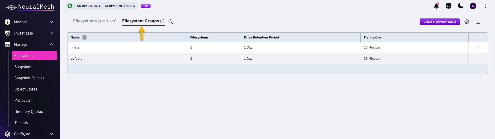
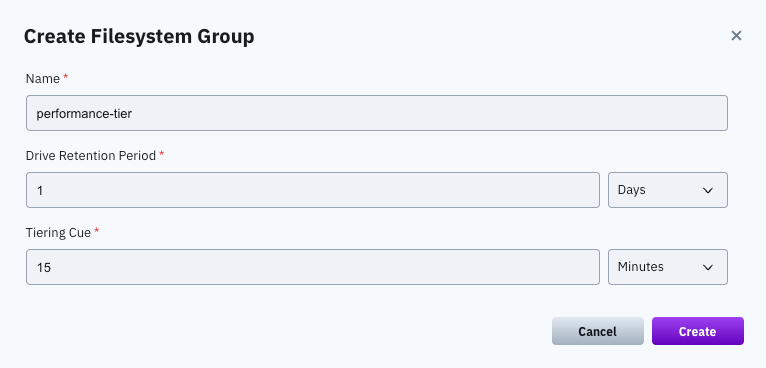
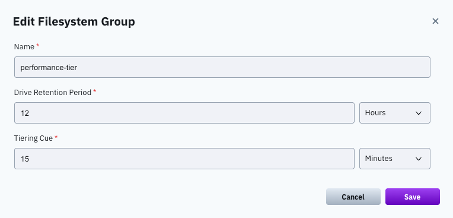
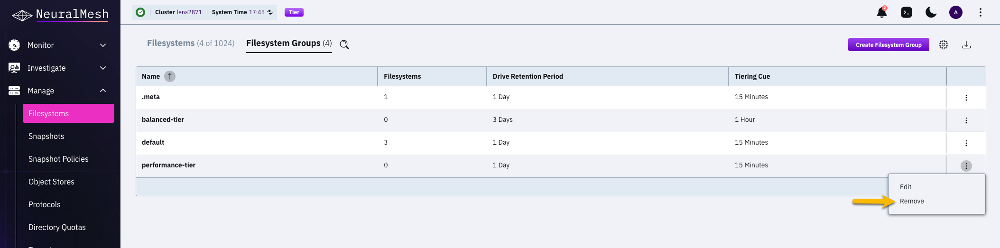

# Manage filesystem groups using the GUI

## View filesystem groups

The filesystem groups appear on the **Filesystems** page. The tab title shows the number of filesystem groups in the cluster.

**Procedure**

1. Select **Manage > Filesystems** from the navigation menu.
2. Select the **Filesystem Groups** tab.

The table shows the following details for each filesystem group:

<table><thead><tr><th width="209.930419921875">Column</th><th>Description</th></tr></thead><tbody><tr><td><strong>Name</strong></td><td>The name of the filesystem group.</td></tr><tr><td><strong>Filesystems</strong></td><td>The number of filesystems that use the group.</td></tr><tr><td><strong>Drive Retention Period</strong></td><td>The time to keep data on the SSD after it is copied to the object store.</td></tr><tr><td><strong>Tiering Cue</strong></td><td>The time to wait after the last update before the data is copied from the SSD to the object store.</td></tr></tbody></table>

## Create a filesystem group

Create a filesystem group to apply a different tiering policy to specific filesystems.

**Procedure**

1. Select **Manage > Filesystems** from the navigation menu.
2. Select the **Filesystem Groups** tab.
3. Select **Create Filesystem Group**.
4. Set the following in the **Create Filesystem Group** dialog:

<table><thead><tr><th width="207.15692138671875">Setting</th><th>Description</th></tr></thead><tbody><tr><td><strong>Name</strong></td><td>A meaningful name for the filesystem group.</td></tr><tr><td><strong>Drive Retention Period</strong></td><td>The time to keep data on the SSD after it is copied to the object store. When this period ends, the copy of the data is deleted from the SSD. Set a value and select the time unit.</td></tr><tr><td><strong>Tiering Cue</strong></td><td>The time to wait after the last update before the data is copied from the SSD to the object store. Set a value and select the time unit.</td></tr></tbody></table>

5. Select **Create**.

## Edit a filesystem group

Edit a filesystem group to adjust its tiering policy to your system requirements.

#### Procedure

1. Select **Manage > Filesystems** from the navigation menu.
2. Select the **Filesystem Groups** tab.
3. Select the three dots menu of the filesystem group, and select **Edit**.
4. Update the settings in the **Edit Filesystem Group** dialog. Show Image The settings are the same as in the **Create Filesystem Group** dialog.

5. Select **Save**.

The updated tiering policy applies to all the filesystems that use the group.

## Remove a filesystem group

Remove a filesystem group that no longer serves any filesystem.


You cannot remove a filesystem group that is used by a filesystem. Move the filesystems to another group, or delete them, before you remove the group.


#### Procedure

1. Select **Manage > Filesystems** from the navigation menu.
2. Select the **Filesystem Groups** tab.
3. Verify that the **Filesystems** column of the group shows `0`.
4. Select the three dots menu of the filesystem group, and select **Remove**.

5. Select **Yes** in the confirmation message.

**Related topics**

[Manage filesystem groups](./)

[Manage data lifecycle for tiered systems](../tiering.md)

[Manage filesystem groups using the CLI](manage-filesystem-groups-using-the-cli.md)
