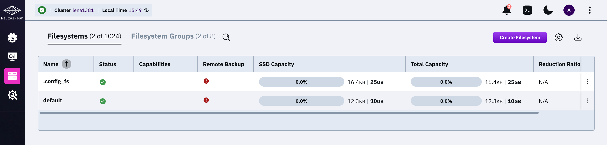
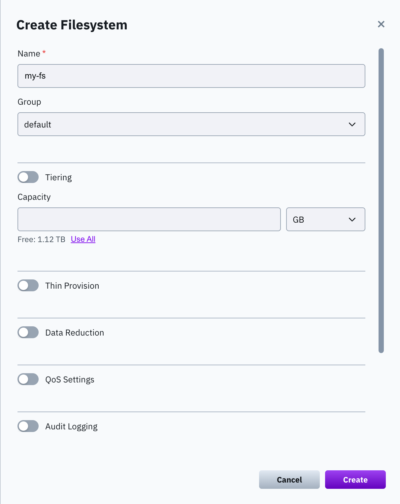
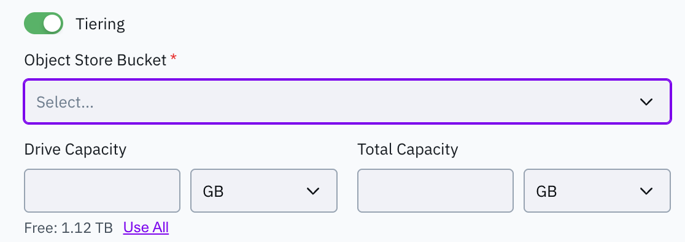
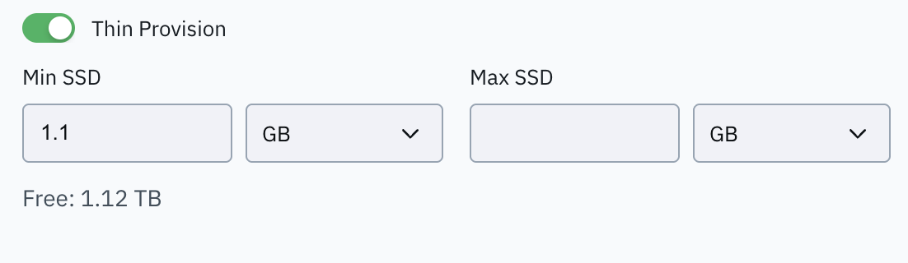
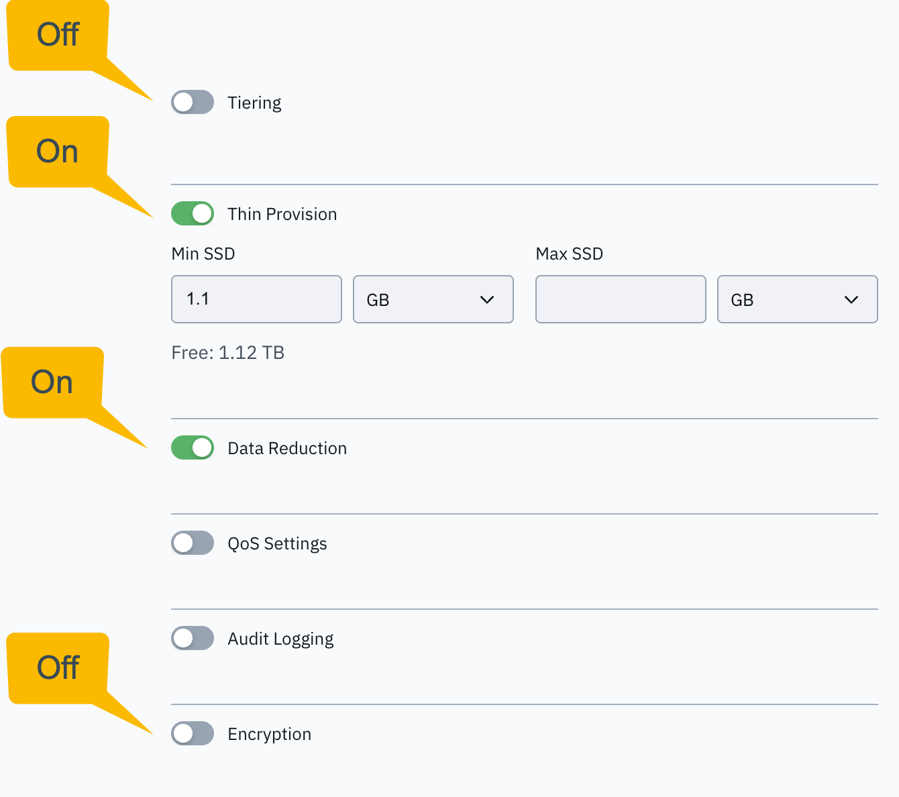
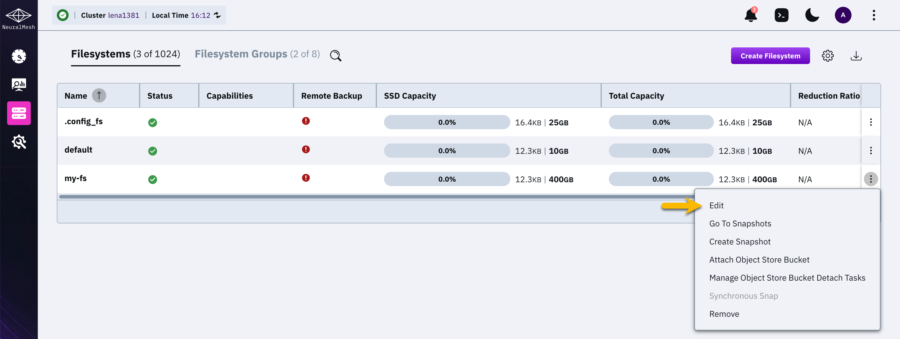

# Manage filesystems using the GUI

## View filesystems

View each filesystem's status, capacity, group, tiering, remote backup, encryption, and data reduction settings.

**Procedure**

1. From the menu, select **Manage > Filesystems**.

## Create a filesystem

Create a filesystem with the capacity and features required for your workload.

On-premises deployments require you to create a filesystem. Cloud deployments include a default filesystem at maximum capacity. Reduce its capacity before creating another filesystem.

**Before you begin**

* Ensure the system has free capacity and a filesystem group.
* If you use tiering, create an object store bucket.
* If you use audit logging, enable and configure **Audit and Forwarding**.
* If you use encryption, configure a KMS.

**Procedure**

1. From the menu, select **Manage > Filesystems**.
2. Select **Create Filesystem**.
3. In **Create Filesystem**, set the following:
   * **Name**: Enter a descriptive name of up to 32 characters. Do not use `/` or `\`.
   * **Group**: Select a filesystem group.
   * **Capacity**: Enter the capacity to provision. Select **Use All** to use all free capacity.

<figure><figcaption>
Create filesystem
</figcaption></figure>

4.  Optional: To enable **Tiering**, select the toggle. Tiering requires a defined object store bucket. You cannot enable tiering with data reduction.

    * **Object Store Bucket**: Select an object store bucket.
    * **Drive Capacity**: Enter the SSD capacity. Select **Use All** to allocate all free capacity.
    * **Total Capacity**: Enter the bucket's total capacity, including drive capacity.

    **Best practice:** Use a 1:4 ratio for drive capacity and total capacity.

    Tiering also supports creating a filesystem from an uploaded snapshot. See the related topics.

5.  Optional: To enable **Thin Provision**, select the toggle. Set the guaranteed minimum and maximum capacity.

    The minimum must not exceed available SSD capacity. Maximum available capacity depends on free SSD space. Thin provisioning is required for data reduction.

6. Optional: To enable **Data Reduction**, select the toggle. The filesystem must be thin-provisioned, non-tiered, and unencrypted. The cluster also requires a valid data reduction license.

<figure><figcaption>
Data reduction
</figcaption></figure>

7. Optional: To enable **Audit Logging**, select the toggle. The system forwards filesystem audit logs when cluster-wide auditing is enabled.


**Audit Logging** requires an enabled and configured **Audit and Forwarding** feature. For more information, see [audit-and-forwarding-management](../../operation-guide/audit-and-forwarding-management/ "mention").


8. Optional: To enable **Encryption**, select the toggle. Encryption requires a configured KMS.
9. Optional: To require authentication when mounting the filesystem, select **Required Authentication**. This setting only applies to filesystems in the root organization. Do not enable it for filesystems with NFS client permissions or SMB shares.
10. Select **Save**.

**Related topics**

[managing-filesystem-groups](../managing-filesystem-groups/ "mention")

[managing-object-stores](../managing-object-stores/ "mention")

[kms-management](../../security/kms-management/ "mention")

[overview.md](../../licensing/overview.md "mention")

[Filesystems, object stores, and filesystem groups](../../weka-system-overview/filesystems-object-stores-and-filesystem-groups/#data-reduction-in-weka-filesystems)

[#create-a-filesystem-from-an-uploaded-snapshot](../snap-to-obj/snap-to-obj.md#create-a-filesystem-from-an-uploaded-snapshot "mention")

## Edit a filesystem

Modify filesystem settings as requirements change. You can change the name, capacity, tiering, thin provisioning, and required authentication. You cannot change encryption.

**Procedure**

1. From the menu, select **Manage > Filesystems**.
2. For the filesystem you want to modify, select the three dots, then select **Edit**.

3. In the **Edit Filesystem** dialog, modify the parameters according to your requirements. (See the parameter descriptions in the [Add a filesystem](managing-filesystems.md#add-a-filesystem) topic.)
4. Select **Save**.

## Delete a filesystem

You can delete a filesystem if its data is no longer required. Deleting a filesystem does not delete the data in the tiered object store bucket.


If you must also delete the data in the tiered object store bucket, see the [Delete a filesystem](managing-filesystems-1.md#delete-a-filesystem) topic in the CLI section.


**Procedure**

1. From the menu, select **Manage > Filesystems**.
2. For the filesystem you want to delete, select the three dots, then select **Remove**.
3. When the confirmation message appears, verify the filesystem name, then select **Confirm**.
