# Manage object stores using the GUI

The page has two areas:

* **Object Stores**: Cards for the default local and remote object stores. Each card shows the number of buckets it holds.
* **Object Store Buckets**: The table of buckets configured in the cluster.

<figure>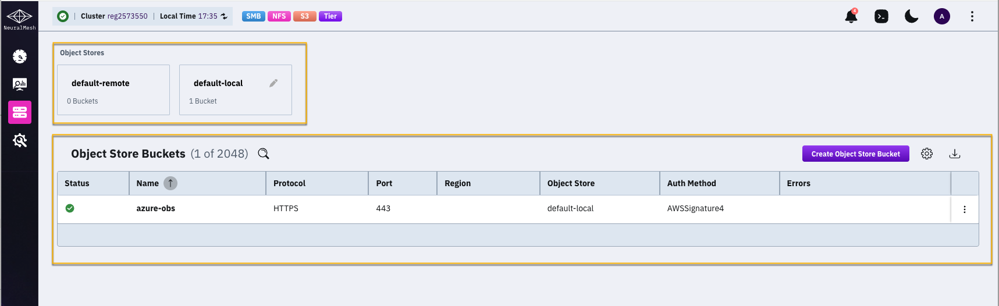<figcaption>
Object Stores and Object Store Buckets
</figcaption></figure>

## Edit the default object stores

Edit the default local and remote object stores to match your connection demands. When you add an object store bucket, you apply the relevant object store to it.

Editing a default object store gives you the following advantages:

* **Restricted downloads from a remote object store.** For an on-premises system whose remote bucket is in the cloud, set a low download bandwidth to reduce cost.
* **Faster bucket creation.** Set the connection parameters at the object store level. Buckets you add use these settings unless you specify different values.

**Procedure**

1. Select **Manage > Object Stores** from the navigation menu.
2. Hover object store, **default-remote** or **default-local** and select the pencil icon (Edit).
3. Select the object store **Type** in the **Edit Object Store** dialog, and update the relevant parameters. The parameters are the same as in the **Create Object Store Bucket** dialog.
4. Select **Save**.



Setting the **Access Key** and **Secret Key** is not mandatory. NeuralMesh accesses the object store from its EC2 instances, and the IAM roles assigned to the instances grant the access.

When you enable **Enable AssumeRole API**, also set the **Role ARN** and the **Role Session Name**.

<figure>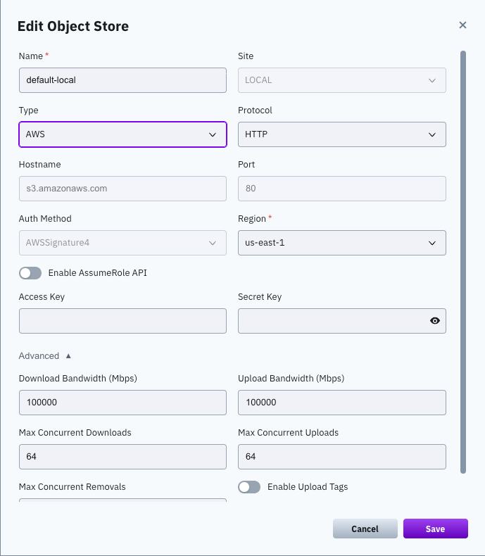<figcaption></figcaption></figure>




Set the **Access Key** and **Secret Key** of a user granted read and write access to the storage account. Azure object stores do not use a **Region** setting.

<figure>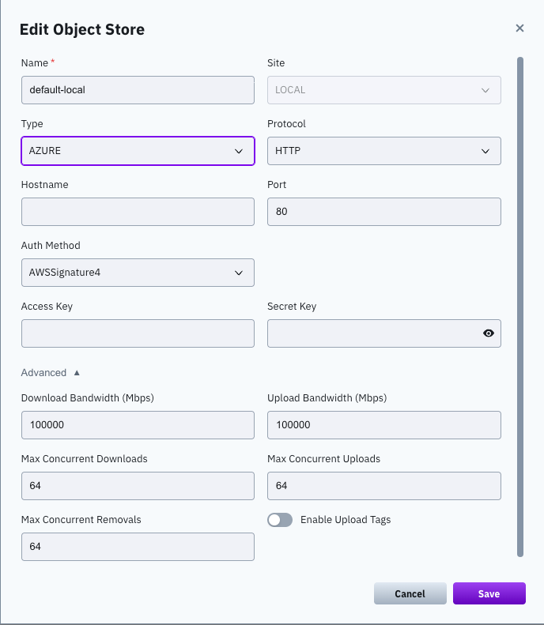<figcaption></figcaption></figure>




Use the **OTHER** type for GCP and any other S3-compatible object store.

For GCP, setting the **Access Key** and **Secret Key** is not mandatory. Google Cloud Storage is accessed using a service account attached to each Compute Engine instance that runs NeuralMesh, provided the service account has the permissions granted by the IAM role: `storage.admin` to create buckets, or `storage.objectAdmin` to use an existing bucket.

<figure>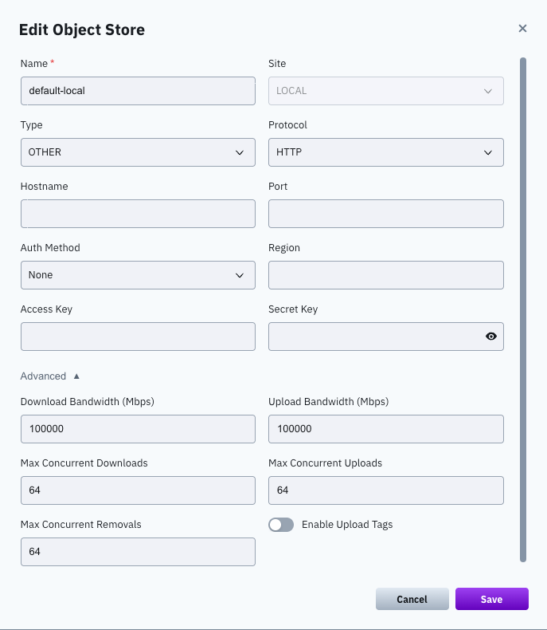<figcaption></figcaption></figure>




## Create an object store bucket 

Create object store buckets to be used for tiering or snapshots.

**Procedure**

1. Select **Manage > Object Stores** from the navigation menu.
2. Select **Create Object Store Bucket**.

3. Set the following in the **Create Object Store Bucket** dialog:

| Setting | Description |
| --- | --- |
| **Name** | A meaningful name for the bucket. |
| **Object Store** | The object store that holds the bucket. Select the local object store for tiering and snapshots. Select the remote object store for snapshots only. |
| **Type** | The type of object store: `AWS`, `AZURE`, or `OTHER`. Use `OTHER` for GCP and other S3-compatible object stores. |

4. Set the connection parameters under **Buckets Default Parameters**. Leave a parameter empty to use the value defined at the object store level.



NeuralMesh supports two options for creating AWS S3 buckets: for a cluster on EC2, and for a cluster that is not on EC2 using STS.

| Setting | Description |
| --- | --- |
| **Protocol** | The protocol to use when connecting to the bucket. |
| **Hostname** | The DNS name or IP address of the bucket entry point. |
| **Port** | The port to use when connecting to the bucket. |
| **Bucket** | The name of the bucket that stores the data. |
| **Auth Method** | The authentication method. AWS uses `AWSSignature4`. |
| **Region** | The region assigned to work with. |
| **Access Key**, **Secret Key** | The keys of a user granted read and write access to the bucket. Leave empty when the EC2 instances have the permissions granted by the IAM role. |

For a cluster that is not on EC2, enable **Enable AssumeRole API** and set the following:

| Setting | Description |
| --- | --- |
| **Role ARN** | The Amazon Resource Name (ARN) to assume. The ARN must have the permissions defined in the IAM role for S3 access. |
| **Role Session Name** | A unique identifier for the assumed role session. |
| **Session Duration** | The duration of the temporary security credentials in seconds. Possible values: 900 to 43200. Default: 3600. |
| **Access Key**, **Secret Key** | The keys of the user granted the AssumeRole permissions. |

<figure>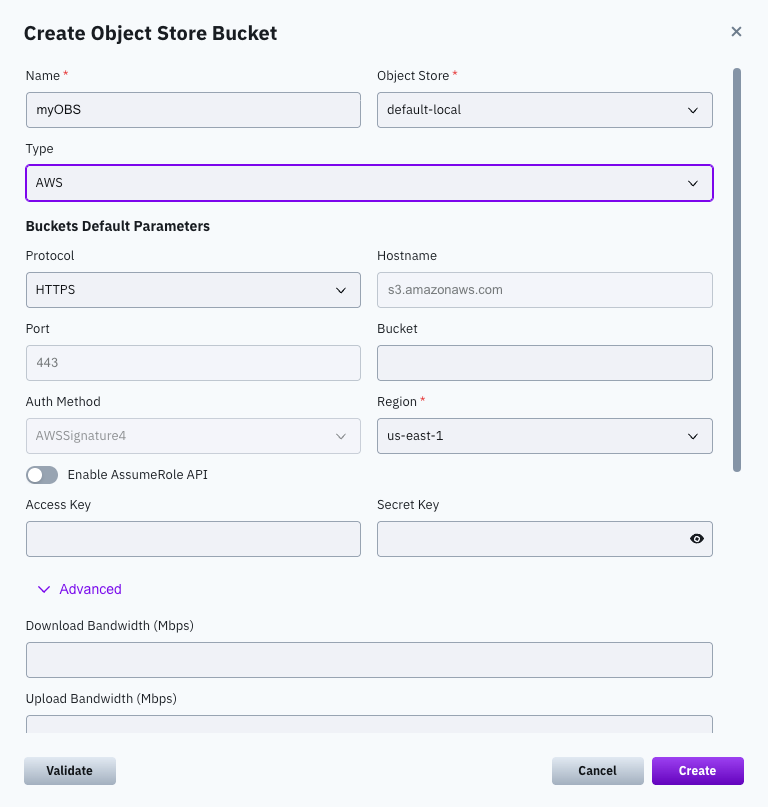<figcaption>
Create AWS S3 bucket
</figcaption></figure>




| Setting | Description |
| --- | --- |
| **Protocol** | The protocol to use when connecting to the bucket. |
| **Hostname** | The DNS name or IP address of the bucket entry point. |
| **Port** | The port to use when connecting to the bucket. |
| **Bucket** | The name of the bucket that stores the data. |
| **Auth Method** | The authentication method to connect to the bucket. |
| **Access Key**, **Secret Key** | The keys of a user granted read and write access to the bucket. |

<figure>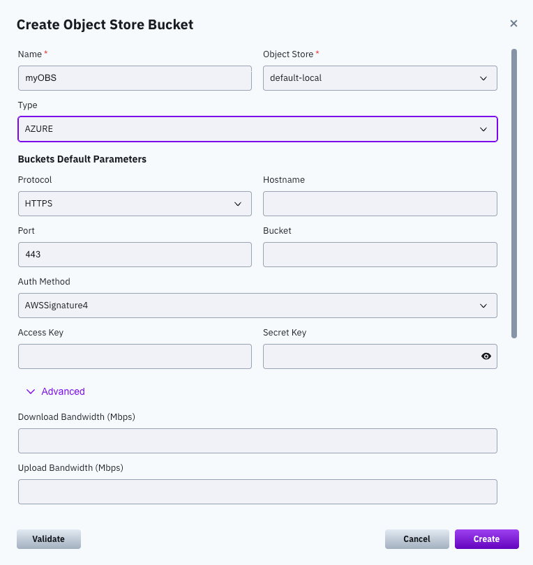<figcaption>
Create Azure S3 bucket
</figcaption></figure>




Use this type for GCP and other S3-compatible object stores.

| Setting | Description |
| --- | --- |
| **Protocol** | The protocol to use when connecting to the bucket. |
| **Hostname** | The DNS name or IP address of the bucket entry point. |
| **Port** | The port to use when connecting to the bucket. |
| **Bucket** | The name of the bucket that stores the data. |
| **Auth Method** | The authentication method to connect to the bucket. |
| **Region** | The region assigned to work with. You can usually leave it empty. |
| **Access Key**, **Secret Key** | The keys of a user granted read and write access to the bucket. For GCP, leave empty when the service account has the permissions granted by the IAM role. Set the keys when the cluster does not run on GCP instances. |

<figure>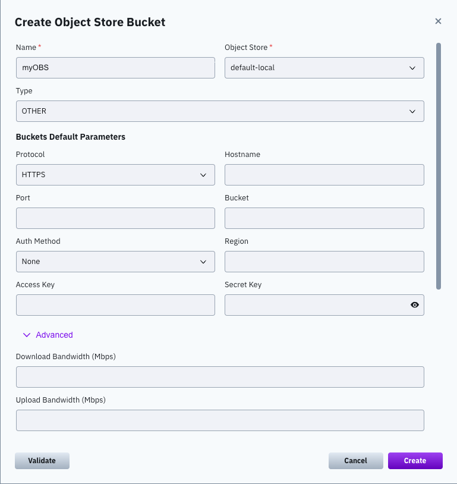<figcaption>
Create GCP S3 bucket
</figcaption></figure>




5. Select **Advanced** and set the following, if required:

<table><thead><tr><th width="267.16766357421875">Setting</th><th>Description</th></tr></thead><tbody><tr><td><strong>Download Bandwidth (Mbps)</strong></td><td>The download bandwidth limitation per core.</td></tr><tr><td><strong>Upload Bandwidth (Mbps)</strong></td><td>The upload bandwidth limitation per core.</td></tr><tr><td><strong>Max concurrent Downloads</strong></td><td>The maximum number of downloads performed concurrently on this object store in a single IO process.</td></tr><tr><td><strong>Max concurrent Uploads</strong></td><td>The maximum number of uploads performed concurrently on this object store in a single IO process.</td></tr><tr><td><strong>Max concurrent Removals</strong></td><td>The maximum number of removals performed concurrently on this object store in a single IO process.</td></tr><tr><td><strong>Enable Upload Tags</strong></td><td>Enables tagging of uploaded objects.</td></tr><tr><td><strong>Data Storage Class</strong></td><td>
Apply to the <code>AWS</code> and <code>AZURE</code> types.

The storage class used for the data. For AWS: <code>STANDARD</code>, <code>REDUCED_REDUNDANCY</code>, <code>STANDARD_IA</code>, <code>ONEZONE_IA</code>, <code>INTELLIGENT_TIERING</code>, <code>OUTPOSTS</code>, <code>GLACIER_IR</code>, and <code>EXPRESS_ONEZONE</code>. For Azure: <code>HOT</code>, <code>COOL</code>, and <code>COLD</code>.
</td></tr><tr><td><strong>Metadata Storage Class</strong></td><td>
Apply to the <code>AWS</code> and <code>AZURE</code> types.

The storage class used for the metadata. The values are the same as for <strong>Data Storage Class</strong>.
</td></tr></tbody></table>

6. Select **Validate** to verify the connection to the object store bucket.
7. Select **Create**.

If an error message about the bucket configuration appears and you still want to save the configuration, select **Create Anyway**.

## View object store buckets 

The object store buckets appear on the **Object Stores** page. The table title shows the number of buckets out of the maximum the cluster supports.

**Procedure**

1. Select **Manage > Object Stores** from the navigation menu.

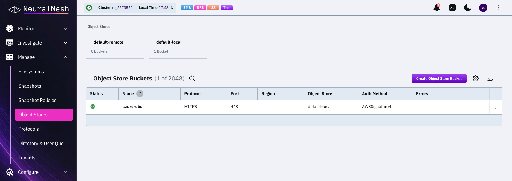

The table shows the following details for each bucket:

| Column | Description |
| --- | --- |
| **Status** | The connection status of the bucket. |
| **Name** | The name of the bucket. |
| **Protocol** | The protocol used to connect to the bucket. |
| **Port** | The port used to connect to the bucket. |
| **Region** | The region assigned to the bucket. |
| **Object Store** | The object store that holds the bucket. |
| **Auth Method** | The authentication method used to connect to the bucket. |
| **Errors** | The error details, if errors exist. |

## Edit an object store bucket 

Edit an object store bucket to adjust its parameters to your changing demands.

**Procedure**

1. Select **Manage > Object Stores** from the navigation menu.
2. Select the three dots menu of the bucket, and select **Edit**.

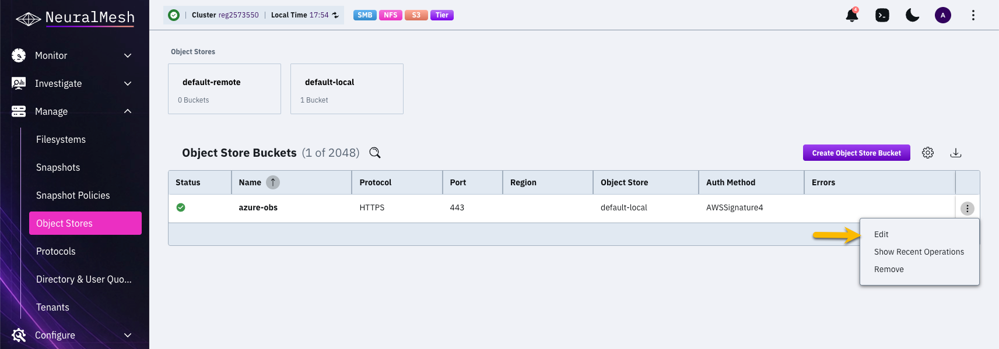

3. Update the settings in the **Edit Object Store Bucket** dialog.\
   The **Name** and **Object Store** of an existing bucket are read-only. All other settings are the same as in the **Create Object Store Bucket** dialog.

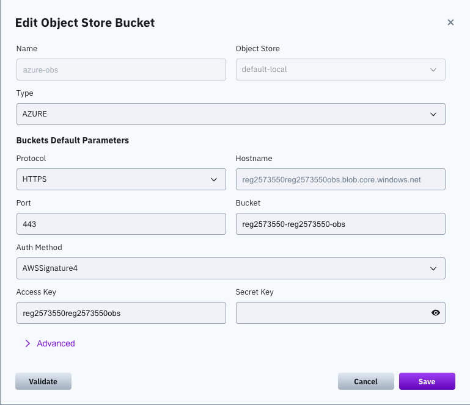

4. Select **Validate** to verify the connection, and select **Save**.

## Show recent operations of an object store bucket

Review operations for an active object store bucket.

**Procedure**

1. Select **Manage > Object Stores** from the navigation menu.
2. Select the three dots menu of the bucket, and select **Show Recent Operations**.

<figure>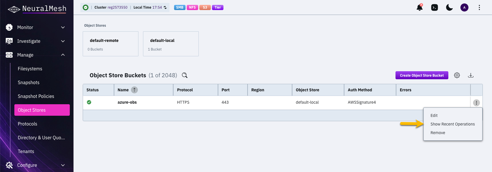<figcaption>
Show Recent Operations (menu)
</figcaption></figure>

The **Recent Operations for OBS Bucket** page opens for the selected bucket. The table lists each operation's type, start time, duration, phase, and any errors.

<figure>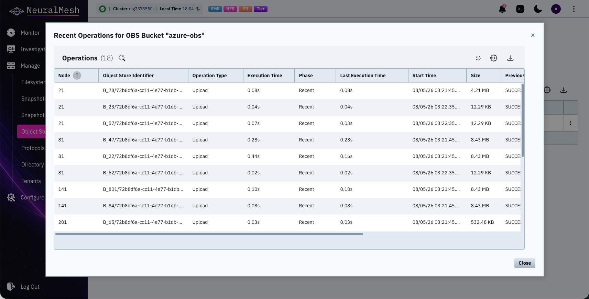<figcaption>
Show Recent Operations for OBS Bucket example
</figcaption></figure>

3. Sort columns or use their filters to focus on specific operations.
4. Select the **Download** icon to download the report. Select the **Refresh** icon to update the table.
5. Select the table settings icon to configure the displayed columns.

## Remove an object store bucket

Remove an object store bucket that is no longer required. The data in the object store remains intact.

**Procedure**

1. Select **Manage > Object Stores** from the navigation menu.
2. Select the three dots menu of the bucket, and select **Remove**.
3. Select **Yes** in the confirmation message.

**Related topics**

[Manage object stores](./)

[Manage data lifecycle for tiered systems](../tiering.md)

[Manage object stores using the CLI](managing-object-stores-1.md)
