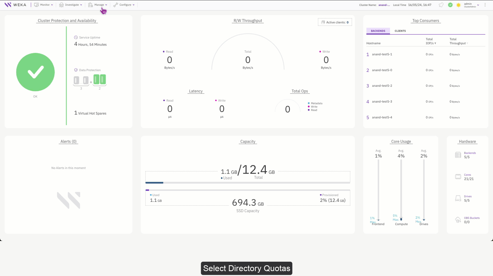
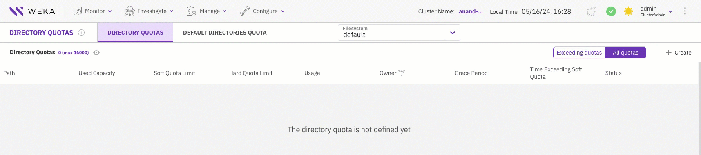
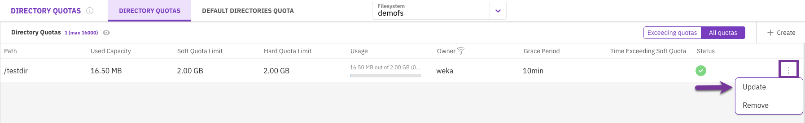
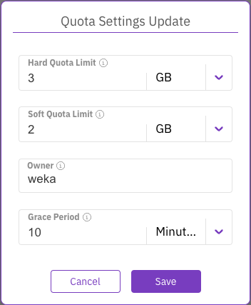
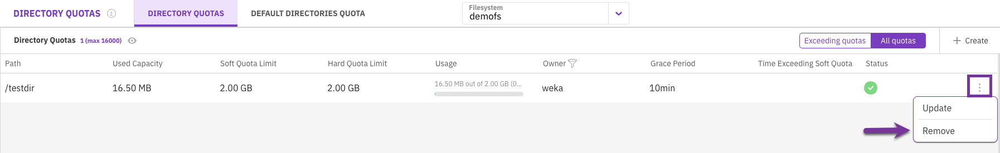

# Manage quotas using the GUI

Directory quotas monitor a directory's filesystem capacity usage and allow restricting the amount of space used by the directory.

Using the GUI, you can:

* [Set directory quota](manage-quotas-using-the-gui.md#set-directory-quota)
* [View directory quotas and default quota](manage-quotas-using-the-gui.md#view-directory-quotas-and-default-quota)
* [Update a directory quota or default quota](manage-quotas-using-the-gui.md#update-a-directory-quota-or-default-quota)
* [Remove a directory quota](manage-quotas-using-the-gui.md#remove-a-directory-quota)
* [Remove the default quota for new directories](manage-quotas-using-the-gui.md#remove-the-default-quota-for-new-directories)


To set a default quota, use the CLI. See [#set-default-quota](quota-management.md#set-default-quota "mention").

Default quotas apply to newly created subdirectories, not the directory or existing children.


## Set directory quota

The organization admin can set a quota on a directory. This action initiates calculating the current directory usage in a background task. Once this calculation is complete, the quota is considered.

**Before you begin**

To set a quota on a directory, a mount point to the relevant filesystem is necessary. The quota set command mustn’t be interrupted until the quota accounting process is finished.

**Procedure**

1. From the menu, select **Manage > Directory Quotas**.
2. Select **Directory Quotas**.
3. Select the filesystem in which you want to set the directory quotas.
4. In the Create Quota dialog, set the following:
   * **Directory Path:** The full path to the directory quota to be set on.
   * **Hard Quota Limit:** The hard quota limit defines the maximum used capacity above the soft quota limit, which prevents writing to the directory.
   * **Soft Quota Limit:** The soft quota limit defines the maximum used capacity that triggers a grace period timer. Data can be written to the directory until the grace period ends or the hard quota limit is reached.
   * **Owner:** The directory’s owner, such as user name, email, or slack ID (up to 48 characters).
   * **Grace Period:** When the soft quota limit is reached, a grace period starts. After this period, data cannot be written to the directory.\
     The system sets the directory quota in the background.
5. To monitor the directory quota setting background task, select **Monitor > Background Tasks.**

<figure><figcaption>
Set a directory quota and monitor the background task
</figcaption></figure>

## View directory quotas and default quota

You can view existing directory quotas and the default quota that are already set.

**Procedure**

1. From the menu, select **Manage > Directory Quotas**.
2. Select the relevant tab: **Directory Quotas** or **Default Directories Quota**.
3. Select the filesystem in which the directory quotas are already set.
4. To view all quotas or only the exceeding quotas, select the **Exceeding quotas/All quotas** switch.

<figure><figcaption>
View directory quotas and default quota
</figcaption></figure>

## Update a directory quota or default quota

You can update an existing directory quota or the default quota for directories. Updating the default quota only applies to new directories.

**Procedure**

1. From the menu, select **Manage > Directory Quotas**.
2. Select the relevant tab: **Directory Quotas** or **Default Directories Quota**.
3. Select the filesystem in which the directory quotas are set (through the CLI).
4. Select the three dots on the right of the required directory. From the menu, select **Update**.

<figure><figcaption>
Directory Quotas
</figcaption></figure>

5. In the Quota Settings Update dialog, modify the following settings according to your needs:
   * **Hard Quota Limit:** The hard quota limit defines the maximum used capacity above the soft quota limit, which prevents writing to the directory.
   * **Soft Quota Limit:** The soft quota limit defines the maximum used capacity that triggers a grace period timer. Data can be written to the directory until the grace period ends or the hard quota limit is reached.
   * **Owner:** The directory’s owner, such as user name, email, or slack ID (up to 48 characters).
   * **Grace Period:** When the soft quota limit is reached, a grace period starts. After this period, data cannot be written to the directory.
6. Click **Save**.

<figure><figcaption>
Quota Settings Update
</figcaption></figure>

## Remove a directory quota

You can remove (unset) a directory quota if it is no longer required.

**Procedure**

1. From the menu, select **Manage > Directory Quotas**.
2. Select the **Directory Quotas** tab.
3. Select the filesystem in which the directory quota is set.
4. Select the three dots on the right of the required default quota. From the menu, select **Remove**.
5. In the Quota Deletion message, select **Yes**.

<figure><figcaption>
Remove a default quota
</figcaption></figure>

## Remove the default quota for new directories

You can remove (unset) the default quota settings for new directories created in a specific filesystem. The quota of existing directories is not affected.

**Procedure**

1. From the menu, select **Manage > Directory Quotas**.
2. Select the **Default Directories Quota** tab.
3. Select the filesystem in which the default quotas are already set (through the CLI).
4. Select the three dots on the right of the required default quota. From the menu, select **Remove**.
5. In the Default Quota Deletion message, select **Yes**.
