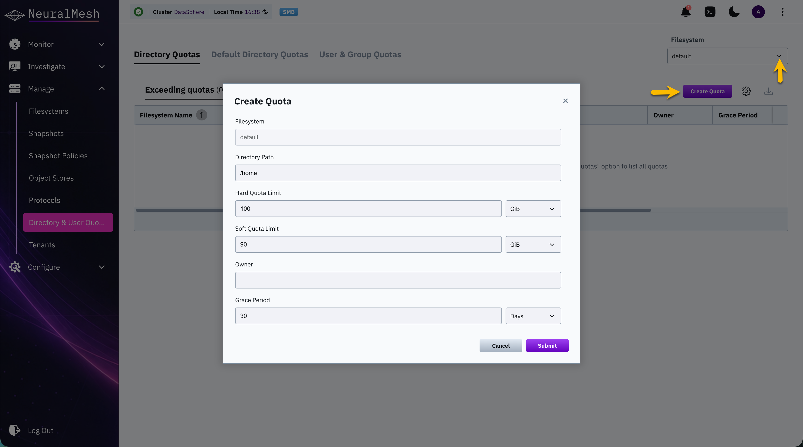
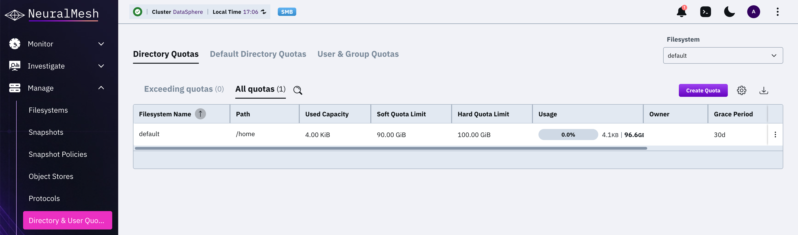
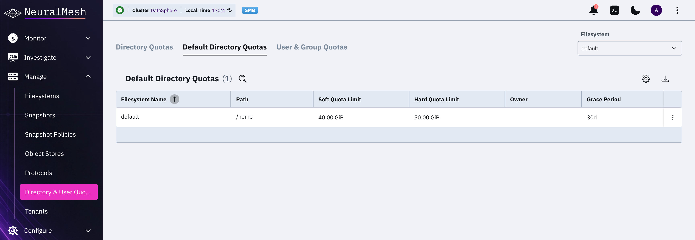
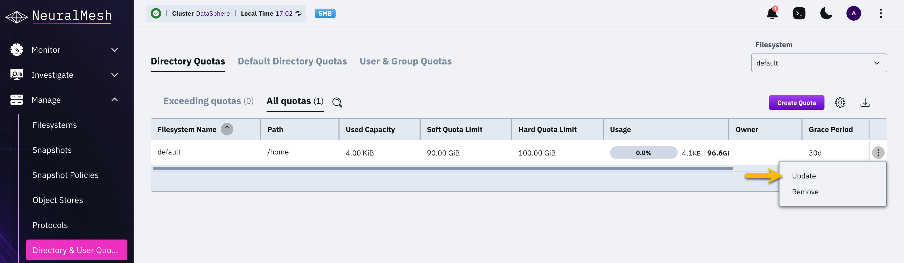
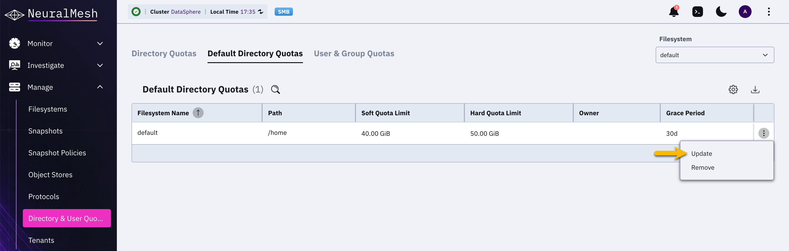
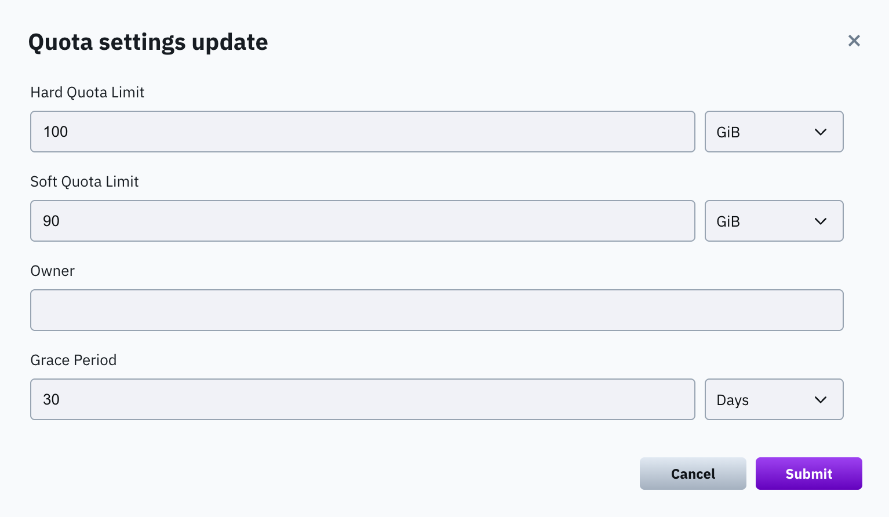
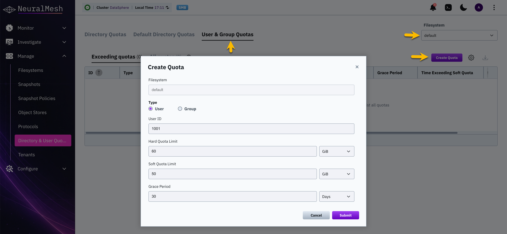
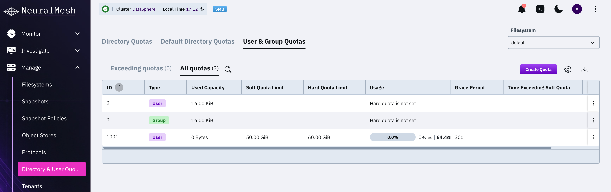

# Manage quotas using the GUI

## Set default directory quota

A default directory quota automatically applies quota limits to every new subdirectory created under a specified parent directory. It does not apply retroactively to existing subdirectories. Use it when new directories inherit consistent limits by default, such as user home directories or project folders.


Creating a default directory quota is a CLI operation. Once created, you can view, update, and remove it from the **Default Directory Quotas** tab. See [quota-management.md](quota-management.md "mention").


## Set directory quota

The tenant admin can set a quota on a directory, which triggers a background task to calculate the current usage. Once this calculation is finished, the quota takes effect.

**Before you begin**

* To apply a quota to a directory, ensure there is a mount point for the relevant filesystem.
* Configure at least one Data Services container before setting a directory quota. The **Create Quota** button is not available until a Data Services container is active. See [set-up-a-data-services-container-for-background-tasks.md](../../operation-guide/set-up-a-data-services-container-for-background-tasks.md "mention").

**Procedure**

1. From the menu, select **Manage > Directory Quotas**.
2. Select **Directory Quotas**.
3. Select the filesystem the directory quota applies to.
4. In the Create Quota dialog, set the following:
   * **Directory Path:** The full path to the directory quota to be set on.
   * **Hard Quota Limit:** The hard quota limit defines the maximum used capacity above the soft quota limit, which prevents writing to the directory.
   * **Soft Quota Limit:** The soft quota limit defines the maximum used capacity that triggers a grace period timer. Data can be written to the directory until the grace period ends or the hard quota limit is reached.
   * **Owner:** The directory’s owner, such as user name, email, or slack ID (up to 48 characters).
   * **Grace Period:** When the soft quota limit is reached, a grace period starts. After this period, data cannot be written to the directory.\
     The system sets the directory quota in the background.
5. Select **Submit**.
6. To monitor the directory quota setting background task, select **Monitor > Background Tasks.**

<figure><figcaption>
Set a directory quota
</figcaption></figure>

## View directory quotas and default quota

You can view existing directory quotas and the default quota that are already set.

**Procedure**

1. From the menu, select **Manage > Directory Quotas**.
2. Select the relevant tab: **Directory Quotas** or **Default Directory Quotas**.
3. Select the filesystem in which the directory quotas are already set.
4. On the **Directory Quotas** tab, to view all quotas or only the exceeding quotas, select the **Exceeding quotas/All quotas** switch.

<figure><figcaption>
View directory quotas
</figcaption></figure>

<figure><figcaption>
View default directory quotas
</figcaption></figure>

## Update a directory quota or default quota

You can update an existing directory quota or default directory quota. Updating a default quota applies only to new directories.

**Procedure**

1. From the menu, select **Manage > Directory Quotas**.
2. Select the relevant tab: **Directory Quotas** or **Default Directory Quotas**.
3. Select the filesystem in which the quotas are set.
4. Select the three dots on the right of the required quota. From the menu, select **Update**.

<figure><figcaption>
Update a directory quota
</figcaption></figure>

<figure><figcaption>
Update a default directory quota
</figcaption></figure>

5. In the Quota Settings Update dialog, modify the following settings according to your needs:
   * **Hard Quota Limit:** The hard quota limit defines the maximum used capacity above the soft quota limit, which prevents writing to the directory.
   * **Soft Quota Limit:** The soft quota limit defines the maximum used capacity that triggers a grace period timer. Data can be written to the directory until the grace period ends or the hard quota limit is reached.
   * **Owner:** The directory’s owner, such as user name, email, or slack ID (up to 48 characters).
   * **Grace Period:** When the soft quota limit is reached, a grace period starts. After this period, data cannot be written to the directory.
6. Select **Submit**.

<figure><figcaption>
Quota Settings Update
</figcaption></figure>

## Remove a directory quota

You can remove (unset) a directory quota if it is no longer required.

**Procedure**

1. From the menu, select **Manage > Directory Quotas**.
2. Select the **Directory Quotas** tab.
3. Select the filesystem in which the directory quota is set.
4. Select the three dots on the right of the required directory quota. From the menu, select **Remove**.
5. In the Quota Deletion message, select **Yes**.

<figure><figcaption>
Remove a directory quota
</figcaption></figure>

## Remove the default quota for new directories

You can remove (unset) the default quota settings for new directories created in a specific filesystem. The quota of existing directories is not affected.

**Procedure**

1. From the menu, select **Manage > Directory Quotas**.
2. Select the **Default Directory Quotas** tab.
3. Select the filesystem in which the default quotas are already set.
4. Select the three dots on the right of the required default quota. From the menu, select **Remove**.
5. In the Default Quota Deletion message, select **Yes**.

## Set a user or group quota

A user or group quota limits the capacity a specific POSIX user or group can consume across the filesystem, wherever that data sits in the directory tree. Unlike a directory quota, it is not bound to a path.

**Before you begin**

* Enable user quota accounting on the filesystem. This is a CLI operation. See [quota-management.md](quota-management.md "mention").
* Configure at least one Data Services container. See [set-up-a-data-services-container-for-background-tasks.md](../../operation-guide/set-up-a-data-services-container-for-background-tasks.md "mention").

**Procedure**

1. From the menu, select **Manage > Directory Quotas**.
2. Select the **User & Group Quotas** tab.
3. Select the filesystem the quota applies to.
4. Select **Create Quota**.
5. In the **Create Quota** dialog, set the following:
   * **Type:** Select **User** or **Group**.
   * **User ID:** The numeric POSIX ID of the user the quota applies to. For a group quota, specify the group ID.
   * **Hard Quota Limit:** The maximum capacity the user or group can use. Writes are blocked when this limit is reached.
   * **Soft Quota Limit:** The capacity threshold that starts the grace period timer. Writes are allowed until the grace period expires or the hard quota limit is reached.
   * **Grace Period:** The time allowed after the soft quota limit is reached before writes are blocked.
6. Select **Submit**.

<figure><figcaption>
Set a user quota
</figcaption></figure>

## View user and group quotas

You can view the user and group quotas set on a filesystem, along with the capacity each user or group currently consumes.

**Procedure**

1. From the menu, select **Manage > Directory Quotas**.
2. Select the **User & Group Quotas** tab.
3. Select the filesystem in which the quotas are already set.
4. To view all quotas or only the exceeding quotas, select the **Exceeding quotas/All quotas** switch.

The table lists each quota by **ID** and **Type** (User or Group), with its used capacity, soft and hard limits, usage, grace period, and the time it has been exceeding the soft quota.

<figure><figcaption>
View user and group quotas
</figcaption></figure>

